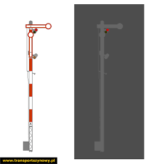

### § 4. Sygnały nadawane przez semafory 

1.  Semafor kształtowy nadaje sygnały odpowiednim położeniem ramion w dzień i dodatkowo światłami w nocy.

2.  Wyróżnia się dwa rodzaje semaforów kształtowych: semafory jednoramienne i dwuramienne. Ramię semafora z przodu jest koloru białego z czerwoną obwódką, natomiast z tyłu jest koloru białego z czarną obwódką. W uzasadnionych przypadkach, w celu zapewnienia lepszej widzialności, kolory ramienia i obwódki mogą być odwrócone.

3.  Semafor kształtowy oznacza się umieszczoną na maszcie, widoczną z przodu listwą w biało-czerwone pasy. Część środkowa listwy ma kolor czerwony.

4.  Na semaforach kształtowych stosowane są światła wsteczne sygnałów nocnych. Gdy semafor nadaje sygnał:
    1. *Sr 1 „Stój", górna latarnia pokazuje wstecz duże światło matowobiałe, a na semaforze dwuramiennym - oprócz tego - dolna latarnia małe światło matowobiałe*;
    2. *Sr 2, górna latarnia pokazuje wstecz duże światło białe, a na semaforze dwuramiennym oprócz tego - dolna latarnia małe światło matowobiałe*;
    3. *Sr 3 - obie latarnie pokazują wstecz duże światła białe*.

*Światła wsteczne należy stosować na wszystkich semaforach kształtowych, jeśli zachodzi tego potrzeba*.

5.  Semafory kształtowe nadają następujące sygnały:
    1.  **sygnał Sr 1 „Stój"**
        1.  **Dzienny**: Ramię semafora ustawione poziomo, na prawo od masztu semafora.
        2.  **Nocny**: Czerwone światło na semaforze.

            
        
        Sygnał Sr 1 nakazuje zatrzymanie pociągu przed semaforem;
    2. **sygnał Sr 2 „Wolna droga"**

**Dzienny Nocny**

> Ramię semafora wzniesione Zielone światło pod kątem 45º do poziomu na
> semaforze. na prawo od masztu
>
> Sygnał Sr 2 zezwala na jazdę z największą dozwoloną prędkością dla
> danego pociągu na danym odcinku linii kolejowej *(szlaku, odstępie,
> drodze przebiegu)*;
>
> 3\) **sygnał Sr 3 „Wolna droga ze zmniejszoną prędkością"**

**Dzienny Nocny**

> Dwa ramiona semafora Dwa światła na wzniesione pod kątem 45° semaforze
> w pionie: do poziomu, na prawo górne światło zielone, od masztu
> semafora. dolne pomarańczowe.
>
> Sygnał Sr 3 zezwala na jazdę z prędkością nie większą niż 40 km/h,
> począwszy od semafora do końca okręgu zwrotnicowego osłanianego tym
> semaforem. W przypadku semafora wjazdowego lub drogowskazowego
> prędkość ograniczona do 40 km/h obowiązuje na całej drodze
> przebiegu*.*

6.  Sygnały na semaforach świetlnych nadawane są za pomocą jednego
    światła lub dwóch świateł w linii pionowej, z wyjątkiem sygnału SE
    „Jazda zgodnie ze wskazaniami systemu

> ERTMS/ETCS". Dolne światło może być uzupełnione poziomym pasem
> świetlnym.

7.  Pas świetlny na semaforze świetlnym tworzy sygnał tylko łącznie z
    dolnym światłem pomarańczowym semafora.

8.  Jeżeli sygnał na semaforze *świetlnym* zezwala na jazdę ze
    zmniejszoną prędkością, to jazda z tą prędkością obowiązuje do końca
    okręgu zwrotnicowego osłanianego tym semaforem, z wyjątkiem jazd po
    torach głównych dodatkowych, na których należy stosować na całej
    drodze przebiegu prędkość wskazaną na semaforze. W przypadku jazdy
    pod nadzorem sprawnie działającego systemu ERTMS/ETCS koniec
    obowiązywania tej prędkości wskazuje system ERTMS/ETCS.

9.  Latarnia sygnałowa semafora świetlnego może być zamontowana na
    maszcie lub bezpośrednio na podstawie

> (semafor karzełkowy) albo zawieszona obok toru lub nad torem.

10. Maszty semaforów odstępowych samoczynnych, na szlakach wyposażonych
    w blokadę wieloodstępową, są pomalowane na kolor biały albo są
    wyposażone w listwy koloru białego wykonane z materiałów
    odblaskowych. Jeżeli latarnia sygnałowa takiego semafora zawieszona
    jest obok toru lub nad torem, to dla oznaczenia rodzaju semafora,
    nad lub pod latarnią sygnałową albo obok niej, znajduje się listwa
    biała. Ostatni semafor samoczynny, usytuowany na szlaku przed
    semaforem wjazdowym posterunku ruchu, oznakowany jest wskaźnikiem W
    18.

11. Maszty semaforów półsamoczynnych, tzn. innych niż wymienione w ust.
    10, pomalowane są w poziome pasy czerwono-białe albo są wyposażone w
    listwy z czerwonobiałymi pasami wykonane z materiałów odblaskowych,
    przy czym pierwszy pas od dołu masztu jest czerwony. Jeżeli latarnia
    sygnałowa zawieszona jest obok toru lub nad torem, to dla oznaczenia
    rodzaju semafora, nad lub pod latarnią sygnałową albo obok niej,
    znajduje się listwa z czerwono-białymi pasami wykonana z materiałów
    odblaskowych.

12. Latarnie sygnałowe semaforów świetlnych karzełkowych, z przodu i z
    boków pomalowane są w poziome pasy, na przemian białe i czerwone
    *tak, że pas czerwony jest pomiędzy białymi*.

13. Semafory świetlne nadają następujące sygnały:

    1)  **sygnał S 1 „Stój"**

> Jedno czerwone światło ciągłe na semaforze.
>
> Sygnał S 1 nakazuje zatrzymanie pociągu *oraz manewrów* przed
> semaforem;

2)  **sygnał S 2 „Jazda z największą dozwoloną prędkością"** Jedno
    zielone światło ciągłe na semaforze.

> Sygnał S 2 zezwala na jazdę z największą prędkością dozwoloną dla
> danego pociągu na danym odcinku linii kolejowej *(szlaku, odstępie,
> drodze przebiegu)* i informuje, że na następnym semaforze, jeżeli
> semafor nadający sygnał S 2 jest z nim uzależniony, nadawany jest
> sygnał zezwalający na jazdę z największą dozwoloną prędkością;

3)  **sygnał S 3 „Jazda z największą dozwoloną prędkością --**

> **w przodzie są dwa odstępy blokowe wolne -- albo przy następnym
> semaforze z prędkością nie większą niż 100 km/h"**

Jedno zielone światło migające na semaforze.

> Sygnał S 3 zezwala na jazdę z największą prędkością dozwoloną dla
> danego pociągu i danego odcinka linii kolejowej *(drogi przebiegu)*.
> Sygnał S 3 nadawany przez:

a)  semafor półsamoczynny lub ostatni semafor samoczynny blokady
    liniowej informuje, że następny semafor może nadawać sygnał
    zezwalający na jazdę z prędkością nie większą niż 100 km/h. Jeżeli
    maszynista stwierdzi, że sygnał na następnym semaforze nie ogranicza
    prędkości, to stosuje się do aktualnych wskazań tego semafora,
    regulując prędkość jazdy, tak aby mógł zatrzymać pociąg przed
    kolejnym semaforem wskazującym sygnał „Stój",

b)  semafor samoczynny blokady liniowej lub semafor wyjazdowy na szlak
    wyposażony w wieloodstępową blokadę liniową informuje, że dwa
    kolejne odstępy blokowe za tym semaforem są wolne. Maszynista
    powinien tak regulować prędkość jazdy, aby mógł zatrzymać pociąg
    przed semaforem wskazującym sygnał „Stój". *Dotyczy to także
    semafora wjazdowego posterunku odgałęźnego bez semafora
    wyjazdowego*;

<!-- -->

4)  **sygnał S 4 „Następny** 5) **semafor wskazuje sygnał zezwalający na
    jazdę z prędkością zmniejszoną do 40 lub 60 km/h"**

+--------------------------------------------------------------------------+
| +---------------------------------------------+------------------------+ |
| | Jedno pomarańczowe                          | Jedno światło          | |
| |                                             | pomarańczowe ciągłe na | |
| | > światło migające na semaforze.            | semaforze.             | |
| +=============================================+========================+ |
+==========================================================================+

**sygnał S 5 „Następny semafor *(wskazuje)* nadaje sygnał Stój"**

Sygnał S 4 zezwala

> na jazdę z największą prędkością dozwoloną dla danego pociągu na danym
> odcinku linii kolejowej *(szlaku, odstępie, drodze przebiegu)*,
> wskazaną w wewnętrznym rozkładzie jazdy pociągów i informuje, że
> następny Sygnał S 5 informuje, że następny semafor nadaje sygnał
> „Stój". Maszynista powinien tak regulować prędkość jazdy, aby mógł
> zatrzymać pociąg przed następnym semaforem wskazującym

sygnał „Stój";

> semafor nadaje sygnał zezwalający na jazdę z prędkością
> nieprzekraczającą
>
> 40 lub 60 km/h;

6)  **sygnał S 6 „Jazda z prędkością nieprzekraczającą 100 km/h, a potem
    z największą dozwoloną prędkością"**

7)  **sygnał S 7 „Jazda z prędkością nieprzekraczającą 100 km/h przy tym
    i następnym semaforze"**

Dwa światła na semaforze

w jednym pionie: dolne światło pomarańczowe ciągłe, a pod nim świetlny
pas zielony poziomy, górne światło -- zielone ciągłe.

  -----------------------------------------------------------------------

  -----------------------------------------------------------------------

Dwa światła na semaforze w jednym pionie: dolne światło pomarańczowe
ciągłe, a pod nim świetlny pas zielony poziomy, górne światło -- zielone
migające.

Sygnał S 6 zezwala

na jazdę z prędkością nie większą niż 100 km/h i informuje, że na
następnym semaforze, jeżeli semafor nadający sygnał S 6 jest z nim
uzależniony, nadawany jest sygnał zezwalający na jazdę z największą
dozwoloną prędkością. *Jeżeli nie ma takiego uzależnienia to o sygnale
na następnym semaforze informuje tarcza ostrzegawcza*;

Sygnał S 7 zezwala na jazdę z prędkością nie większą niż 100 km/h i
informuje, że następny semafor nadaje sygnał zezwalający na jazdę z
prędkością nie większą niż 100 km/h;

8)  **sygnał S 8 „Jazda z prędkością nieprzekraczającą 100 km/h, a przy
    następnym semaforze z prędkością zmniejszoną do 40 lub 60 km/h"**

9)  **sygnał S 9 „Jazda z prędkością nieprzekra czającą 100 km/h, a przy
    następnym semaforze --**

> **Stój"**

Dwa światła na semaforze w jednym pionie: dolne światło pomarańczowe
ciągłe, a pod nim świetlny pas zielony poziomy, górne światło --
pomarańczowe migające.

  -----------------------------------------------------------------------

  -----------------------------------------------------------------------

Dwa światła na semaforze w jednym pionie - dolne światło pomarańczowe
ciągłe, a pod nim świetlny pas zielony poziomy, górne światło --
pomarańczowe ciągłe.

Sygnał S 8 zezwala

na jazdę z prędkością nie większą niż 100 km/h i informuje, że następny
semafor nadaje sygnał zezwalający na jazdę Sygnał S 9 zezwala na jazdę z
prędkością nie większą niż 100 km/h i informuje, że następny semafor
nadaje sygnał

  -----------------------------------------------------------------------
  z prędkością nie większą niż 40 lub 60 km/h;
  -----------------------------------------------------------------------

  -----------------------------------------------------------------------

„Stój";

10) **sygnał S 10 „Jazda z prędkością nieprzekraczającą**

11) **sygnał S 10a „Jazda z prędkością nieprzekraczającą**

> **40 km/h, a potem z największą dozwoloną prędkością"**

+--------------------------------------------------------------------------+
| +------------------------------------------+---------------------------+ |
| | Dwa światła na semaforze                 | Dwa światła na semaforze  | |
| |                                          | w jednym pionie -- dolne  | |
| | > w jednym pionie: dolne światło         | światło pomarańczowe      | |
| | > pomarańczowe ciągłe, a górne --        | ciągłe, a pod nim         | |
| | > zielone ciągłe.                        | świetlny pas pomarańczowy | |
| |                                          | poziomy, górne światło -- | |
| |                                          | zielone ciągłe.           | |
| +==========================================+===========================+ |
+==========================================================================+

**60 km/h, a potem z największą dozwoloną prędkością"**

Sygnał S 10 zezwala

na jazdę z prędkością nie większą niż 40 km/h i informuje, że na
następnym semaforze, jeżeli semafor nadający sygnał S 10 jest z nim
uzależniony, nadawany jest sygnał zezwalający

Sygnał S 10a zezwala na jazdę z prędkością nie większą niż 60 km/h i
informuje, że na następnym semaforze, jeżeli semafor nadający sygnał S
10a jest z nim uzależniony, nadawany jest sygnał zezwalający na jazdę z
największą dozwoloną prędkością. *Jeżeli nie ma takiego uzależnienia to
o sygnale na następnym semaforze informuje tarcza ostrzegawcza*;

na jazdę z największą dozwoloną prędkością. *Jeżeli nie ma takiego
uzależnienia to o sygnale na następnym semaforze informuje tarcza
ostrzegawcza*;

12) **sygnał S 11 „Jazda z prędkością nieprzekraczającą 40 km/h, a przy
    następnym semaforze -- z prędkością nie przekraczającą 100 km/h"**

13) **sygnał S 11a „Jazda z prędkością nieprzekraczającą 60 km/h, a przy
    następnym semaforze -- z prędkością nie przekraczającą 100 km/h"**

Dwa światła na semaforze w pionie -- dolne światło pomarańczowe ciągłe,
górne zielone migające.

Dwa światła na semaforze w pionie -- dolne światło pomarańczowe ciągłe,
a pod nim świetlny pas pomarańczowy poziomy, górne światło -- zielone
migające.

+--------------------------------------------------------------------------+
| +--------------------------------------+-------------------------------+ |
| | Sygnał S 11 zezwala                  | > Sygnał S 11a zezwala na     | |
| |                                      | > jazdę z prędkością nie      | |
| | > na jazdę z prędkością nie większą  | > większą niż 60 km/h i       | |
| | > niż 40 km/h i informuje, że        | > informuje, że następny      | |
| | > następny semafor nadaje sygnał     | > semafor nadaje sygnał       | |
| | > zezwalający na jazdę z prędkością  | > zezwalający na jazdę z      | |
| | > nie większą niż 100 km/h;          | > prędkością nie większą niż  | |
| |                                      | > 100 km/h;                   | |
| +======================================+===============================+ |
| | 14\) **sygnał S 12 „Jazda**          | 15\) **sygnał S 12a „Jazda z  | |
| |                                      | prędkością nieprzekraczającą  | |
| | > **z prędkością nieprzekraczającą   | 60 km/h, a przy następnym     | |
| | > 40 km/h, a przy następnym          | semaforze -- z prędkością     | |
| | > semaforze -- z prędkością nie      | zmniejszoną do 40 lub 60      | |
| | > przekraczającą 40 lub 60 km/h"**   | km/h"**                       | |
| +--------------------------------------+-------------------------------+ |
+==========================================================================+

Dwa światła na semaforze w jednym pionie -- dolne światło pomarańczowe

+--------------------------------------------------------------------------+
| +---------------------------------+------------------------------------+ |
| | ciągłe, górne światło           | > ciągłe, a pod nim świetlny pas   | |
| | pomarańczowe migające.          | > pomarańczowy poziomy, górne      | |
| |                                 | > światło pomarańczowe migające.   | |
| +=================================+====================================+ |
+==========================================================================+

Dwa światła na semaforze w jednym pionie -- dolne światło pomarańczowe
Sygnał S 12 zezwala

na jazdę z prędkością nie większą niż 40 km/h i informuje, że następny
semafor nadaje sygnał zezwalający na jazdę z prędkością nie większą niż
40 lub 60 km/h; Sygnał S 12a zezwala na jazdę z prędkością nie większą
niż 60 km/h i informuje, że następny semafor nadaje sygnał zezwalający
na jazdę z prędkością nie większą niż 40 lub 60 km/h;

16) **sygnał S 13 „Jazda z prędkością nieprzekraczającą 40 km/h, a przy
    następnym semaforze --**

> **Stój"**

17) **sygnał S 13a „Jazda z prędkością nieprzekraczającą 60 km/h, a przy
    następnym semaforze --**

> **Stój"**

Dwa światła

> pomarańczowe ciągłe na semaforze w jednym pionie.

+-----------------------------------------------------------------------+
| > pas pomarańczowy poziomy.                                           |
+=======================================================================+

Dwa światła pomarańczowe ciągłe na semaforze w jednym pionie, a pod nimi
świetlny

Sygnał S 13 zezwala

na jazdę z prędkością nie większą niż 40 km/h i informuje, że następny
semafor nadaje sygnał

„Stój";

Sygnał S 13a zezwala na jazdę z prędkością nie większą niż 60 km/h i
informuje, że następny semafor nadaje sygnał

„Stój";

18) **sygnał zastępczy Sz „Można przejechać obok semafora wskazującego
    sygnał Sr 1 lub S 1 „Stój" albo sygnał wątpliwy, albo też semafora
    nieoświetlonego lub przejechać obok sygnalizatora sygnału
    zastępczego, mającego wyłącznie latarnię ze światłem białym -- bez
    rozkazu pisemnego"**

> Jedno światło matowobiałe migające na semaforze lub maszcie semafora,
> albo na maszcie semafora nieoświetlonego, albo umieszczone na osobnej
> podstawie.
>
> Sygnał zastępczy Sz zezwala na:

a)  jazdę do następnego semafora, tarczy zaporowej, miejsca ustawienia
    tarczy zatrzymania D 1,

b)  jazdę, która może odbywać się z prędkością nie większą niż 40 km/h i
    nie wymaga zatrzymania się przed nim. Maszynista powinien jednak tak
    regulować prędkość jazdy, aby mógł w każdej chwili zatrzymać pociąg
    w razie nagłego zauważenia przeszkody. Przy wyjeździe na szlak bez
    blokady wieloodstępowej jazda z prędkością do 40 km/h obowiązuje do
    końca rozjazdów w okręgu zwrotnicowym osłanianych semaforem.

> Wyjazd pociągu na szlak z blokadą wieloodstępową na podstawie sygnału
> zastępczego, rozkazu pisemnego doręczonego drużynie pociągowej lub
> przekazanego za pomocą urządzeń łączności powinien odbywać się ze
> szczególną ostrożnością, tak aby maszynista mógł w każdej chwili
> zatrzymać pociąg w razie nagłego zauważenia przeszkody, a przy tym
> prędkość jazdy nie może przekraczać 40 km/h. Jazda pociągu z
> ostrożnością obowiązuje do czasu minięcia przez czoło pociągu semafora
> wskazującego sygnał zezwalający na jazdę, o ile maszynista nie
> otrzymał rozkazu pisemnego z informacją, że samoczynne semafory
> odstępowe są nieważne;

19) **sygnał SE „Jazda zgodnie ze wskazaniami systemu**

> **ERTMS/ETCS"**
>
> Brak świateł na semaforze świetlnym, oznaczonym za pomocą wskaźnika W
> ETCS 10 albo W ETCS 11.

{width="0.3950557742782152in"
height="1.8222222222222222in"}
{width="0.42291666666666666in"
height="1.8270833333333334in"}

> Sygnał SE „Jazda zgodnie ze wskazaniami systemu ERTMS/ETCS":

a)  jest stosowany tylko na odcinkach linii kolejowych, o których mowa w
    § 3 ust. 19 pkt 2, oraz na posterunkach ruchu, o których mowa w § 3
    ust. 20,

b)  nakazuje prowadzenie pociągu w sposób określony w § 17 ust. 23 pkt
    10 lit. b -- w przypadku zastosowania wskaźnika W ETCS 10,

c)  nakazuje prowadzenie pociągu w sposób określony w ust. 20 oraz w §
    17 ust. 23 pkt 11 lit. b -- w przypadku zastosowania wskaźnika W
    ETCS 11.