Załącznik do uchwały Nr 1041/2025 Zarządu PKP Polskie Linie Kolejowe
S.A. z dnia 16 grudnia 2025 r.

{width="4.73875in" height="1.2659722222222223in"}

**Instrukcja sygnalizacji**

# Ie-1 

**Obowiązuje od 17 stycznia 2026 r.**

**Właściciel**: PKP Polskie Linie Kolejowe S.A.

**Autor**: PKP Polskie Linie Kolejowe S.A. Centrala Biuro Automatyki

ul. Targowa 74, 03-734 Warszawa tel. +48 22 473 20 50
[www.plk-sa.pl,](http://www.plk-sa.pl/) e-mail:
[iat@plk-sa.pl]{.underline}

**Wydawca**: PKP Polskie Linie Kolejowe S.A. Centrala Biuro
Standaryzacji ul. Targowa 74, 03-734 Warszawa tel. +48 22 473 26 14
[www.plk-sa.pl,](http://www.plk-sa.pl/) e-mail:
[ist@plk-sa.pl]{.underline}

Wszelkie prawa zastrzeżone.

Modyfikacja, wprowadzanie do obrotu, publikacja, kopiowanie i
dystrybucja w celach komercyjnych, całości lub części instrukcji, bez
uprzedniej zgody

PKP Polskie Linie Kolejowe S.A. -- są zabronione.

> **Spis treści**

Rozdział 1.
\...\...\...\...\...\...\...\...\...\...\...\...\...\...\...\...\...\...\...\...\...\...\...\...\...\...\...
5

§ 1. Wprowadzenie
\...\...\...\...\...\...\...\...\...\...\...\...\...\...\...\...\...\...\....
5

§ 2. Przeznaczenie instrukcji
\...\...\...\...\...\...\...\...\...\...\...\...\...\.... 5

§ 3. Postanowienia ogólne
\...\...\...\...\...\...\...\...\...\...\...\...\...\...\..... 5

Rozdział 2.
\...\...\...\...\...\...\...\...\...\...\...\...\...\...\...\...\...\...\...\...\...\...\...\...\...\.....
11

§ 4. Sygnały nadawane przez semafory \...\...\...\...\...\...\...\....
11

§ 5. Sygnały nadawane przez sygnalizatory powtarzające

> \...\...\...\...\...\...\...\...\...\...\...\...\...\...\...\...\...\...\...\...\...\...\...\...\...\....
> 33

§ 6. Sygnały nadawane przez tarcze ostrzegawcze

> semaforowe
> \...\...\...\...\...\...\...\...\...\...\...\...\...\...\...\...\...\...\...\...
> 35

§ 7. Sygnały nadawane przez tarcze ostrzegawcze

> przejazdowe
> \...\...\...\...\...\...\...\...\...\...\...\...\...\...\...\...\...\...\.....
> 43 § 8. Tarcze manewrowe i rozrządowe
> \...\...\...\...\...\...\...\...\.... 45

§ 9. Zasady umieszczania sygnalizatorów \...\...\...\...\...\...\... 53

> § 10. Sygnały zamknięcia toru
> \...\...\...\...\...\...\...\...\...\...\...\...\..... 55
>
> § 11. Sygnały zatrzymania i zmniejszenia prędkości
>
> podawane przenośnymi tarczami \...\...\...\...\...\...\...\...\.... 62
>
> § 12. Sygnały ogólnego stosowania dawane przez
>
> uprawnione
> osoby\...\...\...\...\...\...\...\...\...\...\...\...\...\...\...\...\...
> 74
>
> § 13. Sygnały dawane dźwiękowym urządzeniem ostrzegającym lokomotywy
> lub innego pojazdu
>
> kolejowego z napędem
> \...\...\...\...\...\...\...\...\...\...\...\...\...\.... 81
>
> § 14. Sygnały dawane przy wyprawianiu i przepuszczaniu
>
> pociągów
> \...\...\...\...\...\...\...\...\...\...\...\...\...\...\...\...\...\...\...\...\....
> 85
>
> § 15. Sygnały na pociągach i innych pojazdach kolejowych
>
> \...\...\...\...\...\...\...\...\...\...\...\...\...\...\...\...\...\...\...\...\...\...\...\...\...\....
> 93
>
> § 16. Sygnały alarmowe
> \...\...\...\...\...\...\...\...\...\...\...\...\...\...\...\... 105

Rozdział 3.
\...\...\...\...\...\...\...\...\...\...\...\...\...\...\...\...\...\...\...\...\...\...\...\...\...\...
111

> § 17. Wskaźniki
> \...\...\...\...\...\...\...\...\...\...\...\...\...\...\...\...\...\...\...\.....
> 111
>
> § 18. Sygnały i wskaźniki stosowane wyłącznie na wyznaczonych liniach
> kolejowych i stacjach \...\...\... 201
>
> § 19. Sygnały na semaforach świetlnych, tarczach ostrzegawczych i
> sygnalizatorach powtarzających oraz wskaźniki, stosowane do odwołania
> \...\...\...\..... 204
>
> § 20. *Wskaźniki przekazujące informacje związane*

*z bezpieczeństwem pracowników* \...\...\...\...\...\...\...\.... 206

Tabela zmian
\...\...\...\...\...\...\...\...\...\...\...\...\...\...\...\...\...\...\...\...\...\...\...\...\.....
243

> **Spis załączników**

Załącznik Nr 1 Zestawienie obrazów sygnałowych semaforów

świetlnych
\...\...\...\...\...\...\...\...\...\...\...\...\...\...\...\...\...\.....
208

Załącznik Nr 2 Przykłady osygnalizowania odcinków torów \...\... 211

Załącznik Nr 3 Wykaz sygnałów i wskaźników odnoszących się do

jazdy pociągu z wykorzystaniem systemu

ERTMS/ETCS, które należy objąć tym systemem

\...\...\...\...\...\...\...\...\...\...\...\...\...\...\...\...\...\...\...\...\...\...\...\....
230

Załącznik Nr 4 Przykłady osygnalizowania odcinków linii

kolejowych z wykorzystaniem wskaźników We. 238

Załącznik Nr 5 Zasady oznaczania tarcz ostrzegawczych

przejazdowych
\...\...\...\...\...\...\...\...\...\...\...\...\...\...\...\.... 241

Załącznik Nr 6 Wskaźniki przytorowe dostosowane do wymagań

> TSI OPE
> \...\...\...\...\...\...\...\...\...\...\...\...\...\...\...\...\...\...\.....
> 243

**Rozdział 1.**

## § 1. Wprowadzenie 

„Instrukcja sygnalizacji Ie-1" (zwana dalej: „Instrukcją") zawiera
postanowienia rozporządzenia Ministra Infrastruktury z dnia 18 lipca
2005 r. w sprawie ogólnych warunków prowadzenia ruchu kolejowego i
sygnalizacji (Dz. U. z 2025 r. poz. 100 ze zm.) w zakresie sygnalizacji
na sieci linii kolejowych zarządzanych przez PKP Polskie Linie Kolejowe
S.A. Dodatkowe postanowienia i uszczegółowienia w Instrukcji zaznaczono
pismem pochyłym, uzupełnienia zawarto w załącznikach Nr 1, 2, 3, 4, 5 i
6.

## § 2. Przeznaczenie instrukcji 

Instrukcja obowiązuje we wszystkich jednostkach organizacyjnych PKP
Polskie Linie Kolejowe S.A. oraz w innych przedsiębiorstwach kolejowych,
które do jej przestrzegania zostaną zobowiązane na podstawie zawartych
umów o udostępnianie infrastruktury.

## § 3. Postanowienia ogólne 

1.  W sygnalizacji na liniach kolejowych stosuje się:

    1)  sygnały, za pomocą których przekazuje się nakazy lub polecenia
        wykonania określonych czynności związanych z ruchem pociągów *(w
        tym poruszających się na zasadach pociągu: taboru specjalnego,
        pojazdów pomocniczych oddziałujących na urządzenia sterowania
        ruchem kolejowym)*, manewrami taboru kolejowego, bezpieczeństwem
        ruchu, mienia kolejowego i osób;

> wskaźniki, za pomocą których przekazuje się nakazy lub polecenia
> nieobjęte sygnałami oraz informacje związane z ruchem pociągów,
> manewrami lub bezpieczeństwem ruchu, mienia kolejowego i osób.

2.  Sygnały, o których mowa w ust. 1 pkt 1, mogą być:

    1)  nadawane przez sygnalizatory przytorowe:

        a)  semafory,

        b)  tarcze ostrzegawcze semaforowe,

        c)  tarcze manewrowe,

        d)  sygnalizatory powtarzające,

        e)  sygnalizatory sygnału zastępczego,

        f)  tarcze ostrzegawcze przejazdowe,

        g)  *tarcze rozrządowe*,

        h)  *tarcze zaporowe*;

    2)  przekazywane przez stałe lub przenośne tarcze albo

> latarnie;

3)  dawane przez osoby do tego uprawnione;

4)  na taborze kolejowym;

5)  ostrzegawcze i alarmowe.

> *Stosuje się sygnały wzrokowe: kształtowe i świetlne, dzienne i nocne
> oraz sygnały dźwiękowe. Sygnały świetlne mają te same obrazy sygnałowe
> zarówno w dzień, jak i w nocy. Nocne sygnały wzrokowe należy stosować
> także w dzień, w warunkach ograniczonej widoczności (mgła, opady
> atmosferyczne itp.).*

3.  Wskaźniki, o których mowa w ust. 1 pkt. 2, mogą być:

    1)  zwrotnicowe;

    2)  ogólnoeksploatacyjne;

    3)  dotyczące zelektryfikowanych linii kolejowych;

    4)  dotyczące systemu ERTMS/ETCS *(Europejski System Zarządzania
        Ruchem Kolejowym / Europejski System Sterowania Pociągiem)*.

4.  Ilekroć w *Instrukcji* jest mowa o wskaźniku umieszczonym na maszcie
    semafora, w przypadku semafora zawieszonego na bramce lub specjalnej
    konstrukcji wsporczej obok toru lub nad torem, oznacza to wskaźnik
    umieszczony pod lub nad latarnią sygnałową.

5.  Na wydzielonych liniach kolejowych znaczenia miejscowego i
    bocznicach dopuszcza się stosowanie sygnałów i wskaźników innych niż
    ustalone *Instrukcją za każdorazową zgodą Prezesa Zarządu PKP
    Polskie Linie Kolejowe S.A.*

6.  W przypadku budowy nowych linii kolejowych, a także modernizacji lub
    odnowienia istniejących linii kolejowych wskaźniki w formie tablic,
    a także te sygnały, które są w formie tablic i tarcz, wykonuje się z
    materiałów odblaskowych.

7.  Sygnał, który nie odpowiada ściśle obrazowi ustalonemu *w
    Instrukcji*, jest sygnałem wątpliwym.

8.  Sygnał wątpliwy na semaforze albo semafor nieoświetlony oznacza
    sygnał „Stójˮ, z tym że:

    1)  jeżeli w porze nocnej semafor kształtowy wskazuje nocny sygnał
        Sr 1 „Stój" albo nocny sygnał jest nieoświetlony lub wątpliwy i
        jednocześnie semafor ten wskazuje sygnał dzienny zezwalający na
        jazdę, a przed tym semaforem nie ustawiono tarczy zatrzymania --
        sygnał D 1, ważny jest sygnał dzienny;

> w przypadku pociągu prowadzonego pod nadzorem sprawnie działającego
> systemu ERTMS/ETCS poziomu 2, dla którego podano zezwolenie na jazdę
> (MA) za ten semafor, brak świateł na semaforze świetlnym oznaczonym
> wskaźnikiem W ETCS 10 lub W ETCS 11 oznacza sygnał SE „Jazda zgodnie
> ze wskazaniami systemu ERTMS/ETCS".

9.  Sygnał wątpliwy lub brak świateł na każdym innym sygnalizatorze niż
    semafor należy rozumieć w taki sposób, który zapewnia zachowanie
    większego stopnia bezpieczeństwa ruchu.

10. W przypadku spostrzeżenia lub usłyszenia dwóch różnych sprzecznych
    sygnałów należy stosować się do tego sygnału, który zapewnia
    zachowanie większego stopnia bezpieczeństwa ruchu.

11. Nieczynne, to znaczy nieoddane do użytku lub unieważnione,
    sygnalizatory świetlne oznaczone są wskaźnikiem kasowania W 31
    zawieszonym pod latarnią sygnalizatora.

12. Nieczynne sygnalizatory kształtowe oznaczone są wskaźnikiem
    kasowania W 31 umieszczonym na ramieniu, na tarczy lub latarni albo
    przez opuszczenie pionowo ramion semafora lub zdjęcie tarczy
    sygnalizatora kształtowego.

13. Sygnalizatorów nieczynnych nie oświetla się.

14. Pracownicy kolejowi powinni znać sygnały „Stój", „Alarm" i „Pożar"
    oraz umieć je podawać w przypadku wystąpienia zagrożenia
    bezpieczeństwa ruchu, życia ludzkiego lub mienia.

15. *Wszystkie postanowienia Instrukcji dotyczące maszynisty dotyczą
    prowadzącego pojazd kolejowy z napędem*.

16. Prowadzenie pociągu niewyposażonego w urządzenia pokładowe systemu
    ERTMS/ETCS nie może odbywać się z prędkością przekraczającą 160
    km/h.

17. Na odcinkach linii kolejowych wyposażonych w urządzenia przytorowe
    systemu ERTMS/ETCS poziomu 1 lub poziomu 2 wszystkie sygnały i
    wskaźniki odnoszące się do jazdy pociągu z wykorzystaniem systemu
    ERTMS/ETCS należy objąć tym systemem.

18. Wykaz sygnałów i wskaźników, o których mowa w ust. *17 zawiera
    załącznik Nr 3*.

19. W przypadku wyposażenia odcinka linii kolejowej w system ERTMS/ETCS
    poziomu 2 dopuszcza się:

    1)  wyposażenie takiego odcinka linii kolejowej w sygnalizatory
        przytorowe w pełnym zakresie. Urządzenia te nadają sygnały
        równolegle z działaniem urządzeń przytorowych systemu
        ERTMS/ETCS. Maszynista prowadzi pociąg zgodnie ze wskazaniami
        pulpitu pokładowego systemu ERTMS/ETCS oraz stosuje się do
        sygnałów i wskaźników zgodnie z postanowieniami „Instrukcji o
        prowadzeniu ruchu pociągów z wykorzystaniem systemu ERTMS/ETCS
        poziomu 2 Ir-1b", a jeżeli pociąg nie jest wyposażony w
        urządzenia pokładowe tego systemu, maszynista stosuje się do
        sygnałów i wskaźników, o których mowa w rozdziałach 2 i 3;

> wyposażenie takiego odcinka linii kolejowej w sygnalizatory
> przytorowe, przy czym:

a)  przy czynnych urządzeniach systemu ERTMS/ETCS -- następuje brak
    świateł na semaforach, tarczach ostrzegawczych semaforowych oraz
    sygnalizatorach powtarzających. Maszynista prowadzi pociąg zgodnie z
    zasadami określonymi w „Instrukcji o prowadzeniu ruchu pociągów z
    wykorzystaniem systemu ERTMS/ETCS poziomu 2 Ir-1b". Pociąg
    przejeżdża obok semafora w oparciu o sygnał SE „Jazda zgodnie ze
    wskazaniami systemu ERTMS/ETCS",

b)  na potrzeby przejazdu pociągu niewyposażonego w urządzenia pokładowe
    systemu ERTMS/ETCS, prowadzenia manewrów lub w przypadku awarii
    urządzeń systemu ERTMS/ETCS semafory, tarcze ostrzegawcze semaforowe
    oraz sygnalizatory powtarzające nadają sygnały, inne niż sygnał SE

> „Jazda zgodnie ze wskazaniami systemu
>
> ERTMS/ETCS", i maszynista stosuje się do sygnałów oraz wskaźników, o
> których mowa w rozdziałach 2 i 3;
>
> 3\) brak wyposażenia takiego odcinka linii kolejowej w semafory,
> tarcze ostrzegawcze semaforowe oraz sygnalizatory powtarzające i
> prowadzenie pociągu przez maszynistę wyłącznie w oparciu o wskazania
> pulpitu pokładowego systemu ERTMS/ETCS.

20. Na posterunkach ruchu sąsiadujących z odcinkami linii kolejowych, o
    których mowa w ust. 19 pkt 2 i 3, dopuszcza się stosowanie sygnału
    SE „Jazda zgodnie ze wskazaniami systemu ERTMS/ETCS".

21. Szlaki i posterunki ruchu na odcinkach linii kolejowych, o których
    mowa w ust. 19, oznacza się w wewnętrznym rozkładzie jazdy pociągów
    wraz ze wskazaniem danego przypadku określonego odpowiednio w ust.
    19.

#  Rozdział 2. 

## § 4. Sygnały nadawane przez semafory 

1.  Semafor kształtowy nadaje sygnały odpowiednim położeniem ramion w
    dzień i dodatkowo światłami w nocy.

2.  Wyróżnia się dwa rodzaje semaforów kształtowych: semafory
    jednoramienne i dwuramienne. Ramię semafora z przodu jest koloru
    białego z czerwoną obwódką, natomiast z tyłu jest koloru białego z
    czarną obwódką. W uzasadnionych przypadkach, w celu zapewnienia
    lepszej widzialności, kolory ramienia i obwódki mogą być odwrócone.

3.  Semafor kształtowy oznacza się umieszczoną na maszcie, widoczną z
    przodu listwą w biało-czerwone pasy. Część środkowa listwy ma kolor
    czerwony.

4.  Na semaforach kształtowych stosowane są światła wsteczne sygnałów
    nocnych. Gdy semafor nadaje sygnał:

    1)  *Sr 1 „Stój", górna latarnia pokazuje wstecz duże światło
        matowobiałe, a na semaforze dwuramiennym -- oprócz tego -- dolna
        latarnia małe światło matowobiałe*;

> *Sr 2, górna latarnia pokazuje wstecz duże światło białe, a na
> semaforze dwuramiennym oprócz tego -- dolna latarnia małe światło
> matowobiałe*;
>
> 3\) *Sr 3 -- obie latarnie pokazują wstecz duże światła białe*.
> *Światła wsteczne należy stosować na wszystkich semaforach
> kształtowych, jeśli zachodzi tego potrzeba*.

5.  Semafory kształtowe nadają następujące sygnały:

    1)  **sygnał Sr 1 „Stój"**

**Dzienny Nocny**

> Ramię semafora ustawione Czerwone światło poziomo, na prawo na
> semaforze. od masztu semafora.
>
> 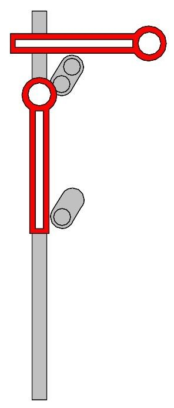
>
> Sygnał Sr 1 nakazuje zatrzymanie pociągu przed semaforem;
>
> **sygnał Sr 2 „Wolna droga"**

**Dzienny Nocny**

> Ramię semafora wzniesione Zielone światło pod kątem 45º do poziomu na
> semaforze. na prawo od masztu
>
> Sygnał Sr 2 zezwala na jazdę z największą dozwoloną prędkością dla
> danego pociągu na danym odcinku linii kolejowej *(szlaku, odstępie,
> drodze przebiegu)*;
>
> 3\) **sygnał Sr 3 „Wolna droga ze zmniejszoną prędkością"**

**Dzienny Nocny**

> Dwa ramiona semafora Dwa światła na wzniesione pod kątem 45° semaforze
> w pionie: do poziomu, na prawo górne światło zielone, od masztu
> semafora. dolne pomarańczowe.
>
> Sygnał Sr 3 zezwala na jazdę z prędkością nie większą niż 40 km/h,
> począwszy od semafora do końca okręgu zwrotnicowego osłanianego tym
> semaforem. W przypadku semafora wjazdowego lub drogowskazowego
> prędkość ograniczona do 40 km/h obowiązuje na całej drodze
> przebiegu*.*

6.  Sygnały na semaforach świetlnych nadawane są za pomocą jednego
    światła lub dwóch świateł w linii pionowej, z wyjątkiem sygnału SE
    „Jazda zgodnie ze wskazaniami systemu

> ERTMS/ETCS". Dolne światło może być uzupełnione poziomym pasem
> świetlnym.

7.  Pas świetlny na semaforze świetlnym tworzy sygnał tylko łącznie z
    dolnym światłem pomarańczowym semafora.

8.  Jeżeli sygnał na semaforze *świetlnym* zezwala na jazdę ze
    zmniejszoną prędkością, to jazda z tą prędkością obowiązuje do końca
    okręgu zwrotnicowego osłanianego tym semaforem, z wyjątkiem jazd po
    torach głównych dodatkowych, na których należy stosować na całej
    drodze przebiegu prędkość wskazaną na semaforze. W przypadku jazdy
    pod nadzorem sprawnie działającego systemu ERTMS/ETCS koniec
    obowiązywania tej prędkości wskazuje system ERTMS/ETCS.

9.  Latarnia sygnałowa semafora świetlnego może być zamontowana na
    maszcie lub bezpośrednio na podstawie

> (semafor karzełkowy) albo zawieszona obok toru lub nad torem.

10. Maszty semaforów odstępowych samoczynnych, na szlakach wyposażonych
    w blokadę wieloodstępową, są pomalowane na kolor biały albo są
    wyposażone w listwy koloru białego wykonane z materiałów
    odblaskowych. Jeżeli latarnia sygnałowa takiego semafora zawieszona
    jest obok toru lub nad torem, to dla oznaczenia rodzaju semafora,
    nad lub pod latarnią sygnałową albo obok niej, znajduje się listwa
    biała. Ostatni semafor samoczynny, usytuowany na szlaku przed
    semaforem wjazdowym posterunku ruchu, oznakowany jest wskaźnikiem W
    18.

11. Maszty semaforów półsamoczynnych, tzn. innych niż wymienione w ust.
    10, pomalowane są w poziome pasy czerwono-białe albo są wyposażone w
    listwy z czerwonobiałymi pasami wykonane z materiałów odblaskowych,
    przy czym pierwszy pas od dołu masztu jest czerwony. Jeżeli latarnia
    sygnałowa zawieszona jest obok toru lub nad torem, to dla oznaczenia
    rodzaju semafora, nad lub pod latarnią sygnałową albo obok niej,
    znajduje się listwa z czerwono-białymi pasami wykonana z materiałów
    odblaskowych.

12. Latarnie sygnałowe semaforów świetlnych karzełkowych, z przodu i z
    boków pomalowane są w poziome pasy, na przemian białe i czerwone
    *tak, że pas czerwony jest pomiędzy białymi*.

13. Semafory świetlne nadają następujące sygnały:

    1)  **sygnał S 1 „Stój"**

> Jedno czerwone światło ciągłe na semaforze.
>
> Sygnał S 1 nakazuje zatrzymanie pociągu *oraz manewrów* przed
> semaforem;

2)  **sygnał S 2 „Jazda z największą dozwoloną prędkością"** Jedno
    zielone światło ciągłe na semaforze.

> Sygnał S 2 zezwala na jazdę z największą prędkością dozwoloną dla
> danego pociągu na danym odcinku linii kolejowej *(szlaku, odstępie,
> drodze przebiegu)* i informuje, że na następnym semaforze, jeżeli
> semafor nadający sygnał S 2 jest z nim uzależniony, nadawany jest
> sygnał zezwalający na jazdę z największą dozwoloną prędkością;

3)  **sygnał S 3 „Jazda z największą dozwoloną prędkością --**

> **w przodzie są dwa odstępy blokowe wolne -- albo przy następnym
> semaforze z prędkością nie większą niż 100 km/h"**

Jedno zielone światło migające na semaforze.

> Sygnał S 3 zezwala na jazdę z największą prędkością dozwoloną dla
> danego pociągu i danego odcinka linii kolejowej *(drogi przebiegu)*.
> Sygnał S 3 nadawany przez:

a)  semafor półsamoczynny lub ostatni semafor samoczynny blokady
    liniowej informuje, że następny semafor może nadawać sygnał
    zezwalający na jazdę z prędkością nie większą niż 100 km/h. Jeżeli
    maszynista stwierdzi, że sygnał na następnym semaforze nie ogranicza
    prędkości, to stosuje się do aktualnych wskazań tego semafora,
    regulując prędkość jazdy, tak aby mógł zatrzymać pociąg przed
    kolejnym semaforem wskazującym sygnał „Stój",

b)  semafor samoczynny blokady liniowej lub semafor wyjazdowy na szlak
    wyposażony w wieloodstępową blokadę liniową informuje, że dwa
    kolejne odstępy blokowe za tym semaforem są wolne. Maszynista
    powinien tak regulować prędkość jazdy, aby mógł zatrzymać pociąg
    przed semaforem wskazującym sygnał „Stój". *Dotyczy to także
    semafora wjazdowego posterunku odgałęźnego bez semafora
    wyjazdowego*;

<!-- -->

4)  **sygnał S 4 „Następny** 5) **semafor wskazuje sygnał zezwalający na
    jazdę z prędkością zmniejszoną do 40 lub 60 km/h"**

+--------------------------------------------------------------------------+
| +---------------------------------------------+------------------------+ |
| | Jedno pomarańczowe                          | Jedno światło          | |
| |                                             | pomarańczowe ciągłe na | |
| | > światło migające na semaforze.            | semaforze.             | |
| +=============================================+========================+ |
+==========================================================================+

**sygnał S 5 „Następny semafor *(wskazuje)* nadaje sygnał Stój"**

Sygnał S 4 zezwala

> na jazdę z największą prędkością dozwoloną dla danego pociągu na danym
> odcinku linii kolejowej *(szlaku, odstępie, drodze przebiegu)*,
> wskazaną w wewnętrznym rozkładzie jazdy pociągów i informuje, że
> następny Sygnał S 5 informuje, że następny semafor nadaje sygnał
> „Stój". Maszynista powinien tak regulować prędkość jazdy, aby mógł
> zatrzymać pociąg przed następnym semaforem wskazującym

sygnał „Stój";

> semafor nadaje sygnał zezwalający na jazdę z prędkością
> nieprzekraczającą
>
> 40 lub 60 km/h;

6)  **sygnał S 6 „Jazda z prędkością nieprzekraczającą 100 km/h, a potem
    z największą dozwoloną prędkością"**

7)  **sygnał S 7 „Jazda z prędkością nieprzekraczającą 100 km/h przy tym
    i następnym semaforze"**

Dwa światła na semaforze

w jednym pionie: dolne światło pomarańczowe ciągłe, a pod nim świetlny
pas zielony poziomy, górne światło -- zielone ciągłe.

  -----------------------------------------------------------------------

  -----------------------------------------------------------------------

Dwa światła na semaforze w jednym pionie: dolne światło pomarańczowe
ciągłe, a pod nim świetlny pas zielony poziomy, górne światło -- zielone
migające.

Sygnał S 6 zezwala

na jazdę z prędkością nie większą niż 100 km/h i informuje, że na
następnym semaforze, jeżeli semafor nadający sygnał S 6 jest z nim
uzależniony, nadawany jest sygnał zezwalający na jazdę z największą
dozwoloną prędkością. *Jeżeli nie ma takiego uzależnienia to o sygnale
na następnym semaforze informuje tarcza ostrzegawcza*;

Sygnał S 7 zezwala na jazdę z prędkością nie większą niż 100 km/h i
informuje, że następny semafor nadaje sygnał zezwalający na jazdę z
prędkością nie większą niż 100 km/h;

8)  **sygnał S 8 „Jazda z prędkością nieprzekraczającą 100 km/h, a przy
    następnym semaforze z prędkością zmniejszoną do 40 lub 60 km/h"**

9)  **sygnał S 9 „Jazda z prędkością nieprzekra czającą 100 km/h, a przy
    następnym semaforze --**

> **Stój"**

Dwa światła na semaforze w jednym pionie: dolne światło pomarańczowe
ciągłe, a pod nim świetlny pas zielony poziomy, górne światło --
pomarańczowe migające.

  -----------------------------------------------------------------------

  -----------------------------------------------------------------------

Dwa światła na semaforze w jednym pionie - dolne światło pomarańczowe
ciągłe, a pod nim świetlny pas zielony poziomy, górne światło --
pomarańczowe ciągłe.

Sygnał S 8 zezwala

na jazdę z prędkością nie większą niż 100 km/h i informuje, że następny
semafor nadaje sygnał zezwalający na jazdę Sygnał S 9 zezwala na jazdę z
prędkością nie większą niż 100 km/h i informuje, że następny semafor
nadaje sygnał

  -----------------------------------------------------------------------
  z prędkością nie większą niż 40 lub 60 km/h;
  -----------------------------------------------------------------------

  -----------------------------------------------------------------------

„Stój";

10) **sygnał S 10 „Jazda z prędkością nieprzekraczającą**

11) **sygnał S 10a „Jazda z prędkością nieprzekraczającą**

> **40 km/h, a potem z największą dozwoloną prędkością"**

+--------------------------------------------------------------------------+
| +------------------------------------------+---------------------------+ |
| | Dwa światła na semaforze                 | Dwa światła na semaforze  | |
| |                                          | w jednym pionie -- dolne  | |
| | > w jednym pionie: dolne światło         | światło pomarańczowe      | |
| | > pomarańczowe ciągłe, a górne --        | ciągłe, a pod nim         | |
| | > zielone ciągłe.                        | świetlny pas pomarańczowy | |
| |                                          | poziomy, górne światło -- | |
| |                                          | zielone ciągłe.           | |
| +==========================================+===========================+ |
+==========================================================================+

**60 km/h, a potem z największą dozwoloną prędkością"**

Sygnał S 10 zezwala

na jazdę z prędkością nie większą niż 40 km/h i informuje, że na
następnym semaforze, jeżeli semafor nadający sygnał S 10 jest z nim
uzależniony, nadawany jest sygnał zezwalający

Sygnał S 10a zezwala na jazdę z prędkością nie większą niż 60 km/h i
informuje, że na następnym semaforze, jeżeli semafor nadający sygnał S
10a jest z nim uzależniony, nadawany jest sygnał zezwalający na jazdę z
największą dozwoloną prędkością. *Jeżeli nie ma takiego uzależnienia to
o sygnale na następnym semaforze informuje tarcza ostrzegawcza*;

na jazdę z największą dozwoloną prędkością. *Jeżeli nie ma takiego
uzależnienia to o sygnale na następnym semaforze informuje tarcza
ostrzegawcza*;

12) **sygnał S 11 „Jazda z prędkością nieprzekraczającą 40 km/h, a przy
    następnym semaforze -- z prędkością nie przekraczającą 100 km/h"**

13) **sygnał S 11a „Jazda z prędkością nieprzekraczającą 60 km/h, a przy
    następnym semaforze -- z prędkością nie przekraczającą 100 km/h"**

Dwa światła na semaforze w pionie -- dolne światło pomarańczowe ciągłe,
górne zielone migające.

Dwa światła na semaforze w pionie -- dolne światło pomarańczowe ciągłe,
a pod nim świetlny pas pomarańczowy poziomy, górne światło -- zielone
migające.

+--------------------------------------------------------------------------+
| +--------------------------------------+-------------------------------+ |
| | Sygnał S 11 zezwala                  | > Sygnał S 11a zezwala na     | |
| |                                      | > jazdę z prędkością nie      | |
| | > na jazdę z prędkością nie większą  | > większą niż 60 km/h i       | |
| | > niż 40 km/h i informuje, że        | > informuje, że następny      | |
| | > następny semafor nadaje sygnał     | > semafor nadaje sygnał       | |
| | > zezwalający na jazdę z prędkością  | > zezwalający na jazdę z      | |
| | > nie większą niż 100 km/h;          | > prędkością nie większą niż  | |
| |                                      | > 100 km/h;                   | |
| +======================================+===============================+ |
| | 14\) **sygnał S 12 „Jazda**          | 15\) **sygnał S 12a „Jazda z  | |
| |                                      | prędkością nieprzekraczającą  | |
| | > **z prędkością nieprzekraczającą   | 60 km/h, a przy następnym     | |
| | > 40 km/h, a przy następnym          | semaforze -- z prędkością     | |
| | > semaforze -- z prędkością nie      | zmniejszoną do 40 lub 60      | |
| | > przekraczającą 40 lub 60 km/h"**   | km/h"**                       | |
| +--------------------------------------+-------------------------------+ |
+==========================================================================+

Dwa światła na semaforze w jednym pionie -- dolne światło pomarańczowe

+--------------------------------------------------------------------------+
| +---------------------------------+------------------------------------+ |
| | ciągłe, górne światło           | > ciągłe, a pod nim świetlny pas   | |
| | pomarańczowe migające.          | > pomarańczowy poziomy, górne      | |
| |                                 | > światło pomarańczowe migające.   | |
| +=================================+====================================+ |
+==========================================================================+

Dwa światła na semaforze w jednym pionie -- dolne światło pomarańczowe
Sygnał S 12 zezwala

na jazdę z prędkością nie większą niż 40 km/h i informuje, że następny
semafor nadaje sygnał zezwalający na jazdę z prędkością nie większą niż
40 lub 60 km/h; Sygnał S 12a zezwala na jazdę z prędkością nie większą
niż 60 km/h i informuje, że następny semafor nadaje sygnał zezwalający
na jazdę z prędkością nie większą niż 40 lub 60 km/h;

16) **sygnał S 13 „Jazda z prędkością nieprzekraczającą 40 km/h, a przy
    następnym semaforze --**

> **Stój"**

17) **sygnał S 13a „Jazda z prędkością nieprzekraczającą 60 km/h, a przy
    następnym semaforze --**

> **Stój"**

Dwa światła

> pomarańczowe ciągłe na semaforze w jednym pionie.

+-----------------------------------------------------------------------+
| > pas pomarańczowy poziomy.                                           |
+=======================================================================+

Dwa światła pomarańczowe ciągłe na semaforze w jednym pionie, a pod nimi
świetlny

Sygnał S 13 zezwala

na jazdę z prędkością nie większą niż 40 km/h i informuje, że następny
semafor nadaje sygnał

„Stój";

Sygnał S 13a zezwala na jazdę z prędkością nie większą niż 60 km/h i
informuje, że następny semafor nadaje sygnał

„Stój";

18) **sygnał zastępczy Sz „Można przejechać obok semafora wskazującego
    sygnał Sr 1 lub S 1 „Stój" albo sygnał wątpliwy, albo też semafora
    nieoświetlonego lub przejechać obok sygnalizatora sygnału
    zastępczego, mającego wyłącznie latarnię ze światłem białym -- bez
    rozkazu pisemnego"**

> Jedno światło matowobiałe migające na semaforze lub maszcie semafora,
> albo na maszcie semafora nieoświetlonego, albo umieszczone na osobnej
> podstawie.
>
> Sygnał zastępczy Sz zezwala na:

a)  jazdę do następnego semafora, tarczy zaporowej, miejsca ustawienia
    tarczy zatrzymania D 1,

b)  jazdę, która może odbywać się z prędkością nie większą niż 40 km/h i
    nie wymaga zatrzymania się przed nim. Maszynista powinien jednak tak
    regulować prędkość jazdy, aby mógł w każdej chwili zatrzymać pociąg
    w razie nagłego zauważenia przeszkody. Przy wyjeździe na szlak bez
    blokady wieloodstępowej jazda z prędkością do 40 km/h obowiązuje do
    końca rozjazdów w okręgu zwrotnicowym osłanianych semaforem.

> Wyjazd pociągu na szlak z blokadą wieloodstępową na podstawie sygnału
> zastępczego, rozkazu pisemnego doręczonego drużynie pociągowej lub
> przekazanego za pomocą urządzeń łączności powinien odbywać się ze
> szczególną ostrożnością, tak aby maszynista mógł w każdej chwili
> zatrzymać pociąg w razie nagłego zauważenia przeszkody, a przy tym
> prędkość jazdy nie może przekraczać 40 km/h. Jazda pociągu z
> ostrożnością obowiązuje do czasu minięcia przez czoło pociągu semafora
> wskazującego sygnał zezwalający na jazdę, o ile maszynista nie
> otrzymał rozkazu pisemnego z informacją, że samoczynne semafory
> odstępowe są nieważne;

19) **sygnał SE „Jazda zgodnie ze wskazaniami systemu**

> **ERTMS/ETCS"**
>
> Brak świateł na semaforze świetlnym, oznaczonym za pomocą wskaźnika W
> ETCS 10 albo W ETCS 11.

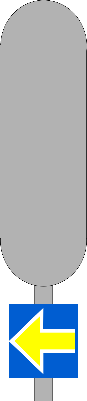{width="0.3950557742782152in"
height="1.8222222222222222in"}
{width="0.42291666666666666in"
height="1.8270833333333334in"}

> Sygnał SE „Jazda zgodnie ze wskazaniami systemu ERTMS/ETCS":

a)  jest stosowany tylko na odcinkach linii kolejowych, o których mowa w
    § 3 ust. 19 pkt 2, oraz na posterunkach ruchu, o których mowa w § 3
    ust. 20,

b)  nakazuje prowadzenie pociągu w sposób określony w § 17 ust. 23 pkt
    10 lit. b -- w przypadku zastosowania wskaźnika W ETCS 10,

c)  nakazuje prowadzenie pociągu w sposób określony w ust. 20 oraz w §
    17 ust. 23 pkt 11 lit. b -- w przypadku zastosowania wskaźnika W
    ETCS 11.

<!-- -->

14. Pociąg zatrzymany przed semaforem wskazującym sygnał Sr 1 lub S 1
    „Stój", nieoświetlonym lub wskazującym białe światło bądź sygnał
    wątpliwy, z wyjątkiem semafora odstępowego samoczynnego, może jechać
    dalej, jeżeli na semaforze ukaże się sygnał zezwalający lub sygnał
    zastępczy, albo na rozkaz pisemny, doręczony drużynie pociągowej lub
    przekazany za pomocą urządzeń łączności.

15. Pociąg zatrzymany wskutek braku semafora kształtowego lub świetlnego
    na miejscu, na którym poprzednio się znajdował, jak również pociąg
    zatrzymany przed sygnałem D 1 „Stój" na przenośnej tarczy
    zatrzymania ustawionej w miejscu brakującego semafora może jechać
    dalej na rozkaz pisemny, doręczony drużynie pociągowej lub
    przekazany za pomocą urządzeń łączności.

16. Pociąg zatrzymany przed semaforem odstępowym samoczynnym wskazującym
    sygnał S 1 „Stój", jeżeli nie ukaże się sygnał zezwalający na jazdę,
    powinien jechać dalej z prędkością nieprzekraczającą 40 km/h, o ile
    nie ma widocznej przeszkody do jazdy. Prędkość pociągu należy tak
    regulować, aby można było w każdej chwili zatrzymać pociąg w
    przypadku zauważenia przeszkody. Jazda pociągu z ostrożnością

> obowiązuje do czasu minięcia przez czoło pociągu semafora wskazującego
> sygnał zezwalający na jazdę.

17. Sygnał Sr 1 lub S 1 „Stój" na semaforze odnosi się zarówno do
    pociągów, jak i do manewrów, i oznacza zakaz przejechania obok
    semafora wskazującego taki sygnał.

18. Manewrujący tabor kolejowy może minąć sygnał Sr 1 lub S 1 „Stój" na
    semaforze wówczas, gdy uprawniony pracownik wyda pozwolenie na
    minięcie tego sygnału i poda sygnał Rm 1 „Do mnie" lub Rm 2 „Ode
    mnie".

19. Sygnał zezwalający na semaforze *oraz sygnał zastępczy* *oznacza
    zakaz manewrowania na drodze przebiegu pociągu*.

20. Pociąg zatrzymany przed wskaźnikiem W ETCS 11 może jechać dalej:

    1)  jeżeli otrzyma zezwolenie na jazdę (MA);

    2)  jeżeli ukaże się sygnał zezwalający na semaforze i o ile
        wskaźnik W ETCS 11 jest umieszczony na maszcie samoczynnego
        semafora odstępowego;

    3)  na zasadach określonych w ust. 16, o ile wskaźnik W ETCS 11 jest
        umieszczony na maszcie samoczynnego semafora odstępowego.

## § 5. Sygnały nadawane przez sygnalizatory powtarzające 

1.  Sygnalizator powtarzający nadaje sygnały światłami latarni
    sygnałowej umieszczonej na maszcie koloru szarego lub zawieszonej
    obok toru.

2.  Zabrania się stosowania sygnalizatorów powtarzających na szlakach z
    blokadą wieloodstępową.

3.  W razie konieczności można stosować więcej niż jeden, ale nie więcej
    niż trzy sygnalizatory powtarzające.

4.  Sygnalizatory powtarzające zaopatruje się w tablice wskazujące
    czarnymi pasami pionowymi na białym tle kolejność tych
    sygnalizatorów, licząc od semafora, do którego się odnoszą.

5.  Na sygnalizatorach powtarzających stosuje się następujące sygnały:

1\) **sygnał Sp 1 „Semafor** 2) **sygnał Sp 2 „Semafor wskazuje sygnał
Sr 1 wskazuje sygnał lub S 1 Stój" zezwalający na jazdę**

> **z największą dozwoloną prędkością"**

Dwa światła w pionie: Dwa światła w pionie:

dolne -- białe, górne -- dolne -- białe, górne --

pomarańczowe; zielone;

3\) **sygnał Sp 3 „Semafor** 4) **sygnał Sp 4 „Semafor wskazuje sygnał
wskazuje sygnał zezwalający na jazdę zezwalający na jazdę**

+-------------------------------------------+--------------------------+
| > **z prędkością nieprzekraczającą**      | **z prędkością           |
| >                                         | zmniejszoną do 40 lub 60 |
| > **100 km/h"**                           | km/h"**                  |
+===========================================+==========================+
| Dwa światła w pionie:                     | Dwa światła w pionie:    |
|                                           | dolne -- białe, górne -- |
| > dolne -- białe, górne -- zielone        | pomarańczowe migające.   |
| > migające;                               |                          |
+-------------------------------------------+--------------------------+

6.  Jeżeli semafor wskazuje sygnał SE „Jazda zgodnie ze wskazaniami
    systemu ERTMS/ETCS", to na odnoszącym się do niego sygnalizatorze
    powtarzającym wszystkie komory są ciemne (brak świateł).

## § 6. Sygnały nadawane przez tarcze ostrzegawcze semaforowe 

1.  Wyróżnia się następujące rodzaje tarczy ostrzegawczej semaforowej
    kształtowej:

    1)  tarcza ostrzegawcza dwustawna, na której można nastawić dwa
        sygnały;

    2)  tarcza ostrzegawcza trójstawna, na której można nastawić trzy
        sygnały;

    3)  tarcza ostrzegawcza nieruchoma.

2.  Tarcza ostrzegawcza dwustawna nadaje sygnały za pomocą dysku koloru
    pomarańczowego z czarnym pierścieniem i białą obwódką, obracającego
    się o kąt około 90° względem poziomej osi oraz latarni sygnałowej
    przesłanianej pomarańczowym lub zielonym szkłem.

3.  Tarcza ostrzegawcza trójstawna nadaje sygnały za pomocą dysku koloru
    pomarańczowego z czarnym pierścieniem i białą obwódką, obracającego
    się o kąt około 90° względem poziomej osi, latarni sygnałowej
    przesłanianej pomarańczowym lub zielonym szkłem oraz białej strzały
    z czerwoną obwódką, umieszczonej na maszcie pod tarczą.

4.  Sygnał tarczy ostrzegawczej nieruchomej stanowi dysk koloru
    pomarańczowego z czarnym pierścieniem i białą obwódką oraz latarnią
    z pomarańczowym szkłem na tarczy.

5.  Tarcze ostrzegawcze semaforowe kształtowe stosuje się przed
    semaforami kształtowymi.

6.  Na liniach kolejowych, na których dopuszczalna prędkość jest nie
    większa niż 40 km/h, w wyjątkowych przypadkach, przed semaforami
    świetlnymi można stosować tarcze ostrzegawcze nieruchome.

7.  Dla kontrolowania, czy świeci się latarnia kształtowej tarczy
    ostrzegawczej, stosuje się światła wsteczne. Gdy tarcza ostrzegawcza
    nadaje sygnał:

    1)  *Od 1, latarnia pokazuje wstecz duże światło matowobiałe*,

    2)  *Od 2, latarnia pokazuje wstecz duże światło białe*,

    3)  *Ot 1, Ot 2, Ot 3, latarnia pokazuje wstecz małe światło
        matowobiałe*.

> *Latarnia nieruchomej tarczy ostrzegawczej pokazuje wstecz światło
> białe*.

8.  Tarcza ostrzegawcza kształtowa dwustawna nadaje następujące sygnały:

> 1\) **sygnał Od 1 „Semafor wskazuje sygnał Sr 1 Stój"**

**Dzienny Nocny**

Dysk pomarańczowy Pomarańczowe światło

> z czarnym pierścieniem poniżej dysku; i białą obwódką ustawiony
>
> 2\) **sygnał Od 2 „Semafor wskazuje sygnał Sr 2 lub Sr 3 zezwalający
> na jazdę"**

**Dzienny Nocny**

> Dysk w położeniu Zielone światło poniżej poziomym. dysku.
>
> 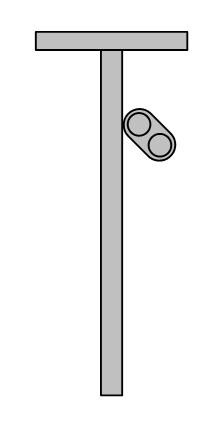

9.  Tarcza ostrzegawcza kształtowa trzystawna nadaje następujące
    sygnały:

    1)  **sygnał Ot 1 „Semafor wskazuje sygnał Sr 1 -- Stój"**

**Dzienny Nocny**

> Okrągły dysk pomarańczowy Pomarańczowe światło z czarnym pierścieniem
> i białą poniżej dysku; obwódką, a pod nim biała strzała z czerwoną
> obwódką -- skierowana ostrzem w dół.

2)  **sygnał Ot 2 „Semafor wskazuje sygnał Sr 2 Wolna droga"**

**Dzienny Nocny**

> Dysk w położeniu poziomym, Zielone światło poniżej a pod nim biała
> strzała dysku; z czerwoną obwódką, skierowana ostrzem w dół.

3)  **sygnał** **Ot 3 „Semafor wskazuje sygnał Sr 3 -- Wolna droga ze
    zmniejszoną prędkością"**

**Dzienny Nocny**

+--------------------------------------+-------------------------------+
| Okrągły dysk pomarańczowy z czarnym  | > Dwa światła w pionie        |
| pierścieniem i białą obwódką, a pod  | > poniżej dysku: dolne        |
| nim biała strzała z czerwoną obwódką | > światło zielone, a górne    |
| --                                   | > pomarańczowe.               |
+======================================+===============================+

> skierowana ostrzem ukośnie w dół na prawo pod kątem 45º od masztu
> tarczy.

10. Tarcza ostrzegawcza nieruchoma nadaje tylko jeden sygnał:

> **sygnał On „W odległości drogi hamowania znajduje się semafor"**

**Dzienny Nocny**

> Nieruchomy pomarańczowy Jedno pomarańczowe światło dysk z czarnym
> pierścieniem na dysku. i białą obwódką.

11. Na tarczy ostrzegawczej nieruchomej, której dysk jest odblaskowy,
    nie stosuje się sygnału nocnego.

12. Tarcza ostrzegawcza nieruchoma nakazuje zmniejszenie prędkości tak,
    aby można było zatrzymać pociąg przed semaforem, gdy semafor ten
    wskazuje sygnał „Stój".

13. Tarcza ostrzegawcza semaforowa świetlna nadaje sygnały światłem
    latarni sygnałowej umieszczonej na maszcie koloru szarego lub
    zawieszonej obok toru.

14. Tarcze ostrzegawcze semaforowe świetlne ustawia się przed semaforami
    świetlnymi, jak również przed semaforami kształtowymi.

15. Tarcza ostrzegawcza semaforowa świetlna nadaje następujące sygnały:

> 1\) **sygnał Os 1 „Semafor, do** 2) **sygnał Os 2 „Semafor, którego
> się tarcza do którego się tarcza odnosi, wskazuje sygnał odnosi,
> wskazuje**

**Stój" sygnał zezwalający**

Jedno pomarańczowe światło ciągłe na tarczy. **na jazdę z największą
dozwoloną prędkością"** Jedno światło zielone ciągłe na tarczy.

+-----+-------------------------------+-----+----------------------------+
| 3\) | **sygnał Os 3 „Semafor, do    | 4\) | **sygnał Os 4 „Semafor, do |
|     | którego się tarcza odnosi,    |     | którego się tarcza odnosi, |
|     | wskazuje sygnał zezwalający   |     | wskazuje sygnał            |
|     | na jazdę z prędkością         |     | zezwalający na jazdę z     |
|     | nieprzekraczającą**           |     | prędkością zmniejszoną do  |
|     |                               |     | 40 lub 60 km/h"**          |
|     | **100 km/h"**                 |     |                            |
+=====+===============================+=====+============================+
|     | Jedno światło zielone         |     | Jedno światło pomarańczowe |
|     | migające na tarczy.           |     | migające na tarczy.        |
+-----+-------------------------------+-----+----------------------------+

16. Jeżeli semafor wskazuje sygnał SE „Jazda zgodnie ze wskazaniami
    systemu ERTMS/ETCS", to na odnoszącej się do niego tarczy
    ostrzegawczej semaforowej świetlnej wszystkie komory są ciemne (brak
    świateł).

## § 7. Sygnały nadawane przez tarcze ostrzegawcze przejazdowe 

1.  Tarcza ostrzegawcza przejazdowa nadaje sygnał dwoma światłami w
    latarni sygnałowej umieszczonej na maszcie lub zawieszonej obok
    toru. *Sygnał nadawany przez tarczę ostrzegawczą przejazdową dotyczy
    toru, przy którym ta tarcza jest ustawiona*.

2.  Tarcza ostrzegawcza przejazdowa informuje drużynę trakcyjną o stanie
    sprawności urządzeń ostrzegających użytkowników drogi na przejeździe
    znajdującym się w odległości drogi hamowania za tą tarczą.

3.  Tarcza ostrzegawcza przejazdowa jest oznaczona tabliczką z liczbą
    odpowiadającą kilometrowi i hektometrowi przejazdu, do którego ta
    tarcza się *odnosi, zgodnie z zasadami określonymi w załączniku Nr
    5*. Maszt tarczy jest pomalowany w poziome pasy biało-czarne albo
    jest wyposażony w listwę z biało-czarnymi pasami wykonaną z
    materiałów odblaskowych, przy czym pierwszy pas od dołu masztu jest
    czarny.

4.  W stanie zasadniczym, gdy do przejazdu, do którego tarcza się
    odnosi, nie zbliża się pociąg, tarcza ostrzegawcza przejazdowa
    pozostaje nieoświetlona. Po włączeniu urządzeń ostrzegających na
    przejeździe tarcza ostrzegawcza przejazdowa nadaje sygnał
    informujący, czy użytkownicy drogi są, czy nie są ostrzegani o
    zbliżaniu się pociągu do przejazdu.

5.  W przypadku gdy tarcza ostrzegawcza przejazdowa nadaje sygnał Osp 1
    lub do czasu minięcia jej przez czoło pociągu pozostaje ciemna,
    należy zmniejszyć prędkość pociągu tak, by można było zatrzymać
    pociąg przed przejazdem, gdy na przejeździe jest przeszkoda
    zagrażająca bezpieczeństwu ruchu. Jazda z prędkością *do* 20 km/h
    obowiązuje tylko do czasu minięcia przejazdu przez czoło pociągu.

6.  Tarcza ostrzegawcza przejazdowa nadaje następujące sygnały:

    1)  **sygnał Osp 1 „Urządzenia sygnalizacji na przejeździe, do
        którego się tarcza odnosi, są niesprawne, jazda przez przejazd z
        prędkością *do* 20 km/h"**

> Dwa światła pomarańczowe ciągłe w linii poziomej;

2)  **sygnał Osp 2 „Urządzenia sygnalizacji na przejeździe, do którego
    się tarcza odnosi, są sprawne, jazda przez przejazd     z największą
    dozwoloną prędkością"** Dwa światła białe ciągłe w linii pionowej.

## § 9. Zasady umieszczania sygnalizatorów 

1.  Na stacji oraz na szlaku jednotorowym sygnalizatory są umieszczane
    (ustawiane lub zawieszane) po prawej stronie toru, patrząc w
    kierunku jazdy, z zastrzeżeniem ust. 2.

2.  W uzasadnionych przypadkach przy torze głównym dodatkowym, semafor
    może być zawieszony nad torem, do którego się odnosi. Tarcze
    ostrzegawcze ustawia się według zasad określonych w ust. 4 i 5.

3.  Na szlaku dwutorowym sygnalizatory umieszcza się po zewnętrznej
    stronie torów.

4.  Na szlaku o liczbie torów większej niż dwa przy torach skrajnych
    sygnalizatory umieszcza się po zewnętrznej stronie torów, zgodnie z
    ust. 3, natomiast przy torach nieskrajnych -- po prawej stronie
    toru, patrząc w kierunku jazdy.

5.  W przypadku równoległego zbliżenia na szlaku dwóch lub więcej torów
    należy przestrzegać następujących zasad:

    1)  na odcinku, na którym tory leżą obok siebie, sygnalizatory
        umieszcza się według zasad określonych w ust. 3 i 4;

    2)  na odcinkach, na których tory są oddalone od siebie,
        sygnalizatory umieszcza się według zasad określonych w ust. 1, 3
        i 4.

6.  Zasady określone w ust. 3-5 dotyczą zarówno umieszczania
    sygnalizatorów na szlaku, jak i semaforów wjazdowych na
    zapowiadawczym posterunku ruchu.

7.  Jeżeli warunki miejscowe nie pozwalają na umieszczenie semafora,
    sygnalizatora sygnału zastępczego lub tarczy ostrzegawczej zgodnie z
    zasadami określonymi w ust. 1-5, to sygnalizator ten może być
    umieszczony w innym miejscu.

8.  W przypadku, o którym mowa w ust. 7, w miejscu, w którym powinien
    znajdować się sygnalizator, umieszcza się wskaźnik W 15.

9.  Sygnalizatory powtarzające powinny być umieszczane po tej samej
    stronie toru, co semafor, do którego się odnoszą.

## § 10. Sygnały zamknięcia toru 

1.  Sygnały zamknięcia toru stosuje się na tarczach zaporowych,
    wykolejnicach, obrotnicach, wagach pomostowych oraz kozłach
    oporowych.

2.  *Sygnał zamknięcia toru stosuje się także na punktach przestawczych
    zestawów kołowych*.

3.  Tarcza zaporowa nadaje sygnał zabraniający albo zezwalający na jazdę
    po torach stacyjnych. *Do kontrolowania czy świeci się latarnia
    tarczy zaporowej, stosuje się światła wsteczne.*

> *Gdy tarcza zaporowa nadaje sygnał*:

1)  *Z 1, latarnia pokazuje wstecz dwa mlecznobiałe światła w linii
    poziomej*;

2)  *Z 2, latarnia pokazuje wstecz dwa mlecznobiałe światła w linii
    ukośnej wznoszącej się pod kątem 45º ku stronie prawej*.

> *Latarnia nieruchomej tarczy zaporowej pokazuje wstecz światło białe*.

4.  Tarcze zaporowe nadają następujące sygnały:

    1)  **sygnał Z 1 „Stój"** 2) **sygnał Z 2 „Jazda**

> **dozwolona"**

**Dzienny i nocny Dzienny i nocny**

> Kresa pozioma czarna na tle Kresa ukośna czarna pod białej okrągłej
> tarczy. kątem 45° w górę
>
> ku stronie prawej, na tle białej okrągłej tarczy.
>
> Sygnał Z 1 na tarczy zaporowej jest ważny zarówno dla manewrów, jak i
> dla pociągów, i nakazuje zatrzymanie pociągu lub manewrującego taboru
> kolejowego przed tą tarczą.
>
> Sygnał Z 2 na tarczy zaporowej zezwala na przejazd manewrującego
> taboru kolejowego poza tę tarczę, a nadany łącznie z sygnałem
> zezwalającym na semaforze w ramach utwierdzonej drogi przebiegu,
> zezwala na przejazd pociągu.

5.  Pociąg zatrzymany przed tarczą zaporową nadającą sygnał Z 1 „Stój"
    może jechać dalej na rozkaz, doręczony lub przekazany za pomocą
    urządzeń łączności drużynie pociągowej.

6.  Manewrujący tabor kolejowy może przejechać poza tarczę zaporową na
    sygnał Z 2 „Jazda dozwolona", a w razie niemożności nastawienia na
    tarczy tego sygnału -- gdy upoważniony pracownik da pozwolenie na
    minięcie sygnału Z 1 „Stój" na tarczy zaporowej, a ponadto nada
    sygnał Rm 1 „Do mnie" lub Rm 2 „Ode mnie".

7.  W przypadku torów zakończonych kozłem oporowym tarczę zaporową
    wskazującą stale sygnał Z 1 „Stój" lub semafor świetlny stale
    wskazujący sygnał S 1 „Stój" ustawia się z prawej strony toru,
    patrząc w kierunku jazdy, w miejscu, gdzie rozpoczyna się odcinek
    zasypany piaskiem, a przy rampach -- z prawej strony toru, na
    wysokości belki zderzakowej kozła oporowego.

8.  *Przed kozłami oporowymi na torach, na których w porze ciemnej nie
    manewruje się i na które nie wjeżdżają pociągi, albo manewruje się
    sporadycznie lub wykonywanie planowanych manewrów zajmuje niewielką
    część doby -- a oświetlenie zewnętrzne w czasie manewrowania
    zapewnia dobrą widoczność sygnału, można zamiast latarń stosować
    tarcze nieoświetlone, dające takie same wskazanie, jakie daje
    latarnia sygnału Z 1 „Stój". Zaleca się, żeby takie tarcze były
    wykonane z materiałów odblaskowych*.

9.  Latarnie wykolejnicowe nadają sygnały wskazujące czy wykolejnica
    jest na torze, czy jest zdjęta z toru.

10. Do nadawania sygnału o położeniu wykolejnicy służy latarnia
    mechaniczna z okrągłym szkłem koloru mlecznego z czarną kresą lub
    latarnia elektryczna z trzema punktami świetlnymi.

11. Latarnie wykolejnicowe nadają następujące sygnały:

+-----+-------------------------------+-----+---------------------------+
| 1\) | **sygnał Z 1wk „Stój,         | 2\) | **sygnał Z 2wk            |
|     | wykolejnica na torze"**       |     | „Wykolejnica zdjęta z     |
|     |                               |     | toru"**                   |
+=====+===============================+=====+===========================+
|     | **Dzienny i nocny**           |     | **Dzienny i nocny**       |
+-----+-------------------------------+-----+---------------------------+
|     | Na latarni mechanicznej kresa |     | Na latarni mechanicznej   |
|     | pozioma czarna na tle białej  |     | kresa pionowa czarna na   |
|     | okrągłej tarczy, a na latarni |     | tle białej okrągłej       |
|     | elektrycznej punkty świetlne  |     | tarczy, a na latarni      |
|     | czerwony i biały              |     | elektrycznej dwa białe    |
|     |                               |     | światła w pionie.         |
|     | w poziomie;                   |     |                           |
+-----+-------------------------------+-----+---------------------------+

  ----------------------------------------------------------------------
  latarnia elektryczna                        latarnia elektryczna
  ------------------------------------------- --------------------------

  ----------------------------------------------------------------------

12. Latarnie mechaniczne mają z tyłu dwa mleczne światła, które ułożone
    w pionie oznaczają „Wykolejnica zdjęta z toru", a ułożone w poziomie
    oznaczają „Stój, wykolejnica na torze".

13. Latarnie elektryczne nadają jednakowe sygnały do przodu i do tyłu.

14. Sygnały Z 1o i Z 2o na obrotnicach oraz Z 1wg i Z 2wg na wagach
    pomostowych i innych urządzeniach nadaje się

> za pomocą latarni ze szkłem koloru mlecznego, która tworzy obraz
> sygnałowy o kształcie okrągłej tarczy z czarną kresą.

15. Na wykolejnicach w torach, na których w porze nocnej nie manewruje
    się lub manewruje się sporadycznie, a oświetlenie zewnętrzne w
    czasie manewrów zapewnia dobrą widoczność sygnałów, można zamiast
    latarni używać tarcz nieoświetlonych, nadających takie same sygnały,
    jak latarnia. Zaleca się, aby tarcze takie były odblaskowe. *Czas
    (porę doby) oraz przypadki, w których latarnie wykolejnicowe powinny
    być podświetlone należy określić w regulaminie technicznym
    posterunku ruchu*.

16. Na urządzeniach, o których mowa w ust. 14, podaje się następujące
    sygnały:

+--------------------------------------+-----+--------------------------+
| 1\) **sygnał Z 1o, Z 1wg „Stój,      | 2\) | **sygnał Z 2o, Z 2wg**   |
| wjazd zabroniony"**                  |     |                          |
|                                      |     | **„Wjazd dozwolony"**    |
+======================================+=====+==========================+
| > **Dzienny i nocny**                |     | > **Dzienny i nocny**    |
+--------------------------------------+-----+--------------------------+
| > Kresa pozioma czarna na tle        |     | > Kresa pionowa czarna   |
| > białej, okrągłej tarczy;           |     | > na tle białej,         |
|                                      |     | > okrągłej               |
+--------------------------------------+-----+--------------------------+

> tarczy.

17. Sygnał Z 1o i Z 1wg „Stój, wjazd zabroniony" na obrotnicy i wadze
    pomostowej oznacza, że wjazd na obrotnicę lub wagę jest zabroniony.
    Jeżeli latarnia lub tarcza wskazuje ten sygnał, należy użyć
    wszelkich dozwolonych środków, aby lokomotywę lub przetaczany tabor
    kolejowy zatrzymać przed obrotnicą lub wagą.

18. Na obrotnicach, wagach pomostowych i innych urządzeniach zamiast
    latarni, o których mowa w ust. 14, można stosować tarcze wskazujące
    taki sam sygnał w dzień i w nocy, przy czym zaleca się, żeby tarcze
    te były wykonane z materiałów odblaskowych.

19. *Na punktach przestawczych zestawów kołowych stosuje się następujący
    sygnał*:

> 1\) **sygnał Z 1p „Stój, wjazd pojazdów z nieprzesuwnymi kołami
> zabroniony"**
>
> **Dzienny i nocny**
>
> *Kresa pozioma czarna na tle białej, okrągłej tarczy, pod którą
> znajduje się duża, biała litera N*;

a)  oznacza, że pojazdom kolejowym z nieprzesuwnymi kołami zestawów
    kołowych zabrania się wjazdu na tor dojazdowy do stanowiska
    przestawczego poza ten sygnał,

b)  w kształcie prostokątnej czarnej tarczy z krótszym bokiem
    równoległym do płaszczyzny główki szyny, ustawionej na maszcie po
    prawej stronie toru dojazdowego, patrząc w kierunku jazdy,

c)  w górnej części tarczy usytuowany jest mlecznobiały okrąg z poziomą
    czarną kresą, w dolnej części mlecznobiała litera „N",

d)  może być wykonany jako świetlny (wyświetlany w porze nocnej) lub w
    postaci tablicy stale wskazującej obraz tego wskaźnika, w tym
    przypadku elementy o barwie białej obrazu wskaźnika powinny być
    wykonane z materiałów odblaskowych,

e)  ustawia się w odległości nie mniejszej niż 15 m od początku
    stanowiska przestawczego;

<!-- -->

2)  podczas przejeżdżania pojazdów kolejowych wyposażonych w zestawy
    kołowe specjalnej konstrukcji z przesuwnymi kołami przez punkt
    przestawczy od strony toru normalno- lub szerokotorowego następuje
    zmiana prześwitu zestawów kołowych odpowiednio do szerokości toru;

3)  jeżeli pojazdy kolejowe nie posiadają zestawów kołowych specjalnej
    konstrukcji, to czoło pchanego składu należy

> zatrzymać przed wskaźnikiem Z 1p;

4)  przejazd pojazdów kolejowych z przesuwnymi kołami w rejonie
    stanowiska przestawczego i przez to stanowisko odbywa się zgodnie z
    przepisami wewnętrznymi zarządcy infrastruktury.

## § 11. Sygnały zatrzymania i zmniejszenia prędkości podawane przenośnymi tarczami 

1.  Stosuje się następujące sygnały zatrzymania:

    1)  **sygnał DO „Za tarczą ostrzegawczą znajduje się tarcza
        zatrzymania"**

  -----------------------------------------------------------------------
  **Dzienny**                              **Nocny**
  ---------------------------------------- ------------------------------
  Nieruchoma okrągła tarcza pomarańczowa z Pomarańczowe światło na
  czarnym                                  maszcie pod tarczą.

  -----------------------------------------------------------------------

> pierścieniem i białą obwódką.
>
> Nieruchoma przenośna tarcza ostrzegawcza informuje, że w odległości
> drogi hamowania zwiększonej o 200 m znajduje się tarcza zatrzymania z
> sygnałem D 1. Przed przenośną tarczą ostrzegawczą nie ustawia się
> wskaźnika W 1;

2)  **sygnał D 1 „Stój" dawany tarczą zatrzymania**

**Dzienny Nocny**

> Prostokątna tarcza Czerwone światło pośrodku czerwona z białą obwódką.
> nad tarczą.

2.  Jeżeli powierzchnia przenośnej tarczy ostrzegawczej i przenośnej
    tarczy zatrzymania jest odblaskowa, to można nie stosować na nich
    sygnału nocnego. *Dla umożliwienia kontroli czy latarnia tarczy
    zatrzymania świeci się, latarnia powinna pokazywać od tyłu światło
    matowobiałe tej samej wielkości co światło przednie*.

3.  Przenośną tarczę ostrzegawczą DO i przenośną tarczę zatrzymania D 1
    ustawia się w stosunku do torów, do których się odnoszą, według tych
    samych zasad ustawiania, jakie obowiązują dla semaforów, z tym że na
    stacjach przenośną tarczę zatrzymania ustawia się w osi toru.

4.  Sygnał D 1 „Stój" dawany tarczą zatrzymania stosuje się do
    oznaczenia miejsca, w którym z jakichkolwiek powodów konieczne jest
    zatrzymanie pociągu lub manewrującego składu, a w miejscu tym nie ma
    semafora ani sygnału zamknięcia toru lub na sygnalizatorze tam
    ustawionym nie da się nastawić sygnału zabraniającego jazdy, a w
    szczególności:

    1)  jeżeli stan toru lub jakakolwiek przeszkoda zagraża
        bezpieczeństwu ruchu kolejowego;

    2)  jeżeli na semaforze lub na tarczy zaporowej nie można z powrotem
        nastawić sygnału „Stój";

    3)  jeżeli czasowo brak semafora;

    4)  w razie zamknięcia toru szlakowego lub stacyjnego albo jego
        części;

    5)  *jeżeli tarcza zaporowa zostanie unieruchomiona w położeniu
        „Jazda dozwolona"*;

    6)  *dla zabezpieczenia maszyn torowych pozostawionych do postoju na
        wyznaczonych torach przed najechaniem taborem -- w tym przypadku
        tarczę zatrzymania ustawia się w odległości od 1 do 3 m przed
        wykolejnicą osłaniającą stojące na torze maszyny torowe*.

> Sygnał ten stosuje się także na szlaku do oznaczenia miejsca
> wymagającego ograniczenia prędkości poniżej 10 km/h.

5.  W przypadkach, o których mowa w ust. 4 pkt 2 i 3, tarczę
    *zatrzymania* D 1 ustawia się przy semaforze lub w miejscu
    ustawienia semafora.

6.  Tarczę zatrzymania na szlaku ustawia się w odległości co najmniej 50
    m od miejsca, które ma być osłonięte, a oprócz tego przed tarczą
    zatrzymania ustawia się przenośną tarczę ostrzegawczą w odległości
    drogi hamowania zwiększonej o 200 m.

7.  W obrębie stacji, *także na posterunku odgałęźnym*, tarczę
    zatrzymania ustawia się w osi toru, w odległości 100 m przed
    miejscem, które ma być osłonięte. Jeżeli warunki miejscowe nie
    pozwalają na jej ustawienie we wskazanej odległości, wówczas można
    ustawić tarczę zatrzymania w odległości mniejszej niż 100 m. Przed
    tarczą zatrzymania ustawioną w obrębie stacji nie umieszcza się
    przenośnej tarczy ostrzegawczej.

8.  Jeżeli tor między dwoma posterunkami zapowiadawczymi jest zamknięty,
    należy oprócz tarcz zatrzymania, osłaniających przeszkodę na szlaku,
    osłonić ten tor również na obydwóch stacjach *(lub posterunkach
    odgałęźnych)* tarczą zatrzymania, bez tarczy ostrzegawczej,
    ustawioną na osi toru poza ostatnim rozjazdem.

9.  *Przeszkodę należy osłonić z obu stron, bez względu na to, czy
    pociąg jest oczekiwany, czy nie. W razie krótkotrwałej przeszkody w
    ruchu na jednym torze linii dwutorowej osłania się przeszkodę
    sygnałem D 1 „Stój" i przenośną tarczą ostrzegawczą (sygnał DO)
    tylko z tej strony, z której normalnie nadjeżdżają pociągi, a po
    drugiej stronie przeszkody powinien się znajdować, w odległości
    równej drodze hamowania zwiększonej o 200 m, pracownik kolejowy z
    przyborami do dawania sygnałów ręcznych (D 2), aby zatrzymać pociąg,
    gdyby zbliżał się on z kierunku przeciwnego*.

10. *Pracownik kolejowy, który dostrzeże przeszkodę dla ruchu, powinien
    na linii dwutorowej najpierw osłonić przeszkodę sygnałami z tej
    strony, z której normalnie odbywa się ruch pociągów po uszkodzonym
    torze, a na linii jednotorowej, jak też w razie uszkodzenia obu
    torów linii dwutorowej, z tej strony, z której najpierw oczekuje się
    pociągu. Jeżeli nie ma tarcz lub latarń, należy biegnąc naprzeciw
    pociągu dawać sygnały „Stój" (D 2 i jednocześnie D 3). Po osłonięciu
    sygnałami uszkodzonego miejsca wymagającego ograniczenia szybkości,
    należy oczekiwać pociągu przy sygnale D 1 „Stój", a po zatrzymaniu
    pociągu przy tym sygnale zawiadomić drużynę trakcyjną o przyczynie
    zatrzymania i prędkości z jaką można jechać przez miejsce
    uszkodzenia*.

11. *Jeżeli wymagają tego względy bezpieczeństwa, to należy równocześnie
    osłonić miejsce przeszkody dla ruchu pociągów po sąsiednim torze*.

12. *W przypadku żądania pociągu ratunkowego lub lokomotywy pomocniczej
    zatrzymany pociąg osłania się ze strony oczekiwanej pomocy lub z obu
    stron, gdy nie wiadomo, skąd przybędzie pomoc*.

13. *Jeżeli semafora nie można z powrotem nastawić na sygnał „Stój",
    należy ustawić tarczę zatrzymania bezpośrednio przed semaforem.
    Jeżeli semafor ma tarczę ostrzegawczą, to oprócz tego należy ustawić
    przenośną tarcze ostrzegawczą bezpośrednio przed tarczą ostrzegawczą
    semafora. W razie potrzeby, należy przygotować się do zatrzymania
    zbliżającego się pociągu sygnałami D 2 i D 3 „Stój", dawanymi
    jednocześnie*.

14. *Przykłady osygnalizowania przeszkód na torach linii jednotorowej i
    dwutorowej przedstawiono na rysunku 1*.

> 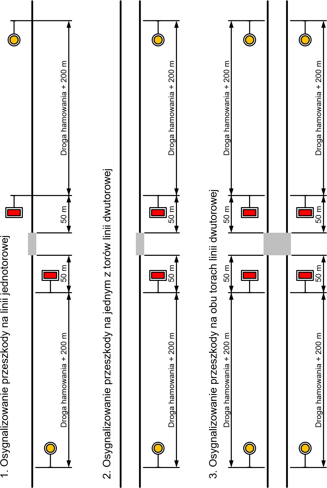{width="4.293333333333333in"
> height="6.416667760279965in"}

Rysunek 1 Przykłady osygnalizowania przeszkód

15. Stosuje się następujący sygnał zmniejszenia prędkości:

    1)  **sygnał D 6 „Zwolnić bieg"**

**Dzienny Nocny**

Trójkątna tarcza pomarańczowa z białą obwódką, zwrócona podstawą do
góry, a na niej czarna liczba wskazująca dozwoloną prędkość jazdy przy
czym wartość podana na sygnale odpowiada 0,1 dozwolonej prędkości jazdy
wyrażonej w km/h, a wartość dozwolonej prędkości jazdy ustala się w
przedziałach co 5 km/h. Jeżeli nie można ustawić tej tarczy z
zachowaniem skrajni, stosuje się tarczę obróconą podstawą ku dołowi i
umieszcza ją nisko.

Pomarańczowe światło na tarczy oraz oświetlona czarna liczba wskazująca
dozwoloną prędkość jazdy przy czym wartość podana na sygnale odpowiada
0,1 dozwolonej prędkości jazdy wyrażonej w km/h, a wartość dozwolonej
prędkości jazdy ustala się w przedziałach co 5 km/h.

> 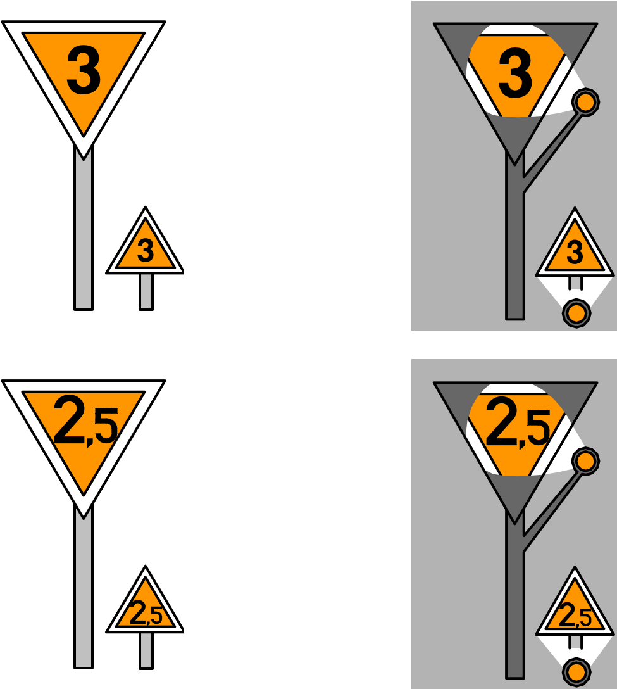{width="3.25in" height="3.6266666666666665in"}

16. Sygnał D 6 „Zwolnić bieg" oznacza, że w odległości drogi hamowania
    znajduje się odcinek toru, na którym należy jechać z prędkością
    mniejszą od prędkości przewidzianej w rozkładzie jazdy.

17. Miejsce wymagające zmniejszenia prędkości należy osłonić z obu
    stron.

18. W razie potrzeby ograniczenia prędkości na szlaku poniżej 10 km/h
    należy miejsce takie osłonić przenośnymi tarczami zatrzymania D 1
    „Stój" i tarczami ostrzegawczymi DO w przepisowej odległości, a
    drużynę trakcyjną każdego pociągu zatrzymanego przy tym sygnale
    zawiadomić, z jaką prędkością pociąg może przejechać przez osłonięte
    miejsce.

19. Tarczę *z sygnałem D 6* „Zwolnić bieg" ustawia się w odległości
    drogi hamowania przed początkiem odcinka, po którym należy jechać ze
    zmniejszoną prędkością. Ponadto miejsce to oraz miejsce, od którego
    wolno powrócić do normalnej prędkości, oznacza się wskaźnikami W 14.

20. Tarczę z sygnałem D 6 „Zwolnić bieg" ustawia się według tych samych
    zasad, co semafory.

21. Jeżeli na szlaku wielotorowym, przy liczbie torów szlakowych
    większej niż dwa, jak również przy równoległym zbliżeniu więcej niż
    dwóch torów szlakowych różnych linii kolejowych, szerokość
    międzytorza nie pozwala na umieszczenie normalnie typowej tarczy z
    sygnałem *D 6* „Zwolnić bieg", umieszcza się ją nisko na wysokości
    główki szyny, podstawą trójkąta do dołu, a w razie potrzeby stosuje
    się tarczę o zmniejszonych wymiarach.

22. W razie konieczności zmniejszenia prędkości w obrębie stacji, na
    całej jej długości, tarczę z sygnałem *D 6* „Zwolnić bieg" ustawia
    się przed stacją, przy tarczy ostrzegawczej odnoszącej się do
    semafora wjazdowego. W tym przypadku zmniejszenie prędkości
    obowiązuje do czasu minięcia przez pociąg całej stacji. Jeżeli
    potrzeba zmniejszenia prędkości zajdzie tylko na części toru
    głównego zasadniczego w obrębie stacji, to miejsce takie należy
    osłonić z obu stron w taki sam sposób, jak na szlaku.

23. W przypadku, gdy konieczność zmniejszenia prędkości dotyczy torów
    głównych dodatkowych lub rozjazdów nieleżących w torach głównych
    zasadniczych:

    1)  nie wymaga się ustawienia tarcz z sygnałem *D 6* „Zwolnić bieg";

    2)  na początku i na końcu odcinka toru, na którym obowiązuje
        ograniczenie prędkości, ustawia się wskaźniki W 14;

    3)  w razie potrzeby ograniczenia prędkości poniżej prędkości
        dozwolonej zgodnie z sygnałem na semaforze osłaniającym tory
        główne dodatkowe lub rozjazdy nieleżące w torach głównych
        zasadniczych należy spowodować zatrzymywanie przy tym semaforze
        właściwych pociągów, celem powiadomienia drużyny pociągowej za
        pomocą rozkazu pisemnego, doręczonego lub przekazanego za pomocą
        urządzeń łączności o potrzebie ograniczenia prędkości jazdy na
        określonym odcinku toru, jeżeli nie została ona o tym wcześniej
        powiadomiona.

> 

24. W przypadku, gdy konieczność zmniejszenia prędkości dotyczy
    jednocześnie toru głównego zasadniczego i torów głównych dodatkowych
    lub rozjazdów nieleżących w torach głównych zasadniczych, to
    niezależnie od tego, czy ograniczenia prędkości są jednakowe, czy
    też różne, należy:

    1)  w celu osygnalizowania ograniczenia prędkości w torze głównym
        zasadniczym ustawić tarczę z sygnałem *D 6*

> „Zwolnić bieg", zgodnie z zasadami określonymi w ust. 22;

2)  przy pozostałych ograniczeniach postępować zgodnie z zasadami
    określonymi w ust. 23.

<!-- -->

25. Na posterunkach odgałęźnych, jeżeli odcinki torów z ograniczoną
    prędkością występują w granicach posterunku, należy stosować zasady
    określone w ust. 22-24 dla osygnalizowania ograniczeń prędkości na
    stacji. Jeżeli natomiast ograniczenia prędkości jazdy występują w
    granicach posterunków odgałęźnych na odcinkach szlaków odgałęzionych
    i zachowanie powyższych zasad spowodowałoby potrzebę ustawienia
    tarczy z sygnałem *D 6* „Zwolnić bieg" przy szlaku wspólnym, to
    należy stosować zasady określone w ust. 23.

26. Tarcza *z sygnałem D 6* „Zwolnić bieg" w porze nocnej, a także w
    dzień, gdy to jest wymagane, ma latarnię ze światłem pomarańczowym
    (sygnał nocny) i jest oświetlona. Wskaźniki ustawione na początku i
    końcu odcinka, przez który przejeżdża się ze zmniejszoną prędkością,
    są również oświetlane. Jeżeli powierzchnia tarczy *z sygnałem D 6*
    „Zwolnić bieg" jest odblaskowa, to można nie stosować na niej, ani
    sygnału nocnego, ani miejscowego oświetlenia.

27. *Przykłady osygnalizowania leżących blisko siebie odcinków szlaku,
    wymagających zmniejszenia prędkości jazdy pociągu, przedstawia
    załącznik Nr 2*.

## § 12. Sygnały ogólnego stosowania dawane przez uprawnione osoby 

1.  Stosuje się następujące sygnały zatrzymania dawane przez uprawnione
    osoby:

    1)  **sygnał D 2 „Stój" dawany ręcznie**

**Dzienny Nocny**

> Zataczanie okręgu Zataczanie okręgu ręczną rozwiniętą chorągiewką
> latarką *sygnałową* lub jakimkolwiek innym ze światłem białym
> przedmiotem lub ręką. lub czerwonym albo
>
> jakimkolwiek innym świecącym się przedmiotem.
>
> Sygnał należy dawać, w miarę możliwości, po stronie maszynisty;

2)  **sygnał D 3 „Stój" -- dźwiękowy**

> Trzy krótkie szybko po sobie następujące tony, kilkakrotnie
> powtórzone.
>
> Sygnały D 2 i D 3 należy dawać jednocześnie ze stosowaniem tarczy
> zatrzymania lub dawanego ręcznie sygnału „Stój". Jeżeli powstaje
> wątpliwość, czy drużyna pociągowa spostrzeże tarczę przenośną sygnału
> D 1 „Stój" lub sygnału D 2 „Stój" dawanego ręcznie, należy dawać
> jednocześnie dźwiękowy sygnał D 3 „Stój" przy zbliżaniu się pociągu i
> podczas jego przejazdu.

2.  W trakcie manewrów sygnał „Stój" powinien być dawany jednocześnie
    ręcznie, za pomocą żółtej chorągiewki, oraz dźwiękowo (sygnał Rm 4).

3.  Sygnał D 2 „Stój" dawany ręcznie i w razie potrzeby także dźwiękowo
    (sygnał D 3) stosuje się w przypadku, gdy zachodzi konieczność
    zatrzymania pociągu, a nie ma możliwości lub potrzeby stosowania
    innych sygnałów zatrzymania, a w szczególności gdy:

    1)  potrzeba zmniejszenia prędkości wskutek stanu toru zajdzie nagle
        i danie sygnału „Zwolnić bieg" jest niemożliwe;

    2)  drużyna konduktorska nadjeżdżającego lub przejeżdżającego
        pociągu daje ręczne lub dźwiękowe sygnały „Stój";

    3)  przy nadjeżdżającym lub przejeżdżającym pociągu, pojeździe
        pomocniczym lub manewrującym taborze kolejowym zostanie
        zauważona nieprawidłowość, która przy dalszej jeździe mogłaby
        zagrażać bezpieczeństwu ruchu lub spowodować straty materialne;

    4)  pociąg jedzie po zamkniętym torze bez uprzedniego zawiadomienia
        posterunków;

    5)  na linii dwutorowej pociąg jedzie po torze w kierunku przeciwnym
        do zasadniczego bez uprzedniego zawiadomienia posterunków;

    6)  w porze ograniczonej widoczności na czole pociągu lub pojazdu
        pomocniczego zgasną wszystkie wymagane światła;

    7)  na torze znajdują się ludzie lub duże zwierzęta, którym grozi
        niebezpieczeństwo przejechania.

4.  Sygnały „Stój" dawane przez jednego z konduktorów powinni powtarzać
    pozostali konduktorzy ku przodowi, a w pociągach z lokomotywą
    popychającą -- także ku tyłowi pociągu.

5.  W pociągach z hamulcem zespolonym drużyna konduktorska, w razie
    zauważenia przeszkód, o których mowa w ust. 3 pkt 7, powinna zamiast
    dawania sygnałów „Stój", zatrzymać pociąg za pomocą hamulca
    bezpieczeństwa.

6.  Sygnały dawane ręcznie i sygnały dźwiękowe należy powtarzać tak
    długo, aż drużyna trakcyjna zastosuje się do nich.

7.  Oprócz sygnałów, o których mowa w ust. 1-6, stosuje się następujące
    sygnały sposobu jazdy, dawane przez uprawnione osoby:

    1)  **sygnał Rm 1 „Do mnie"**

> Dwa długie tony gwizdkiem lub trąbką i jednocześnie:

**Dzienny Nocny**

  -----------------------------------------------------------------------
  Chorągiewka sygnałowa koloru żółtego   *Ręczna* latarka *sygnałowa* z
  lub ręka poruszana poziomo.            białym światłem poruszana
                                         poziomo.
  -------------------------------------- --------------------------------

  -----------------------------------------------------------------------

> Sygnał „Do mnie" oznacza, że należy jechać w kierunku do dającego
> sygnał;

2)  **sygnał Rm 2 „Ode mnie"**

> Jeden długi ton gwizdkiem lub trąbką i jednocześnie:

  -----------------------------------------------------------------------
  **Dzienny**                            **Nocny**
  -------------------------------------- --------------------------------
  Chorągiewka sygnałowa koloru żółtego   Ręczna latarka *sygnałowa* z
  lub ręka poruszana pionowo.            białym światłem poruszana
                                         pionowo.

  -----------------------------------------------------------------------

> Sygnał „Ode mnie" oznacza, że należy jechać w kierunku od podającego
> sygnał.
>
> W przypadku gdy odebranie sygnału „Do mnie" lub „Ode mnie" jest
> niemożliwe lub utrudnione, to sygnał ten można zastąpić słowami
> „Jechać w kierunku\...", przekazanymi za pomocą urządzeń łączności;

3)  **sygnał Rm 3 „Zwolnić"**

> Kilka przeciągłych tonów gwizdkiem lub trąbką i jednocześnie:

**Dzienny Nocny**

> Chorągiewka sygnałowa *Ręczna* latarka sygnałowa koloru żółtego lub
> ręka z białym światłem poruszana powolnym poruszana powolnym ruchem po
> łuku do góry ruchem po łuku do góry

i na dół. i na dół;

4)  **sygnał Rm 4 „Stój"**

> Trzy krótkie szybko po sobie następujące tony gwizdkiem lub trąbką
> kilkakrotnie powtórzone i jednocześnie:

  -----------------------------------------------------------------------
  **Dzienny**                            **Nocny**
  -------------------------------------- --------------------------------
  Zataczanie okręgu rozwiniętą           Zataczanie okręgu ręczną latarką
  chorągiewką, innym przedmiotem         *sygnałową* ze światłem białym;

  -----------------------------------------------------------------------

> lub ręką.

5)  **sygnał Rm 5 „Odrzucić"**

> Dwa długie i jeden krótki ton gwizdkiem lub trąbką i jednocześnie:

  -----------------------------------------------------------------------
  **Dzienny**                            **Nocny**
  -------------------------------------- --------------------------------
  Chorągiewka sygnałowa koloru żółtego   *Ręczna* latarka sygnałowa z
  lub ręka poruszana dwukrotnie poziomo, białym światłem poruszana
  a następnie pionowo do góry i szybko   dwukrotnie poziomo, a następnie
  na dół.                                pionowo do góry i szybko na dół;

  -----------------------------------------------------------------------

6)  **sygnał Rm 6 „Docisnąć"**

> Dwa krótkie tony gwizdkiem i jednocześnie:

  -----------------------------------------------------------------------
  **Dzienny**                           **Nocny**
  ------------------------------------- ---------------------------------
  Kilkakrotne zbliżenie do siebie       Białe światło *ręcznej* latarki
  wyciągniętych poziomo przed siebie    *sygnałowej* przerywane w
  rąk.                                  krótkich odstępach czasu

  -----------------------------------------------------------------------

> skierowane w stronę maszynisty.
>
> Sygnał Rm 6 oznacza, że należy nacisnąć na tabor kolejowy w celu
> sprzęgnięcia lub rozprzęgnięcia.
>
> **§ 13. Sygnały dawane dźwiękowym urządzeniem ostrzegającym**

## lokomotywy lub innego pojazdu kolejowego z napędem 

1.  Jeżeli na przodzie pociągu są dwie lokomotywy, wówczas sygnały
    dźwiękowym urządzeniem ostrzegającym lokomotywy daje maszynista
    pierwszej lokomotywy.

2.  Sygnały na zatrzymanie pociągu daje maszynista dowolnej lokomotywy.

3.  W przypadku, gdy przestało działać dźwiękowe urządzenie ostrzegające
    lokomotywy, dalsza jazda pociągu powinna odbywać się z zachowaniem
    największej ostrożności.

4.  Podczas mgły lub zamieci utrudniających widoczność należy w razie
    zepsucia się dźwiękowego urządzenia ostrzegającego lokomotywy
    dojechać do najbliższej stacji ze zmniejszoną prędkością i zażądać
    lokomotywy pomocniczej.

5.  Stosuje się następujący sygnał ostrzeżenia:

> **sygnał Rp 1 „Baczność"**
>
> Jeden długi ton dźwiękowym urządzeniem ostrzegającym pojazdu
> kolejowego.

6.  Sygnał Rp 1 „Baczność" maszynista daje:

    1)  w razie konieczności ostrzeżenia przed zbliżającym się pociągiem
        pracowników kolejowych, podróżnych lub innych osób znajdujących
        się na torze lub w jego pobliżu;

    2)  po zatrzymaniu pociągu przed semaforem wjazdowym lub odstępowym
        nadającym sygnał „Stój", wątpliwy lub nieoświetlony albo białe
        światło przy zbitym szkle sygnałowym, z wyjątkiem semafora
        odstępowego blokady wieloodstępowej, jeżeli maszynista nie może
        porozumieć się z dyżurnym ruchu za pomocą środków łączności;

    3)  na wezwanie kierownika pociągu, przed odjazdem pociągu
        pasażerskiego zatrzymanego na szlaku;

    4)  przed każdym ruszeniem podczas pracy pociągu technologicznego,
        maszyny torowej i pojazdu pomocniczego, w celu ostrzeżenia
        robotników pracujących na torze lub obok niego;

    5)  po minięciu wskaźnika W 6, W 6b lub W 7;

    6)  w przypadku zauważenia zagrożenia lub potencjalnego zagrożenia
        zdarzeniem na przejeździe kolejowo-drogowym lub przejściu;

    7)  na zarządzenie zarządcy infrastruktury w przypadku niedziałania
        urządzeń zabezpieczenia ruchu na przejeździe kolejowo-drogowym
        lub przejściu albo braku pracownika obsługującego przejazd
        kolejowo-drogowy lub przejście albo kierującego ruchem drogowym
        w obrębie przejazdu kolejowo-drogowego lub przejścia;

    8)  przed przejazdem kolejowo-drogowym lub przejściem w przypadku
        nadawania sygnału Osp 1 przez tarczę ostrzegawczą przejazdową
        odnoszącą się do tego przejazdu kolejowo-drogowego lub przejścia
        albo gdy do czasu minięcia tej tarczy przez czoło pociągu
        pozostaje ona ciemna *lub wskazuje sygnał wątpliwy*;

    9)  w przypadku mijania się pociągów jadących w przeciwnych
        kierunkach na przejeździe kolejowo-drogowym lub przejściu albo w
        ich bezpośrednim sąsiedztwie;

    10) przed wszystkimi przejazdami kolejowo-drogowymi lub przejściami
        znajdującymi się w drodze przebiegu pociągu wyprawionego na
        sygnał zastępczy lub rozkaz pisemny doręczony lub przekazany za
        pomocą urządzeń łączności;

    11) przed każdym ruszeniem z miejsca pociągu towarowego z ludźmi;

    12) przed każdym ruszeniem z postoju niepilotowanego manewrującego
        pojazdu trakcyjnego, gdy jazda manewrowa odbywa się na polecenie
        dyżurnego ruchu, nastawniczego lub zwrotniczego;

    13) *jeżeli prowadzący pojazd kolejowy z napędem zauważy, że rogatki
        nie są zamknięte i nie ma pracownika strzegącego przejazd*;

    14) *przed każdym ruszeniem pojazdu kolejowego z postoju przy
        peronie znajdującym się pomiędzy miejscem ustawienia wskaźnika W
        6b a przejazdem kolejowo-drogowym lub przejściem, do którego
        wskaźnik się odnosił*;

    15) *podczas mijania się pojazdów kolejowych jadących po sąsiednich
        torach, szczególnie w miejscach narażonych na wtargnięcie osób
        postronnych, np. perony przystanków, przejazdy kolejowo-drogowe
        lub przejścia, rozpoczynając*

> *jego nadawanie przed zakończeniem mijania pojazdu jadącego z
> przeciwka*.

7.  W przypadkach, o których mowa w ust. 6 pkt 7 i 8, sygnał Rp 1
    „Baczność" podaje się wielokrotnie.

8.  Jeżeli przy hamowaniu pociągu potrzebne jest współdziałanie drużyny
    konduktorskiej, stosuje się następujące sygnały:

    1)  **sygnał Rp 4 „Hamować średnio"**

> Jeden krótki ton dźwiękowym urządzeniem ostrzegającym lokomotywy;

2)  **sygnał Rp 5 „Hamować"**

> Trzy długie szybko po sobie następujące tony dźwiękowym urządzeniem
> ostrzegającym lokomotywy;

3)  **sygnał Rp 6 „Odhamować średnio"**

> Jeden długi, jeden krótki ton dźwiękowym urządzeniem ostrzegającym
> lokomotywy;

4)  **sygnał Rp 7 „Odhamować"**

> Dwa długie tony dźwiękowym urządzeniem ostrzegającym lokomotywy.

9.  Przy stosowaniu lokomotywy popychającej stosuje się następujące
    sygnały:

    1)  **sygnał Rp 8 „Rozpocząć popychanie"**

> Dwa krótkie tony dźwiękowym urządzeniem ostrzegającym lokomotywy
> ciągnącej;

2)  **sygnał Rp 9 „Przerwać popychanie, pozostać przy pociągu"**

> Jeden krótki, jeden długi ton dźwiękowym urządzeniem ostrzegającym
> lokomotywy ciągnącej;

3)  **sygnał Rp 10 „Dalsze popychanie nie jest potrzebne.**

> **Odjechać od pociągu"**
>
> Cztery krótkie tony dźwiękowym urządzeniem ostrzegającym lokomotywy
> ciągnącej.

10. Jeżeli wszystkie lokomotywy ciągnące i popychające wyposażone są w
    sprawne urządzenia radiołączności, maszyniści mogą porozumiewać się
    za pomocą tych urządzeń. W takim przypadku można nie stosować
    sygnałów Rp 8, Rp 9 i Rp 10 podawanych dźwiękowym urządzeniem
    ostrzegającym lokomotywy.

## § 14. Sygnały dawane przy wyprawianiu i przepuszczaniu pociągów 

1.  Przy odjeździe pociągów pasażerskich stosuje się następujące
    sygnały:

    1)  **sygnał Rp 11 „Wsiadać"**

> Jeden długi ton gwizdkiem.
>
> Sygnał Rp 11 „Wsiadać" podaje drużyna konduktorska przed odjazdem
> pociągów pasażerskich;

2)  **sygnał Rp 12 „Gotów do odjazdu"**

**Dzienny Nocny**

> Podniesienie chorągiewki Podniesienie *ręcznej* latarki *koloru
> żółtego*. *sygnałowej* z białym
>
> Sygnał Rp 12 „Gotów do odjazdu" stosuje się przed odjazdem pociągów z
> wieloosobową drużyną konduktorską;

3)  sygnał Rp 13 „Pociąg nr\... gotów do odjazdu". Sygnał ten kierownik
    pociągu przekazuje słownie lub za pomocą urządzeń łączności do
    maszynisty. Stosuje się go przed odjazdem pociągów zestawionych z
    zespołów trakcyjnych lub wagonów silnikowych w przypadku, gdy
    urządzenia do sterowania drzwiami i sygnałem dźwiękowym
    ostrzegającym podróżnych znajdują się na pulpicie w kabinie
    maszynisty lub zamykanie drzwi pojazdu kolejowego przy wymianie
    podróżnych jest zapewnione, a zamknięcie drzwi pojazdu kolejowego
    jest przekazywane kierującemu pojazdem kolejowym z napędem za pomocą
    urządzeń technicznych;

4)  **sygnał Rp 14 „Odjazd pociągów pasażerskich"**

+--------------------------------------+-------------------------------+
| **Dzienny**                          | **Nocny**                     |
+======================================+===============================+
| Ręka podniesiona do góry przez       | Podniesienie do góry i        |
| kierownika pociągu lub konduktora    | poruszanie pionowo *ręcznej*  |
|                                      | latarki *sygnałowej* z białym |
| znajdującego się najbliżej           | światłem zwróconym w kierunku |
| lokomotywy, zwróconego w kierunku    | maszynisty przez kierownika   |
| maszynisty, oraz wypowiedziane       | pociągu lub konduktora        |
| głośno słowo „Odjazd".               | znajdującego                  |
+--------------------------------------+-------------------------------+

> się najbliżej maszynisty oraz wypowiedziane głośno słowo „Odjazd".
>
> Sygnał Rp 14 „Odjazd pociągów pasażerskich" można również podawać za
> pomocą urządzeń łączności, a w pociągach wyposażonych w urządzenia
> sygnałowe do dawania sygnału Rp 14 „Odjazd pociągów pasażerskich"
> sygnał ten podaje się za pomocą tych urządzeń.

2.  W przypadku jazdy pociągu pasażerskiego bez kierownika pociągu nie
    podaje się sygnałów określonych w ust. 1, z tym że jeżeli w drużynie
    konduktorskiej nie ma kierownika pociągu, a jest konduktor, podaje
    on sygnały określone w ust. 1.

3.  Stosuje się następujący sygnał podawany przez dyżurnego ruchu:

    1)  **sygnał Rd 1 „Nakaz jazdy"**:

**Dzienny Nocny**

> Okrągła biała tarczka *Ręczna* latarka *sygnałowa* z zieloną obwódką z
> zielonym światłem poruszana pionowo. poruszana pionowo;

2)  sygnał Rd 1 „Nakaz jazdy" przy wyprawianiu pociągów podaje dyżurny
    ruchu, a przy przepuszczaniu pociągów -- dyżurny ruchu lub
    nastawniczy na każdorazowe polecenie dyżurnego ruchu, wtedy gdy jest
    to wymagane odpowiednimi przepisami lub instrukcjami.

<!-- -->

4.  Przy próbie hamulców zespolonych stosuje się sygnały ręczne lub
    świetlne dawane za pomocą umieszczonego obok torów albo zawieszonego
    nad torami urządzenia z trzema latarniami w jednym pionie. Sygnały
    ręczne dawane są w stronę biorącego udział w próbie hamulców
    zespolonych maszynisty lokomotywy lub pracownika obsługującego
    urządzenia stałe.

5.  Przy próbie hamulców zespolonych stosuje się następujące sygnały:

    1)  **sygnał Rh 1, Rhs 1 „Zahamować"**

**Dzienny i nocny**

  -----------------------------------------------------------------------
  **Dzienny (Rh 1)**         **Nocny (Rh 1)**          **(Rhs 1)**
  -------------------------- ------------------------- ------------------
  Wyciągnięte ręce składane  Ręczna latarka            Jedno światło
  nad głową z zakreśleniem   *sygnałowa* z białym      matowobiałe;
  półkola.                   światłem poruszana od     
                             dołu łukiem               

  -----------------------------------------------------------------------

> do góry i następnie opuszczona pionowo w dół.

2)  **sygnał Rh 2, Rhs 2 „Odhamować"**

**Dzienny i nocny**

**Dzienny (Rh 2) Nocny (Rh 2)**

> **(Rhs 2)** Wyciągnięta ręka, Ręczna latarka Dwa światła poruszana po
> łuku *sygnałowa* z matowo-białe; nad głową. białym światłem
>
> poruszana po łuku nad głową.

3)  **sygnał Rh 3, Rhs 3 „Hamulce w porządku"**

**Dzienny i nocny**

**Dzienny (Rh 3) Nocny (Rh 3)**

**(Rhs 3)**

Ręka wyciągnięta Ręczna latarka Trzy światła

nad głową, *sygnałowa* z matowobiałe.

> trzymana białym światłem, pionowo. trzymana
>
> pionowo nad głową.

6.  Stosuje się następujące sygnały podawane przez dróżnika
    przejazdowego:

    1)  **sygnał D 7 „Stój"** dawany przez dróżnika przejazdowego w celu
        zatrzymania pojazdów drogowych zbliżających się do przejazdu:

  -----------------------------------------------------------------------
  **Dzienny**                            **Nocny**
  -------------------------------------- --------------------------------
  Tarcza do zatrzymania pojazdów, która  Podniesienie i poruszanie powoli
  ma kształt czerwonego koła z białym    pionowo ręcznej latarki
  obrzeżem podniesiona do góry w         *sygnałowej* z czerwonym
  kierunku nadjeżdżającego pojazdu.      światłem, zwróconym w kierunku
                                         nadjeżdżającego pojazdu;

  -----------------------------------------------------------------------

2)  **sygnał D 8 „Dróżnik obecny na przejeździe kolejowo-drogowym lub
    przejściu"**

**Dzienny Nocny**

Dróżnik przejazdowy stoi na przejeździe kolejowo-drogowym lub przejściu
w miejscu wyznaczonym regulaminem obsługi przejazdu kolejowo-drogowego
lub przejścia, trzymając w ręce pionowo do góry chorągiewkę sygnałową
koloru żółtego w ten sposób, aby być widocznym dla maszynisty
zbliżającego się pociągu lub kierującego pojazdem kolejowym.

Dróżnik przejazdowy porusza powoli pionowo ręczną latarką *sygnałową* z
białym światłem, tak aby sygnał był widoczny dla maszynisty zbliżającego
się pociągu lub kierującego pojazdem kolejowym.

> *W PKP Polskie Linie Kolejowe S.A. dla poprawienia widoczności
> podawanego sygnału D 8, obowiązuje całodobowo podawanie sygnału
> nocnego*.

## § 15. Sygnały na pociągach i innych pojazdach kolejowych 

1\. Na pociągach i innych pojazdach kolejowych stosuje się następujące
sygnały:

1)  **sygnał Pc 1 „Oznaczenie czoła pociągu lub innego pojazdu
    kolejowego znajdującego się na posterunku następczym albo
    wyprawionego na szlak jednotorowej linii kolejowej oraz w kierunku
    zasadniczym na torze dwu- lub wielotorowej linii kolejowej"**

> **Dzienny i nocny**
>
> Trzy białe światła na przodzie pociągu lub innego pojazdu kolejowego z
> zastrzeżeniem ust. 3;
>
> 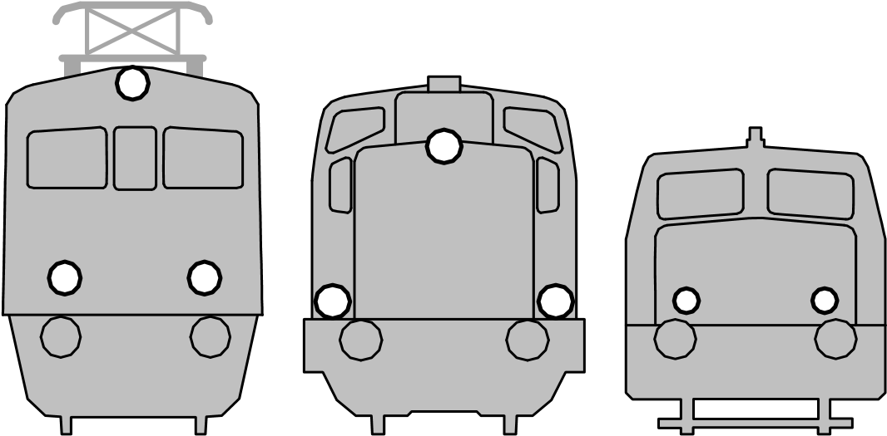{width="3.5533333333333332in" height="1.75in"}

2)  **sygnał Pc 2 „Oznaczenie czoła pociągu lub innego pojazdu
    kolejowego wyprawionego na szlak w kierunku przeciwnym do
    zasadniczego na torze dwu- i wielotorowej linii kolejowej"**

> **Dzienny i nocny**
>
> Trzy światła na przodzie pociągu lub innego pojazdu kolejowego, z
> których górne i prawe w kierunku jazdy są białe, lewe zaś -- czerwone,
> z zastrzeżeniem ust. 3;
>
> 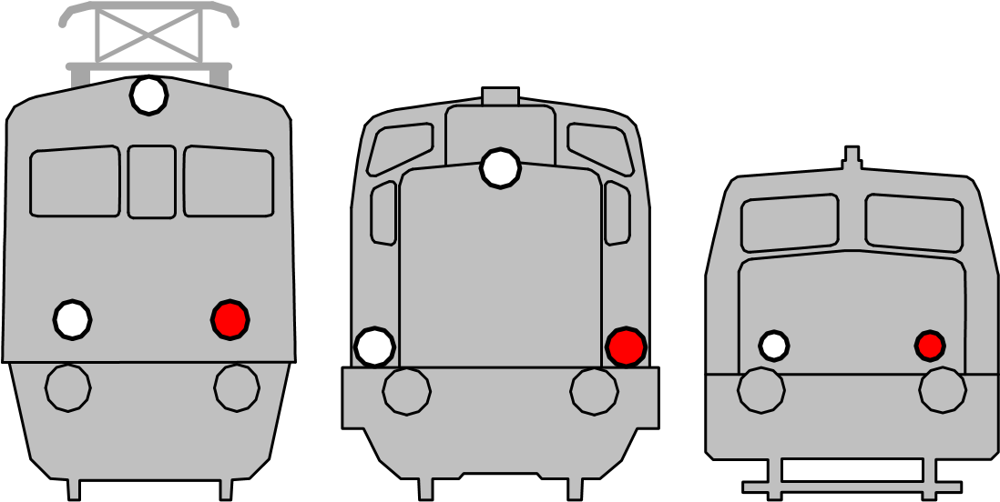{width="3.66in" height="1.84in"}

3)  **sygnał Pc 3 „Oznaczenia czoła pociągu z pługiem odśnieżnym"**

> **Dzienny i nocny**
>
> Dwa białe światła na przodzie pociągu oraz trzecia oświetlona latarnia
> z ukośnym białym krzyżem umieszczona w górnej części czoła lokomotywy
> lub na wierzchołku pługa, gdy pług znajduje się przed lokomotywą;

4)  **sygnał Pc 4 „Oznaczenie czoła pociągu jadącego naprzód wagonami
    niewyposażonymi w kabinę maszynisty"**:

> **Dzienny**
>
> Dwie tarcze albo dwie latarnie z obrazem tarczy na obudowie na
> czołowej ścianie pierwszego wagonu. Tarcze są prostokątne i podzielone
> na cztery trójkąty, z których górny i dolny są czerwone, oba zaś
> boczne -- białe. Powierzchnia tarczy powinna być odblaskowa.
>
> **Dzienny i nocny**
>
> Dwa białe światła na czołowej ścianie pierwszego wagonu.

5)  **sygnał Pc 5 „Oznaczenia końca pociągu lub innego pojazdu
    kolejowego"**

> **Dzienny**
>
> Dwie tarcze albo dwie latarnie z obrazem tarczy na obudowie na tylnej
> ścianie ostatniego pojazdu kolejowego w składzie pociągu lub innego
> pojazdu kolejowego. Tarcze są prostokątne i podzielone na cztery
> trójkąty, z których górny i dolny są czerwone, oba zaś boczne --
> białe. Powierzchnia tarczy powinna być odblaskowa.
>
> **Dzienny i nocny**
>
> Dwa światła czerwone ciągłe na tylnej ścianie ostatniego pojazdu
> kolejowego w składzie pociągu lub innego pojazdu kolejowego.
>
> 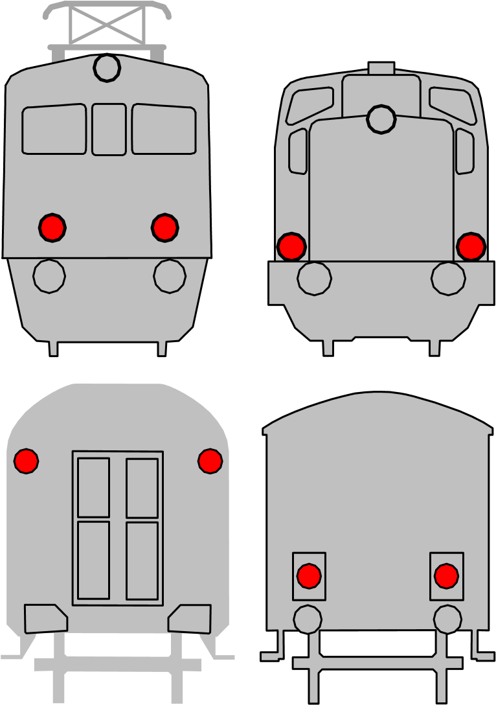{width="2.5533333333333332in"
> height="3.6266666666666665in"}
>
> Dla pociągów pasażerskich stosuje się wyłącznie sygnał Pc 5 *„Dzienny
> i nocny"*. Dla pociągów towarowych dopuszcza się stosowanie całodobowo
> sygnału Pc 5 *„Dzienny"*, jednak na szlakach z blokadą wieloodstępową
> zaleca się stosowanie sygnału Pc 5 *„Dzienny i nocny"*;
>
> 6\) **sygnał Pc 6 „Oznaczenia czoła pociągu z jednoosobową obsadą
> pojazdu trakcyjnego, zatrzymanego z niewiadomej przyczyny na torze
> szlaku dwu- lub wielotorowego"**:
>
> Jedno górne światło białe i dwa dolne światła czerwone na czole
> pociągu.
>
> Sygnał Pc 6 podaje maszynista pociągu bez drużyny konduktorskiej z
> jednoosobową obsadą pojazdu trakcyjnego w przypadku zatrzymania się
> pociągu z niewiadomej przyczyny na torze szlaku dwu- lub wielotorowego
> przed udaniem się wzdłuż pociągu, w celu ustalenia przyczyny jego
> zatrzymania.
>
> Maszynista pociągu w którego kierunku podano sygnał Pc 6 powinien
> zatrzymać pociąg i uzyskać informację o przyczynie zatrzymania pociągu
> i czy o zatrzymaniu został powiadomiony dyżurny ruchu.

2.  Sygnały Pc 1, Pc 2, Pc 3, Pc 4 i Pc 5, podawane światłami i
    tarczami, stosuje się do oznaczania czoła i końca składu pociągu i
    innych pojazdów kolejowych kursujących na zasadach ustalonych dla
    pociągów.

3.  Na pojazdach kolejowych niepodlegających wpisowi do krajowego
    rejestru pojazdów kolejowych (NVR) oraz na pojazdach kolejowych, o
    których mowa w art. 3 ust. 9 pkt 2 ustawy z dnia 28 marca 2003 r. o
    transporcie kolejowym, które

> nie są wyposażone w górne światło, dopuszcza się stosowanie sygnałów
> Pc 1 i Pc 2 za pomocą dwóch świateł.

4.  Sygnał Pc 4 stosuje się przy pociągach pchanych, niemających na
    czole czynnej kabiny sterowniczej. Na pchanych pociągach
    bocznicowych może być stosowane w nocy jedno światło białe na
    czołowym wagonie, a w dzień można nie stosować żadnego znaku. Do
    osygnalizowania czoła pociągów, w których pierwszy wagon ma czynną
    kabinę sterowniczą, w szczególności zespołów trakcyjnych, wagonów
    doczepnych z kabiną maszynisty, należy stosować odpowiednio sygnały
    Pc 1 i Pc 2.

5.  Na pociągu popychanym, w którym popychacz jest sprzęgnięty lub nie
    jest sprzęgnięty ze składem, na tylnej ścianie ostatniego wagonu
    umieszcza się sygnał oznaczenia końca pociągu Pc 5.

> Na czole pierwszej lokomotywy popychającej stosuje się sygnał Pc 1, a
> na tylnej ścianie ostatniej lokomotywy popychającej -- sygnał Pc 5.
> Przy jeździe powrotnej lokomotywy popychającej zamienia się sygnały na
> czole i tylnej ścianie lokomotywy, przy czym na czole powracającej
> lokomotywy na szlaku jednotorowym stosuje się sygnał Pc 1, natomiast
> na torze szlaku dwu- lub wielotorowego przy jeździe w kierunku
> zasadniczym stosuje się sygnał Pc 1, a przy jeździe w kierunku
> przeciwnym do zasadniczego stosuje się sygnał Pc 2.

6.  Do oznaczenia czoła pociągu lub innego pojazdu kolejowego jadącego w
    kierunku zasadniczym po torze zamkniętym szlaku dwu- i wielotorowego
    stosuje się sygnał Pc 1, a do oznaczenia jego końca sygnał Pc 5. Do
    oznaczenia czoła pociągu lub innego pojazdu kolejowego jadącego w
    kierunku przeciwnym

> do zasadniczego po torze zamkniętym szlaku dwu- i wielotorowego
> stosuje się sygnał Pc 2, a do oznaczenia jego końca sygnał Pc 5, nie
> zmieniając osygnalizowania w czasie zatrzymania na szlaku.

7.  Jeżeli pociąg cofa się ze szlaku do stacji, to nie należy zmieniać
    sygnałów na czole i końcu pociągu, z wyjątkiem przypadku, gdy
    cofanie pociągu zestawionego z zespołów trakcyjnych, z pojazdów
    trakcyjnych luzem lub z pojazdów kolejowych zakończonych kabiną
    sterowniczą odbywa się z kabiny umieszczonej w kierunku cofania, w
    którym stosuje się przepisy ust. 6.

8.  Na taborze kolejowym stosuje się następujące sygnały:

> 1\) **sygnał Tb 1 „Oznaczenia przodu i tyłu pojazdu trakcyjnego
> wykonującego manewry"**
>
> **Dzienny i nocny**
>
> Z przodu i z tyłu po jednym białym świetle od strony czynnego
> stanowiska maszynisty.
>
> *Sygnał Tb 1 stosuje się do oznaczania przodu i tyłu wszelkich
> manewrujących pojazdów kolejowych z napędem.* Jeżeli czynne stanowisko
> maszynisty jest umiejscowione centralnie (w osi toru), sygnał Tb 1
> podaje się jak dla czynnego stanowiska maszynisty umiejscowionego po
> prawej stronie w kierunku jazdy;
>
> 2\) **sygnał Tb 2 „Oznaczenie wagonów pocztowych z funkcjonariuszami,
> wagonów restauracyjnych, sypialnych, jak również innych wagonów
> specjalnego przeznaczenia oraz wagonów z podróżnymi na stacji, jeżeli
> te wagony nie są złączone z pociągiem"**

  -----------------------------------------------------------------------
  **Dzienny**                **Dzienny i nocny**
  -------------------------- --------------------------------------------
  Po jednej niebieskiej      Po jednym lub po dwa niebieskie światła na
  chorągiewce umieszczonej   każdej ścianie szczytowej wagonu; dopuszcza
  na każdej ścianie          się takie wykonanie latarń, żeby niebieskie
  szczytowej wagonu.         światło było widoczne także z boku wagonu,
                             lub umieszczenie na bocznej ścianie
                             dodatkowych świateł

  -----------------------------------------------------------------------

> niebieskich.
>
> Sygnał oznaczenia wagonów specjalnego przeznaczenia można stosować na
> jednej ścianie szczytowej wagonu, jeżeli najechanie na wagon zagraża
> tylko z jednej strony; 3) **sygnał Tb 3 „Oznaczenie wagonów pocztowych
> w pociągach w czasie postoju, podczas załadowywania i wyładowywania
> poczty"**

**Dzienny Nocny**

> Niebieska Latarka z niebieskim światłem chorągiewka lub świecącym na
> trzy strony, latarka z niebieskim umieszczona na otwartych światłem,
> świecąca drzwiach wagonu.
>
> na trzy strony, umieszczona na otwartych drzwiach wagonu.
>
> **Dzienny i nocny**
>
> Lampy sygnałowe z niebieskim światłem wbudowane w boczne ściany
> wagonu;
>
> 4\) **sygnał Tb 4 „Oznaczenie pojazdu pomocniczego"**
>
> **Dzienny i nocny**
>
> Od przodu dwa (nad każdą szyną) lub jedno (nad osią toru) światła
> białe, a od tyłu -- czerwone.
>
> Sygnał Tb 4 stosuje się do oznaczania tych pojazdów pomocniczych,
> które nie kursują na zasadach ustalonych dla pociągów.

9\. Do oznaczenia pociągów i wagonów skażonych środkami
promieniotwórczymi, chemicznymi i biologicznymi stosuje się następujące
sygnały:

1)  **sygnał PcSp „Skażenie promieniotwórcze pociągu"** Trójkątne
    chorągiewki koloru zielonego zawieszone z obu stron ściany
    szczytowej wagonu, na czole i na końcu pociągu;

2)  **sygnał PcSb „Skażenie biologiczne pociągu"**

> Trójkątne chorągiewki koloru brązowego zawieszone z obu stron ściany
> szczytowej wagonu, na czole i na końcu pociągu;

3)  **sygnał PcSch „Skażenie chemiczne pociągu"**

> Trójkątne chorągiewki koloru żółtego zawieszone z obu stron ściany
> szczytowej wagonu, na czole i na końcu pociągu.

## § 16. Sygnały alarmowe 

1\. Stosuje się następujące sygnały alarmowe ogólne i pożarowe:

> 1\) **sygnał A 1 „Alarm"**
>
> Dwa białe światła migające na czole lokomotywy i jednocześnie jeden
> długi i trzy krótkie dźwięki dźwiękowego urządzenia ostrzegającego
> lokomotywy, powtarzane kilkakrotnie, jeden długi i trzy krótkie
> dźwięki syreny warsztatowej, dźwiękowego urządzenia ostrzegającego
> lokomotywy, trąbki, gwizdka lub dzwonka aparatu telefonicznego,
> powtarzane kilkakrotnie, przy czym przez pojęcie „dźwiękowego
> urządzenia ostrzegającego lokomotywy" należy rozumieć również sygnały
> dawane przez inne pojazdy wyposażone w urządzenia do dawania sygnałów
> dźwiękowych:

a)  sygnał alarmowy A 1 podawany jest w celu powiadomienia pracowników
    kolejowych o istniejącym lub możliwym zagrożeniu bezpieczeństwa
    ruchu, bezpieczeństwa osobistego pracowników, osób trzecich lub
    całości mienia kolejowego,

b)  sygnał alarmowy A 1 podaje drużyna pojazdu trakcyjnego w przypadku
    zatrzymania się pociągu z niewiadomej przyczyny na torze szlaku dwu-
    lub wielotorowego bądź w razie stwierdzenia nieosygnalizowanej
    przeszkody do jazdy pociągu na torze szlakowym,

c)  sygnał alarmowy A 1 należy podawać do czasu ustalenia, że nie ma
    przeszkody do jazdy po sąsiednich torach, bądź do czasu przepisowego
    osłonięcia przeszkody,

d)  po odebraniu sygnału alarmowego A 1 drużyna pojazdu trakcyjnego
    innego pociągu jadącego na szlaku powinna tak regulować prędkość
    jazdy, aby pociąg mógł być zatrzymany przed napotkaną przeszkodą do
    jazdy,

e)  pracownicy mający przybory przeznaczone do dawania sygnałów
    dźwiękowych powinni powtarzać usłyszane sygnały alarmowe dźwiękowe
    do czasu rozpoczęcia akcji ratunkowej;

<!-- -->

2)  **sygnał A 1r „Alarm"**

> Kombinacja złożona z kolejno po sobie następujących trzech krótkich
> tonów, zróżnicowanych pod względem częstotliwości i powtarzanych
> cyklicznie:

a)  sygnał alarmowy A 1r podawany jest w przypadku zaistnienia nagłego
    zagrożenia bezpieczeństwa ruchu

> na linii kolejowej wyposażonej w sieć radiołączności pociągowej.
> Pracownik, który dowiedział się o wystąpieniu tego zagrożenia lub
> posiada o nim uzasadnione przypuszczenie i ma dostęp do radiotelefonu
> w sieci radiołączności pociągowej, powinien natychmiast nadać sygnał
> „Alarm" za pomocą radiotelefonu; nadanie sygnału „Alarm" nie zwalnia z
> obowiązku podjęcia działań zapobiegających wypadkowi lub
> zmniejszających jego skutki,

b)  sygnał A 1r nadawany jest:

> − automatycznie,
>
> − słownie, gdy radiotelefon nie jest przystosowany do nadawania
> sygnału „Alarm" automatycznie,

c)  automatyczne nadanie sygnału A 1r następuje po wykonaniu przez
    obsługującego czynności ustalonych w instrukcji obsługi danego typu
    radiotelefonu. Powoduje to samoczynne zahamowanie wszystkich
    pojazdów kolejowych z napędem, wyposażonych w urządzenia systemu
    „Radio-stop", których radiotelefony odebrały sygnał „Alarm",

d)  słowne nadanie sygnału A 1r następuje po wypowiedzeniu do mikrofonu,
    co najmniej pięć razy słowa „Alarm" *lub poprzez nawiązanie
    kolejowego połączenia alarmowego (REC) i przekazanie komunikatu o
    zaistniałym zagrożeniu*,

e)  prowadzący pojazdy kolejowe z napędem i pracownicy wyposażeni w
    radiotelefony przenośne po usłyszeniu sygnału A 1r powinni
    natychmiast zatrzymać pojazd kolejowy, o ile nie nastąpiło to już
    samoczynnie,

f)  odebranie sygnału A 1r nadanego automatycznie zobowiązuje wszystkich
    użytkowników, którzy go odebrali, do przełączenia radiotelefonów na
    kanał ratunkowy, w celu wyjaśnienia przyczyn nadania tego sygnału, a
    dyżurnych ruchu posterunków, na których odbywa się zmiana kanału
    radiołączności pociągowej, dodatkowo zobowiązuje do bezzwłocznego
    podjęcia działań mających na celu zapobiegnięcie wypadkowi lub
    zmniejszenie jego skutków;

<!-- -->

3)  **sygnał A 2 „Pożar"**

> Jeden długi i dwa krótkie dźwięki syreny warsztatowej, dźwiękowego
> urządzenia ostrzegającego lokomotywy, gwizdawki kotła parowego, syreny
> alarmowej, trąbki sygnałowej lub gwizdka, powtarzane kilkakrotnie:

a)  sygnał „Pożar" daje się w celu powiadomienia straży pożarnej i
    pracowników kolejowych o powstaniu pożaru na terenie kolejowym,

b)  pracownik kolejowy, który dostrzegł pożar, powinien rozpocząć
    podawanie sygnału „Pożar" i powiadomić straż pożarną. Jeżeli
    pracownik ten nie ma przyrządu do dawania sygnałów dźwiękowych,
    powinien niezwłocznie zawiadomić o pożarze pracownika mającego
    odpowiedni przyrząd sygnałowy,

c)  maszyniści czynnych pojazdów trakcyjnych znajdujących się na terenie
    stacji oraz inni pracownicy powinni powtarzać sygnał pożarowy, a
    niezależnie od tego, pracownicy kolei powinni natychmiast powiadomić
    straż pożarną, zgodnie z postanowieniami regulaminu technicznego.

<!-- -->

2.  Stosuje się następujące sygnały o zagrożeniach:

    1)  **sygnał A 3 „Ogłoszenie alarmu powietrznego dla stacji"**

> Modulowany ton dźwiękowych urządzeń ostrzegających lokomotywy (10
> sekund dźwięku, 1 sekunda przerwy) trwający 3 minuty oraz nadawanie
> przez urządzenia radiofonii przewodowej komunikatu „Uwaga! Uwaga!
> Ogłaszam alarm powietrzny dla stacji \[wymienić nazwę stacji\]",
> powtórzone trzykrotnie. Alarm powietrzny zarządza się w celu
> uprzedzenia pracowników o grożącym niebezpieczeństwie uderzeń z
> powietrza;

2)  **sygnał A 4 „Odwołanie** **alarmu powietrznego dla stacji"**

> Ciągły ton dźwiękowych urządzeń ostrzegających lokomotywy , trwający
> nieprzerwanie 3 minuty oraz nadawanie przez urządzenia radiofonii
> przewodowej komunikatu „Uwaga! Uwaga! Odwołuję alarm powietrzny dla
> stacji \[wymienić nazwę stacji\]", powtórzone trzykrotnie; odwołanie
> alarmu ogłasza się po ustąpieniu niebezpieczeństwa powodującego
> ogłoszenie alarmu;

3)  **sygnał A 5 „Podawanie sygnałów alarmu powietrznego pociągom na
    szlaku"**

**Dzienny Nocny**

> Chorągiewka Białe światło migające latarki niebiesko żółta. ręcznej;

4)  **sygnał A 6 „Potwierdzenie otrzymania sygnału alarmu powietrznego
    przez pociąg na szlaku"**

> Modulowany ton dźwiękowych urządzeń ostrzegających lokomotywy (10
> sekund dźwięku, 1 sekunda przerwy) trwający 3 minuty. Sygnałem tym
> maszynista pociągu potwierdza zrozumienie otrzymanego sygnału alarmu
> powietrznego oraz powiadamia drużynę pociągową o odebraniu sygnału;

5)  **sygnał A 7 „Ogłoszenie alarmu o skażeniach dla stacji"**

> Przerywany ton dźwiękowego urządzenia ostrzegającego lokomotywy --
> trwający 3 minuty, przy czym każdy ton trwa 10 sek., a każda przerwa
> -- 15 sek. oraz nadawanie przez urządzenia radiofonii przewodowej
> komunikatu „Uwaga!
>
> Uwaga! Ogłaszam alarm o skażeniach \[wymienić rodzaj skażenia\] dla
> stacji \[wymienić nazwę stacji\]", powtórzone trzykrotnie. Alarm o
> skażeniach zarządza się dla pracowników stacji kolejowych w celu
> ostrzeżenia o grożącym niebezpieczeństwie skażeń;

6)  **sygnał A 8 „Odwołanie alarmu o skażeniach dla stacji"**

> Ciągły ton dźwiękowego urządzenia ostrzegającego lokomotywy trwający
> nieprzerwanie 3 minuty oraz nadawanie przez urządzenia radiofonii
> przewodowej komunikatu „Uwaga! Uwaga! Odwołuję alarm o skażeniach
> \[wymienić rodzaj skażenia\] dla stacji \[wymienić nazwę stacji\]",
> powtórzone trzykrotnie.

3.  Odwołanie alarmu o skażeniach dla stacji ma na celu powiadomienie
    pracowników o ustąpieniu niebezpieczeństwa skażeń.

4.  Odwołanie alarmu powietrznego, o którym mowa w ust. 2 pkt 1, oraz
    alarmu o skażeniach, o którym mowa w ust. 2 pkt 5, jest jedno dla
    obydwu uprzednio ogłoszonych alarmów.

#  Rozdział 3. 

## § 17. Wskaźniki 

1.  Wskaźniki przekazują polecenia, nakazy i informacje związane z
    ruchem kolejowym za pomocą napisów i symboli umieszczonych na
    tablicach, wyświetlanych przez latarnie lub inne układy świetlne, a
    także poprzez ustalony kształt i formę wskaźnika.

2.  Zaleca się, aby wskaźniki stosowane w postaci tablic wykonywane były
    z materiałów odblaskowych.

3.  Wskaźników stosowanych jako tablice nie oświetla się, chyba że
    zapisy Instrukcji stanowią inaczej.

4.  Wskaźniki zwrotnicowe służą do sygnalizowania aktualnego położenia
    zwrotnic rozjazdów zwyczajnych, łukowych jedno- i dwustronnych oraz
    rozjazdów krzyżowych.

5.  Wskaźniki zwrotnicowe mogą być wykonane w postaci latarń
    mechanicznych z podświetlanym szkłem koloru mlecznego, latarń
    elektrycznych z białymi światłami lub tarcz nieoświetlonych. W
    przypadku stosowania tarcz nieoświetlonych zaleca się, aby były one
    odblaskowe.

6.  Wskaźniki zwrotnicowe wskazują położenie zwrotnicy jednakowo w dzień
    jak i w nocy.

7.  *Obowiązują następujące zasady stosowania wskaźników zwrotnicowych*:

    1)  *można nie stosować wskaźników zwrotnicowych do zwrotnic
        scentralizowanych, po których jazdy odbywają się tylko z
        wykorzystaniem przebiegów utwierdzanych lub zamykanych*;

    2)  *na rozjazdach, na których w porze ciemnej nie wykonuje się
        manewrów lub manewruje się sporadycznie albo oświetlenie
        zewnętrzne zapewnia dobrą widoczność, można nie stosować
        wskaźników zwrotnicowych lub zamiast latarni zwrotnicowych
        stosować tarcze nieoświetlane, dające takie same wskazania jak
        latarnie zwrotnicowe*;

    3)  *czas (porę doby) oraz przypadki, w których latarnie zwrotnicowe
        powinny być podświetlone należy określić w regulaminie
        technicznym posterunku ruchu*.

8.  Wskaźniki dotyczące rozjazdów zwyczajnych, krzyżowych pojedynczych,
    łukowych i skupionych ustawia się obok rozjazdu, na początku każdej
    zwrotnicy.

9.  Wskaźniki dotyczące rozjazdów krzyżowych podwójnych ustawia się z
    boku, w środkowej części rozjazdu.

10. W szczególnych przypadkach stosuje się wskaźniki zwrotnicowe
    zlokalizowane w dalszej odległości przed zwrotnicami. W takim
    przypadku latarnia ze wskaźnikami może być umieszczona na osobnym
    maszcie lub wspólnie z latarniami podającymi inne sygnały.

11. Pojawienie się częściowe trzeciej strzały w latarni mechanicznej
    rozjazdu krzyżowego podwójnego, a w latarni elektrycznej miganie
    środkowego punktu świetlnego wskazuje, że iglica nie przylega do
    opornicy i oznacza, że wjazd na zwrotnicę jest zabroniony.

12. Na zwrotnicach rozjazdów zwyczajnych, łukowych jednostronnych i
    dwustronnych oraz krzyżowych pojedynczych stosuje się następujące
    wskaźniki:

    1)  **wskaźnik Wz 1 „Jazda na wprost"**

> Biały prostokąt na czarnym tle lub dwa białe światła w pionie,
> widoczne zarówno od strony ostrza iglic, jak i od strony krzyżownicy.
>
> Zwrotnica nastawiona w kierunku prostym lub przy rozjazdach łukowych
> jednostronnych w kierunku łuku o większym promieniu dla jazdy na
> ostrze lub z ostrza.

2)  **wskaźnik Wz 2 „Jazda na ostrze"**

> Biała strzała lub biała kresa na czarnym tle, zwrócona skośnie ku
> górze w prawo lub w lewo, wskazująca kierunek jazdy na ostrze,
> widoczna od strony ostrza iglic, a na latarni elektrycznej dwa białe
> światła w poziomie, widoczne zarówno od strony ostrza iglic, jak i od
> strony krzyżownicy, w rozjazdach łukowych dwustronnych wskaźnik ten, o
> odpowiednim zwrocie strzał, stosuje się dla obu położeń zwrotnicy.
>
> Zwrotnica nastawiona w kierunku zwrotnym, przy rozjazdach łukowych
> jednostronnych -- w kierunku łuku o mniejszym promieniu, przy
> rozjazdach dwustronnych łukowych -- po jednym z łuków;

3)  **wskaźnik Wz 3 „Jazda z ostrza"**

> Biała tarcza okrągła na czarnym tle, widoczna od strony krzyżownicy, a
> na latarni elektrycznej dwa białe światła w poziomie.
>
> Zwrotnica nastawiona w kierunku zwrotnym, przy rozjazdach łukowych
> jednostronnych -- w kierunku łuku o mniejszym promieniu;

4)  **wskaźnik Wz 4 „Jazda z ostrza"**

> Biała tarcza okrągła na czarnym tle, a na niej czarny łuk zwrócony
> wklęsłą stroną w kierunku łuku, na który zwrotnica jest nastawiona,
> widoczna od strony krzyżownicy.
>
> Zwrotnica rozjazdu dwustronnego łukowego nastawiona do jazdy z lewego
> albo z prawego toru;

13. Na zwrotnicach rozjazdów krzyżowych podwójnych stosuje się
    następujące wskaźniki:

<!-- -->

1)  **wskaźnik Wz 5 „Jazda po prostej w prawo"**

2)  **wskaźnik Wz 6 „Jazda po prostej w lewo"**

Na czarnym tle dwie białe strzały zwrócone ostrzem ku sobie lub dwie
białe kresy albo trzy białe światła w jednej linii wznoszącej się
ukośnie na prawo.

Na czarnym tle dwie białe strzały zwrócone ostrzem ku sobie lub dwie
białe kresy albo trzy białe światła w jednej linii wznoszącej się
ukośnie na lewo.

Jazda w kierunku prostym z lewego toru przed rozjazdem na prawy tor za
rozjazdem;

Jazda w kierunku prostym z prawego toru przed rozjazdem na lewy tor za
rozjazdem;

3)  **wskaźnik Wz 7 „Jazda po łuku w lewo"**

4)  **wskaźnik Wz 8 „Jazda po łuku w prawo"**

> Na czarnym tle dwie białe strzały zwrócone ostrzem do środka latarni
> lub dwie białe kresy albo trzy białe światła, tworzące kąt prosty
> otwarty w lewo.

Na czarnym tle dwie białe strzały zwrócone ostrzem do środka latarni lub
dwie białe kresy albo trzy białe światła, tworzące kąt prosty otwarty w
prawo.

Jazda w kierunku zwrotnym z lewego toru przed rozjazdem na lewy tor za
rozjazdem;

Jazda w kierunku zwrotnym z prawego toru przed rozjazdem na prawy tor za
rozjazdem.

14. Wskaźniki ogólnoeksploatacyjne ustawia się bezpośrednio obok toru,
    do którego się odnoszą, według następujących zasad:

    1)  na stacji wskaźnik ustawia się z prawej strony toru, do którego
        się odnosi, patrząc w kierunku jazdy;

    2)  na szlaku jednotorowym wskaźnik ustawia się po prawej stronie
        toru dla każdego kierunku jazdy;

    3)  na szlaku dwutorowym, jak również przy równoległym zbliżeniu
        torów szlakowych dwóch linii kolejowych jednotorowych wskaźnik
        ustawia się po zewnętrznej stronie torów, dla toru prawego -- po
        prawej, a dla toru lewego -- po lewej stronie, patrząc w
        kierunku jazdy;

    4)  na szlaku wielotorowym przy liczbie torów szlakowych większej
        niż 2, jak również przy równoległym zbliżeniu więcej niż dwóch
        torów szlakowych różnych linii kolejowych wskaźnik ustawia się:
        przy torach skrajnych -- po zewnętrznej stronie torów, przy
        torach nieskrajnych -- z prawej strony toru dla każdego kierunku
        jazdy po danym torze.

15. Stosuje się następujące wskaźniki ogólnoeksploatacyjne:

    1)  **wskaźnik W 1 „Wskaźnik usytuowania"**

> Prostokątna biała tablica z czarnym obramowaniem, a na niej dwa czarne
> kąty, oparte na krótszych bokach prostokąta, jeden nad drugim,
> stykające się wierzchołkami w środku tablicy.
>
> Wskaźnik W 1 oznacza miejsce ustawienia tarczy ostrzegawczej
> semaforowej lub przejazdowej, a na szlakach z wieloodstępową blokadą
> liniową czterostawną -- przedostatniego semafora odstępowego blokady
> wieloodstępowej na szlaku przed semaforem wjazdowym. Wskaźnik W 1
> ustawia się bezpośrednio przed tarczą ostrzegawczą lub semaforem lub
> mocuje go nisko do masztu tarczy lub semafora -- dla zwrócenia uwagi
> na tarczę lub semafor;

2)  **wskaźniki W 2, W 26a, W 26b „Wskaźniki kierunku jazdy"**
    oznaczają: kierunek wyjazdu pociągu (wskaźnik W 2), przejazd z grupy
    torów dalekobieżnych na grupę torów podmiejskich (wskaźnik W 26a)
    lub przejazd z grupy torów podmiejskich na grupę torów
    dalekobieżnych (wskaźnik W 26b).

> Wskaźnik świetlny z matowobiałą literą na czarnym tle, stanowiącą
> skrót nazwy stacji końcowej lub najbliższej węzłowej danej linii
> kolejowej bądź innego wyróżnionego punktu docelowego dla wyjazdu
> pociągu (wskaźnik W 2) lub grupy torów, na którą przejeżdża pociąg
> (wskaźnik W 26a -- zawsze litera „P", wskaźnik W 26b -- zawsze litera
> „D").
>
> W 2 W 26a W 26b
>
> Wskaźnik W 2 umieszcza się na maszcie semafora albo na osobnym
> maszcie, wskaźniki W 26a i W 26b umieszcza się na semaforze ustawionym
> przed przejściem zwrotnicowym służącym do przejazdu z jednej grupy
> torów na drugą; wskaźnik jest wyświetlany tylko wtedy, kiedy semafor
> wskazuje sygnał zezwalający na jazdę w kierunku, który został
> wyróżniony tym wskaźnikiem; wskaźniki W 26a i W 26b wyświetlają się
> również, gdy na semaforze ukaże się sygnał zastępczy;

3)  **wskaźnik W 3 „Wskaźnik unieważnienia"** oznacza, że znajdujący się
    z prawej strony toru przy tym wskaźniku semafor lub tarcza zaporowa
    nie odnoszą się do toru, przy którym stoi wskaźnik.

**Dzienny Nocny Dzienny i nocny**

  ------------------------------------------------------------------------
  Maszt semafora bez ramion   Białe światło u            Białe światło
                              wierzchołka masztu         wskaźnika
                                                         świetlnego
  --------------------------- -------------------------- -----------------

  ------------------------------------------------------------------------

> Wskaźnik W 3 ustawia się z prawej strony toru przy znajdującym się tam
> semaforze lub tarczy zaporowej dla oznaczenia, że semafor ten lub
> tarcza zaporowa nie odnoszą się do toru, przy którym stoi wskaźnik;

4)  **wskaźnik W 4 „Wskaźnik zatrzymania"** oznacza miejsce zatrzymania
    się czoła pociągu.

> Prosty biały krzyż na czarnym prostokątnym tle;
>
> a\) wskaźnik służy do oznaczenia miejsca na stacji, lub przystanku, do
> którego może dojechać czoło zatrzymującego się tam pociągu; pociąg
> mający postój należy zatrzymać w takiej odległości przed wskaźnikiem,
> aby ruch podróżnych był najdogodniejszy, b) wskaźnik ustawia się przy
> końcu peronu lub przed ukresem, z prawej strony toru, do którego się
> odnosi; wskaźnik ustawiony przy końcu peronu, niebędący jednocześnie
> końcem przebiegu
>
> pociągowego, odnosi się tylko
>
> do pociągów mających postój przy tym peronie *i w szczególnych
> przypadkach, np. brak wymaganej skrajni można go ustawić z lewej
> strony toru na końcu peronu*,

c)  wskaźnik może być wykonany w postaci świetlnej latarni ze szkłem
    mlecznobiałym lub tarczy nieoświetlonej, w zależności od warunków
    miejscowych,

d)  *wskaźnika nie ustawia się, jeżeli w odległości do 25 m za końcem
    peronu znajduje się semafor*;

<!-- -->

5)  **wskaźnik W 5 „Wskaźnik przetaczania"** oznacza granicę
    przetaczania.

> Biała tablica u góry zaokrąglona, z czarnym *i białym* obramowaniem;

a)  wskaźnik stosuje się niezależnie od tarcz manewrowych na tych
    stacjach i przy tych torach, na których zachodzi potrzeba stałego
    oznaczenia granicy, do której przetaczanie jest dozwolone.
    Przetaczanie poza wskaźnik dopuszczalne jest tylko za zezwoleniem
    dyżurnego ruchu,

b)  wskaźnik należy ustawiać przed semaforem wjazdowym w odległości co
    najmniej 100 m,

> patrząc w kierunku szlaku,

c)  na stacjach linii kolejowych dwutorowych wskaźnik ustawia się przy
    torach wjazdowych, po stronie semafora wjazdowego, a na stacjach
    linii kolejowych jednotorowych wskaźnik ustawia się po prawej
    stronie toru głównego zasadniczego, patrząc w kierunku szlaku;

<!-- -->

6)  **wskaźnik W 6 „Wskaźnik ostrzegania"** oznacza, że należy podać
    sygnał Rp 1 „Baczność".

> Trójkątna biała tablica (trójkąt równoboczny) z czarnym *i białym*
> obramowaniem, zwrócona wierzchołkiem ku górze.
>
> Wskaźnik W 6 ustawia się tam, gdzie maszynista powinien dać sygnał Rp
> 1 „Baczność";

7)  **wskaźnik W 6a „Wskaźnik przejazdowy"** oznacza, że za wskaźnikiem
    znajdują się przejazd kolejowo-drogowy lub przejście wyposażone w
    system przejazdowy. Trójkątna biała tablica (trójkąt równoboczny) z
    czarnym *i białym* obramowaniem oraz symbolem pojazdu drogowego,
    zwrócona wierzchołkiem ku górze.

> Wskaźnik W 6a ustawia się przed przejazdami kolejowo-drogowymi lub
> przejściami:

a)  wyposażonymi w półsamoczynny lub samoczynny system przejazdowy,
    powiązany z urządzeniami stacyjnymi lub uzależniony od nich,

b)  wyposażonymi w tarcze ostrzegawcze przejazdowe, na których
    półsamoczynny system przejazdowy jest obsługiwany przez uprawnionych
    pracowników zarządcy infrastruktury lub przewoźnika kolejowego,

c)  wyposażonymi lub niewyposażonymi w tarcze ostrzegawcze przejazdowe,
    na których ruch drogowy jest sterowany przy pomocy samoczynnych
    systemów przejazdowych, wyposażonych w sygnalizatory drogowe i
    rogatki zamykające ruch drogowy w kierunku wjazdu na przejazd albo
    wjazdu na przejazd i zjazdu z przejazdu,

d)  na których ruch drogowy jest sterowany przy pomocy samoczynnych
    systemów przejazdowych wyposażonych tylko w sygnalizatory drogowe.
    Wskaźnik W 6a ustawia się w sposób określony w przepisach wydanych
    na podstawie art. 7 ust. 2 pkt 2 ustawy z dnia 7 lipca 1994 r. --
    Prawo budowlane (Dz. U. z 2025 r. poz. 418), dotyczących warunków
    technicznych, jakim powinny odpowiadać skrzyżowania linii kolejowych
    i bocznic kolejowych z drogami oraz ich usytuowanie;

<!-- -->

8)  **wskaźnik W 6b „Wskaźnik ostrzegania przed niezabezpieczonym
    przejazdem kolejowo-drogowym lub przejściem"** oznacza, że należy
    podać sygnał Rp 1 „Baczność".

> Dwie trójkątne białe tablice (trójkąty równoboczne) z czarnym *i
> białym* obramowaniem oraz symbolem pojazdu drogowego, zwrócone
> wierzchołkami ku górze, umieszczone bezpośrednio jedna pod drugą.
>
> Wskaźnik W 6b ustawia się przed przejazdami kolejowo-drogowymi lub
> przejściami:

a)  niewyposażonymi w półsamoczynne lub samoczynne systemy przejazdowe,

b)  w przypadku których półsamoczynny system przejazdowy jest
    niepowiązany z urządzeniami stacyjnymi lub nieuzależniony od nich
    lub niewyposażony w tarcze ostrzegawcze przejazdowe,

c)  na których ruch drogowy jest kierowany przez uprawnionych
    pracowników zarządcy infrastruktury lub przewoźnika kolejowego,

d)  wyposażonymi w rogatki stale zamknięte, otwierane w razie potrzeby
    przez użytkowników.

> Wskaźnik W 6b w sposób określony w przepisach wydanych na podstawie
> art. 7 ust. 2 pkt 2 ustawy z dnia 7 lipca 1994 r. -- Prawo budowlane,
> dotyczących warunków technicznych, jakim powinny odpowiadać
> skrzyżowania linii kolejowych i bocznic kolejowych z drogami oraz ich
> usytuowanie;

9)  **wskaźnik W 7 „Wskaźnik robót torowych"** oznacza, że należy podać
    sygnał Rp 1 „Baczność" ze względu na prowadzone roboty torowe.

> Przenośna trójkątna biała tablica (trójkąt równoboczny) z czarnym *i
> białym* obramowaniem oraz czarną literą „R", zwrócona wierzchołkiem ku
> górze;

a)  wskaźnik stosuje się tam, gdzie maszynista powinien podać sygnał Rp
    1 „Baczność" ze względu na bezpieczeństwo ludzi pracujących na
    torze,

b)  wskaźnik ustawia się z obu stron przed miejscem prowadzenia robót na
    torze, w odległości od 300 do 500 m od miejsca prowadzenia robót, w
    zależności od warunków miejscowych;

<!-- -->

10) **wskaźnik W 8 „Wskaźnik ograniczenia prędkości"** oznacza, że
    należy zmniejszyć prędkość jazdy. Trójkątna biała tablica (trójkąt
    równoboczny) z czarnym obramowaniem, zwrócona wierzchołkiem ku
    dołowi, a na niej czarna liczba wskazująca dozwoloną prędkość, przy
    czym wartość podana na wskaźniku odpowiada 0,1 dozwolonej prędkości
    jazdy wyrażonej w km/h, a wartość dozwolonej prędkości jazdy ustala
    się w przedziałach co 5 km/h. Gdy nie można ustawić tej tablicy z
    zachowaniem skrajni, stosuje się tablicę zwróconą wierzchołkiem ku
    górze i umieszcza ją nisko na wysokości główki szyny;

<!-- -->

a)  wskaźnik należy stosować wówczas, gdy ostrzeżenie jest ujęte w
    wykazie ostrzeżeń stałych,

b)  wskaźnik ustawia się w odległości drogi hamowania obowiązującej na
    danej linii kolejowej przed początkiem odcinka, po którym należy
    jechać ze zmniejszoną prędkością; ponadto miejsce to, a w miarę
    potrzeby także miejsce, od którego wolno powrócić do normalnej
    prędkości, oznacza się wskaźnikami W 9,

c)  w obrębie stacji wskaźnik ustawia się na zasadach obowiązujących dla
    szlaku jednotorowego,

d)  w przypadku konieczności zmniejszenia prędkości w torach głównych
    dodatkowych lub na rozjazdach nieleżących w torach głównych
    zasadniczych nie wymaga się ustawienia wskaźników W 8, lecz na
    początku, a w razie potrzeby i na końcu odcinka, na którym
    obowiązuje ograniczenie prędkości, ustawia się tylko właściwy
    wskaźnik W 9, o którym mowa w pkt 11,

e)  w przypadku konieczności zmniejszenia prędkości pociągów w obrębie
    stacji na całej jej długości należy ustawić wskaźnik przed stacją,
    przy tarczy ostrzegawczej odnoszącej się do semafora wjazdowego; w
    tym przypadku zmniejszenie prędkości obowiązuje do czasu minięcia
    przez pociąg całej stacji,

f)  jeżeli zajdzie potrzeba zmniejszenia prędkości tylko na części toru
    głównego zasadniczego w obrębie stacji,

> to należy takie miejsce osłonić z obu stron w taki sam sposób, jak na
> szlaku *jednotorowym*,

g)  wskaźnik W 8 należy również stosować do oznaczania miejsca
    zmniejszenia obowiązującej prędkości drogowej, jako wskaźnik
    uprzedzający przed wskaźnikami W 27a; w tym przypadku wskaźnik W 8
    ustawia się w odległości drogi hamowania przed wskaźnikami W 27a;

> 11\) **wskaźniki W 9, W 14 „Wskaźniki odcinka ograniczonej
> prędkości"** oznaczają początek lub koniec odcinka, przez który należy
> przejeżdżać z ograniczoną prędkością.
>
> Prostokątna biała (wskaźnik W 9) lub pomarańczowa (wskaźnik W 14)
> tablica z czarnym obramowaniem, a na niej z jednej strony czarny kąt,
> zwrócony wierzchołkiem ku dołowi i między ramionami kąta czarna liczba
> wskazująca największą dozwoloną prędkość drogową, przy czym wartość
> podana na wskaźniku odpowiada 0,1 dozwolonej prędkości jazdy wyrażonej
> w km/h, a wartość dozwolonej prędkości jazdy ustala się w przedziałach
> co 5 km/h, z drugiej strony -- czarny kąt zwrócony wierzchołkiem ku
> górze i między ramionami kąta może znajdować się czarna litera C (kąt
> oparty jest na krótszym boku prostokąta, a wierzchołek dotyka
> przeciwległego boku);

a)  wskaźnik W 9, W 14 umieszczony na końcu odcinka z ograniczoną
    prędkością posiadający czarną literę C oznacza, że ograniczenie
    prędkości dotyczy czoła pociągu,

b)  wskaźnik W 9 należy stosować łącznie ze wskaźnikiem W 8, określonym
    w pkt 10, jeżeli ostrzeżenie jest ujęte w wykazie ostrzeżeń stałych,

c)  wskaźnik W 9 ustawia się za wskaźnikiem W 8, patrząc w kierunku
    jazdy, na początku i na końcu odcinka, przez który należy jechać ze
    zmniejszoną prędkością,

d)  wskaźnik W 14 należy stosować łącznie z sygnałem

> D 6 -- tarcza „Zwolnić bieg", określonym w § 11 ust. 15,

e)  wskaźnik W 14 ustawia się za tarczą D 6 „Zwolnić bieg", patrząc w
    kierunku jazdy, na początku i na końcu odcinka, przez który należy
    jechać ze zmniejszoną prędkością,

f)  w przypadku konieczności zmniejszenia prędkości pociągów w obrębie
    stacji na całej jej długości wskaźnik W 9 lub W 14 należy umieścić
    przy semaforze wjazdowym,

g)  na początku odcinka, przez który należy jechać ze zmniejszoną
    prędkością, wskaźnik ustawia się po tej stronie toru, po której
    ustawiono wskaźnik W 8 lub tarczę D 6 „Zwolnić bieg",

h)  na końcu odcinka:

> − na szlaku jednotorowym i wielotorowym, przy liczbie torów szlakowych
> większej niż 2, jak również przy równoległym zbliżeniu więcej niż
> dwóch torów szlakowych różnych linii kolejowych -- dla jazdy po torze
> nieskrajnym -- obowiązuje maszynistę obraz na odwrotnej stronie
> wskaźnika, ustawionego na początku odcinka dla przeciwnego kierunku,
> pomimo tego że wskaźnik ten jest ustawiony z lewej strony toru,
> patrząc w kierunku jazdy. Zasada ta obowiązuje także dla wskaźników
> ustawionych w obrębie stacji,
>
> − na szlaku dwutorowym, przy równoległym zbliżeniu torów szlakowych
> dwóch linii kolejowych jednotorowych i na szlaku wielotorowym, przy
>
> liczbie torów szlakowych większej niż 2, jak również przy równoległym
> zbliżeniu więcej niż dwóch torów szlakowych różnych linii kolejowych
> dla jazdy po torze skrajnym, obowiązuje maszynistę obraz na odwrotnej
> stronie wskaźnika, ustawionego na początku odcinka dla przeciwnego
> kierunku, z prawej albo z lewej strony toru, patrząc w kierunku jazdy,

i)  wskaźnik ustawiony na początku odcinka jest zwrócony w kierunku
    nadjeżdżającego pojazdu szynowego tą stroną, na której jest
    uwidoczniony kąt zwrócony wierzchołkiem ku dołowi, a ustawiony na
    końcu odcinka -- tą stroną, na której jest uwidoczniony kąt zwrócony
    wierzchołkiem ku górze,

j)  jeżeli na szlaku wielotorowym, przy liczbie torów szlakowych
    większej niż 2, jak również przy równoległym zbliżeniu więcej niż
    dwóch torów szlakowych różnych linii kolejowych, szerokość
    międzytorza nie pozwala na ustawienie wskaźnika typowego, stosuje
    się wskaźnik o zmniejszonych wymiarach i umieszcza się go nisko, z
    zachowaniem skrajni, dolną krawędzią tablicy na wysokości główki
    szyny,

k)  tło wskaźników W 9, W 14 powinno być wykonane z materiałów
    odblaskowych;

<!-- -->

12) **wskaźniki W 10a i W 10b „Wskaźniki odcinka z popychaniem"**
    oznaczają, że należy rozpocząć (wskaźnik W 10a) albo zaprzestać
    (wskaźnik W 10b) popychania. Wskaźnik świetlny (latarnia) --
    mlecznobiały kąt na czarnym tle zwrócony wierzchołkiem ku górze
    (wskaźnik W 10a -- oznaczający początek odcinka z popychaniem) albo
    ku dołowi (wskaźnik W 10b oznaczający koniec odcinka z popychaniem);

    a)  wskaźniki W 10a i W 10b służą do oznaczania w razie potrzeby
        tych punktów na szlaku, przy których lokomotywa popychająca ma
        rozpocząć popychanie pociągu albo zaprzestać popychania,

    b)  wskaźnik W 10a oznaczający początek odcinka z popychaniem
        ustawia się w odległości 100 m przed miejscem, od którego należy
        rozpocząć popychanie, natomiast wskaźnik W 10b oznaczający
        koniec odcinka z popychaniem -- w miejscu, od którego należy
        zaprzestać popychania pociągów. Wskaźniki te umieszcza się po
        prawej stronie toru, do którego się odnoszą;

13) **wskaźniki W 11a, W 11b i W 11c** **„Wskaźniki** **uprzedzające"**
    w zależności od miejsca usytuowania wskaźnika oznaczają, że za
    wskaźnikiem znajduje się:

    a)  tarcza ostrzegawcza semafora wjazdowego lub odstępowego albo
        semafor, którego obrazy sygnałowe mogą nie być widoczne w sposób
        ciągły z wymaganej odległości (wskaźnik W 11a),

    b)  tarcza ostrzegawcza semafora wjazdowego posterunku ruchu, na
        którym rozpoczyna się odcinek zelektryfikowany napięciem 3 kV
        prądu stałego

> (wskaźnik W 11b),

c)  tarcza ostrzegawcza semafora wjazdowego posterunku ruchu, na którym
    rozpoczyna się odcinek zelektryfikowany napięciem 25 kV prądu
    przemiennego

> (wskaźnik W 11c),

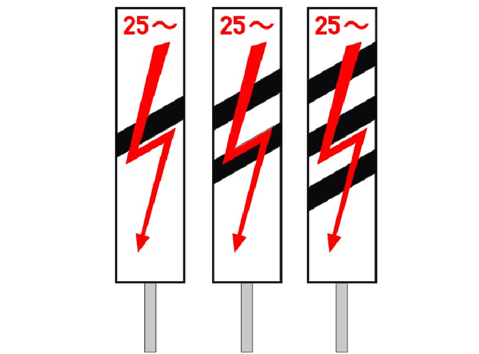

> Przed tarczą ostrzegawczą zawsze trzy, a przed semaforem, którego
> obrazy sygnałowe mogą nie być widoczne w sposób ciągły z wymaganej
> odległości, zawsze cztery kolejno po sobie następujące prostokątne lub
> kwadratowe białe tablice odpowiednio: z trzema, dwoma i jednym albo z
> czterema, trzema, dwoma i jednym czarnymi pasami, wznoszącymi się
> ukośnie z lewa na prawo. Pasy czarne na tablicach prostokątnych maluje
> się pod kątem 30°, a na tablicach kwadratowych -- pod kątem 45° do
> poziomu:

a)  na wskaźniku W 11b na czarnych pasach tablic umieszcza się czerwoną
    strzałę w kształcie błyskawicy, zwróconą ostrzem ku dołowi i
    malowaną na całej długości tablicy wskaźnika,

b)  na wskaźniku W 11c na czarnych pasach tablic umieszcza się czerwoną
    strzałę w kształcie błyskawicy, zwróconą ostrzem ku dołowi i
    malowaną na całej długości tablicy wskaźnika oraz czerwone
    oznaczenie „25" i sinusoidę umieszczone w górnej części wskaźnika,

c)  wskaźnik W 11a służy do zwrócenia uwagi maszynisty pojazdu
    trakcyjnego na zbliżanie się do tarczy ostrzegawczej semafora
    wjazdowego lub odstępowego albo do semafora, którego obrazy
    sygnałowe mogą nie być widoczne w sposób ciągły z wymaganej
    odległości,

d)  wskaźnik W 11b, umieszczany wyłącznie przed tarczą ostrzegawczą
    semafora wjazdowego, służy dodatkowo do uprzedzenia maszynisty o
    zbliżaniu się do posterunku ruchu, na którym rozpoczyna się odcinek
    zelektryfikowany z siecią górną pod napięciem 3 kV prądu stałego,
    której dotknięcie lub skierowanie na nią strumienia wody grozi
    śmiercią,

e)  wskaźnik W 11c, umieszczany wyłącznie przed tarczą ostrzegawczą
    semafora wjazdowego, służy dodatkowo

> do uprzedzenia maszynisty o zbliżaniu się do posterunku ruchu, na
> którym rozpoczyna się odcinek zelektryfikowany z siecią górną pod
> napięciem 25 kV prądu przemiennego, której dotknięcie lub skierowanie
> na nią strumienia wody grozi śmiercią,

f)  wskaźnik W 11a ustawia się przed tarczą ostrzegawczą semafora
    wjazdowego lub odstępowego albo przed semaforem, którego obrazy
    sygnałowe mogą nie być widoczne w sposób ciągły z wymaganej
    odległości; na stacjach pośrednich, niewęzłowych, leżących na
    liniach kolejowych drugorzędnych i znaczenia miejscowego można nie
    stosować wskaźnika przed tarczą ostrzegawczą. Wskaźnika W 11a można
    także nie stosować przed tarczami ostrzegawczymi na szlakach, na
    których największa dopuszczalna prędkość nie przekracza 40 km/h,
    niezależnie od kategorii linii kolejowej i rodzaju posterunku
    (stacja pośrednia, węzłowa, posterunek odgałęźny, odstępowy),

g)  wskaźnik W 11b stosuje się na szlakach niezelektryfikowanych
    niezależnie od kategorii linii kolejowej i warunków widoczności
    tarczy ostrzegawczej oraz ustawia go przed tarczami ostrzegawczymi
    semaforów wjazdowych posterunków ruchu, na których rozpoczyna się
    odcinek zelektryfikowany napięciem 3 kV prądu stałego,

h)  wskaźnik W 11c stosuje się na szlakach niezelektryfikowanych
    niezależnie od kategorii linii kolejowej i warunków widoczności
    tarczy ostrzegawczej oraz ustawia go przed tarczami ostrzegawczymi
    semaforów wjazdowych posterunków ruchu, na których rozpoczyna się
    odcinek zelektryfikowany napięciem 25 kV prądu przemiennego,

i)  wskaźniki W 11a, W 11b i W 11c ustawia się po tej samej stronie
    toru, patrząc w kierunku jazdy, po której umieszczona jest tarcza
    ostrzegawcza lub semafor, wymagające zastosowania tych wskaźników,

j)  tablice wskaźników przed tarczą ostrzegawczą ustawia się w
    odległościach co 100 m w takiej kolejności, aby maszynista pojazdu
    trakcyjnego zbliżającego się do tarczy ostrzegawczej, widział
    pierwszą napotkaną tablicę z trzema, drugą -- z dwoma i ostatnią --
    z jednym pasem czarnym. W przypadkach wyjątkowych, uzasadnionych
    miejscowymi warunkami, podane odległości mogą być zmniejszone
    najwyżej do 60 m między sąsiednimi tablicami, przy czym należy
    zachować jednakowe odległości między wszystkimi tablicami,

k)  tablice wskaźnika przed semaforem, którego obrazy sygnałowe mogą nie
    być widoczne w sposób ciągły z wymaganej odległości, ustawia się w
    ten sposób, że pierwszą tablicę z czterema pasami czarnymi umieszcza
    się w miejscu, z którego powinien być widoczny semafor, a następne
    -- kolejno z trzema, dwoma i jednym pasem -- pomiędzy pierwszą
    tablicą a semaforem tak, żeby były zachowane jednakowe odległości
    między wszystkimi tablicami,

l)  jeżeli wskaźniki ustawia się na zewnątrz torów, to stosuje się
    tablice prostokątne wysokie, jeśli zaś na międzytorzu, to można
    ustawić, w zależności od szerokości międzytorza, tablice prostokątne
    o mniejszych wymiarach albo tablice kwadratowe;

<!-- -->

14) **wskaźnik W 11p „Wskaźnik przejazdowy"** oznaczają, że za
    wskaźnikami znajduje się tarcza ostrzegawcza przejazdowa.

> Przed tarczą ostrzegawczą przejazdową jedna, a przed tarczą
> ostrzegawczą przejazdową, której obrazy sygnałowe mogą nie być
> widoczne w sposób ciągły z wymaganej odległości, dwie, kolejno po
> sobie następujące prostokątne tablice pomarańczowe, odpowiednio z
> jednym albo dwoma czarnymi trójkątami równobocznymi skierowanymi
> wierzchołkiem do góry, umieszczonymi w środkowej części tablicy;

a)  wskaźnik W 11p służy do zwrócenia uwagi maszyniście na zbliżanie się
    do tarczy ostrzegawczej przejazdowej,

b)  wskaźnik W 11p z jednym trójkątem ustawia się w odległości 200 m, a
    wskaźnik W 11p z dwoma trójkątami -- 400 m, przed tarczą
    ostrzegawczą przejazdową, po tej samej stronie toru, po której
    umieszczona jest tarcza ostrzegawcza przejazdowa, do której wskaźnik
    się odnosi;

<!-- -->

15) **wskaźnik W 12 „Wskaźnik parowozowy"** oznacza, że należy zakropić
    popielnik oraz zamknąć jego klapy. Biała tablica w kształcie
    ukośnika z czarnym i białym obramowaniem, zwrócona do góry
    wierzchołkiem leżącym na dłuższej przekątnej;

    a)  wskaźnik W 12 ustawia się w odległości 200 m przed mostami,
        wiaduktami lub innymi obiektami,

    b)  przy przejeżdżaniu obok wskaźnika W 12 należy popielnik parowozu
        zakropić i zamknąć jego klapy;

16) **wskaźnik W 13 „Wskaźnik torowy"** oznacza, że należy podnieść noże
    i zamknąć skrzydła pługa odśnieżnego oraz zachować szczególną
    ostrożność przy pracy podbijarek, oczyszczarek tłucznia i innych
    maszyn torowych. Czarno-biała krata lub dwie kraty, każda składająca
    się z dwóch par czarno-białych ukośników, umieszczone jedna nad
    drugą;

<!-- -->

a)  wskaźnik W 13 stosuje się do oznaczania miejsc, w szczególności
    przejazdu, mostu, rozjazdu, urządzeń oddziaływania tor-pojazd,
    czujnika szynowego, urządzeń do wykrywania zagrzanych osi i płaskich
    miejsc lub innych urządzeń w torze, przed którymi powinny być
    podnoszone noże i zamykane skrzydła pługa odśnieżnego podczas
    oczyszczania toru ze śniegu oraz w których należy zachować
    szczególną ostrożność przy pracy podbijarek, oczyszczarek tłucznia i
    innych maszyn torowych,

b)  wskaźnik W 13 ustawia się w odległości 50 m od osłanianego miejsca,
    z obu stron tego miejsca, przy każdym torze,

c)  przeszkody znajdujące się w odległości mniejszej od 150 m jedna od
    drugiej powinny być oznaczone

> jako jedna przeszkoda wskaźnikiem W 13 w postaci dwóch krat;

17) **wskaźnik W 15 „Wskaźnik zmiany lokalizacji"** oznacza, że semafor,
    sygnalizator powtarzający lub tarcza ostrzegawcza nie są umieszczone
    w miejscu, w którym powinny się znajdować, pomimo to odnoszą się do
    toru, przy którym stoi wskaźnik.

> Kwadratowa biała tablica z czarnym trójkątem zwróconym ostrzem w
> kierunku semafora, sygnalizatora powtarzającego lub tarczy
> ostrzegawczej (trójkąt równoramienny, którego podstawą jest bok
> kwadratu, a wierzchołek skierowany do sygnalizatora leży na środku
> przeciwległego boku).
>
> Wskaźnik W 15 ustawia się w tym miejscu, w którym powinny być
> ustawione: semafor, sygnalizator powtarzający lub tarcza ostrzegawcza;

18) **wskaźnik W 16 „Wskaźnik przystanku osobowego"** oznacza, że za
    wskaźnikiem w odległości drogi hamowania znajduje się przystanek
    osobowy.

> Biała pozioma tablica z trzema czarnymi pasami, wznoszącymi się
> ukośnie z lewa na prawo.
>
> Wskaźnik W 16 ustawia się skośnie do toru przed przystankami
> osobowymi, na których nie ma semaforów, z prawej strony toru, do
> którego się odnosi, w odległości drogi hamowania pociągów
> obowiązującej na danym szlaku, liczonej od wskaźnika W 4, ustawionego
> na tym przystanku;

19) **wskaźnik W 17 „Wskaźnik ukresu"** oznacza miejsce przy
    zbiegających się torach, do którego wolno tor zająć taborem
    kolejowym.

> Wskaźnik w postaci biało-czerwonego słupka (słupek ukresowy).
>
> *Miejsce usytuowania wskaźnika wyznacza się z uwzględnieniem
> obowiązującej skrajni i warunków lokalnych, w szczególności przechyłki
> lub poszerzenia na łuku*;

20) **wskaźnik W 18 „Wskaźnik samoczynnej blokady liniowej"** oznacza
    miejsce ustawienia ostatniego semafora odstępowego wieloodstępowej
    blokady liniowej na szlaku przed semaforem wjazdowym.

> Kwadratowa biała tablica z czarnym obramowaniem, a na niej czarny
> pierścień z czarnym kołem w środku;

a)  wskaźnik W 18 umieszcza się na maszcie ostatniego semafora
    odstępowego wieloodstępowej, blokady liniowej w celu poinformowania
    drużyny pociągowej, że zbliża się do semafora wjazdowego posterunku
    ruchu,

b)  w przypadku gdy ostatni samoczynny semafor odstępowy jest ciemny lub
    unieważniony, wskaźnik W 18 nakazuje maszyniście jazdę z taką
    prędkością, aby mógł on zatrzymać pociąg przed ewentualną
    przeszkodą, semaforem wjazdowym wskazującym sygnał „Stój" lub
    zmniejszyć prędkość stosownie do wskazań semafora wjazdowego;

<!-- -->

21) **wskaźnik W 19 „Wskaźnik uprzedzający o braku drogi hamowania"**
    oznacza, że odległość między dwoma następnymi semaforami lub między
    następną tarczą ostrzegawczą semaforową a semaforem jest mniejsza od
    obowiązującej na danej linii kolejowej długości drogi hamowania.

> Biała strzała, zwrócona ostrzem ku dołowi, na czarnym tle;

a)  wskaźnik W 19 informuje drużynę pociągową o tym, że za następnym
    semaforem lub tarczą ostrzegawczą semaforową pociąg wjedzie na
    odstęp o długości mniejszej od obowiązującej na danej linii
    kolejowej drogi

> hamowania i wymaga od
>
> maszynisty zachowania
>
> szczególnej ostrożności w
>
> regulowaniu prędkości jazdy pociągu,

b)  wskaźnik W 19 umieszcza się na maszcie semafora lub tarczy
    ostrzegawczej semaforowej bezpośrednio poprzedzających ten semafor
    lub tarczę ostrzegawczą semaforową, za którymi występuje skrócony
    odstęp, i wyświetla się jednocześnie z sygnałem na semaforze lub
    tarczy ostrzegawczej nakazującym zatrzymanie lub zmniejszenie
    prędkości przy kolejnych dwóch semaforach,

c)  wskaźnik W 19 wykonuje się jako świetlny *(wyświetlany)*, w postaci
    latarni z matowobiałą lub złożoną z punktów świetlnych strzałą,
    ukazujący się razem z sygnałem zezwalającym na semaforze dla
    przebiegu ustawionego na odstęp o skróconej drodze hamowania,

d)  dopuszcza się wykonanie wskaźnika W 19 w formie tablicy wykonanej z
    materiałów odblaskowych w przypadku, gdy:

> − odnosi się on do każdego sygnału zezwalającego nadawanego przez dany
> semafor,
>
> − jest on umieszczony na semaforze czterostawnej wieloodstępowej
> blokady liniowej,

e)  *wskaźnik W 19 umieszczony na przedostatnim semaforze odstępowym
    czterostawnej wieloodstępowej blokady liniowej informuje drużynę
    pociągową o tym, że ostatni odstęp blokady jest krótszy od
    obowiązującej drogi hamowania. W przypadku prowadzenia ruchu
    pociągów w odstępach posterunków następczych przy wprowadzonym
    telefonicznym zapowiadaniu pociągów, maszynista powinien regulować
    prędkość tak, aby mógł zatrzymać pociąg przed semaforem wjazdowym
    wskazującym sygnał „Stój",*

f)  *do odwołania stosuje się* wskaźniki *W 19 w formie tablic
    wykonanych z materiałów odblaskowych w przypadkach innych niż
    wskazane w lit. d*;

<!-- -->

22) **wskaźnik W 20 „Wskaźnik braku drogi hamowania"** oznacza, że
    odległość między tarczą ostrzegawczą semaforową lub semaforem, na
    których jest umieszczony wskaźnik, a następnym semaforem jest
    mniejsza od obowiązującej na danej linii kolejowej długości drogi
    hamowania.

> Dwie równoległe białe strzały, zwrócone ostrzem ku dołowi, na czarnym
> tle;

a)  wskaźnik W 20 informuje drużynę pociągową o tym, że pociąg wjeżdża
    na odstęp o długości mniejszej od obowiązującej na danej linii
    kolejowej drogi hamowania i wymaga od maszynisty zachowania
    szczególnej ostrożności w regulowaniu prędkości jazdy pociągu,

b)  wskaźnik W 20 umieszcza się na maszcie tarczy ostrzegawczej
    semaforowej lub semafora na początku skróconego odstępu *(drogi
    przebiegu)*, patrząc w kierunku jazdy pociągu, i wyświetla się
    jednocześnie z sygnałem na semaforze lub tarczy ostrzegawczej

> nakazującym zatrzymanie
>
> lub zmniejszenie prędkości przy następnym semaforze,

c)  wskaźnik W 20 powinien być poprzedzony wskaźnikiem W 19, o którym
    mowa w pkt 21,

d)  wskaźnik W 20 wykonuje się jako świetlny *(wyświetlany)*, w postaci
    latarni z matowobiałymi lub złożonymi z punktów świetlnych
    strzałami, ukazujący się razem z sygnałem zezwalającym na semaforze,

e)  dopuszcza się wykonanie wskaźnika W 20 w formie tablicy wykonanej z
    materiałów odblaskowych w przypadku, gdy:

> − odnosi się on do każdego sygnału zezwalającego nadawanego przez dany
> semafor,
>
> − jest on umieszczony na semaforze czterostawnej wieloodstępowej
> blokady liniowej,

f)  *do odwołania stosuje się* wskaźniki *W 20 w formie tablic
    wykonanych z materiałów odblaskowych w przypadkach innych niż
    wskazane w lit. e*;

<!-- -->

23) **wskaźnik W 21 „Wskaźnik podwyższenia prędkości"** *wyświetlony
    razem z sygnałem na semaforze oznacza, że jazda od tego semafora
    może odbywać się z prędkością określoną przez wskaźnik*.

> Kwadratowa *lub prostokątna* czarna tablica, a na niej biała liczba
> wskazująca największą dozwoloną prędkość określoną w dziesiątkach
> kilometrów na godzinę;

a)  wskaźnik W 21 umieszczony na maszcie semafora oznacza, że jazda od
    semafora, na którym znajduje się wskaźnik, nadającego sygnał
    zezwalający na jazdę z prędkością 40, 60 lub 100 km/h, może

> odbywać się z
>
> prędkością wyższą,
>
> nieprzekraczająca wartości określonej przez ten wskaźnik,

b)  wskaźnik W 21 wykonuje się jako świetlny

> *(wyświetlany)* i umieszcza na maszcie semafora tylko wówczas, gdy
> zachodzi potrzeba podwyższenia dozwolonej prędkości do wartości
> wyższej niż dopuszczona przez sygnał zezwalający na jazdę nadawany
> przez semafor,

c)  na wskaźniku W 21 matowobiała lub złożona z punktów świetlnych
    liczba na czarnym tle wyświetla się jednocześnie z ukazaniem się na
    semaforze sygnału zezwalającego na jazdę,

d)  dopuszcza się stosowanie wskaźnika W 21 w postaci czarnej tablicy
    oraz białej cyfry wykonanej z materiałów odblaskowych, który odnosi
    się do:

> − wszystkich sygnałów zezwalających na jazdę ze zmniejszoną
> prędkością, jeżeli dla wszystkich przebiegów układ torowy zezwala na
> jazdę z prędkością większą niż wskazuje na to sygnał zezwalający na
> jazdę ze zmniejszoną prędkością nadawany przez ten semafor,
>
> − sygnałów zezwalających na jazdę z prędkością zmniejszoną do 40 km/h,
> jeżeli dla wszystkich przebiegów spod danego semafora, dla których ta
> prędkość jest sygnalizowana, możliwe jest jej zwiększenie do 50 km/h;

24) **wskaźnik W 21a „Wskaźnik uprzedzający podwyższenie prędkości na
    następnym semaforze"** *wyświetlony razem z sygnałem na
    sygnalizatorze oznacza, że jazda od następnego semafora może odbywać
    się z prędkością określoną przez wskaźnik*.

> Kwadratowa czarna tablica, a na niej pomarańczowa liczba wskazująca
> największą dozwoloną prędkość określoną w dziesiątkach km/h, która
> została wyświetlona na wskaźniku W 21 umieszczonym na następnym
> semaforze:
>
> 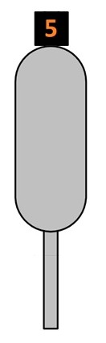{width="1.3736111111111111in"
> height="4.426388888888889in"}

a)  wskaźnik W 21a umieszczony nad latarnią sygnałową sygnalizatora
    oznacza, że jazda od następnego semafora, nadającego sygnał
    zezwalający może odbywać się z większą prędkością, nieprzekraczającą
    wartości określonej przez ten wskaźnik,

b)  wskaźnik W 21a wykonuje się jako świetlny i umieszcza nad latarnią
    sygnałową sygnalizatora,

c)  na wskaźniku W 21a pomarańczowa lub złożona z pomarańczowych punktów
    świetlnych liczba na czarnym tle wyświetla się jednocześnie z
    ukazaniem się na następnym semaforze sygnału zezwalającego na jazdę
    oraz liczby wyświetlającej się na wskaźniku

> W 21,
>
> d\) wskaźnik W 21a stosuje się wyłącznie w ramach projektów
> pilotażowych, których celem jest ustanowienie w przyszłości nowego
> systemu sygnalizacji na sieci kolejowej, lub na zarządzenie zarządcy
> infrastruktury;

25) **wskaźnik W 22 „Wskaźnik jazdy pociągu towarowego"** oznacza, że
    pociąg towarowy może przejechać bez zatrzymania ze zmniejszoną
    prędkością obok semafora odstępowego blokady wieloodstępowej,
    wskazującego sygnał „Stój".

> Kwadratowa czarna tablica ustawiona po przekątnej pionowo, a na niej
> umieszczona centralnie biała litera „T" wykonana z materiałów
> odblaskowych;

a)  wskaźnik W 22 jest stosowany na semaforach odstępowych
    wieloodstępowej blokady liniowej, ustawionych na wzniesieniu
    miarodajnym ponad 6 ‰ na długości drogi hamowania,

b)  wskaźnik W 22 odnosi się wyłącznie do ciężkich pociągów towarowych i
    zezwala na przejechanie bez zatrzymania obok semafora odstępowego
    wieloodstępowej blokady liniowej, wskazującego sygnał „Stój", z
    prędkością nie większą od 20 km/h, przy czym maszynista powinien tak
    regulować prędkość, aby mógł

> w każdej chwili zatrzymać pociąg
>
> w razie zauważenia przeszkody do dalszej jazdy;

26) **wskaźnik W 23 „Wskaźnik odcinka izolowanego"** oznacza początek
    odcinka torowego lub zwrotnicowego wyposażonego w urządzenie
    kontroli niezajętości torów i rozjazdów.

*Wskaźnik w postaci żółtego słupka ustawionego przy torze*;

a)  wskaźnik W 23 oznacza miejsce, przed którym przetaczany tabor
    kolejowy powinien się zatrzymać, aby umożliwić przestawienie
    zwrotnicy,

b)  wskaźnika W 23 nie oświetla się;

<!-- -->

27) **wskaźnik W 24 „Wskaźnik kierunku przeciwnego"** oznacza wyjazd na
    tor szlaku dwutorowego lub wielotorowego w kierunku przeciwnym do
    zasadniczego.

> Wskaźnik świetlny *(wyświetlany)*, matowobiała lub złożona z punktów
> świetlnych kresa na kwadratowej czarnej tablicy wznosząca się do góry
> z prawa na lewo;

a)  wskaźnik W 24 umieszcza się na maszcie semafora albo na osobnym
    maszcie,

b)  obraz na wskaźniku W 24 pokazuje się jednocześnie z wyświetleniem na
    semaforze sygnału zezwalającego na jazdę,

c)  w przypadku wyprawienia pociągu na sygnał zastępczy „Sz"

> obraz na wskaźniku W 24
>
> pokazuje się jednocześnie z obrazem sygnału zastępczego,

d)  w szczególnych przypadkach, *określonych wytycznymi organizacji
    zamknięć torowych w czasie wykonywania planowych robót*, wskaźnik W
    24 może być stosowany w porze dziennej w postaci przenośnej tablicy
    nieoświetlonej;

<!-- -->

28) **wskaźnik W 25 „Wskaźnik ogrzewania"** oznacza stanowisko
    elektrycznego ogrzewania wagonów i rozpoczęcia ogrzewania.

> Wskaźnik świetlny -- jedna lub dwie prostokątne latarnie umieszczone
> na wspólnym maszcie; na każdej latarni, w kolorze czerwonym, numer
> toru ze strzałką zwróconą w kierunku toru, do którego się ta latarnia
> odnosi, oraz strzała w kształcie błyskawicy zwrócona ostrzem ku
> dołowi;

a)  wskaźnik W 25 ustawia się na międzytorzu w miejscu stanowiska
    elektrycznego ogrzewania wagonów na torach postojowych; przeznaczony
    jest on do uprzedzenia o konieczności zachowania ostrożności w
    czasie ogrzewania składów, z uwagi na wysokie napięcie,

b)  wskaźnik W 25 wyświetla się z chwilą rozpoczęcia ogrzewania,

c)  w czasie trwania ogrzewania wagonów zabrania się zbliżania i
    dojeżdżania do nich;

<!-- -->

29) **wskaźnik W 27a „Wskaźnik zmiany prędkości"** oznacza miejsce
    zmiany i obowiązującą od tego miejsca największą dozwoloną prędkość
    drogową dla danej linii kolejowej. Kwadratowa biała tablica z czarną
    obwódką, a na niej czarna liczba wskazująca największą dozwoloną
    prędkość drogową, przy czym wartość podana na wskaźniku odpowiada
    0,1 dozwolonej prędkości jazdy wyrażonej w km/h, a wartość
    dozwolonej prędkości jazdy ustala się w przedziałach co 5 km/h;

<!-- -->

a)  wskaźnik W 27a (wskaźnik dwustronny, stosownie do prędkości
    dozwolonej za tym wskaźnikiem, patrząc w kierunku jazdy pociągu)
    ustawia się:

> − przy torach szlakowych i głównych zasadniczych danej linii kolejowej
> poza drogami rozjazdowymi,
>
> − na szlaku jednotorowym po prawej stronie toru, patrząc w kierunku
> wzrostu kilometrażu linii kolejowej, a w pozostałych przypadkach
> według zasad określonych w ust. 14 pkt 1, 3 i 4,

b)  jeżeli nie można ustawić wskaźnika W 27a z zachowaniem skrajni,
    stosuje się tablicę o zmniejszonych wymiarach i umieszcza się ją
    nisko,

c)  białe tło wskaźnika W 27a powinno być wykonane z materiałów
    odblaskowych;

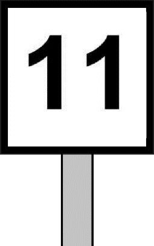{width="1.1569444444444446in"
height="1.8409722222222222in"}
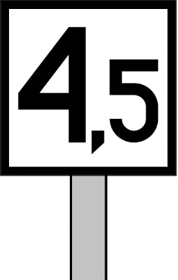{width="1.1666666666666667in"
height="1.841388888888889in"}

> 30\) **wskaźnik W 28 „Wskaźnik kanału radiowego"** oznacza miejsce
> zmiany i obowiązujący od tego miejsca numer kanału radiołączności
> pociągowej.
>
> Okrągła czarna tablica, a na niej żółte oznaczenie literowo-cyfrowe.
> Litera stanowi uzgodniony z Prezesem Urzędu Transportu Kolejowego
> wyróżnik zarządcy infrastruktury -- *dla PLK SA jest litera „R"*,
> którego wskaźnik dotyczy. Liczba wskazuje numer kanału radiołączności
> pociągowej, przydzielonego danemu zarządcy infrastruktury;

a)  wskaźnik W 28 informuje maszynistę o miejscu zmiany obowiązującego
    kanału radiołączności pociągowej i o obowiązującym od tego miejsca
    numerze kanału radiowego. Po minięciu wskaźnika maszynista powinien
    przełączyć radiotelefon na wskazany kanał radiołączności pociągowej
    i jak najszybciej nawiązać łączność z najbliższym posterunkiem ruchu
    pracującym na tym kanale,

b)  numer kanału określony wskaźnikiem W 28 obowiązuje do miejsca
    ustawienia następnego wskaźnika z innym numerem,

c)  wskaźnik W 28 ustawia się w następujący sposób:

> − na stacji lub posterunku odgałęźnym, będącym początkiem linii
> kolejowej z radiołącznością pociągową -- na stacji w odległości 30-70
> m
>
> *za ostatnią zwrotnicą wyjazdową*, a na posterunku odgałęźnym --
> 100-150 m za ostatnią zwrotnicą, patrząc w kierunku szlaku z
> radiołącznością pociągową,
>
> − na stacji węzłowej lub posterunku odgałęźnym, jeżeli na przyległych
> szlakach jest radiołączność pociągowa o różnych numerach kanałów -- na
> stacji w odległości 30-70 m *za ostatnią zwrotnicą wyjazdową*, a na
> posterunku odgałęźnym -- 100-150 m za ostatnią zwrotnicą wyjazdową,
> patrząc w kierunku szlaku z innym kanałem radiołączności pociągowej,
>
> − przy dojeździe do posterunku leżącego na linii kolejowej z
> radiołącznością pociągową, na szlaku niewyposażonym w radiołączność
> pociągową -- 300 m przed semaforem wjazdowym posterunku ruchu z
> radiołącznością pociągową,

d)  jeżeli nie można ustawić wskaźnika W 28 z zachowaniem skrajni,
    stosuje się tablicę o zmniejszonych wymiarach i umieszcza ją nisko.
    Litera i cyfra na wskaźniku powinny być wykonane z materiałów
    odblaskowych,

e)  *jeżeli nie ma możliwości ustawienia wskaźnika w sposób, o którym
    mowa w lit. c, dopuszcza się za zgodą komórki organizacyjnej PKP
    Polskich Linii Kolejowych S.A. ds. telekomunikacji ustawienie
    wskaźnika w innym miejscu, zgodnie z zasadą obowiązywania jednego
    numeru kanału radiołączności pociągowej na danym szlaku*;

<!-- -->

31) **wskaźnik W 29 „Wskaźnik nawiązania łączności"** oznacza, że należy
    nawiązać łączność radiową z dyżurnym ruchu odcinkowym.

> Pomarańczowa tablica pozioma, a na niej dwa czarne kąty, oparte na
> krótszych bokach prostokąta, jeden obok drugiego, stykające się
> wierzchołkami w środku tablicy;

a)  wskaźnik W 29 stosuje się na odcinkach linii kolejowej, na których
    ruch prowadzony jest na podstawie radiotelefonicznego porozumiewania
    się dyżurnego ruchu odcinkowego z maszynistą pojazdu trakcyjnego lub
    kierującym pojazdem pomocniczym, dla wskazania miejsca, w którym
    maszynista lub kierujący pojazdem pomocniczym ma obowiązek
    nawiązania łączności radiowej z dyżurnym ruchu odcinkowym,

b)  wskaźnik W 29 ustawia się skośnie do toru, po prawej stronie toru
    przed mijanką bezobsługową w odległości nie mniejszej niż 1600 m
    przed samoczynnie działającym semaforem wjazdowym;

<!-- -->

32) **wskaźnik W 30 „Wskaźnik ważenia składu"** oznacza prędkość, z jaką
    należy przejeżdżać przez automatyczną wagę podczas ważenia składu.

> Wskaźnik świetlny -- matowobiałe koło na jasnoniebieskim tle, a w kole
> napis „Waga x km/h", gdzie „x" oznacza prędkość przejazdu w km/h;

a)  wskaźnik W 30 umieszcza się we właściwej odległości, zgodnie z
    dokumentacją techniczną wagi, przed wagą z obu jej stron,

b)  wyświetlony wskaźnik W 30 oznacza, że skład będzie ważony i należy
    przejeżdżać przez wagę z prędkością określoną na wskaźniku;

<!-- -->

33) **wskaźnik W 31 „Wskaźnik kasowania"** oznacza, że sygnalizator, na
    którym został umieszczony wskaźnik, jest nieczynny, nie został
    oddany do użytku lub jest unieważniony, a w przypadku sygnalizatora
    świetlnego wszystkie jego komory są ciemne (brak świateł).

> Biały ukośny krzyż z czarną obwódką.
>
> Wskaźnik W 31 umieszcza się na nieczynnych sygnalizatorach, a w
> przypadku sygnalizatorów świetlnych na latarniach sygnałowych tych
> sygnalizatorów;

34) **wskaźnik W 32 „Wskaźnik czoła pociągu"** oznacza miejsce
    zatrzymania czoła pociągu o długości określonej tym wskaźnikiem.

> Biała tablica pięciokątna (ścięty prostokąt) z czarną obwódką i czarną
> liczbą określającą długość pociągu w metrach.
>
> **200**
>
> Wskaźnik W 32 stosuje się na stacjach i przystankach osobowych.
> Wskaźnik W 32, w razie potrzeby więcej niż jeden, dla pociągów o
> różnych długościach, ustawia się, rozmieszczając go w zależności od
> warunków miejscowych w taki sposób, aby zapewniona została możliwie
> najdogodniejsza obsługa podróżnych.
>
> *Wskaźniki wykonuje się jako lewo- i prawostronne, ze ściętym
> narożnikiem od strony toru, do którego się odnoszą;*

35) **wskaźnik W 33 „Wskaźnik sieci GSM-R"** oznacza miejsce, w którym
    maszynista musi ręcznie wybrać wskazaną sieć GSM-R w radiotelefonie
    kabinowym, chyba że sieć zostaje wybrana automatycznie przez
    działanie urządzeń przytorowych.

> Prostokątna biała tablica z czarnym obramowaniem, a na niej czarny
> symbol graficzny przedstawiający słuchawkę oraz czarne litery GSM-R
> umieszczone poniżej symbolu słuchawki. Poniżej wewnątrz czarnego
> obramowania w kształcie elipsy umieszczony jest czarny skrót literowy
> nazwy państwa, na obszarze którego zainstalowany jest dany system
> GSM-R;

a)  wskaźnik W 33 informuje maszynistę o miejscu zmiany sieci GSM-R lub
    systemu radiołączności pociągowej na obowiązujący od tego miejsca
    system GSM-R,

b)  wskaźnik W 33 ustawia się przy dojeździe do posterunku ruchu
    leżącego na linii kolejowej wyposażonej w system GSM-R, przed
    semaforem wjazdowym tego posterunku ruchu, w odległości
    *pozwalającej na pomyślne zalogowanie radiotelefonu kabinowego GSM-R
    do sieci GSM-R oraz zarejestrowanie numeru funkcyjnego przed tym
    semaforem, przy uwzględnieniu* maksymalnej prędkości drogowej
    obowiązującej na danym odcinku linii,

c)  jeżeli nie można ustawić wskaźnika W 33 z zachowaniem skrajni,
    stosuje się tablicę o zmniejszonych wymiarach i umieszcza ją nisko;
    białe tło wskaźnika wykonuje się z materiałów odblaskowych;

<!-- -->

36) **wskaźnik W 34 „Wskaźnik końca obowiązywania systemu ERTMS/GSM-R"**
    oznacza koniec obowiązującego do tego miejsca systemu ERTMS/GSM-R.

> Prostokątna biała tablica z czarnym obramowaniem, a na niej czarny
> symbol graficzny przedstawiający słuchawkę oraz czarne litery GSM-R
> umieszczone poniżej symbolu słuchawki. Poniżej wewnątrz czarnego
> obramowania w kształcie elipsy umieszczony jest czarny skrót literowy
> nazwy państwa, na obszarze którego zainstalowany jest dany system
> ERTMS/GSM-R. Tablica przekreślona czerwonym pasem wznoszącym się
> ukośnie od lewego dolnego wierzchołka do prawego górnego wierzchołka;

a)  wskaźnik W 34 informuje maszynistę o miejscu zmiany systemu
    ERTMS/GSM-R na obowiązujący od tego miejsca system radiołączności
    pociągowej 150 MHz; po minięciu wskaźnika, maszynista powinien
    przełączyć urządzenia pokładowe, jeśli są dostępne, na system
    radiołączności pociągowej 150 MHz obowiązujący od tego miejsca oraz
    jak najszybciej nawiązać łączność z najbliższym posterunkiem ruchu
    pracującym w tym systemie,

b)  wskaźnik W 34 stosuje się wraz ze wskaźnikiem W 28, który informuje
    maszynistę o kanale systemu radiołączności pociągowej 150 MHz
    obowiązującego za wskaźnikiem W 34. Wskaźnik W 28 umieszcza się
    powyżej wskaźnika W 34 na wspólnej konstrukcji wsporczej,

c)  wskaźnik W 34 ustawia się w następujący sposób:

> − na stacji, stacji węzłowej lub posterunku odgałęźnym, będącym końcem
> ostatniego szlaku linii kolejowej z systemem ERTMS/GSM-R -- na stacji
> i na stacji węzłowej w odległości 30-70 m za ostatnią zwrotnicą
> wyjazdową, a na posterunku odgałęźnym 100-150 m za ostatnim rozjazdem,
> patrząc w kierunku szlaku z systemem
>
> ERTMS/GSM-R,
>
> − przy dojeździe do posterunku ruchu niewyposażonego w system
> ERTMS/GSM-R -- w odległości drogi hamowania obowiązującej na danym
> szlaku, przed semaforem wjazdowym na ten posterunek ruchu,

d)  jeżeli nie można ustawić wskaźnika W 34 z zachowaniem skrajni,
    stosuje się tablicę o zmniejszonych wymiarach i umieszcza ją nisko.
    Białe tło wskaźnika powinno być wykonane z materiałów odblaskowych;

> 37\) **wskaźniki W 35, W 36 „Wskaźniki ograniczenia prędkości na
> kierunku zwrotnym"** oznaczają, że ograniczenie prędkości na
> rozjeździe lub zmniejszenie prędkości drogowej dotyczy wyłącznie jazdy
> na kierunek zwrotny. Prostokątna biała (wskaźnik W 35) lub
> pomarańczowa (wskaźnik W 36) tablica z czarną obwódką, a na niej
> czarna pozioma strzała zwrócona ostrzem w kierunku lewym lub prawym;

a)  wskaźnik W 35 informuje maszynistę, że stałe ograniczenie prędkości
    wprowadzone na rozjeździe lub zmniejszenie prędkości drogowej
    obowiązuje tylko w przypadku, gdy rozjazd ustawiony jest na kierunek
    zwrotny,

b)  wskaźnik W 36 informuje maszynistę, że doraźne ograniczenie
    prędkości wprowadzone na rozjeździe obowiązuje tylko w przypadku,
    gdy rozjazd ustawiony jest na kierunek zwrotny,

c)  wskaźnik W 35 umieszcza się nad wskaźnikiem W 8 oraz nad wskaźnikiem
    W 9 stojącym na początku odcinka stałego ograniczenia prędkości,

d)  wskaźnik W 36 umieszcza się nad tarczą sygnału D 6 i nad wskaźnikiem
    W 14 stojącym na początku odcinka doraźnego ograniczenia prędkości,

e)  czarna strzała na wskaźnikach W 35, W 36 jest zwrócona w tę stronę,
    w którą na danym rozjeździe odgałęzia się tor w kierunku zwrotnym,

f)  jeżeli szerokość międzytorza nie pozwala na ustawienie wskaźników W
    35, W 36 o typowych wymiarach, stosuje się wskaźniki o zmniejszonych
    wymiarach i umieszcza się je nisko, z zachowaniem skrajni.

<!-- -->

16. Wskaźniki We stosowane na liniach kolejowych zelektryfikowanych
    określają obowiązujący maszynistę sposób prowadzenia elektrycznego
    pojazdu trakcyjnego wynikający z układu zasilania i układu oraz
    stanu sieci trakcyjnej.

17. Wskaźniki We mogą być stałe albo przenośne.

18. Wskaźniki We umieszcza się według następujących zasad:

    1)  wskaźniki We stałe zawiesza się nad torem, do którego się
        odnoszą, na konstrukcjach wsporczych na wysokości nie mniejszej
        niż 4,5 m od poziomu główki szyny lub na wysięgnikach
        konstrukcji wsporczych, patrząc w kierunku jazdy;

    2)  wskaźniki We przenośne umieszcza się zgodnie z pkt 1 albo obok
        toru zgodnie z ust. 14 pkt 1.

19. Wskaźniki We mają postać kwadratowej niebieskiej tablicy z czarną i
    białą obwódką, ustawionej przekątną pionowo, z odpowiednim białym
    symbolem na niebieskim polu.

20. Stosuje się następujące wskaźniki dotyczące zelektryfikowanych linii
    kolejowych:

    1)  **wskaźniki We 1a, We 1b, We 1c „Wskaźniki opuszczania
        pantografu**" oznaczają, że należy opuścić pantografy przed
        następnym wskaźnikiem (wskaźniki opuszczonego pantografu We 2a,
        We 2b, We 2c): niezależnie od kierunku jazdy (wskaźnik We 1a),
        przy jeździe na tor odgałęziający się w prawo od toru, przy
        którym jest ustawiony wskaźnik (wskaźnik We 1b), lub przy
        jeździe na tor odgałęziający się w lewo od toru, przy którym
        jest ustawiony wskaźnik (wskaźnik We 1c).

> Dwa poziome białe paski jednakowej wielkości, przesunięte w pionie i w
> poziomie względem siebie tak, że początek górnego paska jest na
> wysokości końca paska dolnego; wskaźnik We 1b i We 1c obowiązujący dla
> torów odgałęziających się uzupełniony jest małą kwadratową czarną
> tablicą z białym trójkątem zwróconym ostrzem odpowiednio w prawo
> (wskaźnik We 1b) lub w lewo (wskaźnik We 1c), w zależności od tego,
> którego toru odgałęziającego się dotyczy wskaźnik.

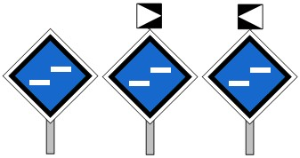{width="3.928472222222222in"
height="2.104861111111111in"}

> We 1a We 1b We 1c
>
> Wskaźniki We 1a, We 1b lub We 1c ustawia się na szlaku i na stacji
> przy torach głównych, przed właściwym wskaźnikiem We 2a, We 2b, We 2c
> w odległości *co najmniej*:

a)  *400 m -- dla odcinka linii o prędkości do 60 km/h włącznie*,

b)  *600 m -- dla odcinka linii o prędkości większej niż 60 km/h do 100
    km/h włącznie*,

c)  *800 m -- dla odcinka linii o prędkości większej niż 100 km/h*;

<!-- -->

2)  **wskaźniki We 2a, We 2b, We 2c „Wskaźniki opuszczonego
    pantografu"** oznaczają miejsce, od którego jazda pociągu odbywa się
    z opuszczonym pantografem: niezależnie od kierunku jazdy (wskaźnik
    We 2a), przy jeździe na tor odgałęziający się w prawo od toru, przy
    którym jest ustawiony wskaźnik (wskaźnik We 2b) lub przy jeździe na
    tor odgałęziający się w lewo od toru, przy którym jest ustawiony
    wskaźnik (wskaźnik We 2c). Jeden biały, poziomy pasek; wskaźnik We
    2b i We 2c obowiązujący dla torów odgałęziających się uzupełniony
    jest małą kwadratową czarną tablicą z białym trójkątem zwróconym
    ostrzem odpowiednio w prawo lub w lewo, w zależności od tego,
    którego toru odgałęziającego się dotyczy wskaźnik;

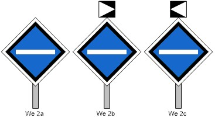{width="3.8118055555555554in"
height="2.09375in"}

a)  wskaźnik We 2a, We 2b, We 2c ustawia się na szlaku i na stacjach w
    odległości nie mniejszej niż 50 m i nie większej niż 150 m przed
    początkiem odcinka toru, który należy przejeżdżać z opuszczonym
    pantografem,

b)  wskaźnik We 2a, We 2b, We 2c stosuje się:

> − w razie wyłączania sieci lub odcinka sieci spod napięcia, aby
> uniknąć przeniesienia napięcia przez pantograf,
>
> − w razie konieczności jazdy z rozpędu na odcinkach toru
> niezelektryfikowanego,
>
> − w razie konieczności jazdy z rozpędu na odcinkach toru
> zelektryfikowanego w przypadku, gdy stan sieci lub inne względy nie
> pozwalają na współpracę z pantografami;

3)  **wskaźniki We 3a, We 3b, We 3c „Wskaźniki podniesienia
    pantografu"** oznaczają, że należy podnieść pantografy.

> Jeden biały pionowy pasek; wskaźnik obowiązujący lokomotywy
> elektryczne jest uzupełniony małą kwadratową białą tablicą z czarną
> obwódką oraz czarną literą „L", wskaźnik obowiązujący pociągi dłuższe
> niż 200 m jest uzupełniony małą prostokątną białą tablicą z czarną
> obwódką oraz czarnym napisem „400";

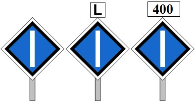{width="4.001388888888889in"
height="2.104861111111111in"}

> We 3a We 3b We 3c

a)  wskaźnik We 3a dotyczący elektrycznych zespołów trakcyjnych lub
    innych pociągów z pantografem zlokalizowanym w odległości większej
    niż 30 m od czoła pociągu i nie większej niż 200 m od czoła pociągu
    ustawia się w odległości nie mniejszej niż 200 m i nie większej niż
    250 m za miejscem, w którym można podnieść pantografy,

b)  wskaźnik We 3b dotyczący lokomotyw elektrycznych ustawia się w
    odległości nie mniejszej niż 30 m i nie większej niż 100 m za
    miejscem, w którym można podnieść pantografy,

c)  wskaźnik We 3c dotyczący elektrycznych zespołów trakcyjnych
    dłuższych niż 200 m lub innych pociągów z pantografem zlokalizowanym
    w odległości większej niż 200 m od czoła pociągu, w tym składów typu
    push-pull z lokomotywą na końcu składu, ustawia się w odległości nie
    mniejszej niż 400 m i nie większej

> niż 450 m za miejscem, w którym można podnieść pantografy;

4)  **wskaźniki We 4a, We 4b, We 4c „Wskaźniki zakazu wjazdu
    elektrycznych pojazdów trakcyjnych"** oznaczają, że wjazd
    elektrycznych pojazdów trakcyjnych jest zabroniony: na tor, przy
    którym jest ustawiony wskaźnik (wskaźnik We 4a), na tor
    odgałęziający się w prawo od toru, przy którym jest ustawiony
    wskaźnik (wskaźnik We 4b), lub na tor odgałęziający się w lewo od
    toru, przy którym ustawiony jest wskaźnik (wskaźnik We 4c). Dwa
    białe kwadraty jeden w drugim *na kwadratowej niebieskiej tablicy z
    czarną i białą obwódką*. Wskaźnik obowiązujący dla torów
    odgałęziających się uzupełniony jest małą kwadratową czarną tablicą
    z białym trójkątem zwróconym ostrzem odpowiednio w prawo lub w lewo,
    w zależności od tego, którego toru odgałęziającego się dotyczy:

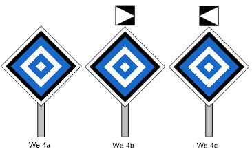{width="3.8131944444444446in"
height="2.3333333333333335in"}

a)  wskaźnik We 4a, We 4b, We 4c służy do oznaczania miejsc, poza które
    przejazd elektrycznych pojazdów trakcyjnych jest zabroniony, w
    szczególności takich jak uszkodzenie sieci, praca przy sieci, koniec
    sieci,

b)  wskaźnik We 4a, We 4b, We 4c ustawia się w odległości nie mniejszej
    niż 15 m i nie większej niż 65 m przed miejscem, poza które przejazd
    jest zabroniony;

<!-- -->

5)  **wskaźniki We 8a, We 8b, We 8c „Wskaźniki jazdy bezprądowej"**
    oznaczają miejsce, przez które elektryczny pojazd trakcyjny powinien
    przejeżdżać bez pobierania prądu trakcyjnego z sieci trakcyjnej, a w
    przypadku prądu przemiennego również z wyłączonym wyłącznikiem
    głównym: przy przejeździe po torze, przy którym jest ustawiony
    wskaźnik (wskaźnik We 8a), przy jeździe na tor odgałęziający się w
    prawo od toru, przy którym jest ustawiony wskaźnik (wskaźnik We 8b),
    lub przy jeździe na tor odgałęziający się w lewo od toru, przy
    którym jest ustawiony wskaźnik (wskaźnik We 8c).

> Dwa równoległe białe paski pionowe i pod nimi jeden biały pasek
> poziomy, niestykający się z paskami pionowymi; wskaźnik obowiązujący
> dla torów odgałęziających się uzupełniony jest małą kwadratową czarną
> tablicą z białym trójkątem zwróconym ostrzem odpowiednio w prawo lub w
> lewo, w zależności od tego, którego toru odgałęziającego się dotyczy.

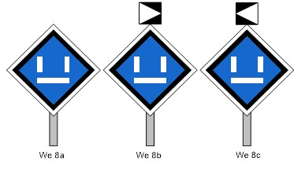{width="3.904861111111111in"
height="2.3333333333333335in"}

> Wskaźniki We 8a, We 8b i We 8c ustawia się w odległości nie mniejszej
> niż 30 m i nie większej niż 80 m przed elementem podłużnego
> sekcjonowania sieci jezdnej, takim jak *odcinek neutralny sekcji
> separacji faz albo systemów,* izolowane przęsło naprężenia, przerwa
> powietrzna, izolator sekcyjny, który oddziela elektrycznie dwa odcinki
> sieci i przez który należy przejeżdżać bez pobierania prądu
> trakcyjnego z sieci *trakcyjnej, a w przypadku prądu przemiennego
> również z wyłączonym wyłącznikiem głównym*;

6)  **wskaźniki We 9a, We 9b, We 9c „Wskaźniki jazdy pod prądem"**
    oznaczają miejsce, od którego można jechać, pobierając prąd
    trakcyjny z sieci trakcyjnej.

> *Dwa równoległe białe paski pionowe i pod nimi jeden biały pasek
> poziomy, stykający się z paskami pionowymi*; wskaźnik obowiązujący
> lokomotywy elektryczne jest uzupełniony małą kwadratową białą tablicą
> z czarną obwódką oraz czarną literą „L", wskaźnik obowiązujący pociągi
> dłuższe niż 200 m jest uzupełniony małą prostokątną białą tablicą z
> czarną obwódką oraz czarnym napisem „400";

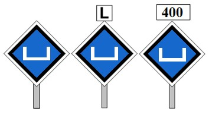{width="3.698611111111111in" height="2.0in"}

> We 9a We 9b We 9c

a)  wskaźnik We 9a dotyczący elektrycznych zespołów trakcyjnych lub
    innych pociągów z pantografem zlokalizowanym w odległości większej
    niż 30 m od czoła pociągu, ale nie większej niż 200 m od czoła
    pociągu ustawia się w odległości nie mniejszej niż 200 m i nie
    większej niż 250 m za miejscem, które należy przejeżdżać bez
    pobierania prądu trakcyjnego z sieci *trakcyjnej, a w przypadku
    prądu przemiennego również z wyłączonym wyłącznikiem głównym*,

b)  wskaźnik We 9b dotyczący lokomotyw elektrycznych ustawia się w
    odległości nie mniejszej niż 30 m i nie większej niż 100 m za
    miejscem, które należy przejeżdżać bez pobierania prądu trakcyjnego
    z sieci *trakcyjnej, a w przypadku prądu przemiennego również z
    wyłączonym wyłącznikiem głównym*,

c)  wskaźnik We 9c dotyczący elektrycznych zespołów trakcyjnych
    dłuższych niż 200 m lub innych pociągów z pantografem zlokalizowanym
    w odległości większej niż 200 m od czoła pociągu, w tym składów typu
    push-pull z lokomotywą na końcu składu, ustawia się w odległości nie
    mniejszej niż 400 m i nie większej niż 450 m za miejscem, które
    należy przejeżdżać bez pobierania prądu trakcyjnego z sieci
    *trakcyjnej, a w przypadku prądu przemiennego również z wyłączonym
    wyłącznikiem głównym*. *Uwaga: przykład osygnalizowania odcinka
    jazdy bez poboru prądu przedstawiono w załączniku Nr 4*;

> 7\) **wskaźniki We 10a, We 10b, We 10c, We 10d, We 10e, We 10f
> „Wskaźniki zmiany systemu zasilania"** oznaczają zmianę systemu
> zasilania dla toru przy którym stoi wskaźnik:

a)  **wskaźnik We 10a**: białe oznaczenie „25" i pod spodem sinusoida
    informuje maszynistę o wjeździe do obszaru zasilanego w systemie 25
    kV prądu przemiennego,

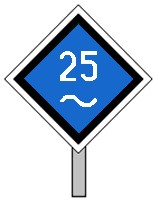{width="1.6145833333333333in"
height="2.1666666666666665in"}

b)  **wskaźnik We 10b**: białe oznaczenie „25" i pod spodem sinusoida,
    przekreślone czerwonym pasem wznoszącym się ukośnie od lewego
    dolnego boku do prawego górnego boku, informuje maszynistę o
    wyjeździe z obszaru zasilanego w systemie 25 kV prądu przemiennego,

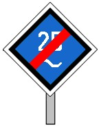{width="1.5in" height="1.9583333333333333in"}

c)  **wskaźnik We 10c**: białe oznaczenie „15" i pod spodem sinusoida
    informuje maszynistę o wjeździe do obszaru zasilanego w systemie 15
    kV prądu przemiennego,

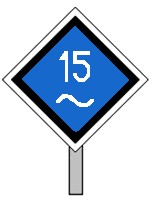{width="1.59375in" height="2.125in"}

d)  **wskaźnik We 10d**: białe oznaczenie „15" i pod spodem sinusoida,
    przekreślone czerwonym pasem wznoszącym się ukośnie od lewego
    dolnego boku do prawego górnego boku, informuje maszynistę o
    wyjeździe z obszaru zasilanego w systemie 15 kV prądu przemiennego,

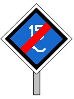{width="1.5729166666666667in"
height="2.1145833333333335in"}

e)  **wskaźnik We 10e**: białe oznaczenie „3" i pod spodem dwa poziome
    paski, informuje maszynistę o wjeździe do obszaru zasilanego w
    systemie 3 kV prądu stałego,

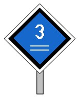{width="1.5833333333333333in"
height="1.9791666666666667in"}

f)  **wskaźnik We 10f**: białe oznaczenie „3" i pod spodem dwa poziome
    paski, przekreślone czerwonym pasem wznoszącym się ukośnie od lewego
    dolnego boku do prawego górnego boku, informuje maszynistę o
    wyjeździe z obszaru zasilanego w systemie 3 kV prądu stałego.

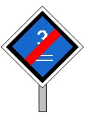{width="1.5104166666666667in"
height="1.9895833333333333in"}

> Wskaźniki We 10a, We 10b, We 10c, We 10d, We 10e i We 10f stosuje się
> wyłącznie dla oznaczenia stref separacji dwóch różnych systemów
> zasilania sieci trakcyjnej -- wskaźników tych nie należy stosować na
> granicy obszarów zelektryfikowanego i niezelektryfikowanego.
>
> *Wskaźniki We 10a, We 10c lub We 10e ustawia się w sekcji separacji
> systemów, w miejscu rozpoczęcia obszaru zasilanego we właściwym
> systemie tj. 25 kV prądu przemiennego, 15 kV prądu przemiennego lub 3
> kV prądu stałego. Uwaga: przykład osygnalizowania sekcji separacji
> systemów przedstawiono w załączniku Nr 4.*
>
> *Wskaźnik We 10a, We 10c lub We 10e ustawia się przed wskaźnikiem We
> 3b lub We 9b.*
>
> *Wskaźniki We 10b, We 10d lub We 10f ustawia się przed wskaźnikiem We
> 2a lub We 8a właściwym dla sekcji separacji systemów, w odległości co
> najmniej:*

  ---------------------------------------------------------------------
  −    *400 m -- dla odcinka linii o prędkości do 60 km/h włącznie,*
  ---- ----------------------------------------------------------------
  −    *600 m -- dla odcinka linii o prędkości większej niż 60 km/h do
       100 km/h włącznie,*

  −    *800 m -- dla odcinka linii o prędkości większej*
  ---------------------------------------------------------------------

> *niż 100 km/h.*

21. Wskaźniki stosowane do prowadzenia ruchu pociągów z wykorzystaniem
    systemu ERTMS/ETCS:

    1)  ustawia się zgodnie z ust. 14;

    2)  wykonuje się z materiałów odblaskowych.

22. *Jeżeli warunki miejscowe nie pozwalają na umieszczenie wskaźnika W
    ETCS 10 i W ETCS 11 zgodnie z zasadami określonymi w ust. 14, to
    wskaźnik ten może być umieszczony po przeciwnej stronie toru lub nad
    torem. W przypadku*

> *semafora zawieszonego na bramce, odnoszący się do niego wskaźnik W
> ETCS 10 lub W ETCS 11 umieszcza się nad torem*.

23. Do prowadzenia ruchu pociągów z wykorzystaniem systemu ERTMS/ETCS
    stosuje się następujące wskaźniki:

    1)  **wskaźnik W ETCS 1 „Zapowiedź wjazdu w obszar ERTMS/ETCS
        poziomu 1 LS"** oznacza miejsce zapowiedzi zmiany poziomu
        systemu ERTMS/ETCS na poziom 1 LS.

> Żółta kwadratowa tablica z czarnym obramowaniem i czarnym oznaczeniem
> literowo-cyfrowym „ETCS L1LS"
>
> (oznaczenie „ETCS" umieszczone nad oznaczeniem „L1LS"):
>
> {width="1.0611111111111111in"
> height="1.020138888888889in"}

a)  wskaźnik W ETCS 1 stosuje się w celu poinformowania maszynisty
    pociągu wyposażonego w urządzenia pokładowe systemu ERTMS/ETCS o
    zbliżaniu się do obszaru wyposażonego w system

> ERTMS/ETCS poziomu 1 LS,

b)  wskaźnik W ETCS 1 ustawia się na stacji lub szlaku -- w miejscu
    stanowiącym zapowiedź wjazdu do obszaru wyposażonego w system
    ERTMS/ETCS poziomu 1

> LS,

c)  wskaźnika W ETCS 1 nie stosuje się wewnątrz obszaru wyposażonego w
    system ERTMS/ETCS poziomu 1 LS,

d)  jeżeli na szlaku nie można ustawić wskaźnika W ETCS 1 z zachowaniem
    skrajni, stosuje się tablicę o zmniejszonych wymiarach i umieszcza
    ją nisko,

e)  w granicach stacji zaleca się stosować tablicę o zmniejszonych
    wymiarach i umieszczać ją nisko;

<!-- -->

2)  **wskaźnik W ETCS 2 „Wjazd w obszar ERTMS/ETCS poziomu 1 LS"**
    oznacza miejsce zmiany poziomu systemu ERTMS/ETCS na poziom 1 LS.

> Biała kwadratowa tablica z czarnym obramowaniem i czarnym oznaczeniem
> literowo-cyfrowym „ETCS L1LS"
>
> (oznaczenie „ETCS" umieszczone nad oznaczeniem „L1LS"):
>
> {width="1.0611111111111111in"
> height="0.9798611111111111in"}

a)  wskaźnik W ETCS 2 stosuje się w celu poinformowania maszynisty
    pociągu wyposażonego w urządzenia pokładowe systemu ERTMS/ETCS o
    wjeździe do obszaru wyposażonego w system

> ERTMS/ETCS poziomu 1 LS,

b)  wskaźnik W ETCS 2 ustawia się w następujący sposób:

> − na stacji lub szlaku -- w miejscu stanowiącym granicę wjazdu do
> obszaru wyposażonego w system ERTMS/ETCS poziomu 1 LS lub
>
> − obok każdej grupy balis, która wysyła polecenie zmiany poziomu
> systemu ERTMS/ETCS na poziom 1 LS,

c)  jeżeli na szlaku nie można ustawić wskaźnika W ETCS 2 z zachowaniem
    skrajni, stosuje się tablicę o zmniejszonych wymiarach i umieszcza
    ją nisko,

d)  w granicach stacji zaleca się stosować tablicę o zmniejszonych
    wymiarach i umieszczać ją nisko;

<!-- -->

3)  **wskaźnik W ETCS 3 „Wyjazd z obszaru ERTMS/ETCS poziomu 1 LS"**
    oznacza miejsce wyjazdu z obszaru wyposażonego w system ERTMS/ETCS
    poziomu 1 LS. Biała kwadratowa tablica z czarnym obramowaniem i
    czarnym oznaczeniem literowo-cyfrowym „ETCS L1LS" (oznaczenie „ETCS"
    umieszczone nad oznaczeniem „L1LS") przekreślona czerwonym pasem
    wznoszącym się ukośnie od lewego dolnego wierzchołka do prawego
    górnego wierzchołka:

> {width="1.0611111111111111in"
> height="0.9798611111111111in"}

a)  wskaźnik W ETCS 3 stosuje się w celu poinformowania maszynisty
    pociągu wyposażonego w urządzenia pokładowe systemu ERTMS/ETCS o

> wyjeździe z obszaru wyposażonego w system
>
> ERTMS/ETCS poziomu 1 LS,

b)  wskaźnik W ETCS 3 ustawia się na stacji lub szlaku -- w miejscu
    stanowiącym granicę wyjazdu z obszaru wyposażonego w system
    ERTMS/ETCS poziomu 1

> LS,

c)  wskaźnika W ETCS 3 nie stosuje się: na granicy pomiędzy obszarem
    wyposażonym w system ERTMS/ETCS poziomu 1 LS a obszarem wyposażonym
    w system ERTMS/ETCS poziomu 1; na granicy pomiędzy obszarem
    wyposażonym w system ERTMS/ETCS poziomu 1 LS a obszarem wyposażonym
    w system ERTMS/ETCS poziomu 2,

d)  jeżeli na szlaku nie można ustawić wskaźnika W ETCS 3 z zachowaniem
    skrajni, stosuje się tablicę o zmniejszonych wymiarach i umieszcza
    ją nisko,

e)  w granicach stacji zaleca się stosować tablicę o zmniejszonych
    wymiarach i umieszczać ją nisko;

<!-- -->

4)  **wskaźnik W ETCS 4 „Zapowiedź wjazdu w obszar ERTMS/ETCS poziomu
    1"** oznacza miejsce zapowiedzi zmiany poziomu systemu ERTMS/ETCS na
    poziom 1. Żółta kwadratowa tablica z czarnym obramowaniem i czarnym
    oznaczeniem literowo-cyfrowym „ETCS L1"

> (oznaczenie „ETCS" umieszczone nad oznaczeniem „L1"):
>
> {width="1.0611111111111111in" height="1.0in"}

a)  wskaźnik W ETCS 4 stosuje się w celu poinformowania maszynisty
    pociągu wyposażonego w urządzenia pokładowe systemu ERTMS/ETCS o
    zbliżaniu się do obszaru wyposażonego w system

> ERTMS/ETCS poziomu 1,

b)  wskaźnik W ETCS 4 ustawia się na stacji lub szlaku -- w miejscu
    stanowiącym zapowiedź wjazdu do obszaru wyposażonego w system
    ERTMS/ETCS poziomu 1,

c)  wskaźnika W ETCS 4 nie stosuje się wewnątrz obszaru wyposażonego w
    system ERTMS/ETCS poziomu 1,

d)  jeżeli na szlaku nie można ustawić wskaźnika W ETCS 4 z zachowaniem
    skrajni, stosuje się tablicę o zmniejszonych wymiarach i umieszcza
    ją nisko,

e)  w granicach stacji zaleca się stosować tablicę o zmniejszonych
    wymiarach i umieszczać ją nisko;

<!-- -->

5)  **wskaźnik W ETCS 5 „Wjazd w obszar ERTMS/ETCS poziomu 1"** oznacza
    miejsce zmiany poziomu systemu ERTMS/ETCS na poziom 1.

> Biała kwadratowa tablica z czarnym obramowaniem i czarnym oznaczeniem
> literowo-cyfrowym „ETCS L1"
>
> (oznaczenie „ETCS" umieszczone nad oznaczeniem „L1"):
>
> {width="1.0611111111111111in" height="1.0in"}

a)  wskaźnik W ETCS 5 stosuje się w celu poinformowania maszynisty
    pociągu wyposażonego w urządzenia pokładowe systemu ERTMS/ETCS o
    wjeździe do obszaru wyposażonego w system

> ERTMS/ETCS poziomu 1,

b)  wskaźnik W ETCS 5 ustawia się w następujący sposób:

> − na stacji lub szlaku -- w miejscu stanowiącym granicę wjazdu do
> obszaru wyposażonego w system ERTMS/ETCS poziomu 1 lub
>
> − obok każdej grupy balis, która wysyła polecenie zmiany poziomu
> systemu ERTMS/ETCS na poziom 1,

c)  jeżeli na szlaku nie można ustawić wskaźnika W ETCS 5 z zachowaniem
    skrajni, stosuje się tablicę o zmniejszonych wymiarach i umieszcza
    ją nisko,

d)  w granicach stacji zaleca się stosować tablicę o zmniejszonych
    wymiarach i umieszczać ją nisko;

<!-- -->

6)  **wskaźnik W ETCS 6 „Wyjazd z obszaru ERTMS/ETCS poziomu 1"**
    oznacza miejsce wyjazdu z obszaru wyposażonego w system ERTMS/ETCS
    poziomu 1.

> Biała kwadratowa tablica z czarnym obramowaniem i czarnym oznaczeniem
> literowo-cyfrowym „ETCS L1" (oznaczenie „ETCS" umieszczone nad
> oznaczeniem „L1") przekreślona czerwonym pasem wznoszącym się ukośnie
> od lewego dolnego wierzchołka do prawego górnego wierzchołka:
>
> 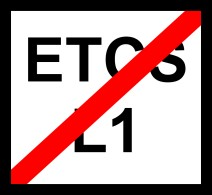{width="1.0611111111111111in"
> height="0.9798611111111111in"}

a)  wskaźnik W ETCS 6 stosuje się w celu poinformowania maszynisty
    pociągu wyposażonego w urządzenia pokładowe systemu ERTMS/ETCS o
    wyjeździe z obszaru wyposażonego w system

> ERTMS/ETCS poziomu 1,

b)  wskaźnik W ETCS 6 ustawia się na stacji lub szlaku -- w miejscu
    stanowiącym granicę wyjazdu z obszaru wyposażonego w system
    ERTMS/ETCS poziomu 1,

c)  wskaźnika W ETCS 6 nie stosuje się: na granicy pomiędzy obszarem
    wyposażonym w system ERTMS/ETCS poziomu 1 a obszarem wyposażonym w
    system ERTMS/ETCS poziomu 1 LS; na granicy pomiędzy obszarem
    wyposażonym w system ERTMS/ETCS poziomu 1 a obszarem wyposażonym w
    system ERTMS/ETCS poziomu 2,

d)  jeżeli na szlaku nie można ustawić wskaźnika W ETCS 6 z zachowaniem
    skrajni, stosuje się tablicę o zmniejszonych wymiarach i umieszcza
    ją nisko,

e)  w granicach stacji zaleca się stosować tablicę o zmniejszonych
    wymiarach i umieszczać ją nisko;

<!-- -->

7)  **wskaźnik W ETCS 7 „Zapowiedź wjazdu w obszar ERTMS/ETCS poziomu
    2"** oznacza miejsce zapowiedzi zmiany poziomu systemu ERTMS/ETCS na
    poziom 2. Żółta kwadratowa tablica z czarnym obramowaniem i czarnym
    oznaczeniem literowo-cyfrowym „ETCS L2"

> (oznaczenie „ETCS" umieszczone nad oznaczeniem „L2"):
>
> {width="1.0611111111111111in" height="1.0in"}

a)  wskaźnik W ETCS 7 stosuje się w celu poinformowania maszynisty
    pociągu wyposażonego w urządzenia pokładowe systemu ERTMS/ETCS o
    zbliżaniu się do obszaru wyposażonego w system

> ERTMS/ETCS poziomu 2,

b)  wskaźnik W ETCS 7 ustawia się na stacji lub szlaku -- w miejscu
    stanowiącym zapowiedź wjazdu do obszaru wyposażonego w system
    ERTMS/ETCS poziomu 2,

c)  wskaźnika W ETCS 7 nie stosuje się wewnątrz obszaru wyposażonego w
    system ERTMS/ETCS poziomu 2,

d)  jeżeli na szlaku nie można ustawić wskaźnika W ETCS 7 z zachowaniem
    skrajni, stosuje się tablicę o zmniejszonych wymiarach i umieszcza
    ją nisko,

e)  w granicach stacji zaleca się stosować tablicę o zmniejszonych
    wymiarach i umieszczać ją nisko;

<!-- -->

8)  **wskaźnik W ETCS 8 „Wjazd w obszar ERTMS/ETCS poziomu 2"** oznacza
    miejsce zmiany poziomu systemu ERTMS/ETCS na poziom 2.

> Biała kwadratowa tablica z czarnym obramowaniem i czarnym oznaczeniem
> literowo-cyfrowym „ETCS L2"
>
> (oznaczenie „ETCS" umieszczone nad oznaczeniem „L2"):
>
> {width="1.0611111111111111in" height="1.0in"}

a)  wskaźnik W ETCS 8 stosuje się w celu poinformowania maszynisty
    pociągu wyposażonego w urządzenia pokładowe systemu ERTMS/ETCS o
    wjeździe do obszaru wyposażonego w system

> ERTMS/ETCS poziomu 2,

b)  wskaźnik W ETCS 8 ustawia się w następujący sposób:

> − na stacji lub szlaku -- w miejscu stanowiącym granicę wjazdu do
> obszaru wyposażonego w system ERTMS/ETCS poziomu 2 lub
>
> − obok każdej grupy balis, która wysyła polecenie zmiany poziomu
> systemu ERTMS/ETCS na poziom 2,

c)  jeżeli na szlaku nie można ustawić wskaźnika W ETCS 8 z zachowaniem
    skrajni, stosuje się tablicę o zmniejszonych wymiarach i umieszcza
    ją nisko,

d)  w granicach stacji zaleca się stosować tablicę o zmniejszonych
    wymiarach i umieszczać ją nisko;

<!-- -->

9)  **wskaźnik W ETCS 9 „Wyjazd z obszaru ERTMS/ETCS poziomu 2"**
    oznacza miejsce wyjazdu z obszaru wyposażonego w system ERTMS/ETCS
    poziomu 2. Biała kwadratowa tablica z czarnym obramowaniem i czarnym
    oznaczeniem literowo-cyfrowym „ETCS L2" (oznaczenie „ETCS"
    umieszczone nad oznaczeniem „L2") przekreślona czerwonym pasem
    wznoszącym się ukośnie od lewego dolnego wierzchołka do prawego
    górnego wierzchołka:

> 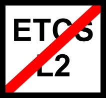{width="1.0611111111111111in"
> height="0.9798611111111111in"}

a)  wskaźnik W ETCS 9 stosuje się w celu poinformowania maszynisty
    pociągu wyposażonego w urządzenia pokładowe systemu ERTMS/ETCS o
    wyjeździe z obszaru wyposażonego w system

> ERTMS/ETCS poziomu 2,

b)  wskaźnik W ETCS 9 ustawia się na stacji lub szlaku -- w miejscu
    stanowiącym granicę wyjazdu z obszaru wyposażonego w system
    ERTMS/ETCS poziomu 2,

c)  wskaźnika W ETCS 9 nie stosuje się: na granicy pomiędzy obszarem
    wyposażonym w system ERTMS/ETCS poziomu 2 a obszarem wyposażonym w
    system ERTMS/ETCS poziomu 1 LS, na granicy pomiędzy obszarem
    wyposażonym w system ERTMS/ETCS poziomu 2 a obszarem wyposażonym w
    system ERTMS/ETCS poziomu 1,

d)  jeżeli na szlaku nie można ustawić wskaźnika W ETCS 9 z zachowaniem
    skrajni, stosuje się tablicę o zmniejszonych wymiarach i umieszcza
    ją nisko,

e)  w granicach stacji zaleca się stosować tablicę o zmniejszonych
    wymiarach i umieszczać ją nisko;

<!-- -->

10) **wskaźnik W ETCS 10 „Wskaźnik zatrzymania ETCS"** oznacza miejsce
    końca odstępu, odstępu ETCS lub odcinka kontroli niezajętości, jako
    potencjalnego końca zezwolenia na jazdę (MA) podawanego przez
    urządzenia systemu ERTMS/ETCS oraz miejsce zatrzymania dla pociągu
    prowadzonego w trybie Jazdy na Widoczność (OS) lub w trybie
    Odpowiedzialności Personelu (SR).

> Niebieski kwadrat z żółtą strzałą z białym obramowaniem, zwróconą
> ostrzem w stronę toru, do którego się odnosi;
>
> {width="1.2652777777777777in"
> height="3.8368055555555554in"}

a)  wskaźnik W ETCS 10 stosuje się:

  -----------------------------------------------------------------------
  −    na końcu odstępu, odstępu ETCS lub odcinka kontroli niezajętości,
       stanowiącego potencjalny koniec zezwolenia na jazdę, gdy kolejny
       odstęp ETCS lub odcinek kontroli niezajętości nie jest osłonięty
       semaforem i gdy nie zastosowano w tym miejscu wskaźnika W ETCS 11,
  ---- ------------------------------------------------------------------
  −    na maszcie tych semaforów świetlnych

  -----------------------------------------------------------------------

> obsługiwanych, które są technicznie przystosowane do nadawania sygnału
> SE „Jazda zgodnie ze wskazaniami ERTMS/ETCS\",

b)  minięcie wskaźnika W ETCS 10 jest dozwolone na podstawie:

  -----------------------------------------------------------------------
  −    zezwolenia na jazdę (MA) podawanego przez urządzenia systemu
       ERTMS/ETCS -- dla pociągów prowadzonych pod pełnym nadzorem tego
       systemu,
  ---- ------------------------------------------------------------------
  −    wskazania semafora -- dla pozostałych pojazdów, o ile dany
       wskaźnik W ETCS 10 umieszczono na maszcie semafora,

  −    rozkazu pisemnego,
  -----------------------------------------------------------------------

c)  wskaźnik W ETCS 10 nieznajdujący się na maszcie semafora należy
    uzupełnić tabliczką z oznaczeniem jednoznacznie identyfikującym
    wskaźnik W ETCS 10:

  -----------------------------------------------------------------------
  −    *wskaźnik W ETCS 10 zlokalizowany na posterunku ruchu oznacza się
       kolejnymi wielkimi literami alfabetu zgodnie z kierunkiem
       kilometrowania linii od strony lewej do prawej patrząc w kierunku
       sygnalizowanej jazdy. Oznaczenie literowe może być uzupełnione
       numerem toru przy którym stoi dany wskaźnik*,
  ---- ------------------------------------------------------------------
  −    *wskaźnik W ETCS 10 zlokalizowany na szlaku*

  -----------------------------------------------------------------------

> *oznacza się liczbą odpowiadającą kilometrowi i hektometrowi linii
> kolejowej, w którym wskaźnik jest umieszczony. Wskaźniki dla jazd w
> kierunku przeciwnym do zasadniczego również należy oznaczać zgodnie z
> powyższą zasadą, dodatkowo uzupełniając numery przez dodanie na końcu*
>
> *litery \"N\". Dodatkowo na szlakach wielotorowych, dla powiązania
> wskaźników z linią, do której się odnoszą, w oznaczeniu jak wyżej
> należy dopisać oznacznik literowy wyróżniający daną linię, np. dla
> torów podmiejskich 222P, 222PN, a dla torów dalekobieżnych 222D,
> 222DN*;
>
> 11\) **wskaźnik W ETCS 11 „Wskaźnik lokalizacji ETCS"** oznacza
> miejsce końca odstępu, odstępu ETCS lub odcinka kontroli niezajętości,
> jako potencjalnego końca zezwolenia na jazdę (MA) podawanego przez
> urządzenia systemu ERTMS/ETCS.
>
> Biały kwadrat z czarnym obramowaniem z czarną strzałką zwróconą
> ostrzem w stronę toru, do którego się odnosi;
>
> 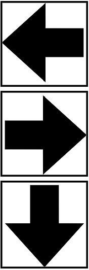{width="1.2597222222222222in"
> height="3.835277777777778in"}

a)  wskaźnik W ETCS 11 stosuje się:

  -----------------------------------------------------------------------
  −    na końcu odstępu, odstępu ETCS lub odcinka kontroli niezajętości,
       stanowiącego potencjalny koniec zezwolenia na jazdę, gdy kolejny
       odstęp ETCS lub odcinek kontroli niezajętości nie jest osłonięty
       semaforem i gdy nie zastosowano w tym miejscu wskaźnika W ETCS 10,
  ---- ------------------------------------------------------------------
  −    na maszcie tych samoczynnych semaforów

  -----------------------------------------------------------------------

> odstępowych blokady, które są technicznie przystosowane do nadawania
> sygnału SE „Jazda zgodnie ze wskazaniami ERTMS/ETCS",

b)  zatrzymanie się pociągu przed wskaźnikiem W ETCS 11 jest wymagane
    wyłącznie, gdy:

> − obowiązujące zezwolenie na jazdę (MA) kończy się w miejscu
> ustawienia tego wskaźnika dla pociągów prowadzonych pod nadzorem
> systemu
>
> ERTMS/ETCS, albo
>
> − wynika to z otrzymanego rozkazu pisemnego, albo
>
> − wynika to ze wskazania semafora, na którym jest umieszczony ten
> wskaźnik,

c)  wskaźnik W ETCS 11 nieznajdujący się na maszcie semafora należy
    uzupełnić tabliczką z oznaczeniem jednoznacznie identyfikującym
    wskaźnik W ETCS 11:

> − *wskaźnik W ETCS 11 zlokalizowany na posterunku ruchu oznacza się
> wielkimi literami alfabetu zgodnie z kierunkiem kilometrowania linii
> od strony lewej do prawej patrząc w kierunku sygnalizowanej jazdy.
> Oznaczenie literowe może być uzupełnione numerem toru przy którym stoi
> dany wskaźnik*,
>
> − *wskaźnik W ETCS 11 zlokalizowany na szlaku oznacza się liczbą
> odpowiadającą kilometrowi i hektometrowi linii kolejowej, w którym
> wskaźnik jest umieszczony. Wskaźniki dla jazd w kierunku przeciwnym do
> zasadniczego również należy oznaczać zgodnie z powyższą zasadą,
> dodatkowo uzupełniając numery przez dodanie na końcu litery \"N\".
> Dodatkowo na szlakach wielotorowych, dla powiązania wskaźników z
> linią, do której się odnoszą, w oznaczeniu jak wyżej należy dopisać
> oznacznik literowy wyróżniający daną linię, np. dla torów podmiejskich
> „222P", „222PN", a dla torów dalekobieżnych „222D", „222DN"*.

## § 18. Sygnały i wskaźniki stosowane wyłącznie na wyznaczonych liniach kolejowych i stacjach 

1\. Sygnały i wskaźniki stosowane wyłącznie na wyznaczonych liniach
kolejowych i stacjach:

> 1\) **sygnał S 1a „Stój -- absolutny zakaz wjazdu do tunelu"**
> Czerwone migające światło wyświetlone jednocześnie z sygnałem S 1
> „Stój" na semaforze odstępowym samoczynnym:

a)  sygnał ten oznacza absolutny zakaz przejazdu obok semafora
    odstępowego samoczynnego wskazującego sygnał S 1 „Stój", ustawionego
    przed wjazdem do tunelu,

b)  pociąg zatrzymany przed sygnałem S 1a może jechać dalej, gdy sygnał
    ten zostanie wyłączony oraz dodatkowo drużyna pociągowa otrzyma
    zezwolenie na wjazd do tunelu przekazane za pomocą urządzeń
    łączności przez właściwego dyżurnego ruchu lub ustnie przez
    upoważnionego pracownika,

c)  sygnał S 1a może być stosowany przed wjazdem do tunelu;

<!-- -->

2)  **wskaźnik W 21wg** oznacza, że należy przejeżdżać z określoną
    prędkością przez automatyczną wagę.

> Matowobiała liczba na ciemnym tle, oznaczająca prędkość
>
> (w dziesiątkach km/h) wjazdu na automatyczną wagę;

a)  liczba na wskaźniku W 21wg wyświetla się jednocześnie z sygnałem
    zezwalającym tylko wówczas, gdy jest nastawiony przebieg wjazdowy na
    tor, na którym jest zainstalowana automatyczna waga; w odległości 40
    m przed wagą, z obu jej stron, ustawia się wskaźniki W 9 bez
    poprzedzania ich wskaźnikami

> W 8,

b)  wskaźnik W 21wg jest stosowany na stacjach PKP Hrubieszów Towarowy i
    Dorohusk;

<!-- -->

3)  **sygnał Pc 5-LHS „Oznaczenie końca pociągu"**

> **Dzienny i nocny**
>
> Jedna tarcza po prawej stronie tylnej ściany ostatniego wagonu w
> składzie pociągu; tarcze są prostokątne i podzielone na cztery
> trójkąty, z których górny i dolny są czerwone, oba zaś boczne --
> białe; powierzchnia tarczy powinna być wykonana z materiałów
> odblaskowych.
>
> *Sygnał Pc 5-LHS stosuje się wyłącznie na liniach kolejowych
> zarządzanych przez PKP Linia Hutnicza Szerokotorowa sp. z o.o.*

## § 19. Sygnały na semaforach świetlnych, tarczach ostrzegawczych i sygnalizatorach powtarzających oraz wskaźniki, stosowane do odwołania 

1.  Na semaforach świetlnych można do odwołania stosować następujące
    sygnały:

> 1\) **sygnał „Wolna droga** 2) **sygnał „Wolna droga. ze zmniejszoną
> Następny semafor**
>
> **prędkością"** lub **„Wolna wskazuje sygnał droga ze zmniejszoną
> zezwalający na jazdę prędkością. Następny ze zmniejszoną semafor
> nadaje sygnał prędkością" zezwalający na jazdę"**
>
> Dwa zielone światła Światło zielone, a nad nim na semaforze w jednym
> światło pomarańczowe pionie zwrócone na semaforze w pionie, do
> pociągu; zwrócone do pociągu.

2.  Na tarczy ostrzegawczej można do odwołania stosować następujący
    sygnał:

> **sygnał „Semafor wskazuje sygnał „Wjazd ze zmniejszoną prędkością.
> Następny semafor wskazuje Stój""** lub **sygnał „Wolna droga ze
> zmniejszoną prędkością. Następny semafor wskazuje sygnał zezwalający
> na jazdę"**.
>
> Pomarańczowe i zielone światło w pionie zwrócone do pociągu.

3.  Na sygnalizatorze powtarzającym można do odwołania stosować
    następujący sygnał:

> **sygnał „Semafor wskazuje sygnał zezwalający na jazdę ze zmniejszoną
> prędkością"**.
>
> Jedno światło pomarańczowe, jedno białe i jedno zielone w pionie,
> zwrócone do pociągu.

4.  Informacje dotyczące sygnałów, o których mowa w ust. 1-3, powinny
    być zawarte w dodatku do wewnętrznego rozkładu jazdy pociągów.

## § 20. *Wskaźniki przekazujące informacje związane z bezpieczeństwem pracowników* 

1.  *Wskaźniki przekazujące informacje związane z bezpieczeństwem
    pracowników przeznaczone są dla pracowników wykonujących prace
    torowe. Wskaźniki te nie przekazują informacji związanych z
    prowadzeniem ruchu kolejowego.*

2.  *Stosuje się następujące wskaźniki przekazujące informacje związane
    z bezpieczeństwem pracowników:*

> 1\) ***wskaźnik oznaczający kierunek zejścia z toru*** *Trójkątna
> czerwona tablica -- trójkąt równoramienny z białym obramowaniem,
> mocowany od strony podstawy na biało-czerwonym słupku, zwrócony
> wierzchołkiem w lewą lub prawą stronę, zgodnie z wyznaczonym
> kierunkiem zejścia z toru.*
>
> 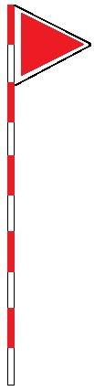{width="1.0729166666666667in"
> height="4.458333333333333in"}
>
> *Kierunek schodzenia pracowników z toru oznacza się na początku i
> końcu robót.*

# Załącznik Nr 1 Zestawienie obrazów sygnałowych semaforów świetlnych 

**Zestawienie obrazów sygnałowych semaforów świetlnych**

***Uwaga:** Zestawienie przedstawione w załączniku Nr 1 dotyczy
przypadku, gdy największa dozwolona prędkość dla pociągu na danym
odcinku linii, wskazana w służbowym rozkładzie jazdy, przekracza 100
km/h.*

> *\*) Jazda z największą dozwoloną prędkością.*
>
> *\*\*) Jazda z największą dozwoloną prędkością -- w przodzie są dwa
> odstępy blokowe wolne -- albo przy następnym semaforze z prędkością
> nieprzekraczającą 100 km/h.*
>
> *\*\*\*) Następny semafor wskazuje sygnał zezwalający na jazdę z
> prędkością zmniejszoną do 40 lub 60 km/h.*

*\*\*\*\*) Następny semafor wskazuje sygnał „Stój".*

**Zestawienie obrazów sygnałowych semaforów świetlnych**

> 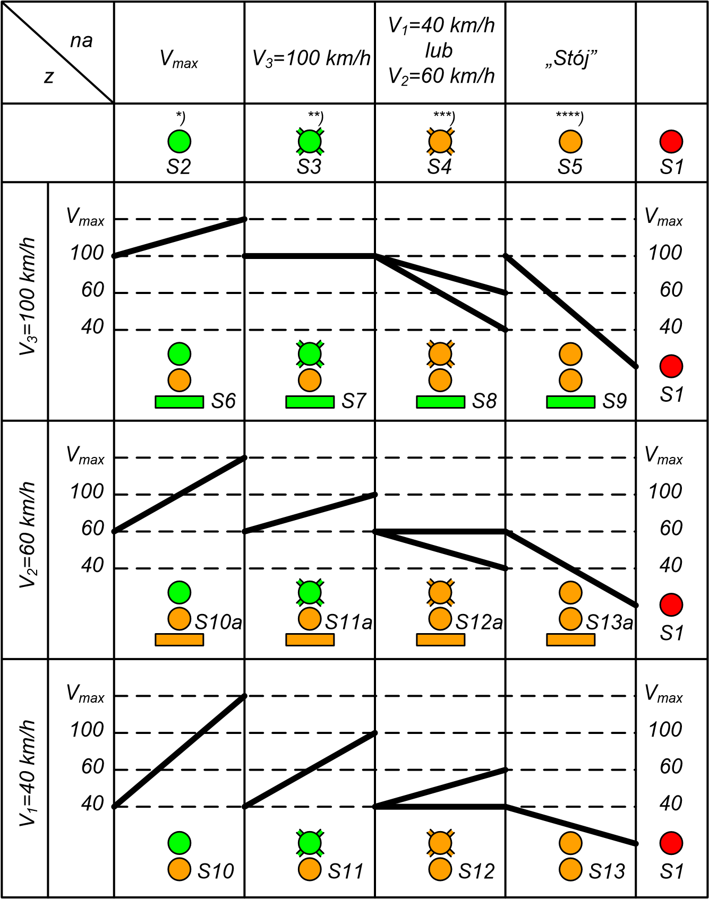{width="4.45in" height="5.6466666666666665in"}

# Załącznik Nr 2 Przykłady osygnalizowania odcinków torów 

**Przykłady osygnalizowania leżących blisko siebie odcinków torów, na
szlaku jednotorowym i dwutorowym, wymagających zmniejszenia prędkości
jazdy pociągów wskutek ograniczeń doraźnie wprowadzonych**

**oraz**

**przykłady osygnalizowania odcinków torów, na szlaku jednotorowym,
dwutorowym i wielotorowym (przy liczbie torów szlakowych większej niż
2), jak również przy równoległym zbliżeniu więcej niż dwóch torów
szlakowych różnych linii kolejowych, wymagających zmniejszenia prędkości
jazdy pociągów wskutek**

**ograniczeń stałych i doraźnie wprowadzonych**

**1. SZLAK JEDNOTOROWY**

1\) Dwa odcinki leżące jeden za drugim niedaleko od siebie, na których
prędkość jazdy powinna być ograniczona odpowiednio do 20 km/h i 30 km/h.

**Kierunek A - B**

> Sygnał D 6 dla ograniczenia prędkości jazdy do 30 km/h powinien być
> ustawiony w km 4,1, jednak aby nie wprowadzał w błąd maszynisty,
> został on ustawiony w km 4,3 w miejscu ustawienia wskaźnika W 14 dla
> odcinka z ograniczeniem prędkości do 20 km/h. Droga hamowania wynosi
> 500 m i jest wystarczająca, ponieważ prędkość będzie większa (30
> km/h).

**Kierunek B - A**

> Sygnał D 6 dla odcinka, na którym prędkość ograniczono do 20 km/h,
> powinien być ustawiony w km 5,2 (700), czyli 100 m za wskaźnikiem W 14
> dla początku odcinka o prędkości 30 km/h.
>
> Dla lepszej przejrzystości może on być ustawiony w km 5,3, obok
> wskaźnika W 14 dla pierwszego odcinka zwolnionej jazdy, tj. w
> odległości 800 m, co zostało przedstawione na rysunku 1.

2)  Jeżeli suma długości odcinka między dwoma ostrzeżeniami oraz odcinka
    z mniejszym ograniczeniem (większą prędkością) jest mniejsza od
    drogi hamowania, należy na obu odcinkach z ograniczeniem prędkości
    przyjąć większe ograniczenie

> (mniejszą prędkość), co zostało przedstawione na rysunku 2.

3)  Jeżeli wewnątrz dłuższego odcinka, na którym prędkość jest
    ograniczona do 30 km/h znajduje się odcinek, na którym

> należy ograniczyć prędkość do 20 km/h, należy postąpić w sposób
> wskazany na rysunku 3.

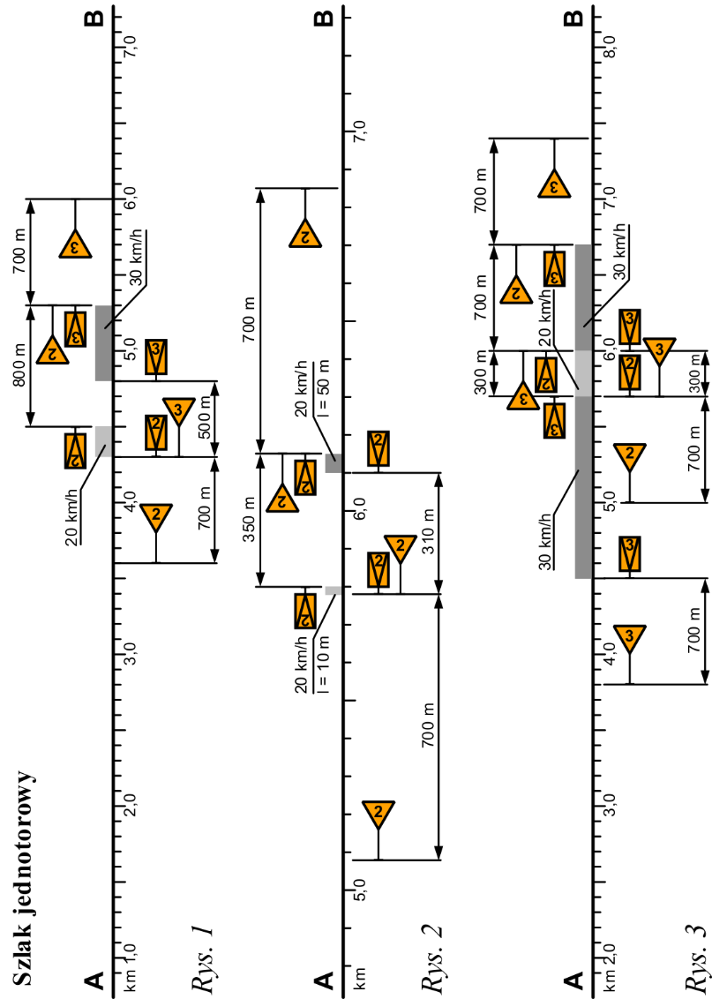{width="4.527083333333334in"
height="6.337916666666667in"}

**Kierunek A - B**

> Sygnał D 6 dla drugiej części długiego odcinka (od km 6,0 do km 6,7)
> dla prędkości ograniczonej do 30 km/h ustawiono obok wskaźnika W 14
> dla odcinka z ograniczoną prędkością do 20 km/h (początek) w km 5,7.
> Droga hamowania 300 m jest wystarczająca, ponieważ prędkość na
> następnym odcinku zwiększa się.

**Kierunek B - A**

> Sygnał D 6 dla odcinka prędkości 20 km/h należy ustawić w km 6,7,
> ponieważ prędkość jazdy powinna się zmniejszyć (z 30 km/h do 20 km/h).
>
> Sygnał D 6 dla drugiego odcinka, z ograniczeniem prędkości do 30 km/h,
> powinien być ustawiony w odległości 700 m od początku tego odcinka,
> tj. w km 6,4, a więc 400 m przed wskaźnikiem W 14 dla odcinka o
> prędkości jazdy 20 km/h; sygnał ten jednak został ustawiony obok
> wskaźnika W 14 w km 6,0. Odległość 300 m od początku odcinka, dla
> którego przewidziana jest prędkość 30 km/h, jest wystarczająca, gdyż
> następny odcinek będzie przejeżdżany z większą prędkością niż
> poprzedni.

**2. SZLAK DWUTOROWY**

1\) **Wewnątrz dłuższego odcinka, z ograniczeniem prędkości do 50 km/h,
leży krótszy odcinek, na którym ograniczenie prędkości wynosi 20 km/h**.

> a\) Droga hamowania jest wystarczająca, jeśli chodzi o ustawienie
> sygnału D 6.
>
> W celu uniknięcia zbytniego zgrupowania sygnałów i wskaźników
> zaniechano ustawienia wskaźnika W 14 dla końca pierwszego odcinka o
> prędkości ograniczonej do 50 km/h i dla końca odcinka o prędkości
> ograniczonej do 20 km/h. Sygnał D 6 dla drugiego odcinka o prędkości
> ograniczonej do 50 km/h leżącego za odcinkiem o prędkości ograniczonej
> do 20 km/h, ustawiono obok wskaźnika W 14 odnoszącego się do początku
> odcinka, na którym prędkość ma być ograniczona do 20 km/h, a
> mianowicie w km 5,2 zamiast w km 5,3. Takie ustawienie sygnału daje
> jaśniejszy i przejrzystszy obraz osygnalizowania, co zostało
> przedstawione na rysunku 4.
>
> b\) Droga hamowania dla drugiego i trzeciego sygnału D 6 jest
> niewystarczająca.
>
> Gdyby ustawiono sygnał D 6 dla pierwszego odcinka z ograniczeniem
> prędkości do 50 km/h w km 4,1, a wskaźnik W 14 na początku tego
> odcinka w km 4,8, wówczas sygnał D 6 dla odcinka z ograniczeniem
> prędkości do 20 km/h należałoby ustawić w km 4,5, a więc 300 m przed
> wskaźnikiem W 14 ustawionym dla pierwszego odcinka z ograniczeniem
> prędkości do 50 km/h.
>
> Takie ustawienie mogłoby wprowadzić w błąd maszynistę. Wobec tego
> sygnał D 6 dla odcinka z ograniczeniem prędkości do 20 km/h powinien
> być ustawiony w odległości 700 m, ponieważ prędkość będzie zmniejszona
> i dlatego ustawiono go w km 4,5 -- bezpośrednio obok wskaźnika W 14
> dla pierwszego odcinka z ograniczeniem prędkości do 50 km/h. Dla
> drugiego odcinka z ograniczeniem prędkości do 50 km/h leżącego za
> odcinkiem, po którym wolno jechać z prędkością 20 km/h, wystarcza
> droga hamowania 300 m, ponieważ prędkość na nim wzrasta. Sygnał D 6
> dla tego odcinka został ustawiony obok wskaźnika W 14 dla odcinka z
> ograniczeniem prędkości do 20 km/h.
>
> Zaniechano ustawienia wskaźnika W 14 dla końca pierwszego i drugiego
> odcinka o ograniczonej prędkości, co zostało przedstawione na rysunku
> 5.

2)  **Bardzo krótkie następujące po sobie odcinki wymagające
    zmniejszenia prędkości odpowiednio do 20 km/h, a następnie do 50
    km/h, gdy dozwolona prędkość jazdy wynosi 100 km/h**.

> Dla pierwszego sygnału D 6 droga hamowania 700 m jest wystarczająca
> dla zmniejszenia prędkości na moście do 20 km/h. Dla drugiego sygnału
> D 6 droga hamowania wynosi tylko 110 m, jest to jednak wystarczające,
> gdyż należy zwiększyć prędkość do 50 km/h. Z tego również względu
> zbędne jest ustawienie wskaźnika W 14 dla końca odcinka, po którym
> można przejechać z prędkością 20 km/h, natomiast koniec odcinka, po
> którym można jechać z prędkością 50 km/h, jest osygnalizowany
> wskaźnikiem W 14, gdyż od miejsca ustawienia tego wskaźnika można
> jechać dalej z maksymalną dozwoloną prędkością (100 km/h) -- rysunek
> 6.

3)  W przypadkach podobnych, a nie podanych, należy wzorować się na
    opisanych przykładach.

4)  We wszystkich omawianych przykładach chodzi o ostrzeżenia niestałe,
    a więc takie, które wymagają powiadomienia drużyn pociągowych
    rozkazem pisemnym „O".

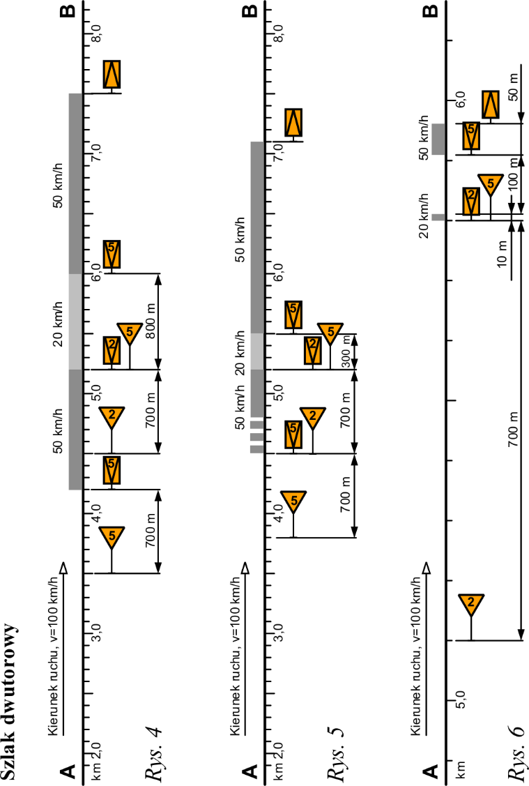{width="4.527083333333334in"
height="6.722777777777778in"}

**3. PRZYKŁADY SPOSOBU USTAWIANIA**

> **WSKAŹNIKÓW W8 I W9**

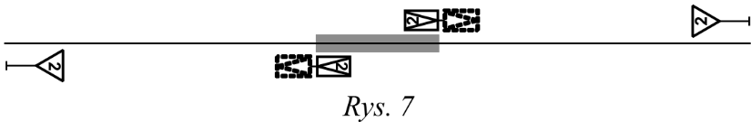{width="3.754861111111111in" height="0.6125in"}

1)  Rysunek 7 przedstawia ustawienie wskaźników na szlaku jednotorowym.
    Linią przerywaną oznaczono odwrotną stronę wskaźnika W 9,
    sygnalizującą koniec odcinka, przez który należy jechać ze
    zmniejszoną prędkością. Obraz tego wskaźnika jest ważny dla
    maszynisty, aczkolwiek wskaźnik jest ustawiony z lewej strony toru,
    patrząc w kierunku jazdy.

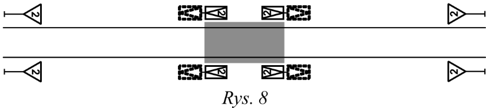{width="3.754861111111111in"
height="0.8368055555555556in"}

2)  Rysunek 8 przedstawia ustawienie wskaźników na szlaku dwutorowym
    przy ograniczeniu prędkości na dwóch torach. Wskaźniki W 8 i W 9
    ustawia się tak samo przy równoległym zbliżeniu torów szlakowych
    dwóch linii jednotorowych. Obrazy wskaźników W 8 i W 9 są ważne dla
    maszynisty, aczkolwiek niektóre ze wskaźników są ustawione z lewej
    strony toru, patrząc w kierunku jazdy.

{width="3.754861111111111in"
height="0.6527777777777778in"}

3)  Rysunek 9 przedstawia ustawienie wskaźników na szlaku dwutorowym
    przy ograniczeniu prędkości na jednym torze. Obrazy wskaźników W 8 i
    W 9 są ważne dla maszynisty, aczkolwiek niektóre ze wskaźników są
    ustawione z lewej strony toru, patrząc w kierunku jazdy.

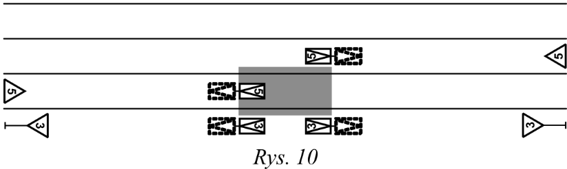{width="3.754861111111111in"
height="1.1222222222222222in"}

4)  Rysunek 10 przedstawia szlak wielotorowy lub równoległe zbliżenie
    torów szlakowych różnych linii kolejowych, składające się z dwóch
    szlaków dwutorowych, przy czym ograniczenie prędkości obowiązuje na
    dwóch torach jednego szlaku dwutorowego. Na międzytorzu, o ile
    zachodzi potrzeba, należy umieścić wskaźnik W 8 nisko z prawej
    strony toru -- patrząc w kierunku jazdy -- zwrócony podstawą
    trójkąta do dołu, a ponadto wskaźnik W 9 typowy lub o zmniejszonych
    wymiarach. Obrazy wskaźników W 8 i W 9 są ważne dla maszynisty,
    aczkolwiek niektóre ze wskaźników są ustawione z lewej strony toru,
    patrząc w kierunku jazdy.

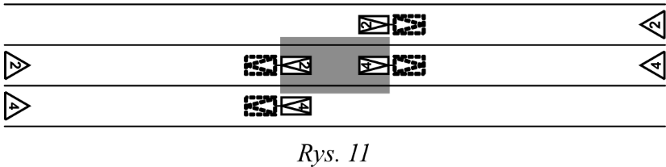{width="3.754861111111111in"
height="0.9388888888888889in"}

5)  Rysunek 11 przedstawia szlak wielotorowy lub równoległe zbliżenie
    torów szlakowych różnych linii kolejowych, składające się z dwóch
    szlaków dwutorowych, przy czym ograniczenie prędkości obowiązuje na
    dwóch torach nieskrajnych. Dla międzytorzy, z uwagi na warunki
    skrajni, obowiązują zasady podane w opisie do rysunku 10. Wskaźniki
    W 8 i, jeżeli zachodzi potrzeba ustawienia -- również wskaźniki W 9
    na początku odcinka dla jazdy po torze nieskrajnym, ustawia się z
    prawej strony toru, patrząc w kierunku jazdy, aby nie wprowadzać w
    błąd drużyny pociągu jadącego po sąsiednim torze. Linią przerywaną
    oznaczono odwrotną stronę wskaźników W 9 sygnalizujących koniec
    odcinka. Obrazy wskaźników W 9 są ważne dla maszynisty, aczkolwiek
    wskaźniki są ustawione z lewej strony toru, patrząc w kierunku
    jazdy.

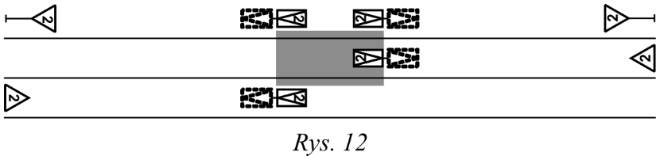{width="3.754861111111111in"
height="0.8979166666666667in"}

6)  Rysunek 12 przedstawia szlak wielotorowy lub równoległe zbliżenie
    torów szlakowych różnych linii kolejowych, składające się ze szlaku
    dwutorowego i jednotorowego, przy czym ograniczenie prędkości
    obowiązuje na dwóch torach szlaku dwutorowego, bądź też na szlaku
    jednotorowym i jednym torze szlaku dwutorowego. Dla międzytorzy, z
    uwagi na warunki skrajni, obowiązują zasady podane w opisie do
    rysunku 10. Przy torze skrajni wskaźniki W 8 i W 9 ustawia się
    według zasad podanych w opisie do rysunku 9.

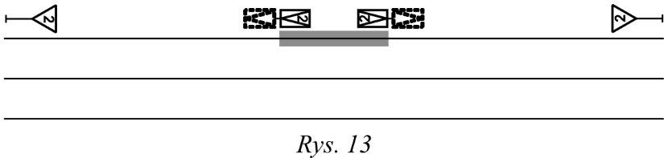{width="3.754861111111111in"
height="0.8979166666666667in"}

7)  Rysunek 13 przedstawia szlak wielotorowy lub równoległe zbliżenie
    torów szlakowych różnych linii kolejowych, składające się ze szlaku
    dwutorowego i jednotorowego, przy czym ograniczenie prędkości
    obowiązuje na torze skrajnym. Przy osygnalizowaniu odcinka, przez
    który należy jechać ze zmniejszoną prędkością, w torze skrajnym
    obowiązują zasady podane w opisie do rysunku 9.

{width="3.754861111111111in"
height="0.7145833333333333in"}

8)  Rysunek 14 przedstawia szlak wielotorowy lub równoległe zbliżenie
    torów szlakowych różnych linii kolejowych, składające się ze szlaku
    dwutorowego i jednotorowego, przy czym ograniczenie prędkości
    obowiązuje na torze nieskrajnym. Przy osygnalizowaniu odcinka, przez
    który należy jechać ze zmniejszoną prędkością, w torze nieskrajnym
    obowiązują zasady podane w opisie do rysunku 10.

{width="3.754861111111111in"
height="0.46944444444444444in"}

9)  Ponadto, jak na rysunku 15, dopuszcza się osygnalizowanie podanym
    sposobem odcinka toru szlaku jednotorowego, w jednym torze szlaku
    dwutorowego oraz w torze szlaku wielotorowego lub torze szlakowym
    przy równoległym zbliżeniu różnych linii kolejowych. Powyższe można
    stosować przy stałych ograniczeniach prędkości tylko dla jednego
    kierunku jazdy, np. na dużym spadku.

**4. PRZYKŁADY SPOSOBU USTAWIANIA TARCZ „ZWOLNIĆ BIEG" (SYGNAŁÓW D 6) I
WSKAŹNIKÓW W 14**

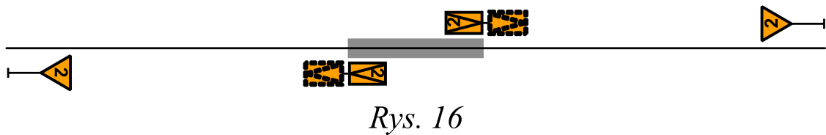{width="3.754861111111111in" height="0.6125in"}

1)  Rysunek 16 przedstawia ustawienie tarcz „Zwolnić bieg" i wskaźników
    W 14 na szlaku jednotorowym; linią przerywaną oznaczono odwrotną
    stronę wskaźnika W 14, sygnalizującą koniec odcinka, przez który
    należy jechać ze zmniejszoną prędkością. Obraz tego wskaźnika jest
    ważny dla maszynisty, aczkolwiek wskaźnik jest ustawiony z lewej
    strony toru, patrząc w kierunku jazdy.

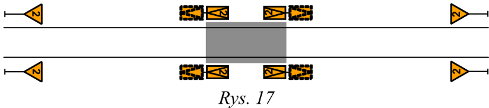{width="3.754861111111111in"
height="0.8368055555555556in"}

2)  Rysunek 17 przedstawia ustawienie tarcz „Zwolnić bieg" i wskaźników
    W 14 na szlaku dwutorowym przy ograniczeniu prędkości na dwóch
    torach. Tarcze „Zwolnić bieg" i wskaźniki W 14 ustawia się tak samo
    przy równoległym zbliżeniu torów szlakowych dwóch linii
    jednotorowych; obrazy tarcz i wskaźników są ważne dla maszynisty,
    aczkolwiek niektóre z tarcz „Zwolnić bieg" i wskaźników W 14 są
    ustawione z lewej strony toru, patrząc w kierunku jazdy.

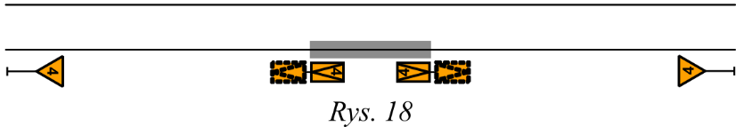{width="3.754861111111111in"
height="0.6527777777777778in"}

3)  Rysunek 18 przedstawia ustawienie tarcz „Zwolnić bieg" i wskaźników
    W 14 na szlaku dwutorowym przy ograniczeniu prędkości na jednym
    torze. Obrazy tarcz i wskaźników są ważne dla maszynisty, aczkolwiek
    niektóre z tarcz „Zwolnić bieg" i wskaźników W 14 są ustawione z
    lewej strony toru, patrząc w kierunku jazdy.

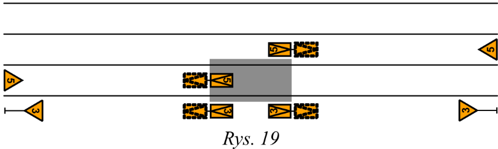{width="3.754861111111111in"
height="1.1222222222222222in"}

4)  Rysunek 19 przedstawia szlak wielotorowy lub równoległe zbliżenie
    torów szlakowych różnych linii kolejowych, składające się z dwóch
    szlaków dwutorowych, przy czym ograniczenie prędkości obowiązuje na
    dwóch torach jednego szlaku dwutorowego. Na międzytorzu, o ile
    zachodzi potrzeba, należy umieścić tarczę „Zwolnić bieg" nisko z
    prawej strony toru, patrząc w kierunku jazdy, zwróconą podstawą
    trójkąta do dołu, a ponadto wskaźnik W 14 typowy lub o zmniejszonych
    wymiarach obrazy tarcz i wskaźników są ważne dla maszynisty,
    aczkolwiek niektóre z tarcz „Zwolnić bieg" i wskaźników W 14 są
    ustawione z lewej strony toru, patrząc w kierunku jazdy.

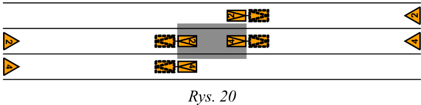{width="3.754861111111111in"
height="0.9388888888888889in"}

5)  Rysunek 20 przedstawia szlak wielotorowy lub równoległe zbliżenie
    torów szlakowych różnych linii kolejowych, składające się z dwóch
    szlaków dwutorowych, przy czym ograniczenie prędkości obowiązuje na
    dwóch torach nieskrajnych. Dla międzytorzy, z uwagi na warunki
    skrajni, obowiązują zasady podane w opisie do rysunku 19. Tarcze
    „Zwolnić bieg" oraz wskaźniki W 14 na początku odcinka dla jazdy po
    torze nieskrajnym ustawia się z prawej strony toru, patrząc w
    kierunku jazdy, aby nie wprowadzać w błąd drużyny pociągu jadącego
    po sąsiednim torze. Linią przerywaną oznaczono odwrotną stronę
    wskaźników W 14 sygnalizujących koniec odcinka; obrazy wskaźników W
    14 są ważne dla maszynisty, aczkolwiek wskaźniki są ustawione z
    lewej strony toru, patrząc w kierunku jazdy.

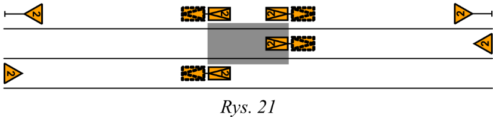{width="3.754861111111111in"
height="0.8979166666666667in"}

6)  Rysunek 21 przedstawia szlak wielotorowy lub równoległe zbliżenie
    torów szlakowych różnych linii kolejowych, składające się ze szlaku
    dwutorowego i jednotorowego, przy czym ograniczenie prędkości
    obowiązuje na dwóch torach szlaku dwutorowego, bądź też na szlaku
    jednotorowym i jednym torze szlaku dwutorowego. Dla międzytorzy, z
    uwagi na warunki skrajni, obowiązują zasady podane w opisie do
    rysunku 19. Przy torze skrajnym tarcze „Zwolnić bieg" i wskaźniki W
    14 ustawia się według zasad podanych w opisie do rysunku 18.

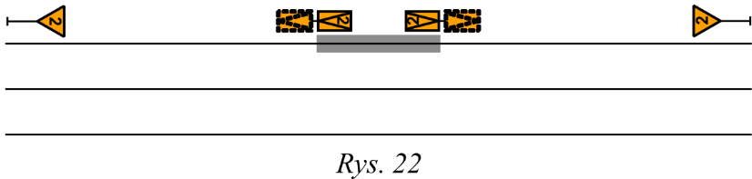{width="3.754861111111111in"
height="0.8979166666666667in"}

7)  Rysunek 22 przedstawia szlak wielotorowy lub równoległe zbliżenie
    torów szlakowych różnych linii kolejowych, składające się ze szlaku
    dwutorowego i jednotorowego, przy czym ograniczenie prędkości
    obowiązuje na torze skrajnym. Przy osygnalizowaniu odcinka, przez
    który należy jechać ze zmniejszoną prędkością, w torze skrajnym
    obowiązują zasady podane w opisie do rysunku 18.

{width="3.754861111111111in"
height="0.7145833333333333in"}

8)  Rysunek 23 przedstawia szlak wielotorowy lub równoległe zbliżenie
    torów szlakowych różnych linii kolejowych, składające się ze szlaku
    dwutorowego i jednotorowego, przy czym ograniczenie prędkości
    obowiązuje na torze nieskrajnym. Przy osygnalizowaniu odcinka, przez
    który należy jechać

> ze zmniejszoną prędkością, w torze nieskrajnym obowiązują zasady
> podane w opisie do rysunku 19.

# Załącznik Nr 3 Wykaz sygnałów i wskaźników odnoszących się do jazdy pociągu z wykorzystaniem systemu ERTMS/ETCS, które należy objąć tym systemem 

**Wykaz sygnałów i wskaźników odnoszących się do jazdy pociągu z
wykorzystaniem systemu ERTMS/ETCS, które należy objąć tym systemem**

1.  **Zestawienie sygnałów odnoszących się do jazdy pociągu z
    wykorzystaniem systemu ERTMS/ETCS, które należy objąć tym
    systemem.**

+-------+--------------------------------------------------------------+
| > Lp. | Sygnał                                                       |
+=======+==============================================================+
| > 1   | Sr 1 „Stój"                                                  |
+-------+--------------------------------------------------------------+
| > 2   | Sr 2 „Wolna droga"                                           |
+-------+--------------------------------------------------------------+
| > 3   | Sr 3 „Wolna droga ze zmniejszoną prędkością"                 |
+-------+--------------------------------------------------------------+
| > 4   | S 1 „Stój"                                                   |
+-------+--------------------------------------------------------------+
| > 5   | S 2 „Jazda z największą dozwoloną prędkością"                |
+-------+--------------------------------------------------------------+
| > 6   | S 3 „Jazda z największą dozwoloną prędkością -- w przodzie   |
|       | są dwa odstępy blokowe wolne -- albo przy następnym          |
|       | semaforze z prędkością nie większą niż 100 km/h"             |
+-------+--------------------------------------------------------------+
| > 7   | S 4 „Następny semafor wskazuje sygnał zezwalający na jazdę z |
|       | prędkością zmniejszoną do 40 lub 60 km/h"                    |
+-------+--------------------------------------------------------------+
| > 8   | S 5 „Następny semafor wskazuje sygnał Stój"                  |
+-------+--------------------------------------------------------------+
| > 9   | S 6 „Jazda z prędkością nieprzekraczającą 100 km/h, a potem  |
|       | z największą dozwoloną prędkością"                           |
+-------+--------------------------------------------------------------+
| > 10  | S 7 „Jazda z prędkością nieprzekraczającą 100 km/h przy tym  |
|       | i następnym semaforze"                                       |
+-------+--------------------------------------------------------------+
| > 11  | S 8 „Jazda z prędkością nieprzekraczającą 100 km/h, a przy   |
|       | następnym semaforze z prędkością zmniejszoną do 40 lub 60    |
|       | km/h"                                                        |
+-------+--------------------------------------------------------------+
| > 12  | S 9 „Jazda z prędkością nieprzekraczającą 100 km/h, a przy   |
|       | następnym semaforze -- Stój"                                 |
+-------+--------------------------------------------------------------+

+-------+--------------------------------------------------------------+
| > Lp. | Sygnał                                                       |
+=======+==============================================================+
| > 13  | S 10 „Jazda z prędkością nieprzekraczającą 40 km/h, a potem  |
|       | z największą dozwoloną prędkością"                           |
+-------+--------------------------------------------------------------+
| > 14  | S 10a „Jazda z prędkością nieprzekraczającą 60 km/h, a potem |
|       | z największą dozwoloną prędkością"                           |
+-------+--------------------------------------------------------------+
| > 15  | S 11 „Jazda z prędkością nieprzekraczającą 40 km/h, a przy   |
|       | następnym semaforze -- z prędkością nieprzekraczającą 100    |
|       | km/h"                                                        |
+-------+--------------------------------------------------------------+
| > 16  | S 11a „Jazda z prędkością nieprzekraczającą 60 km/h, a przy  |
|       | następnym semaforze -- z prędkością nieprzekraczającą 100    |
|       | km/h"                                                        |
+-------+--------------------------------------------------------------+
| > 17  | S 12 „Jazda z prędkością nieprzekraczającą 40 km/h, a przy   |
|       | następnym semaforze -- z prędkością nieprzekraczającą 40 lub |
|       | 60 km/h"                                                     |
+-------+--------------------------------------------------------------+
| > 18  | S 12a „Jazda z prędkością nieprzekraczającą 60 km/h, a przy  |
|       | następnym semaforze -- z prędkością zmniejszoną do 40 lub 60 |
|       | km/h"                                                        |
+-------+--------------------------------------------------------------+
| > 19  | S 13 „Jazda z prędkością nieprzekraczającą 40 km/h, a przy   |
|       | następnym semaforze -- Stój"                                 |
+-------+--------------------------------------------------------------+
| > 20  | S 13a „Jazda z prędkością nieprzekraczającą 60 km/h, a przy  |
|       | następnym semaforze -- Stój"                                 |
+-------+--------------------------------------------------------------+
| > 21  | Sz „Można przejechać obok semafora wskazującego sygnał Sr 1  |
|       | lub S 1 „Stój" albo sygnał wątpliwy, albo też semafora       |
|       | świetlnego lub przejechać obok sygnalizatora sygnału         |
|       | zastępczego, mającego wyłącznie latarnię ze światłem białym  |
|       | -- bez rozkazu pisemnego"                                    |
+-------+--------------------------------------------------------------+

+-------+--------------------------------------------------------------+
| > Lp. | Sygnał                                                       |
+=======+==============================================================+
| > 22  | Od 1 „Semafor wskazuje sygnał Sr 1 Stój"                     |
+-------+--------------------------------------------------------------+
| > 23  | Od 2 „Semafor wskazuje sygnał Sr 2 lub Sr 3 zezwalający na   |
|       | jazdę"                                                       |
+-------+--------------------------------------------------------------+
| > 24  | Ot 1 „Semafor wskazuje sygnał Sr 1 -- Stój"                  |
+-------+--------------------------------------------------------------+
| > 25  | Ot 2 „Semafor wskazuje sygnał Sr 2 Wolna droga"              |
+-------+--------------------------------------------------------------+
| > 26  | Ot 3 Semafor wskazuje sygnał Sr 3 -- Wolna droga ze          |
|       | zmniejszoną prędkością"                                      |
+-------+--------------------------------------------------------------+
| > 27  | On „W odległości drogi hamowania znajduje się semafor"       |
+-------+--------------------------------------------------------------+
| > 28  | Os 1 „Semafor, do którego się tarcza odnosi wskazuje sygnał  |
|       | Stój"                                                        |
+-------+--------------------------------------------------------------+
| > 29  | Os 2 „Semafor, do którego się tarcza odnosi, wskazuje sygnał |
|       | zezwalający na jazdę z największą dozwoloną prędkością"      |
+-------+--------------------------------------------------------------+
| > 30  | Os 3 „Semafor, do którego się tarcza odnosi wskazuje sygnał  |
|       | zezwalający na jazdę z prędkością nieprzekraczającą 100      |
|       | km/h"                                                        |
+-------+--------------------------------------------------------------+
| > 31  | Os 4 „Semafor, do którego się tarcza odnosi, wskazuje sygnał |
|       | zezwalający na jazdę z prędkością zmniejszoną do 40 lub 60   |
|       | km/h"                                                        |
+-------+--------------------------------------------------------------+
| > 32  | Osp 1 „Urządzenia sygnalizacji na przejeździe, do którego    |
|       | się tarcza odnosi, są niesprawne, jazda przez przejazd z     |
|       | prędkością *do* 20 km/h"                                     |
+-------+--------------------------------------------------------------+
| > Lp. | Sygnał                                                       |
+-------+--------------------------------------------------------------+
| > 33  | Osp 2 „Urządzenia sygnalizacji na przejeździe, do którego    |
|       | się tarcza odnosi, są sprawne, jazda przez przejazd z        |
|       | największą dozwoloną prędkością"                             |
+-------+--------------------------------------------------------------+
| > 34  | Z 1 „Stój"                                                   |
+-------+--------------------------------------------------------------+
| > 35  | Z 2 „Jazda dozwolona"                                        |
+-------+--------------------------------------------------------------+
| > 36  | DO „Za tarczą ostrzegawczą znajduje się tarcza zatrzymania"  |
+-------+--------------------------------------------------------------+
| > 37  | D 1 „Stój"                                                   |
+-------+--------------------------------------------------------------+
| > 38  | D 6 „Zwolnić bieg"                                           |
+-------+--------------------------------------------------------------+
| > 39  | S 1a „Stój -- absolutny zakaz wjazdu do tunelu"              |
+-------+--------------------------------------------------------------+
| > 40  | SE „Jazda zgodnie ze wskazaniami systemu                     |
|       |                                                              |
|       | ERTMS/ETCS"                                                  |
+-------+--------------------------------------------------------------+

2.  **Zestawienie wskaźników odnoszących się do jazdy pociągu z
    wykorzystaniem systemu ERTMS/ETCS, które należy objąć tym
    systemem.**

+------+---------------------------------------------------------------+
| Lp.  | Wskaźnik                                                      |
+======+===============================================================+
| 1    | W 2 „Wskaźnik kierunku jazdy"                                 |
+------+---------------------------------------------------------------+
| 2    | W 6 „Wskaźnik ostrzegania"                                    |
+------+---------------------------------------------------------------+
| 3    | W 6a „Wskaźnik przejazdowy"                                   |
+------+---------------------------------------------------------------+
| 4    | W 6b „Wskaźnik ostrzegania przed przejazdem kolejowo-drogowym |
|      | lub przejściem"                                               |
+------+---------------------------------------------------------------+
| 5    | W 8 „Wskaźnik ograniczenia prędkości"                         |
+------+---------------------------------------------------------------+
| 6    | W 9 „Wskaźnik odcinka ograniczonej prędkości"                 |
+------+---------------------------------------------------------------+
| 7    | W 14 „Wskaźnik odcinka ograniczonej prędkości"                |
+------+---------------------------------------------------------------+
| 8    | W 18 „Wskaźnik samoczynnej blokady liniowej"                  |
+------+---------------------------------------------------------------+
| 9    | W 21 „Wskaźnik podwyższenia prędkości"                        |
+------+---------------------------------------------------------------+
| 10   | W 22 „Wskaźnik jazdy pociągu towarowego"                      |
+------+---------------------------------------------------------------+
| 11   | W 24 „Wskaźnik kierunku przeciwnego"                          |
+------+---------------------------------------------------------------+
| 12   | W 26a, W 26b „Wskaźniki kierunku jazdy"                       |
+------+---------------------------------------------------------------+
| 13   | W 27a „Wskaźnik zmiany prędkości"                             |
+------+---------------------------------------------------------------+
| 14   | W 28 „Wskaźnik kanału radiowego"                              |
+------+---------------------------------------------------------------+
| 15   | W 33 „Wskaźnik początku obowiązywania systemu                 |
|      |                                                               |
|      | ERTMS/GSM-R"                                                  |
+------+---------------------------------------------------------------+
| 16   | W 34 „Wskaźnik końca obowiązywania systemu                    |
|      |                                                               |
|      | ERTMS/GSM-R"                                                  |
+------+---------------------------------------------------------------+
| 17   | W 35, W 36 „Wskaźniki ograniczenia prędkości na kierunku      |
|      | zwrotnym"                                                     |
+------+---------------------------------------------------------------+

+------+---------------------------------------------------------------+
| Lp.  | Wskaźnik                                                      |
+======+===============================================================+
| 18   | We 1a, We 1b, We 1c „Wskaźniki opuszczania pantografu"        |
+------+---------------------------------------------------------------+
| 19   | We 2a, We 2b, We 2c „Wskaźniki opuszczonego pantografu"       |
+------+---------------------------------------------------------------+
| 20   | We 3a, We 3b, We 3c „Wskaźniki podniesienia pantografu"       |
+------+---------------------------------------------------------------+
| 21   | We 4a, We 4b, We 4c „Wskaźniki zakazu wjazdu elektrycznych    |
|      | pojazdów trakcyjnych"                                         |
+------+---------------------------------------------------------------+
| 22   | We 8a, We 8b, We 8c „Wskaźniki jazdy bezprądowej"             |
+------+---------------------------------------------------------------+
| 23   | We 9a, We 9b, We 9c „Wskaźniki jazdy pod prądem"              |
+------+---------------------------------------------------------------+
| 24   | We 10a, We 10b, We 10c, We 10d, We 10e, We 10f                |
|      |                                                               |
|      | „Wskaźniki zmiany systemu zasilania"                          |
+------+---------------------------------------------------------------+
| 25   | W ETCS 1 „Zapowiedź wjazdu w obszar ERTMS/ETCS poziomu 1 LS"  |
+------+---------------------------------------------------------------+
| 26   | W ETCS 2 „Wjazd w obszar ERTMS/ETCS poziomu 1                 |
|      |                                                               |
|      | LS"                                                           |
+------+---------------------------------------------------------------+
| 27   | W ETCS 3 „Wyjazd z obszaru ERTMS/ETCS poziomu                 |
|      |                                                               |
|      | 1 LS"                                                         |
+------+---------------------------------------------------------------+
| 28   | W ETCS 4 „Zapowiedź wjazdu w obszar ERTMS/ETCS poziomu 1"     |
+------+---------------------------------------------------------------+
| 29   | W ETCS 5 „Wjazd w obszar ERTMS/ETCS poziomu 1"                |
+------+---------------------------------------------------------------+
| 30   | W ETCS 6 „Wyjazd z obszaru ERTMS/ETCS poziomu                 |
|      |                                                               |
|      | 1"                                                            |
+------+---------------------------------------------------------------+
| 31   | W ETCS 7 „Zapowiedź wjazdu w obszar ERTMS/ETCS poziomu 2"     |
+------+---------------------------------------------------------------+
| Lp.  | Wskaźnik                                                      |
+------+---------------------------------------------------------------+
| 32   | W ETCS 8 „Wjazd w obszar ERTMS/ETCS poziomu 2"                |
+------+---------------------------------------------------------------+
| 33   | W ETCS 9 „Wyjazd z obszaru ERTMS/ETCS poziomu 2"              |
+------+---------------------------------------------------------------+
| 34   | W ETCS 10 „Wskaźnik zatrzymania ETCS"                         |
+------+---------------------------------------------------------------+
| 35   | W ETCS 11 „Wskaźnik lokalizacji ETCS"                         |
+------+---------------------------------------------------------------+

# Załącznik Nr 4 Przykłady osygnalizowania odcinków linii kolejowych z wykorzystaniem wskaźników We 

**Przykłady osygnalizowania odcinków linii kolejowych z wykorzystaniem
wskaźników We**

> PKP POLSKIE LINIE KOLEJOWE S.A.

1.  Przykład osygnalizowania odcinka jazdy bez poboru prądu z użyciem
    wskaźników We 8a, We 9a, We 9b oraz We 9c.

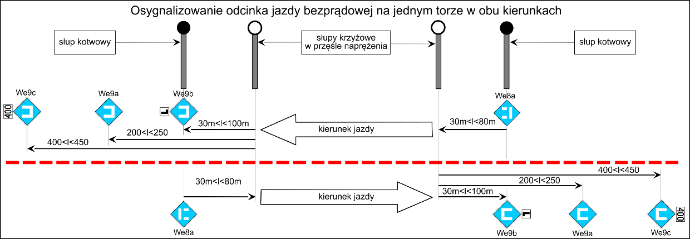{width="6.690417760279965in"
height="2.3222222222222224in"}

> 239
>
> PKP POLSKIE LINIE KOLEJOWE S.A.

2.  Przykład osygnalizowania sekcji separacji systemów.

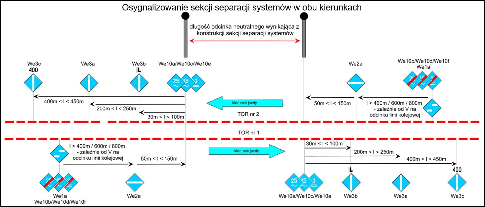{width="6.717777777777778in"
height="2.877083333333333in"}

> 240

# Załącznik Nr 5 Zasady oznaczania tarcz ostrzegawczych przejazdowych 

**Zasady oznaczania tarcz ostrzegawczych przejazdowych**

> PKP POLSKIE LINIE KOLEJOWE S.A.

1.  Dla tarczy usytuowanej przy torze prawym (patrząc od początku linii
    ku jej końcowi), ostatnią cyfrą w liczbie jest najbliższy hektometr
    nieparzysty przejazdu kolejowo-drogowego lub przejścia (patrząc w
    kierunku jazdy), a dla tarczy przy torze lewym -- najbliższy
    hektometr parzysty przejazdu kolejowo-drogowego (patrząc w kierunku
    jazdy).

2.  Tarcze ostrzegawcze przejazdowe dla jazd w kierunku przeciwnym do
    zasadniczego również oznacza się zgodnie z powyższą zasadą,
    dodatkowo uzupełniając przez dodanie litery „N".

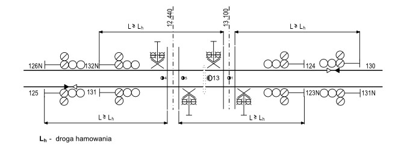{width="6.87722331583552in"
height="2.592361111111111in"}

> 242

# Załącznik Nr 6 Wskaźniki przytorowe dostosowane do wymagań TSI OPE 

**Wskaźniki przytorowe dostosowane do wymagań TSI OPE**

Niniejszy załącznik określa zasady stosowania wskaźników przytorowych
wynikających z wymagań Technicznej Specyfikacji Interoperacyjności w
zakresie podsystemu „Ruch kolejowy" (TSI OPE), będącej europejskim aktem
standaryzującym jednolite procedury prowadzenia ruchu oraz eksploatacji
systemu ERTMS na sieciach kolejowych państw członkowskich Unii
Europejskiej.

Wskaźniki te, określone w Dodatku A do Rozporządzenia Wykonawczego
Komisji (UE) 2019/773, stanowią element interoperacyjności podsystemu
„Sterowanie -- urządzenia przytorowe" i podlegają wymaganiom
zharmonizowanej normy EN 16494:2025, dostosowanej do aktualnych procedur
eksploatacyjnych systemu ERTMS.

Celem załącznika jest zapewnienie jednolitego i zgodnego z przepisami UE
stosowania wskaźników przytorowych na sieci zarządzanej przez PKP
Polskie Linie Kolejowe S.A., a także ich spójnej integracji z krajowym
systemem sygnalizacji oraz obowiązującymi przepisami dotyczącymi
prowadzenia ruchu kolejowego.

Postanowienia załącznika będą stosowane po wejściu w życie zmian w
rozporządzeniu Ministra Infrastruktury z dnia 18 lipca 2005

r\. w sprawie ogólnych warunków prowadzenia ruchu kolejowego i
sygnalizacji (Dz. U. z 2025 r. poz. 100 ze zm.), umożliwiającego
formalne stosowanie wskaźników TSI OPE w krajowym systemie sygnalizacji.
Do czasu wejścia w życie wskazanych zmian obowiązują regulacje
wynikające z postanowień Instrukcji w wersji obowiązującej dotychczas.
Uregulowania zawarte w niniejszym załączniku będą wdrażane na liniach
kolejowych w zakresie, w jakim stosowanie wskaźników wynika z TSI OPE
lub jest niezbędne dla zapewnienia interoperacyjności systemu
kolejowego.

W Instrukcji wprowadza się następujące zmiany, uwzględniając wskazany
powyżej termin rozpoczęcia ich obowiązywania:

1)  § 17 ust. 19 otrzymuje brzmienie:

> „19. Wskaźniki We mają postać kwadratowej niebieskiej lub białej
> tablicy z białą lub niebieską obwódką, ustawionej przekątną pionowo, z
> odpowiednim białym lub niebieskim symbolem.";

2)  § 17 ust. 20 pkt 1 otrzymuje brzmienie: „1) wskaźniki We 1a, We 1b,
    We 1c „Wskaźniki opuszczania pantografu" oznaczają, że należy
    opuścić pantografy przed następnym wskaźnikiem (wskaźniki
    opuszczonego pantografu We 2a, We 2b, We 2c): niezależnie od
    kierunku jazdy (wskaźnik We 1a), przy jeździe na tor odgałęziający
    się w prawo od toru, przy którym jest ustawiony wskaźnik (wskaźnik
    We 1b), lub przy jeździe na tor odgałęziający się w lewo od toru,
    przy którym jest ustawiony wskaźnik (wskaźnik We 1c).

> Dwa poziome białe paski jednakowej wielkości, przesunięte w pionie i w
> poziomie względem siebie tak, że początek górnego paska jest na
> wysokości środka paska dolnego; wskaźnik We 1b i We 1c obowiązujący
> dla torów odgałęziających się uzupełniony jest małą kwadratową czarną
> tablicą z białym trójkątem zwróconym ostrzem odpowiednio w prawo
> (wskaźnik We 1b) lub w lewo (wskaźnik We 1c), w zależności od tego,
> którego toru odgałęziającego się dotyczy wskaźnik.

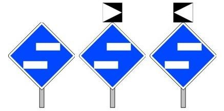{width="4.097916666666666in" height="2.03125in"}

> We 1a We 1b We 1c
>
> Wskaźniki We 1a, We 1b lub We 1c ustawia się na szlaku i na stacji
> przy torach głównych, przed wskaźnikami We 2a, We 2b, We 2c w
> odległości co najmniej:

a)  400 m -- dla odcinka linii o prędkości do 60 km/h włącznie,

b)  600 m -- dla odcinka linii o prędkości większej niż 60 km/h do 100
    km/h włącznie,

c)  800 m -- dla odcinka linii o prędkości większej niż 100 km/h;";

<!-- -->

3)  § 17 ust. 20 pkt 2 dotychczasowe lica wskaźników zmienia się na:

> 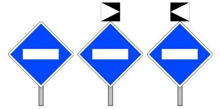{width="4.097916666666666in"
> height="2.035138888888889in"} We 2a We 2b We 2c

4)  § 17 ust. 20 pkt 3 dotychczasowe lica wskaźników zmienia się na:

> 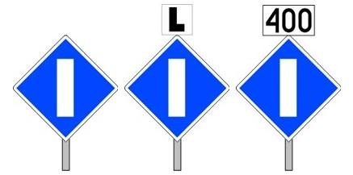{width="4.097916666666666in"
> height="2.035138888888889in"} We 3a We 3b We 3c 5) § 17 ust. 20 pkt 4:

a)  dotychczasowy opis i lica wskaźników zmienia się na: „4) wskaźniki
    We 4a, We 4b, We 4c „Wskaźniki zakazu wjazdu elektrycznych pojazdów
    trakcyjnych" oznaczają, że wjazd elektrycznych pojazdów trakcyjnych
    jest zabroniony: na tor, przy którym jest ustawiony wskaźnik
    (wskaźnik We 4a), na tor

> odgałęziający się w prawo od toru, przy którym jest ustawiony wskaźnik
> (wskaźnik We 4b), lub na tor odgałęziający się w lewo od toru, przy
> którym ustawiony jest wskaźnik (wskaźnik We 4c). Dwa białe romby jeden
> w drugim, wskaźnik obowiązujący dla torów odgałęziających się
> uzupełniony jest małą kwadratową czarną tablicą z białym trójkątem
> zwróconym ostrzem odpowiednio w prawo lub w lewo, w zależności od
> tego, którego toru odgałęziającego się dotyczy:",
>
> 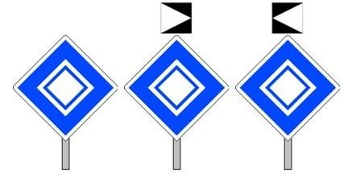{width="4.097916666666666in"
> height="2.03125in"} We 4a We 4b We 4c

b)  opis w lit. a i b tego pkt pozostaje w brzmieniu dotychczasowym;

<!-- -->

6)  § 17 ust. 20 pkt 5 dotychczasowe lica wskaźników zmienia się na:

> 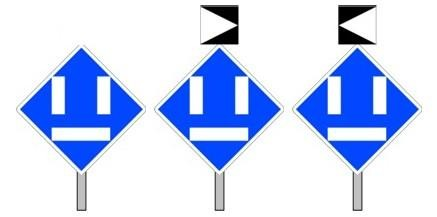{width="4.097916666666666in"
> height="2.03125in"} We 8a We 8b We 8c

7)  § 17 ust. 20 pkt 6 dotychczasowe lica wskaźników zmienia się na:

> 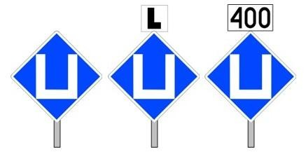{width="4.097916666666666in"
> height="2.03125in"} We 9a We 9b We 9c 8) § 17 ust. 20 pkt 7 otrzymuje
> brzmienie:
>
> „7) wskaźniki We 10a, We 10b, We 10c, „Wskaźniki zmiany systemu
> zasilania" oznaczają zmianę systemu zasilania dla toru przy którym
> stoi wskaźnik:
>
> a\) wskaźnik We 10a: białe oznaczenie „25 kV", informuje maszynistę o
> wjeździe do obszaru zasilanego w systemie
>
> 25 kV prądu przemiennego,
>
> 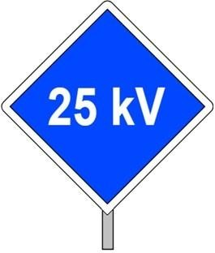{width="1.38125in" height="1.62125in"}
>
> b\) wskaźnik We 10b: białe oznaczenie „15 kV", informuje maszynistę o
> wjeździe do obszaru zasilanego w systemie
>
> 15 kV prądu przemiennego,
>
> 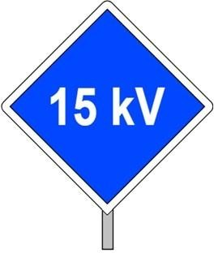{width="1.3775142169728785in"
> height="1.6215277777777777in"}
>
> c\) wskaźnik We 10c: białe oznaczenie „3000 V", informuje maszynistę o
> wjeździe do obszaru zasilanego w systemie
>
> 3 kV prądu przemiennego,
>
> 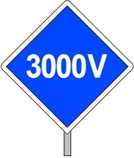{width="1.3775142169728785in"
> height="1.6215277777777777in"}

d)  wskaźniki We 10a, We 10b i We 10c stosuje się wyłącznie dla
    oznaczenia stref separacji dwóch różnych systemów zasilania sieci
    trakcyjnej -- wskaźników tych nie należy stosować na granicy
    obszarów zelektryfikowanego i niezelektryfikowanego,

e)  wskaźniki We 10a, We 10b lub We 10c ustawia się w sekcji separacji
    systemów, w miejscu rozpoczęcia obszaru zasilanego we właściwym
    systemie tj. 25 kV prądu przemiennego, 15 kV prądu przemiennego lub
    3 kV prądu stałego.

> *Uwaga: przykład osygnalizowania sekcji separacji systemów
> przedstawiono w załączniku Nr 4."* 9) § 17 ust. 20 dodaje się pkt 8 w
> brzmieniu: „8) wskaźnik We 11a, We 11b, We 11c „Wskaźniki uprzedzające
> o zmianie systemu zasilania":

a)  wskaźnik We 11a: niebieskie oznaczenie „25 kV", informuje maszynistę
    o zbliżającym się wjeździe do obszaru zasilanego w systemie 25 kV
    prądu przemiennego,

> 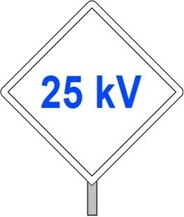{width="1.3694444444444445in"
> height="1.6134722222222222in"}

b)  wskaźnik We 11b: niebieskie oznaczenie „15 kV", informuje maszynistę
    o zbliżającym się wjeździe do obszaru zasilanego w systemie 15 kV
    prądu przemiennego,

> 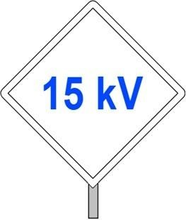{width="1.3694444444444445in"
> height="1.6134722222222222in"}

c)  wskaźnik We 11c: niebieskie oznaczenie „3000 V", informuje
    maszynistę o zbliżającym się wjeździe do obszaru zasilanego w
    systemie 3 kV prądu stałego,

> 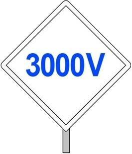{width="1.38125in"
> height="1.6134722222222222in"}

d)  wskaźniki We 11a, We 11b i We 11c stosuje się wyłącznie dla
    oznaczenia stref separacji dwóch różnych systemów zasilania sieci
    trakcyjnej -- wskaźników tych nie należy stosować na granicy
    obszarów zelektryfikowanego i niezelektryfikowanego,

e)  wskaźniki We 11a, We 11b lub We 11c ustawia się przed wskaźnikiem We
    2a lub We 8a właściwym dla sekcji separacji systemów, w odległości
    co najmniej:

> − 400 m -- dla odcinka linii o prędkości do 60 km/h włącznie,
>
> − 600 m -- dla odcinka linii o prędkości większej niż
>
> 60 km/h do 100 km/h włącznie,
>
> − 800 m -- dla odcinka linii o prędkości większej niż 100 km/h.
>
> *Uwaga: przykład osygnalizowania sekcji separacji systemów
> przedstawiono w załączniku Nr 4;*" 10) § 17 ust. 20 dodaje się pkt 9 w
> brzmieniu:
>
> „9) wskaźnik We 12 „Wskaźnik uprzedzający o zakazie wjazdu
> elektrycznych pojazdów trakcyjnych" informuje maszynistę o zbliżaniu
> się do obszaru, w który wjazd elektrycznych pojazdów trakcyjnych jest
> zabroniony; dwa niebieskie romby jeden w drugim;
>
> 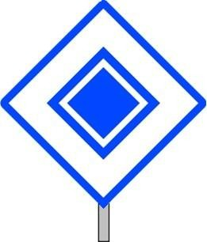{width="1.3576388888888888in"
> height="1.59375in"}
>
> wskaźnik We 12, ustawia się przed wskaźnikami We 4a, We 4b, We 4c w
> odległości nie mniejszej niż 30 m i nie większej niż 100 m;";
>
> 11\) § 17 ust. 20 dodaje się pkt 10 w brzmieniu:
>
> „10) wskaźnik We 13 „Wskaźnik uprzedzający o odcinku neutralnym"
> informuje maszynistę o zbliżającym się wjeździe w odcinek neutralny
> sekcji separacji faz, przez który elektryczny pojazd trakcyjny
> powinien przejeżdżać z wyłączonym wyłącznikiem głównym. Dwa równoległe
> białe paski pionowe;
>
> 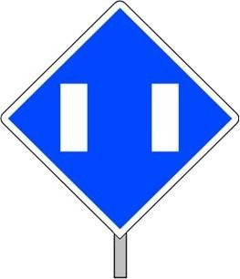{width="1.3694444444444445in"
> height="1.59375in"}
>
> wskaźnik We 13 ustawia się przed wskaźnikiem We 8a właściwym dla
> sekcji separacji faz, w odległości co najmniej:

a)  400 m -- dla odcinka linii o prędkości do 60 km/h włącznie,

b)  600 m -- dla odcinka linii o prędkości większej niż

> 60 km/h do 100 km/h włącznie,

c)  800 m -- dla odcinka linii o prędkości większej niż

> 100 km/h."; 12) § 17 ust. 23:

a)  uchyla się dotychczasowe punkty od 1 do 9,

b)  dotychczasowy pkt 10 staje się pkt 1,

c)  dotychczasowy pkt 11 staje się pkt 2,

d)  dodaje się pkt 3 w brzmieniu

> „3) wskaźnik W ETCS 12 „Wskaźnik zmiany poziomu
>
> ETCS" oznacza miejsce zmiany poziomu systemu ETCS.
>
> Biała kwadratowa tablica z czarnym obramowaniem i czarnym oznaczeniem
> literowo-cyfrowym „LT ETCS XXX" (oznaczenie „ETCS" umieszczone pod
> oznaczeniem „LT", dodatkowo pod oznaczeniem ETCS w zależności od
> sytuacji można umieścić oznaczenie XXX, gdzie w miejsce oznaczenia XXX
> może być podana informacja o poziomie systemu np. LS, L1, L2,
>
> NTC);
>
> 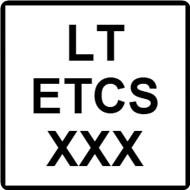{width="1.4284722222222221in"
> height="1.4284722222222221in"}

a)  wskaźnik W ETCS 12 stosuje się w celu poinformowania maszynisty
    pociągu wyposażonego w urządzenia pokładowe systemu ETCS o
    lokalizacji zmiany poziomu systemu ETCS,

b)  wskaźnik W ETCS 12 ustawia się w następujący sposób:

- na stacji lub szlaku -- w miejscu stanowiącym lokalizację zmiany
  poziomu systemu ETCS,

- obok każdej grupy balis, która powoduje zmianę poziomu systemu ETCS,

c)  jeżeli na szlaku nie można ustawić wskaźnika W ETCS 12 z zachowaniem
    skrajni, stosuje się tablicę o zmniejszonych wymiarach i umieszcza
    ją nisko,

d)  w granicach stacji zaleca się stosować tablicę o zmniejszonych
    wymiarach i umieszczać ją nisko;",

e)  dodaje się pkt 4 w brzmieniu:

> „4) wskaźnik W ETCS 13 „Wskaźnik uruchomienia dźwiękowego urządzenia
> ostrzegawczego" oznacza, że należy podać sygnał Rp 1 „Baczność".
> Czworokątna czarna tablica z białym symbolem trąbki z białym
> obramowaniem, wskaźnik ustawia się tam, gdzie zgodnie z projektem
> systemu ERTMS maszynista powinien podać sygnał Rp 1 „Baczność";",
>
> 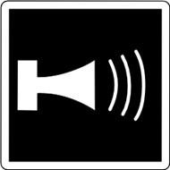{width="1.425in" height="1.425in"}

f)  dodaje się pkt 5 w brzmieniu:

> „5) wskaźnik W ETCS 14a „Wskaźnik zapowiedzi bezpiecznego miejsca
> zatrzymania" informuje maszynistę, że zbliża się do obszaru, w którym
> pociąg może się bezpiecznie zatrzymać w sytuacji awaryjnej lub zgodnie
> z procedurą.
>
> 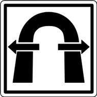{width="1.425in" height="1.425in"}
>
> Wskaźnik zapowiedzi bezpiecznego miejsca zatrzymania należy stosować
> do oznaczania obszaru bezpiecznego w rozumieniu rozporządzenia Komisji
> (UE) nr 1303/2014 z dnia 18 listopada 2014 r. w sprawie technicznej
> specyfikacji interoperacyjności w zakresie aspektu „Bezpieczeństwo w
> tunelach kolejowych" systemu kolei w Unii Europejskiej, jako wskaźnik
> uprzedzający przed wskaźnikiem początku bezpiecznego miejsca
> zatrzymania: czworokątna biała tablica z czarnym symbolem tunelu i
> poziomymi strzałkami; wskaźnik zapowiedzi bezpiecznego miejsca ustawia
> się w odległości drogi hamowania przed wskaźnikiem początku
> bezpiecznego miejsca zatrzymania;",

g)  dodaje się pkt 6 w brzmieniu:

> „6) wskaźnik W ETCS 14b „Wskaźnik początku bezpiecznego miejsca
> zatrzymania" oznacza początek strefy, w której pociąg może się
> zatrzymać bez ryzyka naruszenia bezpieczeństwa.
>
> 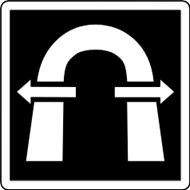{width="1.425in" height="1.425in"}
>
> Wskaźnik początku bezpiecznego miejsca zatrzymania należy stosować do
> oznaczania obszaru bezpiecznego w rozumieniu rozporządzenia Komisji
> (UE) nr 1303/2014 z dnia 18 listopada 2014 r. w sprawie technicznej
> specyfikacji interoperacyjności w zakresie aspektu „Bezpieczeństwo w
> tunelach kolejowych" systemu kolei w Unii Europejskiej, jako wskaźnik
> uprzedzający przed wskaźnikiem początku bezpiecznego miejsca
> zatrzymania: czworokątna biała tablica z czarnym symbolem tunelu i
> poziomymi strzałkami; wskaźnik zapowiedzi bezpiecznego miejsca ustawia
> się w odległości drogi hamowania przed wskaźnikiem początku
> bezpiecznego miejsca zatrzymania;",

h)  dodaje się pkt 7 w brzmieniu:

> „7) wskaźnik W ETCS 14c „Wskaźnik końca bezpiecznego miejsca
> zatrzymania" informuje maszynistę, że kończy się strefa, w której
> pociąg mógł się bezpiecznie zatrzymać.
>
> 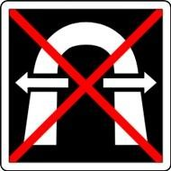{width="1.425in" height="1.425in"}
>
> Wskaźnik końca bezpiecznego miejsca zatrzymania należy stosować do
> oznaczania końca obszaru bezpiecznego w rozumieniu rozporządzenia
> Komisji (UE) nr 1303/2014 z dnia 18 listopada 2014 r. w sprawie
> technicznej specyfikacji interoperacyjności w zakresie aspektu
> „Bezpieczeństwo w tunelach kolejowych" systemu kolei w Unii
> Europejskiej:
>
> czworokątna czarna tablica z białym symbolem tunelu, poziomymi
> strzałkami i czerwonym przekreśleniem; wskaźnik ustawia się na końcu
> obszaru bezpiecznego;",

i)  dodaje się pkt 8 w brzmieniu:

> „8) wskaźnik W ETCS 15a „Wskaźnik zapowiedzi zakazu użycia specjalnych
> systemów hamowania" należy stosować do oznaczania odcinka z zakazem
> użycia specjalnych systemów hamowania, jako wskaźnik uprzedzający
> przed wskaźnikiem odcinka z zakazem użycia specjalnych systemów
> hamowania:
>
> czworokątna biała tablica z czarnym symbolem hamulca i szarym
> przekreśleniem;
>
> 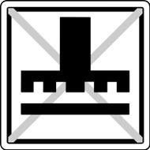{width="1.425in" height="1.425in"}
>
> Wskaźnik zapowiedzi zakazu użycia specjalnych systemów hamowania
> ustawia się w odległości drogi hamowania przed wskaźnikiem początku
> odcinka z zakazem użycia specjalnych systemów hamowania;",

j)  dodaje się pkt 9 w brzmieniu:

> „9) wskaźnik W ETCS 15b „Wskaźnik początku odcinka z zakazem użycia
> specjalnych systemów hamowania" informuje maszynistę o początku
> odcinka, na którym zabronione jest użycie jednego lub więcej z
> poniższych typów hamulców specjalnych:

a)  hamulec wiroprądowy,

b)  hamulec magnetyczny,

c)  hamulec odzyskowy.

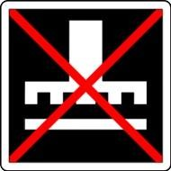{width="1.425in" height="1.425in"}

> Wskaźnik początku odcinka z zakazem użycia specjalnych systemów
> hamowania należy stosować do oznaczania początku odcinka z zakazem
> użycia specjalnych systemów hamowania: czworokątna czarna tablica z
> białym symbolem hamulca i czerwonym przekreśleniem; wskaźnik ustawia
> się na początku odcinka z zakazem użycia specjalnych systemów
> hamowania;",

k)  dodaje się pkt 10 w brzmieniu:

> „10) wskaźnik W ETCS 15c „Wskaźnik końca odcinka z zakazem użycia
> specjalnych systemów hamowania" należy stosować do oznaczania końca
> odcinka z zakazem użycia specjalnych systemów hamowania:
>
> czworokątna czarna tablica z białym symbolem hamulca.

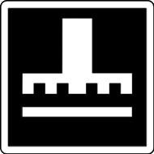{width="1.425in" height="1.425in"}

> Wskaźnik ustawia się na końcu odcinka z zakazem użycia specjalnych
> systemów hamowania."; 2) § 4 ust. 13 pkt 19 lit b otrzymuje brzmienie:
>
> „b) nakazuje prowadzenie pociągu w sposób określony w § 17 ust. 23 pkt
> 1 lit. b -- w przypadku zastosowania wskaźnika W ETCS 10";

3)  § 4 ust. 13 pkt 19 lit c otrzymuje brzmienie:

> „c) nakazuje prowadzenie pociągu w sposób określony w ust. 20 oraz w §
> 17 ust. 23 pkt 2 lit. b -- w przypadku zastosowania wskaźnika W ETCS
> 11";

4)  załącznik Nr 3 ust. 2 tabela otrzymuje brzmienie:

  -----------------------------------------------------------------------
  Lp.     Wskaźnik
  ------- ---------------------------------------------------------------
  1       W 2 „Wskaźnik kierunku jazdy"

  2       W 6 „Wskaźnik ostrzegania"

  3       W 6a „Wskaźnik przejazdowy"

  4       W 6b „Wskaźnik ostrzegania przed przejazdem kolejowo-drogowym
          lub przejściem"

  5       W 8 „Wskaźnik ograniczenia prędkości"

  6       W 9 „Wskaźnik odcinka ograniczonej prędkości"

  7       W 14 „Wskaźnik odcinka ograniczonej prędkości"
  -----------------------------------------------------------------------

+------+---------------------------------------------------------------+
| Lp.  | Wskaźnik                                                      |
+======+===============================================================+
| 8    | W 18 „Wskaźnik samoczynnej blokady liniowej"                  |
+------+---------------------------------------------------------------+
| 9    | W 21 „Wskaźnik podwyższenia prędkości"                        |
+------+---------------------------------------------------------------+
| 10   | W 22 „Wskaźnik jazdy pociągu towarowego"                      |
+------+---------------------------------------------------------------+
| 11   | W 24 „Wskaźnik kierunku przeciwnego"                          |
+------+---------------------------------------------------------------+
| 12   | W 26a, W 26b „Wskaźniki kierunku jazdy"                       |
+------+---------------------------------------------------------------+
| 13   | W 27a „Wskaźnik zmiany prędkości"                             |
+------+---------------------------------------------------------------+
| 14   | W 28 „Wskaźnik kanału radiowego"                              |
+------+---------------------------------------------------------------+
| 15   | W 33 „Wskaźnik początku obowiązywania systemu                 |
|      |                                                               |
|      | ERTMS/GSM-R"                                                  |
+------+---------------------------------------------------------------+
| 16   | W 34 „Wskaźnik końca obowiązywania systemu                    |
|      |                                                               |
|      | ERTMS/GSM-R"                                                  |
+------+---------------------------------------------------------------+
| 17   | W 35, W 36 „Wskaźniki ograniczenia prędkości na kierunku      |
|      | zwrotnym"                                                     |
+------+---------------------------------------------------------------+
| 18   | We 1a, We 1b, We 1c „Wskaźniki opuszczania pantografu"        |
+------+---------------------------------------------------------------+
| 19   | We 2a, We 2b, We 2c „Wskaźniki opuszczonego pantografu"       |
+------+---------------------------------------------------------------+
| 20   | We 3a, We 3b, We 3c „Wskaźniki podniesienia pantografu"       |
+------+---------------------------------------------------------------+
| 21   | We 4a, We 4b, We 4c „Wskaźniki zakazu wjazdu elektrycznych    |
|      | pojazdów trakcyjnych"                                         |
+------+---------------------------------------------------------------+
| 22   | We 8a, We 8b, We 8c „Wskaźniki jazdy bezprądowej"             |
+------+---------------------------------------------------------------+
| 23   | We 9a, We 9b, We 9c „Wskaźniki jazdy pod prądem"              |
+------+---------------------------------------------------------------+
| 24   | We 10a, We 10b, We 10c„Wskaźniki zmiany systemu zasilania"    |
+------+---------------------------------------------------------------+
| Lp.  | Wskaźnik                                                      |
+------+---------------------------------------------------------------+
| 25   | We 11a, We 11b, We 11c                                        |
|      |                                                               |
|      | „Wskaźniki uprzedzające o zmianie systemu zasilania"          |
+------+---------------------------------------------------------------+
| 26   | We 12 „Wskaźnik uprzedzający o zakazie wjazdu elektrycznych   |
|      | pojazdów trakcyjnych"                                         |
+------+---------------------------------------------------------------+
| 27   | We 13 „Wskaźnik uprzedzający o odcinku neutralnym"            |
+------+---------------------------------------------------------------+
| 28   | W ETCS 10 „Wskaźnik zatrzymania ETCS"                         |
+------+---------------------------------------------------------------+
| 29   | W ETCS 11 „Wskaźnik lokalizacji ETCS"                         |
+------+---------------------------------------------------------------+
| 30   | W ETCS 12 „Wskaźnik zmiany poziomu ETCS"                      |
+------+---------------------------------------------------------------+
| 31   | W ETCS 13 „Wskaźnik uruchomienia dźwiękowego urządzenia       |
|      | ostrzegawczego"                                               |
+------+---------------------------------------------------------------+
| 32   | W ETCS 14a „Wskaźnik zapowiedzi bezpiecznego miejsca          |
|      | zatrzymania"                                                  |
+------+---------------------------------------------------------------+
| 33   | W ETCS 14b „Wskaźnik początku bezpiecznego miejsca            |
|      | zatrzymania"                                                  |
+------+---------------------------------------------------------------+
| 34   | W ETCS 14c „Wskaźnik końca bezpiecznego miejsca zatrzymania"  |
+------+---------------------------------------------------------------+
| 35   | W ETCS 15a „Wskaźnik zapowiedzi zakazu użycia specjalnych     |
|      | systemów hamowania"                                           |
+------+---------------------------------------------------------------+
| 36   | W ETCS 15b „Wskaźnik początku odcinka z zakazem użycia        |
|      | specjalnych systemów hamowania"                               |
+------+---------------------------------------------------------------+
| 37   | W ETCS 15c „Wskaźnik końca odcinka z zakazem użycia           |
|      | specjalnych systemów hamowania"                               |
+------+---------------------------------------------------------------+

> PKP POLSKIE LINIE KOLEJOWE S.A.

5)  załącznik Nr 4 ust. 1 otrzymuje brzmienie:

> „1. Przykład osygnalizowania odcinka jazdy bez poboru prądu z użyciem
> wskaźników We 8a, We 9a, We 9b, We 9c oraz We 13.";

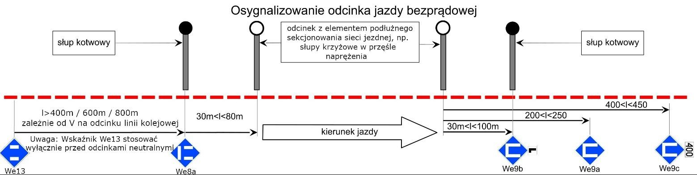{width="7.083333333333333in"
height="1.7826388888888889in"}

> 265
>
> PKP POLSKIE LINIE KOLEJOWE S.A.

6)  załączniku Nr 4 ust. 2 otrzymuje brzmienie:

> „2. Przykład osygnalizowania sekcji separacji systemów z użyciem
> wskaźników We 1a, We 11a, We 11b, We 11c We 2a, We 10a, We 10b, We
> 10c, We 3a, We 3b, We 3c.".

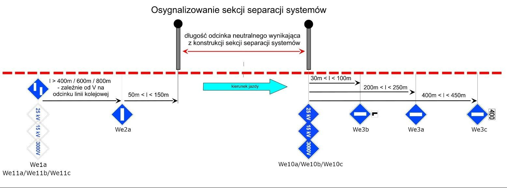{width="7.086111111111111in"
height="2.6333333333333333in"}

> 266
>
> PKP POLSKIE LINIE KOLEJOWE S.A.

**Tabela zmian**

+----------+-------------------+---------------+-----------+-----------------+
| > Lp.    | > Nr uchwały      | Jednostki     | > Data    | > Biuletyn      |
| >        | > Zarządu/decyzji | redakcyjne, w | > wejścia | >               |
| > zmiany | > członka Zarządu | obrębie       | > w życie | > PKP Polskie   |
|          | > wprowadzającej  | których       |           | >               |
|          | > zmianę          | wprowadzono   |           | > Linie         |
|          |                   | zmiany        |           | >               |
|          |                   |               |           | > Kolejowe      |
|          |                   |               |           | > S.A., w       |
|          |                   |               |           | > którym zmiana |
|          |                   |               |           | > została       |
|          |                   |               |           | > opublikowana  |
|          |                   |               |           | >               |
|          |                   |               |           | > (Nr/poz./rok) |
+==========+===================+===============+===========+=================+
|          |                   |               |           |                 |
+----------+-------------------+---------------+-----------+-----------------+
|          |                   |               |           |                 |
+----------+-------------------+---------------+-----------+-----------------+
|          |                   |               |           |                 |
+----------+-------------------+---------------+-----------+-----------------+
|          |                   |               |           |                 |
+----------+-------------------+---------------+-----------+-----------------+
|          |                   |               |           |                 |
+----------+-------------------+---------------+-----------+-----------------+
|          |                   |               |           |                 |
+----------+-------------------+---------------+-----------+-----------------+
|          |                   |               |           |                 |
+----------+-------------------+---------------+-----------+-----------------+

> 267
