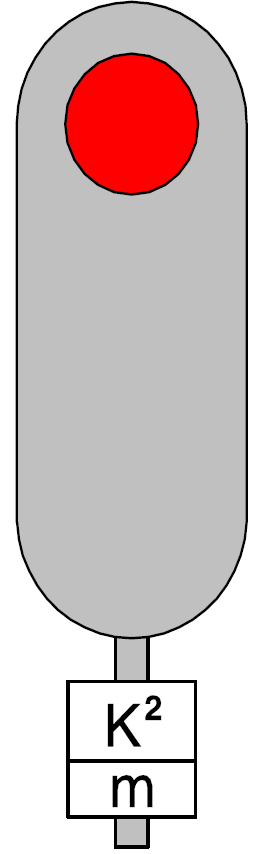
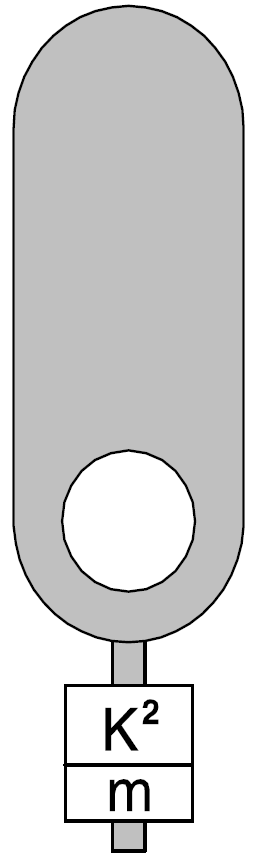

[Ie-1](../index.md)

# § 8 Tarcze manewrowe i rozrządowe

1. Stosuje się następujące tarcze manewrowe:

> 1\) tarcze manewrowe kształtowe, które nadają sygnały odpowiednim
> położeniem kwadratowej tarczy obracającej się wzdłuż przekątnej o kąt
> 90° wokół poziomej osi i w nocy dodatkowo światłami koloru:

a)  niebieskiego -- gdy manewr jest zabroniony,

b)  mlecznobiałego -- gdy manewr jest dozwolony;

> 2\) tarcze manewrowe świetlne, które nadają sygnały za pomocą jednego
> światła:

a)  niebieskiego -- gdy manewr jest zabroniony,

b)  matowobiałego -- gdy manewr jest dozwolony.

<!-- -->

2.  Sygnały nadawane przez tarcze manewrowe odnoszą się tylko do jazd
    manewrowych.

3.  Tarcze manewrowe kształtowe nadają następujące sygnały:

    1)  **sygnał M 1 „Jazda manewrowa zabroniona"**

**Dzienny Nocny**

> Kwadratowa tarcza niebieska Niebieskie światło z białą obwódką,
> ustawiona na maszcie pod tarczą.
>
> przekątną pionowo.
>
> Jeżeli tarcza manewrowa kształtowa wskazuje stale sygnał M 1 „Jazda
> manewrowa zabroniona", dopuszcza się niestosowanie sygnału nocnego pod
> warunkiem, że tarcza jest odblaskowa;

2)  **sygnał M 2 „Jazda manewrowa dozwolona"**

**Dzienny Nocny**

Tarcza w położeniu Mlecznobiałe światło

poziomym. na maszcie pod tarczą.

+---------+------------------------------------------------------------+
|         | +-------------------+                                      |
|         | |                   |                                      |
|         | +=========+=========+                                      |
|         | |         |         |                                      |
|         | +---------+---------+                                      |
+=========+============================================================+

4.  Tarcze manewrowe świetlne nadają następujące sygnały:

> 1\) **sygnał Ms 1 „Jazda** 2) **sygnał Ms 2 „Jazda manewrowa manewrowa
> zabroniona" dozwolona"**
>
> Jedno niebieskie światło Jedno matowobiałe na tarczy; światło na
> tarczy.

5.  Jeżeli nie jest możliwe podanie na tarczy manewrowej świetlnej
    sygnału Ms 2 *lub na tarczy manewrowej kształtowej sygnału M 2*,
    manewrujący tabor kolejowy może przejechać poza sygnalizator
    zabraniający dalszej jazdy, gdy upoważniony pracownik wyda
    zezwolenie na jazdę przekazane za pomocą urządzeń łączności albo
    odpowiednio za pomocą sygnału Rm 1 „Do mnie" lub Rm 2 „Ode mnie".

6. Sygnały manewrowe mogą być również nadawane przez semafory świetlne, oznaczone literą „m" na tabliczce opisowej:
    1. sygnał S 1 „Stój"
        - Sygnał S 1 „Stój" na semaforze, o którym mowa w ust. 6, odnosi się również do manewrów;  

        

    2. sygnał Ms 2 „Jazda manewrowa dozwolona"
        - Semafor, o którym mowa w ust. 6, nadaje sygnał Ms 2 „Jazda manewrowa dozwolona" światłem matowobiałym.

        

7.  Jeżeli nie jest możliwe nastawienie sygnału Ms 2 na semaforze, o
    którym mowa w ust. 6 lub na semaforze nieprzystosowanym do podawania
    sygnału Ms 2, manewrujący tabor kolejowy może przejechać poza ten
    semafor wskazujący sygnał „Stój", gdy upoważniony pracownik wyda
    zezwolenie na jazdę przekazane za pomocą urządzeń łączności albo
    odpowiednio za pomocą sygnału Rm 1 „Do mnie" lub Rm 2 „Ode mnie".

8.  Stosuje się następujące tarcze rozrządowe:

    1)  tarcze rozrządowe kształtowe, które nadają sygnały za pomocą
        podłużnego ruchomego białego ramienia z czarną obwódką,
        oświetlonego w porze nocnej, obracającego się na tle nieruchomej
        okrągłej, czarnej tarczy z białą obwódką, umieszczonej na
        maszcie, zwróconego w kierunku lokomotywy pchającej tabor
        kolejowy;

    2)  tarcze rozrządowe świetlne, które nadają sygnały za pomocą
        umieszczonych na maszcie latarń.

9.  Tarcze rozrządowe ustawia się na szczycie górki rozrządowej, a w
    razie potrzeby stosuje się ich powtarzacze przed grzbietem górki.
    Powtarzacze wskazują takie same sygnały, jak tarcze ustawione na
    szczycie górki rozrządowej.

10. Jeżeli na górce rozrządowej są dwa tory, można stosować oddzielne
    tarcze rozrządowe i ich powtarzacze, odnoszące się do każdego z tych
    torów.

11. Tarcze rozrządowe nadają następujące sygnały:

    1)  **sygnał Rt 1 „Pchanie zabronione"**

  -----------------------------------------------------------------------
  **Dzienny**             **Nocny**                 **Dzienny i nocny**
  ----------------------- ------------------------- ---------------------
  Podłużne białe ramię    Oświetlone podłużne białe Szereg białych
  ustawione poziomo.      ramię ustawione poziomo.  świateł tworzących
                                                    linię poziomą;

  -----------------------------------------------------------------------

2)  **sygnał Rt 2 „Pchać powoli"**

+-----------------------+------------------------+---------------------+
| **Dzienny**           | **Nocny**              | > **Dzienny i       |
|                       |                        | > nocny**           |
+=======================+========================+=====================+
| Podłużne białe ramię  | > Oświetlone podłużne  | Szereg białych      |
| ustawione ukośnie     | > białe ramię          | świateł tworzących  |
| prawym końcem do góry | > ustawione ukośnie    | linię ukośną        |
| pod kątem 45°.        | > prawym końcem do     | wznoszącą się pod   |
|                       | > góry pod kątem 45°.  | kątem 45°.          |
+-----------------------+------------------------+---------------------+

> Sygnał Rt 2 oznacza, że można pchać tabor kolejowy z prędkością
> nieprzekraczającą 3 km/h;

3)  **sygnał Rt 3 „Pchać z umiarkowaną prędkością"**

**Dzienny Nocny Dzienny i nocny**

> Podłużne białe Oświetlone Szereg białych ramię ustawione podłużne
> białe świateł pionowo. ramię ustawione tworzących linię

pionowo. pionową.

> Sygnał Rt 3 oznacza, że można pchać tabor kolejowy z prędkością
> nieprzekraczającą 5 km/h, jeżeli regulamin techniczny nie stanowi
> inaczej;

4)  **sygnał Rt 4 „Cofnąć"**

> **Dzienny i nocny**
>
> Szereg białych świateł tworzących kąt prosty, zwrócony ramionami w
> prawo i w dół.
>
> Sygnał Rt 4 oznacza, że należy cofnąć skład manewrowy z górki. Sygnał
> ten stosuje się tylko na tarczach rozrządowych świetlnych;

5)  **sygnał Rt 5 „Podepchnąć skład do górki"**

> **Dzienny i nocny**
>
> Szereg białych migających jednocześnie świateł tworzących linię
> poziomą.
>
> Sygnał Rt 5 oznacza, że można podepchnąć skład do górki w czasie, gdy
> z sąsiedniego toru są spychane wagony przez górkę. W razie potrzeby
> rozróżnienia, z którego spośród kilku torów ma nastąpić podpychanie,
> sygnał Rt 5 powinien być podawany jednocześnie z sygnałem Ms 2 „Jazda
> manewrowa dozwolona" podanym na *semaforze lub* tarczy manewrowej
> ustawionej przy właściwym torze. Podpychanie powinno odbywać się z
> prędkością nieprzekraczającą 15 km/h. Sygnał Rt 5 stosuje się tylko na
> tarczach rozrządowych świetlnych.

12. Jeżeli nie można nastawić na tarczy rozrządowej sygnału
    zezwalającego na pchanie taboru kolejowego poza tarczę, to pchanie
    taboru kolejowego jest dozwolone tylko wówczas, gdy upoważniony do
    tego pracownik, po uprzednim ustnym poinformowaniu drużyny
    trakcyjnej, że pchanie jest dozwolone poza tarczę, da ręczny sygnał
    Rm 1 „Do mnie" lub polecenie pchania będzie przekazane za pomocą
    megafonu lub innego środka łączności.

13. Jeżeli nie można nastawić na tarczy rozrządowej sygnału Rt 4
    „Cofnąć" lub zachodzi potrzeba cofnięcia składu z górki, wyposażonej
    w kształtową tarczę rozrządową, to cofnięcie składu z górki
    dozwolone jest tylko wówczas, gdy pracownik do tego upoważniony, po
    uprzednim ustnym poinformowaniu drużyny trakcyjnej, że należy cofnąć
    tabor kolejowy, da ręczny sygnał Rm 2 „Ode mnie" lub polecenie
    cofnięcia będzie przekazane za pomocą megafonu lub innego środka
    łączności.
