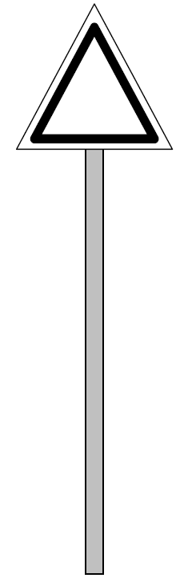
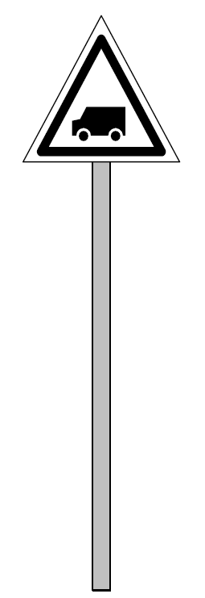
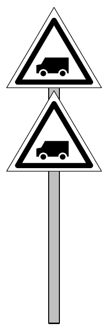
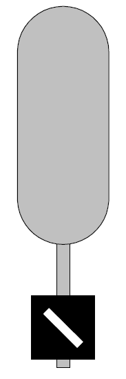

[Ie-1](../index.md)

# § 17. Wskaźniki 

1.  Wskaźniki przekazują polecenia, nakazy i informacje związane z
    ruchem kolejowym za pomocą napisów i symboli umieszczonych na
    tablicach, wyświetlanych przez latarnie lub inne układy świetlne, a
    także poprzez ustalony kształt i formę wskaźnika.

2.  Zaleca się, aby wskaźniki stosowane w postaci tablic wykonywane były
    z materiałów odblaskowych.

3.  Wskaźników stosowanych jako tablice nie oświetla się, chyba że
    zapisy Instrukcji stanowią inaczej.

4.  Wskaźniki zwrotnicowe służą do sygnalizowania aktualnego położenia
    zwrotnic rozjazdów zwyczajnych, łukowych jedno- i dwustronnych oraz
    rozjazdów krzyżowych.

5.  Wskaźniki zwrotnicowe mogą być wykonane w postaci latarń
    mechanicznych z podświetlanym szkłem koloru mlecznego, latarń
    elektrycznych z białymi światłami lub tarcz nieoświetlonych. W
    przypadku stosowania tarcz nieoświetlonych zaleca się, aby były one
    odblaskowe.

6.  Wskaźniki zwrotnicowe wskazują położenie zwrotnicy jednakowo w dzień
    jak i w nocy.

7.  *Obowiązują następujące zasady stosowania wskaźników zwrotnicowych*:

    1)  *można nie stosować wskaźników zwrotnicowych do zwrotnic
        scentralizowanych, po których jazdy odbywają się tylko z
        wykorzystaniem przebiegów utwierdzanych lub zamykanych*;

    2)  *na rozjazdach, na których w porze ciemnej nie wykonuje się
        manewrów lub manewruje się sporadycznie albo oświetlenie
        zewnętrzne zapewnia dobrą widoczność, można nie stosować
        wskaźników zwrotnicowych lub zamiast latarni zwrotnicowych
        stosować tarcze nieoświetlane, dające takie same wskazania jak
        latarnie zwrotnicowe*;

    3)  *czas (porę doby) oraz przypadki, w których latarnie zwrotnicowe
        powinny być podświetlone należy określić w regulaminie
        technicznym posterunku ruchu*.

8.  Wskaźniki dotyczące rozjazdów zwyczajnych, krzyżowych pojedynczych,
    łukowych i skupionych ustawia się obok rozjazdu, na początku każdej
    zwrotnicy.

9.  Wskaźniki dotyczące rozjazdów krzyżowych podwójnych ustawia się z
    boku, w środkowej części rozjazdu.

10. W szczególnych przypadkach stosuje się wskaźniki zwrotnicowe
    zlokalizowane w dalszej odległości przed zwrotnicami. W takim
    przypadku latarnia ze wskaźnikami może być umieszczona na osobnym
    maszcie lub wspólnie z latarniami podającymi inne sygnały.

11. Pojawienie się częściowe trzeciej strzały w latarni mechanicznej
    rozjazdu krzyżowego podwójnego, a w latarni elektrycznej miganie
    środkowego punktu świetlnego wskazuje, że iglica nie przylega do
    opornicy i oznacza, że wjazd na zwrotnicę jest zabroniony.

12. Na zwrotnicach rozjazdów zwyczajnych, łukowych jednostronnych i
    dwustronnych oraz krzyżowych pojedynczych stosuje się następujące
    wskaźniki:

    1)  **wskaźnik Wz 1 „Jazda na wprost"**

> Biały prostokąt na czarnym tle lub dwa białe światła w pionie,
> widoczne zarówno od strony ostrza iglic, jak i od strony krzyżownicy.
>
> Zwrotnica nastawiona w kierunku prostym lub przy rozjazdach łukowych
> jednostronnych w kierunku łuku o większym promieniu dla jazdy na
> ostrze lub z ostrza.

2)  **wskaźnik Wz 2 „Jazda na ostrze"**

> Biała strzała lub biała kresa na czarnym tle, zwrócona skośnie ku
> górze w prawo lub w lewo, wskazująca kierunek jazdy na ostrze,
> widoczna od strony ostrza iglic, a na latarni elektrycznej dwa białe
> światła w poziomie, widoczne zarówno od strony ostrza iglic, jak i od
> strony krzyżownicy, w rozjazdach łukowych dwustronnych wskaźnik ten, o
> odpowiednim zwrocie strzał, stosuje się dla obu położeń zwrotnicy.
>
> Zwrotnica nastawiona w kierunku zwrotnym, przy rozjazdach łukowych
> jednostronnych -- w kierunku łuku o mniejszym promieniu, przy
> rozjazdach dwustronnych łukowych -- po jednym z łuków;

3)  **wskaźnik Wz 3 „Jazda z ostrza"**

> Biała tarcza okrągła na czarnym tle, widoczna od strony krzyżownicy, a
> na latarni elektrycznej dwa białe światła w poziomie.
>
> Zwrotnica nastawiona w kierunku zwrotnym, przy rozjazdach łukowych
> jednostronnych -- w kierunku łuku o mniejszym promieniu;

4)  **wskaźnik Wz 4 „Jazda z ostrza"**

> Biała tarcza okrągła na czarnym tle, a na niej czarny łuk zwrócony
> wklęsłą stroną w kierunku łuku, na który zwrotnica jest nastawiona,
> widoczna od strony krzyżownicy.
>
> Zwrotnica rozjazdu dwustronnego łukowego nastawiona do jazdy z lewego
> albo z prawego toru;

13. Na zwrotnicach rozjazdów krzyżowych podwójnych stosuje się
    następujące wskaźniki:

<!-- -->

1)  **wskaźnik Wz 5 „Jazda po prostej w prawo"**

2)  **wskaźnik Wz 6 „Jazda po prostej w lewo"**

Na czarnym tle dwie białe strzały zwrócone ostrzem ku sobie lub dwie
białe kresy albo trzy białe światła w jednej linii wznoszącej się
ukośnie na prawo.

Na czarnym tle dwie białe strzały zwrócone ostrzem ku sobie lub dwie
białe kresy albo trzy białe światła w jednej linii wznoszącej się
ukośnie na lewo.

Jazda w kierunku prostym z lewego toru przed rozjazdem na prawy tor za
rozjazdem;

Jazda w kierunku prostym z prawego toru przed rozjazdem na lewy tor za
rozjazdem;

3)  **wskaźnik Wz 7 „Jazda po łuku w lewo"**

4)  **wskaźnik Wz 8 „Jazda po łuku w prawo"**

> Na czarnym tle dwie białe strzały zwrócone ostrzem do środka latarni
> lub dwie białe kresy albo trzy białe światła, tworzące kąt prosty
> otwarty w lewo.

Na czarnym tle dwie białe strzały zwrócone ostrzem do środka latarni lub
dwie białe kresy albo trzy białe światła, tworzące kąt prosty otwarty w
prawo.

Jazda w kierunku zwrotnym z lewego toru przed rozjazdem na lewy tor za
rozjazdem;

Jazda w kierunku zwrotnym z prawego toru przed rozjazdem na prawy tor za
rozjazdem.

14. Wskaźniki ogólnoeksploatacyjne ustawia się bezpośrednio obok toru,
    do którego się odnoszą, według następujących zasad:

    1)  na stacji wskaźnik ustawia się z prawej strony toru, do którego
        się odnosi, patrząc w kierunku jazdy;

    2)  na szlaku jednotorowym wskaźnik ustawia się po prawej stronie
        toru dla każdego kierunku jazdy;

    3)  na szlaku dwutorowym, jak również przy równoległym zbliżeniu
        torów szlakowych dwóch linii kolejowych jednotorowych wskaźnik
        ustawia się po zewnętrznej stronie torów, dla toru prawego -- po
        prawej, a dla toru lewego -- po lewej stronie, patrząc w
        kierunku jazdy;

    4)  na szlaku wielotorowym przy liczbie torów szlakowych większej
        niż 2, jak również przy równoległym zbliżeniu więcej niż dwóch
        torów szlakowych różnych linii kolejowych wskaźnik ustawia się:
        przy torach skrajnych -- po zewnętrznej stronie torów, przy
        torach nieskrajnych -- z prawej strony toru dla każdego kierunku
        jazdy po danym torze.
## 15.

Stosuje się następujące wskaźniki ogólnoeksploatacyjne:

### 1) Wskaźnik W 1 "Wskaźnik usytuowania"

> Prostokątna biała tablica z czarnym obramowaniem, a na niej dwa czarne
> kąty, oparte na krótszych bokach prostokąta, jeden nad drugim,
> stykające się wierzchołkami w środku tablicy.
>
> Wskaźnik W 1 oznacza miejsce ustawienia tarczy ostrzegawczej
> semaforowej lub przejazdowej, a na szlakach z wieloodstępową blokadą
> liniową czterostawną -- przedostatniego semafora odstępowego blokady
> wieloodstępowej na szlaku przed semaforem wjazdowym. Wskaźnik W 1
> ustawia się bezpośrednio przed tarczą ostrzegawczą lub semaforem lub
> mocuje go nisko do masztu tarczy lub semafora -- dla zwrócenia uwagi
> na tarczę lub semafor;

2)  **wskaźniki W 2, W 26a, W 26b „Wskaźniki kierunku jazdy"**
    oznaczają: kierunek wyjazdu pociągu (wskaźnik W 2), przejazd z grupy
    torów dalekobieżnych na grupę torów podmiejskich (wskaźnik W 26a)
    lub przejazd z grupy torów podmiejskich na grupę torów
    dalekobieżnych (wskaźnik W 26b).

> Wskaźnik świetlny z matowobiałą literą na czarnym tle, stanowiącą
> skrót nazwy stacji końcowej lub najbliższej węzłowej danej linii
> kolejowej bądź innego wyróżnionego punktu docelowego dla wyjazdu
> pociągu (wskaźnik W 2) lub grupy torów, na którą przejeżdża pociąg
> (wskaźnik W 26a -- zawsze litera „P", wskaźnik W 26b -- zawsze litera
> „D").
>
> W 2 W 26a W 26b
>
> Wskaźnik W 2 umieszcza się na maszcie semafora albo na osobnym
> maszcie, wskaźniki W 26a i W 26b umieszcza się na semaforze ustawionym
> przed przejściem zwrotnicowym służącym do przejazdu z jednej grupy
> torów na drugą; wskaźnik jest wyświetlany tylko wtedy, kiedy semafor
> wskazuje sygnał zezwalający na jazdę w kierunku, który został
> wyróżniony tym wskaźnikiem; wskaźniki W 26a i W 26b wyświetlają się
> również, gdy na semaforze ukaże się sygnał zastępczy;

3)  **wskaźnik W 3 „Wskaźnik unieważnienia"** oznacza, że znajdujący się
    z prawej strony toru przy tym wskaźniku semafor lub tarcza zaporowa
    nie odnoszą się do toru, przy którym stoi wskaźnik.

**Dzienny Nocny Dzienny i nocny**

  ------------------------------------------------------------------------
  Maszt semafora bez ramion   Białe światło u            Białe światło
                              wierzchołka masztu         wskaźnika
                                                         świetlnego
  --------------------------- -------------------------- -----------------

  ------------------------------------------------------------------------

> Wskaźnik W 3 ustawia się z prawej strony toru przy znajdującym się tam
> semaforze lub tarczy zaporowej dla oznaczenia, że semafor ten lub
> tarcza zaporowa nie odnoszą się do toru, przy którym stoi wskaźnik;

4)  **wskaźnik W 4 „Wskaźnik zatrzymania"** oznacza miejsce zatrzymania
    się czoła pociągu.

> Prosty biały krzyż na czarnym prostokątnym tle;
>
> a\) wskaźnik służy do oznaczenia miejsca na stacji, lub przystanku, do
> którego może dojechać czoło zatrzymującego się tam pociągu; pociąg
> mający postój należy zatrzymać w takiej odległości przed wskaźnikiem,
> aby ruch podróżnych był najdogodniejszy, b) wskaźnik ustawia się przy
> końcu peronu lub przed ukresem, z prawej strony toru, do którego się
> odnosi; wskaźnik ustawiony przy końcu peronu, niebędący jednocześnie
> końcem przebiegu
>
> pociągowego, odnosi się tylko
>
> do pociągów mających postój przy tym peronie *i w szczególnych
> przypadkach, np. brak wymaganej skrajni można go ustawić z lewej
> strony toru na końcu peronu*,

c)  wskaźnik może być wykonany w postaci świetlnej latarni ze szkłem
    mlecznobiałym lub tarczy nieoświetlonej, w zależności od warunków
    miejscowych,

d)  *wskaźnika nie ustawia się, jeżeli w odległości do 25 m za końcem
    peronu znajduje się semafor*;

<!-- -->

5)  **wskaźnik W 5 „Wskaźnik przetaczania"** oznacza granicę
    przetaczania.

> Biała tablica u góry zaokrąglona, z czarnym *i białym* obramowaniem;

a)  wskaźnik stosuje się niezależnie od tarcz manewrowych na tych
    stacjach i przy tych torach, na których zachodzi potrzeba stałego
    oznaczenia granicy, do której przetaczanie jest dozwolone.
    Przetaczanie poza wskaźnik dopuszczalne jest tylko za zezwoleniem
    dyżurnego ruchu,

b)  wskaźnik należy ustawiać przed semaforem wjazdowym w odległości co
    najmniej 100 m,

> patrząc w kierunku szlaku,

c)  na stacjach linii kolejowych dwutorowych wskaźnik ustawia się przy
    torach wjazdowych, po stronie semafora wjazdowego, a na stacjach
    linii kolejowych jednotorowych wskaźnik ustawia się po prawej
    stronie toru głównego zasadniczego, patrząc w kierunku szlaku;

<!-- -->

### 6) wskaźnik W 6 „Wskaźnik ostrzegania"

Oznacza, że należy podać sygnał Rp 1 „Baczność".

Trójkątna biała tablica (trójkąt równoboczny) z czarnym *i białym* obramowaniem, zwrócona wierzchołkiem ku górze.

Wskaźnik W 6 ustawia się tam, gdzie maszynista powinien dać sygnał Rp 1 „Baczność";

### 7) wskaźnik W 6a „Wskaźnik przejazdowy"

Oznacza, że za wskaźnikiem znajduje się przejazd kolejowo-drogowy lub przejście wyposażone w system przejazdowy.

Trójkątna biała tablica (trójkąt równoboczny) z czarnym *i białym* obramowaniem oraz symbolem pojazdu drogowego, zwrócona wierzchołkiem ku górze.

Wskaźnik W 6a ustawia się przed przejazdami kolejowo-drogowymi lub przejściami:

- a) wyposażonymi w półsamoczynny lub samoczynny system przejazdowy, powiązany z urządzeniami stacyjnymi lub uzależniony od nich,
- b) wyposażonymi w tarcze ostrzegawcze przejazdowe, na których półsamoczynny system przejazdowy jest obsługiwany przez uprawnionych pracowników zarządcy infrastruktury lub przewoźnika kolejowego,
- c) wyposażonymi lub niewyposażonymi w tarcze ostrzegawcze przejazdowe, na których ruch drogowy jest sterowany przy pomocy samoczynnych systemów przejazdowych, wyposażonych w sygnalizatory drogowe i rogatki zamykające ruch drogowy w kierunku wjazdu na przejazd albo wjazdu na przejazd i zjazdu z przejazdu,
- d) na których ruch drogowy jest sterowany przy pomocy samoczynnych systemów przejazdowych wyposażonych tylko w sygnalizatory drogowe.

Wskaźnik W 6a ustawia się w sposób określony w przepisach wydanych na podstawie art. 7 ust. 2 pkt 2 ustawy z dnia 7 lipca 1994 r. - Prawo budowlane (Dz. U. z 2025 r. poz. 418), dotyczących warunków technicznych, jakim powinny odpowiadać skrzyżowania linii kolejowych i bocznic kolejowych z drogami oraz ich usytuowanie;

### 8) wskaźnik W 6b „Wskaźnik ostrzegania przed niezabezpieczonym przejazdem kolejowo-drogowym lub przejściem"

Oznacza, że należy podać sygnał Rp 1 „Baczność".

Dwie trójkątne białe tablice (trójkąty równoboczne) z czarnym *i białym* obramowaniem oraz symbolem pojazdu drogowego, zwrócone wierzchołkami ku górze, umieszczone bezpośrednio jedna pod drugą.

Wskaźnik W 6b ustawia się przed przejazdami kolejowo-drogowymi lub przejściami:

- a) niewyposażonymi w półsamoczynne lub samoczynne systemy przejazdowe,
- b) w przypadku których półsamoczynny system przejazdowy jest niepowiązany z urządzeniami stacyjnymi lub nieuzależniony od nich lub niewyposażony w tarcze ostrzegawcze przejazdowe,
- c) na których ruch drogowy jest kierowany przez uprawnionych pracowników zarządcy infrastruktury lub przewoźnika kolejowego,
- d) wyposażonymi w rogatki stale zamknięte, otwierane w razie potrzeby przez użytkowników.

Wskaźnik W 6b w sposób określony w przepisach wydanych na podstawie art. 7 ust. 2 pkt 2 ustawy z dnia 7 lipca 1994 r. - Prawo budowlane, dotyczących warunków technicznych, jakim powinny odpowiadać skrzyżowania linii kolejowych i bocznic kolejowych z drogami oraz ich usytuowanie;

### 9)  **wskaźnik W 7 „Wskaźnik robót torowych"** oznacza, że należy podać
    sygnał Rp 1 „Baczność" ze względu na prowadzone roboty torowe.

> Przenośna trójkątna biała tablica (trójkąt równoboczny) z czarnym *i
> białym* obramowaniem oraz czarną literą „R", zwrócona wierzchołkiem ku
> górze;

a)  wskaźnik stosuje się tam, gdzie maszynista powinien podać sygnał Rp
    1 „Baczność" ze względu na bezpieczeństwo ludzi pracujących na
    torze,

b)  wskaźnik ustawia się z obu stron przed miejscem prowadzenia robót na
    torze, w odległości od 300 do 500 m od miejsca prowadzenia robót, w
    zależności od warunków miejscowych;

<!-- -->

10) **wskaźnik W 8 „Wskaźnik ograniczenia prędkości"** oznacza, że
    należy zmniejszyć prędkość jazdy. Trójkątna biała tablica (trójkąt
    równoboczny) z czarnym obramowaniem, zwrócona wierzchołkiem ku
    dołowi, a na niej czarna liczba wskazująca dozwoloną prędkość, przy
    czym wartość podana na wskaźniku odpowiada 0,1 dozwolonej prędkości
    jazdy wyrażonej w km/h, a wartość dozwolonej prędkości jazdy ustala
    się w przedziałach co 5 km/h. Gdy nie można ustawić tej tablicy z
    zachowaniem skrajni, stosuje się tablicę zwróconą wierzchołkiem ku
    górze i umieszcza ją nisko na wysokości główki szyny;

<!-- -->

a)  wskaźnik należy stosować wówczas, gdy ostrzeżenie jest ujęte w
    wykazie ostrzeżeń stałych,

b)  wskaźnik ustawia się w odległości drogi hamowania obowiązującej na
    danej linii kolejowej przed początkiem odcinka, po którym należy
    jechać ze zmniejszoną prędkością; ponadto miejsce to, a w miarę
    potrzeby także miejsce, od którego wolno powrócić do normalnej
    prędkości, oznacza się wskaźnikami W 9,

c)  w obrębie stacji wskaźnik ustawia się na zasadach obowiązujących dla
    szlaku jednotorowego,

d)  w przypadku konieczności zmniejszenia prędkości w torach głównych
    dodatkowych lub na rozjazdach nieleżących w torach głównych
    zasadniczych nie wymaga się ustawienia wskaźników W 8, lecz na
    początku, a w razie potrzeby i na końcu odcinka, na którym
    obowiązuje ograniczenie prędkości, ustawia się tylko właściwy
    wskaźnik W 9, o którym mowa w pkt 11,

e)  w przypadku konieczności zmniejszenia prędkości pociągów w obrębie
    stacji na całej jej długości należy ustawić wskaźnik przed stacją,
    przy tarczy ostrzegawczej odnoszącej się do semafora wjazdowego; w
    tym przypadku zmniejszenie prędkości obowiązuje do czasu minięcia
    przez pociąg całej stacji,

f)  jeżeli zajdzie potrzeba zmniejszenia prędkości tylko na części toru
    głównego zasadniczego w obrębie stacji,

> to należy takie miejsce osłonić z obu stron w taki sam sposób, jak na
> szlaku *jednotorowym*,

g)  wskaźnik W 8 należy również stosować do oznaczania miejsca
    zmniejszenia obowiązującej prędkości drogowej, jako wskaźnik
    uprzedzający przed wskaźnikami W 27a; w tym przypadku wskaźnik W 8
    ustawia się w odległości drogi hamowania przed wskaźnikami W 27a;

> 11\) **wskaźniki W 9, W 14 „Wskaźniki odcinka ograniczonej
> prędkości"** oznaczają początek lub koniec odcinka, przez który należy
> przejeżdżać z ograniczoną prędkością.
>
> Prostokątna biała (wskaźnik W 9) lub pomarańczowa (wskaźnik W 14)
> tablica z czarnym obramowaniem, a na niej z jednej strony czarny kąt,
> zwrócony wierzchołkiem ku dołowi i między ramionami kąta czarna liczba
> wskazująca największą dozwoloną prędkość drogową, przy czym wartość
> podana na wskaźniku odpowiada 0,1 dozwolonej prędkości jazdy wyrażonej
> w km/h, a wartość dozwolonej prędkości jazdy ustala się w przedziałach
> co 5 km/h, z drugiej strony -- czarny kąt zwrócony wierzchołkiem ku
> górze i między ramionami kąta może znajdować się czarna litera C (kąt
> oparty jest na krótszym boku prostokąta, a wierzchołek dotyka
> przeciwległego boku);

a)  wskaźnik W 9, W 14 umieszczony na końcu odcinka z ograniczoną
    prędkością posiadający czarną literę C oznacza, że ograniczenie
    prędkości dotyczy czoła pociągu,

b)  wskaźnik W 9 należy stosować łącznie ze wskaźnikiem W 8, określonym
    w pkt 10, jeżeli ostrzeżenie jest ujęte w wykazie ostrzeżeń stałych,

c)  wskaźnik W 9 ustawia się za wskaźnikiem W 8, patrząc w kierunku
    jazdy, na początku i na końcu odcinka, przez który należy jechać ze
    zmniejszoną prędkością,

d)  wskaźnik W 14 należy stosować łącznie z sygnałem

> D 6 -- tarcza „Zwolnić bieg", określonym w § 11 ust. 15,

e)  wskaźnik W 14 ustawia się za tarczą D 6 „Zwolnić bieg", patrząc w
    kierunku jazdy, na początku i na końcu odcinka, przez który należy
    jechać ze zmniejszoną prędkością,

f)  w przypadku konieczności zmniejszenia prędkości pociągów w obrębie
    stacji na całej jej długości wskaźnik W 9 lub W 14 należy umieścić
    przy semaforze wjazdowym,

g)  na początku odcinka, przez który należy jechać ze zmniejszoną
    prędkością, wskaźnik ustawia się po tej stronie toru, po której
    ustawiono wskaźnik W 8 lub tarczę D 6 „Zwolnić bieg",

h)  na końcu odcinka:

> − na szlaku jednotorowym i wielotorowym, przy liczbie torów szlakowych
> większej niż 2, jak również przy równoległym zbliżeniu więcej niż
> dwóch torów szlakowych różnych linii kolejowych -- dla jazdy po torze
> nieskrajnym -- obowiązuje maszynistę obraz na odwrotnej stronie
> wskaźnika, ustawionego na początku odcinka dla przeciwnego kierunku,
> pomimo tego że wskaźnik ten jest ustawiony z lewej strony toru,
> patrząc w kierunku jazdy. Zasada ta obowiązuje także dla wskaźników
> ustawionych w obrębie stacji,
>
> − na szlaku dwutorowym, przy równoległym zbliżeniu torów szlakowych
> dwóch linii kolejowych jednotorowych i na szlaku wielotorowym, przy
>
> liczbie torów szlakowych większej niż 2, jak również przy równoległym
> zbliżeniu więcej niż dwóch torów szlakowych różnych linii kolejowych
> dla jazdy po torze skrajnym, obowiązuje maszynistę obraz na odwrotnej
> stronie wskaźnika, ustawionego na początku odcinka dla przeciwnego
> kierunku, z prawej albo z lewej strony toru, patrząc w kierunku jazdy,

i)  wskaźnik ustawiony na początku odcinka jest zwrócony w kierunku
    nadjeżdżającego pojazdu szynowego tą stroną, na której jest
    uwidoczniony kąt zwrócony wierzchołkiem ku dołowi, a ustawiony na
    końcu odcinka -- tą stroną, na której jest uwidoczniony kąt zwrócony
    wierzchołkiem ku górze,

j)  jeżeli na szlaku wielotorowym, przy liczbie torów szlakowych
    większej niż 2, jak również przy równoległym zbliżeniu więcej niż
    dwóch torów szlakowych różnych linii kolejowych, szerokość
    międzytorza nie pozwala na ustawienie wskaźnika typowego, stosuje
    się wskaźnik o zmniejszonych wymiarach i umieszcza się go nisko, z
    zachowaniem skrajni, dolną krawędzią tablicy na wysokości główki
    szyny,

k)  tło wskaźników W 9, W 14 powinno być wykonane z materiałów
    odblaskowych;

<!-- -->

12) **wskaźniki W 10a i W 10b „Wskaźniki odcinka z popychaniem"**
    oznaczają, że należy rozpocząć (wskaźnik W 10a) albo zaprzestać
    (wskaźnik W 10b) popychania. Wskaźnik świetlny (latarnia) --
    mlecznobiały kąt na czarnym tle zwrócony wierzchołkiem ku górze
    (wskaźnik W 10a -- oznaczający początek odcinka z popychaniem) albo
    ku dołowi (wskaźnik W 10b oznaczający koniec odcinka z popychaniem);

    a)  wskaźniki W 10a i W 10b służą do oznaczania w razie potrzeby
        tych punktów na szlaku, przy których lokomotywa popychająca ma
        rozpocząć popychanie pociągu albo zaprzestać popychania,

    b)  wskaźnik W 10a oznaczający początek odcinka z popychaniem
        ustawia się w odległości 100 m przed miejscem, od którego należy
        rozpocząć popychanie, natomiast wskaźnik W 10b oznaczający
        koniec odcinka z popychaniem -- w miejscu, od którego należy
        zaprzestać popychania pociągów. Wskaźniki te umieszcza się po
        prawej stronie toru, do którego się odnoszą;

13) **wskaźniki W 11a, W 11b i W 11c** **„Wskaźniki** **uprzedzające"**
    w zależności od miejsca usytuowania wskaźnika oznaczają, że za
    wskaźnikiem znajduje się:

    a)  tarcza ostrzegawcza semafora wjazdowego lub odstępowego albo
        semafor, którego obrazy sygnałowe mogą nie być widoczne w sposób
        ciągły z wymaganej odległości (wskaźnik W 11a),

    b)  tarcza ostrzegawcza semafora wjazdowego posterunku ruchu, na
        którym rozpoczyna się odcinek zelektryfikowany napięciem 3 kV
        prądu stałego

> (wskaźnik W 11b),

c)  tarcza ostrzegawcza semafora wjazdowego posterunku ruchu, na którym
    rozpoczyna się odcinek zelektryfikowany napięciem 25 kV prądu
    przemiennego

> (wskaźnik W 11c),

> Przed tarczą ostrzegawczą zawsze trzy, a przed semaforem, którego
> obrazy sygnałowe mogą nie być widoczne w sposób ciągły z wymaganej
> odległości, zawsze cztery kolejno po sobie następujące prostokątne lub
> kwadratowe białe tablice odpowiednio: z trzema, dwoma i jednym albo z
> czterema, trzema, dwoma i jednym czarnymi pasami, wznoszącymi się
> ukośnie z lewa na prawo. Pasy czarne na tablicach prostokątnych maluje
> się pod kątem 30°, a na tablicach kwadratowych -- pod kątem 45° do
> poziomu:

a)  na wskaźniku W 11b na czarnych pasach tablic umieszcza się czerwoną
    strzałę w kształcie błyskawicy, zwróconą ostrzem ku dołowi i
    malowaną na całej długości tablicy wskaźnika,

b)  na wskaźniku W 11c na czarnych pasach tablic umieszcza się czerwoną
    strzałę w kształcie błyskawicy, zwróconą ostrzem ku dołowi i
    malowaną na całej długości tablicy wskaźnika oraz czerwone
    oznaczenie „25" i sinusoidę umieszczone w górnej części wskaźnika,

c)  wskaźnik W 11a służy do zwrócenia uwagi maszynisty pojazdu
    trakcyjnego na zbliżanie się do tarczy ostrzegawczej semafora
    wjazdowego lub odstępowego albo do semafora, którego obrazy
    sygnałowe mogą nie być widoczne w sposób ciągły z wymaganej
    odległości,

d)  wskaźnik W 11b, umieszczany wyłącznie przed tarczą ostrzegawczą
    semafora wjazdowego, służy dodatkowo do uprzedzenia maszynisty o
    zbliżaniu się do posterunku ruchu, na którym rozpoczyna się odcinek
    zelektryfikowany z siecią górną pod napięciem 3 kV prądu stałego,
    której dotknięcie lub skierowanie na nią strumienia wody grozi
    śmiercią,

e)  wskaźnik W 11c, umieszczany wyłącznie przed tarczą ostrzegawczą
    semafora wjazdowego, służy dodatkowo

> do uprzedzenia maszynisty o zbliżaniu się do posterunku ruchu, na
> którym rozpoczyna się odcinek zelektryfikowany z siecią górną pod
> napięciem 25 kV prądu przemiennego, której dotknięcie lub skierowanie
> na nią strumienia wody grozi śmiercią,

f)  wskaźnik W 11a ustawia się przed tarczą ostrzegawczą semafora
    wjazdowego lub odstępowego albo przed semaforem, którego obrazy
    sygnałowe mogą nie być widoczne w sposób ciągły z wymaganej
    odległości; na stacjach pośrednich, niewęzłowych, leżących na
    liniach kolejowych drugorzędnych i znaczenia miejscowego można nie
    stosować wskaźnika przed tarczą ostrzegawczą. Wskaźnika W 11a można
    także nie stosować przed tarczami ostrzegawczymi na szlakach, na
    których największa dopuszczalna prędkość nie przekracza 40 km/h,
    niezależnie od kategorii linii kolejowej i rodzaju posterunku
    (stacja pośrednia, węzłowa, posterunek odgałęźny, odstępowy),

g)  wskaźnik W 11b stosuje się na szlakach niezelektryfikowanych
    niezależnie od kategorii linii kolejowej i warunków widoczności
    tarczy ostrzegawczej oraz ustawia go przed tarczami ostrzegawczymi
    semaforów wjazdowych posterunków ruchu, na których rozpoczyna się
    odcinek zelektryfikowany napięciem 3 kV prądu stałego,

h)  wskaźnik W 11c stosuje się na szlakach niezelektryfikowanych
    niezależnie od kategorii linii kolejowej i warunków widoczności
    tarczy ostrzegawczej oraz ustawia go przed tarczami ostrzegawczymi
    semaforów wjazdowych posterunków ruchu, na których rozpoczyna się
    odcinek zelektryfikowany napięciem 25 kV prądu przemiennego,

i)  wskaźniki W 11a, W 11b i W 11c ustawia się po tej samej stronie
    toru, patrząc w kierunku jazdy, po której umieszczona jest tarcza
    ostrzegawcza lub semafor, wymagające zastosowania tych wskaźników,

j)  tablice wskaźników przed tarczą ostrzegawczą ustawia się w
    odległościach co 100 m w takiej kolejności, aby maszynista pojazdu
    trakcyjnego zbliżającego się do tarczy ostrzegawczej, widział
    pierwszą napotkaną tablicę z trzema, drugą -- z dwoma i ostatnią --
    z jednym pasem czarnym. W przypadkach wyjątkowych, uzasadnionych
    miejscowymi warunkami, podane odległości mogą być zmniejszone
    najwyżej do 60 m między sąsiednimi tablicami, przy czym należy
    zachować jednakowe odległości między wszystkimi tablicami,

k)  tablice wskaźnika przed semaforem, którego obrazy sygnałowe mogą nie
    być widoczne w sposób ciągły z wymaganej odległości, ustawia się w
    ten sposób, że pierwszą tablicę z czterema pasami czarnymi umieszcza
    się w miejscu, z którego powinien być widoczny semafor, a następne
    -- kolejno z trzema, dwoma i jednym pasem -- pomiędzy pierwszą
    tablicą a semaforem tak, żeby były zachowane jednakowe odległości
    między wszystkimi tablicami,

l)  jeżeli wskaźniki ustawia się na zewnątrz torów, to stosuje się
    tablice prostokątne wysokie, jeśli zaś na międzytorzu, to można
    ustawić, w zależności od szerokości międzytorza, tablice prostokątne
    o mniejszych wymiarach albo tablice kwadratowe;

<!-- -->

14) **wskaźnik W 11p „Wskaźnik przejazdowy"** oznaczają, że za
    wskaźnikami znajduje się tarcza ostrzegawcza przejazdowa.

> Przed tarczą ostrzegawczą przejazdową jedna, a przed tarczą
> ostrzegawczą przejazdową, której obrazy sygnałowe mogą nie być
> widoczne w sposób ciągły z wymaganej odległości, dwie, kolejno po
> sobie następujące prostokątne tablice pomarańczowe, odpowiednio z
> jednym albo dwoma czarnymi trójkątami równobocznymi skierowanymi
> wierzchołkiem do góry, umieszczonymi w środkowej części tablicy;

a)  wskaźnik W 11p służy do zwrócenia uwagi maszyniście na zbliżanie się
    do tarczy ostrzegawczej przejazdowej,

b)  wskaźnik W 11p z jednym trójkątem ustawia się w odległości 200 m, a
    wskaźnik W 11p z dwoma trójkątami -- 400 m, przed tarczą
    ostrzegawczą przejazdową, po tej samej stronie toru, po której
    umieszczona jest tarcza ostrzegawcza przejazdowa, do której wskaźnik
    się odnosi;

<!-- -->

15) **wskaźnik W 12 „Wskaźnik parowozowy"** oznacza, że należy zakropić
    popielnik oraz zamknąć jego klapy. Biała tablica w kształcie
    ukośnika z czarnym i białym obramowaniem, zwrócona do góry
    wierzchołkiem leżącym na dłuższej przekątnej;

    a)  wskaźnik W 12 ustawia się w odległości 200 m przed mostami,
        wiaduktami lub innymi obiektami,

    b)  przy przejeżdżaniu obok wskaźnika W 12 należy popielnik parowozu
        zakropić i zamknąć jego klapy;

16) **wskaźnik W 13 „Wskaźnik torowy"** oznacza, że należy podnieść noże
    i zamknąć skrzydła pługa odśnieżnego oraz zachować szczególną
    ostrożność przy pracy podbijarek, oczyszczarek tłucznia i innych
    maszyn torowych. Czarno-biała krata lub dwie kraty, każda składająca
    się z dwóch par czarno-białych ukośników, umieszczone jedna nad
    drugą;

<!-- -->

a)  wskaźnik W 13 stosuje się do oznaczania miejsc, w szczególności
    przejazdu, mostu, rozjazdu, urządzeń oddziaływania tor-pojazd,
    czujnika szynowego, urządzeń do wykrywania zagrzanych osi i płaskich
    miejsc lub innych urządzeń w torze, przed którymi powinny być
    podnoszone noże i zamykane skrzydła pługa odśnieżnego podczas
    oczyszczania toru ze śniegu oraz w których należy zachować
    szczególną ostrożność przy pracy podbijarek, oczyszczarek tłucznia i
    innych maszyn torowych,

b)  wskaźnik W 13 ustawia się w odległości 50 m od osłanianego miejsca,
    z obu stron tego miejsca, przy każdym torze,

c)  przeszkody znajdujące się w odległości mniejszej od 150 m jedna od
    drugiej powinny być oznaczone

> jako jedna przeszkoda wskaźnikiem W 13 w postaci dwóch krat;

17) **wskaźnik W 15 „Wskaźnik zmiany lokalizacji"** oznacza, że semafor,
    sygnalizator powtarzający lub tarcza ostrzegawcza nie są umieszczone
    w miejscu, w którym powinny się znajdować, pomimo to odnoszą się do
    toru, przy którym stoi wskaźnik.

> Kwadratowa biała tablica z czarnym trójkątem zwróconym ostrzem w
> kierunku semafora, sygnalizatora powtarzającego lub tarczy
> ostrzegawczej (trójkąt równoramienny, którego podstawą jest bok
> kwadratu, a wierzchołek skierowany do sygnalizatora leży na środku
> przeciwległego boku).
>
> Wskaźnik W 15 ustawia się w tym miejscu, w którym powinny być
> ustawione: semafor, sygnalizator powtarzający lub tarcza ostrzegawcza;

18) **wskaźnik W 16 „Wskaźnik przystanku osobowego"** oznacza, że za
    wskaźnikiem w odległości drogi hamowania znajduje się przystanek
    osobowy.

> Biała pozioma tablica z trzema czarnymi pasami, wznoszącymi się
> ukośnie z lewa na prawo.
>
> Wskaźnik W 16 ustawia się skośnie do toru przed przystankami
> osobowymi, na których nie ma semaforów, z prawej strony toru, do
> którego się odnosi, w odległości drogi hamowania pociągów
> obowiązującej na danym szlaku, liczonej od wskaźnika W 4, ustawionego
> na tym przystanku;

19) **wskaźnik W 17 „Wskaźnik ukresu"** oznacza miejsce przy
    zbiegających się torach, do którego wolno tor zająć taborem
    kolejowym.

> Wskaźnik w postaci biało-czerwonego słupka (słupek ukresowy).
>
> *Miejsce usytuowania wskaźnika wyznacza się z uwzględnieniem
> obowiązującej skrajni i warunków lokalnych, w szczególności przechyłki
> lub poszerzenia na łuku*;

20) **wskaźnik W 18 „Wskaźnik samoczynnej blokady liniowej"** oznacza
    miejsce ustawienia ostatniego semafora odstępowego wieloodstępowej
    blokady liniowej na szlaku przed semaforem wjazdowym.

> Kwadratowa biała tablica z czarnym obramowaniem, a na niej czarny
> pierścień z czarnym kołem w środku;

a)  wskaźnik W 18 umieszcza się na maszcie ostatniego semafora
    odstępowego wieloodstępowej, blokady liniowej w celu poinformowania
    drużyny pociągowej, że zbliża się do semafora wjazdowego posterunku
    ruchu,

b)  w przypadku gdy ostatni samoczynny semafor odstępowy jest ciemny lub
    unieważniony, wskaźnik W 18 nakazuje maszyniście jazdę z taką
    prędkością, aby mógł on zatrzymać pociąg przed ewentualną
    przeszkodą, semaforem wjazdowym wskazującym sygnał „Stój" lub
    zmniejszyć prędkość stosownie do wskazań semafora wjazdowego;

<!-- -->

21) **wskaźnik W 19 „Wskaźnik uprzedzający o braku drogi hamowania"**
    oznacza, że odległość między dwoma następnymi semaforami lub między
    następną tarczą ostrzegawczą semaforową a semaforem jest mniejsza od
    obowiązującej na danej linii kolejowej długości drogi hamowania.

> Biała strzała, zwrócona ostrzem ku dołowi, na czarnym tle;

a)  wskaźnik W 19 informuje drużynę pociągową o tym, że za następnym
    semaforem lub tarczą ostrzegawczą semaforową pociąg wjedzie na
    odstęp o długości mniejszej od obowiązującej na danej linii
    kolejowej drogi

> hamowania i wymaga od
>
> maszynisty zachowania
>
> szczególnej ostrożności w
>
> regulowaniu prędkości jazdy pociągu,

b)  wskaźnik W 19 umieszcza się na maszcie semafora lub tarczy
    ostrzegawczej semaforowej bezpośrednio poprzedzających ten semafor
    lub tarczę ostrzegawczą semaforową, za którymi występuje skrócony
    odstęp, i wyświetla się jednocześnie z sygnałem na semaforze lub
    tarczy ostrzegawczej nakazującym zatrzymanie lub zmniejszenie
    prędkości przy kolejnych dwóch semaforach,

c)  wskaźnik W 19 wykonuje się jako świetlny *(wyświetlany)*, w postaci
    latarni z matowobiałą lub złożoną z punktów świetlnych strzałą,
    ukazujący się razem z sygnałem zezwalającym na semaforze dla
    przebiegu ustawionego na odstęp o skróconej drodze hamowania,

d)  dopuszcza się wykonanie wskaźnika W 19 w formie tablicy wykonanej z
    materiałów odblaskowych w przypadku, gdy:

> − odnosi się on do każdego sygnału zezwalającego nadawanego przez dany
> semafor,
>
> − jest on umieszczony na semaforze czterostawnej wieloodstępowej
> blokady liniowej,

e)  *wskaźnik W 19 umieszczony na przedostatnim semaforze odstępowym
    czterostawnej wieloodstępowej blokady liniowej informuje drużynę
    pociągową o tym, że ostatni odstęp blokady jest krótszy od
    obowiązującej drogi hamowania. W przypadku prowadzenia ruchu
    pociągów w odstępach posterunków następczych przy wprowadzonym
    telefonicznym zapowiadaniu pociągów, maszynista powinien regulować
    prędkość tak, aby mógł zatrzymać pociąg przed semaforem wjazdowym
    wskazującym sygnał „Stój",*

f)  *do odwołania stosuje się* wskaźniki *W 19 w formie tablic
    wykonanych z materiałów odblaskowych w przypadkach innych niż
    wskazane w lit. d*;

<!-- -->

22) **wskaźnik W 20 „Wskaźnik braku drogi hamowania"** oznacza, że
    odległość między tarczą ostrzegawczą semaforową lub semaforem, na
    których jest umieszczony wskaźnik, a następnym semaforem jest
    mniejsza od obowiązującej na danej linii kolejowej długości drogi
    hamowania.

> Dwie równoległe białe strzały, zwrócone ostrzem ku dołowi, na czarnym
> tle;

a)  wskaźnik W 20 informuje drużynę pociągową o tym, że pociąg wjeżdża
    na odstęp o długości mniejszej od obowiązującej na danej linii
    kolejowej drogi hamowania i wymaga od maszynisty zachowania
    szczególnej ostrożności w regulowaniu prędkości jazdy pociągu,

b)  wskaźnik W 20 umieszcza się na maszcie tarczy ostrzegawczej
    semaforowej lub semafora na początku skróconego odstępu *(drogi
    przebiegu)*, patrząc w kierunku jazdy pociągu, i wyświetla się
    jednocześnie z sygnałem na semaforze lub tarczy ostrzegawczej

> nakazującym zatrzymanie
>
> lub zmniejszenie prędkości przy następnym semaforze,

c)  wskaźnik W 20 powinien być poprzedzony wskaźnikiem W 19, o którym
    mowa w pkt 21,

d)  wskaźnik W 20 wykonuje się jako świetlny *(wyświetlany)*, w postaci
    latarni z matowobiałymi lub złożonymi z punktów świetlnych
    strzałami, ukazujący się razem z sygnałem zezwalającym na semaforze,

e)  dopuszcza się wykonanie wskaźnika W 20 w formie tablicy wykonanej z
    materiałów odblaskowych w przypadku, gdy:

> − odnosi się on do każdego sygnału zezwalającego nadawanego przez dany
> semafor,
>
> − jest on umieszczony na semaforze czterostawnej wieloodstępowej
> blokady liniowej,

f)  *do odwołania stosuje się* wskaźniki *W 20 w formie tablic
    wykonanych z materiałów odblaskowych w przypadkach innych niż
    wskazane w lit. e*;

<!-- -->

23) **wskaźnik W 21 „Wskaźnik podwyższenia prędkości"** *wyświetlony
    razem z sygnałem na semaforze oznacza, że jazda od tego semafora
    może odbywać się z prędkością określoną przez wskaźnik*.

> Kwadratowa *lub prostokątna* czarna tablica, a na niej biała liczba
> wskazująca największą dozwoloną prędkość określoną w dziesiątkach
> kilometrów na godzinę;

a)  wskaźnik W 21 umieszczony na maszcie semafora oznacza, że jazda od
    semafora, na którym znajduje się wskaźnik, nadającego sygnał
    zezwalający na jazdę z prędkością 40, 60 lub 100 km/h, może

> odbywać się z
>
> prędkością wyższą,
>
> nieprzekraczająca wartości określonej przez ten wskaźnik,

b)  wskaźnik W 21 wykonuje się jako świetlny

> *(wyświetlany)* i umieszcza na maszcie semafora tylko wówczas, gdy
> zachodzi potrzeba podwyższenia dozwolonej prędkości do wartości
> wyższej niż dopuszczona przez sygnał zezwalający na jazdę nadawany
> przez semafor,

c)  na wskaźniku W 21 matowobiała lub złożona z punktów świetlnych
    liczba na czarnym tle wyświetla się jednocześnie z ukazaniem się na
    semaforze sygnału zezwalającego na jazdę,

d)  dopuszcza się stosowanie wskaźnika W 21 w postaci czarnej tablicy
    oraz białej cyfry wykonanej z materiałów odblaskowych, który odnosi
    się do:

> − wszystkich sygnałów zezwalających na jazdę ze zmniejszoną
> prędkością, jeżeli dla wszystkich przebiegów układ torowy zezwala na
> jazdę z prędkością większą niż wskazuje na to sygnał zezwalający na
> jazdę ze zmniejszoną prędkością nadawany przez ten semafor,
>
> − sygnałów zezwalających na jazdę z prędkością zmniejszoną do 40 km/h,
> jeżeli dla wszystkich przebiegów spod danego semafora, dla których ta
> prędkość jest sygnalizowana, możliwe jest jej zwiększenie do 50 km/h;

24) **wskaźnik W 21a „Wskaźnik uprzedzający podwyższenie prędkości na
    następnym semaforze"** *wyświetlony razem z sygnałem na
    sygnalizatorze oznacza, że jazda od następnego semafora może odbywać
    się z prędkością określoną przez wskaźnik*.

> Kwadratowa czarna tablica, a na niej pomarańczowa liczba wskazująca
> największą dozwoloną prędkość określoną w dziesiątkach km/h, która
> została wyświetlona na wskaźniku W 21 umieszczonym na następnym
> semaforze:
>
> {width="1.3736111111111111in"
> height="4.426388888888889in"}

a)  wskaźnik W 21a umieszczony nad latarnią sygnałową sygnalizatora
    oznacza, że jazda od następnego semafora, nadającego sygnał
    zezwalający może odbywać się z większą prędkością, nieprzekraczającą
    wartości określonej przez ten wskaźnik,

b)  wskaźnik W 21a wykonuje się jako świetlny i umieszcza nad latarnią
    sygnałową sygnalizatora,

c)  na wskaźniku W 21a pomarańczowa lub złożona z pomarańczowych punktów
    świetlnych liczba na czarnym tle wyświetla się jednocześnie z
    ukazaniem się na następnym semaforze sygnału zezwalającego na jazdę
    oraz liczby wyświetlającej się na wskaźniku

> W 21,
>
> d\) wskaźnik W 21a stosuje się wyłącznie w ramach projektów
> pilotażowych, których celem jest ustanowienie w przyszłości nowego
> systemu sygnalizacji na sieci kolejowej, lub na zarządzenie zarządcy
> infrastruktury;

25) **wskaźnik W 22 „Wskaźnik jazdy pociągu towarowego"** oznacza, że
    pociąg towarowy może przejechać bez zatrzymania ze zmniejszoną
    prędkością obok semafora odstępowego blokady wieloodstępowej,
    wskazującego sygnał „Stój".

> Kwadratowa czarna tablica ustawiona po przekątnej pionowo, a na niej
> umieszczona centralnie biała litera „T" wykonana z materiałów
> odblaskowych;

a)  wskaźnik W 22 jest stosowany na semaforach odstępowych
    wieloodstępowej blokady liniowej, ustawionych na wzniesieniu
    miarodajnym ponad 6 ‰ na długości drogi hamowania,

b)  wskaźnik W 22 odnosi się wyłącznie do ciężkich pociągów towarowych i
    zezwala na przejechanie bez zatrzymania obok semafora odstępowego
    wieloodstępowej blokady liniowej, wskazującego sygnał „Stój", z
    prędkością nie większą od 20 km/h, przy czym maszynista powinien tak
    regulować prędkość, aby mógł

> w każdej chwili zatrzymać pociąg
>
> w razie zauważenia przeszkody do dalszej jazdy;

26) **wskaźnik W 23 „Wskaźnik odcinka izolowanego"** oznacza początek
    odcinka torowego lub zwrotnicowego wyposażonego w urządzenie
    kontroli niezajętości torów i rozjazdów.

*Wskaźnik w postaci żółtego słupka ustawionego przy torze*;

a)  wskaźnik W 23 oznacza miejsce, przed którym przetaczany tabor
    kolejowy powinien się zatrzymać, aby umożliwić przestawienie
    zwrotnicy,

b)  wskaźnika W 23 nie oświetla się;

<!-- -->

### 27) Wskaźnik W 24 „Wskaźnik kierunku przeciwnego"

Oznacza wyjazd na tor szlaku dwutorowego lub wielotorowego w kierunku przeciwnym do zasadniczego.

Wskaźnik świetlny *(wyświetlany)*, matowobiała lub złożona z punktów świetlnych kresa na kwadratowej czarnej tablicy wznosząca się do góry z prawa na lewo;

- a) wskaźnik W 24 umieszcza się na maszcie semafora albo na osobnym maszcie,
- b) obraz na wskaźniku W 24 pokazuje się jednocześnie z wyświetleniem na semaforze sygnału zezwalającego na jazdę,
- c) w przypadku wyprawienia pociągu na sygnał zastępczy „Sz" obraz na wskaźniku W 24 pokazuje się jednocześnie z obrazem sygnału zastępczego,
- d) w szczególnych przypadkach, *określonych wytycznymi organizacji zamknięć torowych w czasie wykonywania planowych robót*, wskaźnik W 24 może być stosowany w porze dziennej w postaci przenośnej tablicy nieoświetlonej;

## W 25

<!-- -->

28) **wskaźnik W 25 „Wskaźnik ogrzewania"** oznacza stanowisko
    elektrycznego ogrzewania wagonów i rozpoczęcia ogrzewania.

> Wskaźnik świetlny -- jedna lub dwie prostokątne latarnie umieszczone
> na wspólnym maszcie; na każdej latarni, w kolorze czerwonym, numer
> toru ze strzałką zwróconą w kierunku toru, do którego się ta latarnia
> odnosi, oraz strzała w kształcie błyskawicy zwrócona ostrzem ku
> dołowi;

a)  wskaźnik W 25 ustawia się na międzytorzu w miejscu stanowiska
    elektrycznego ogrzewania wagonów na torach postojowych; przeznaczony
    jest on do uprzedzenia o konieczności zachowania ostrożności w
    czasie ogrzewania składów, z uwagi na wysokie napięcie,

b)  wskaźnik W 25 wyświetla się z chwilą rozpoczęcia ogrzewania,

c)  w czasie trwania ogrzewania wagonów zabrania się zbliżania i
    dojeżdżania do nich;

<!-- -->

29) **wskaźnik W 27a „Wskaźnik zmiany prędkości"** oznacza miejsce
    zmiany i obowiązującą od tego miejsca największą dozwoloną prędkość
    drogową dla danej linii kolejowej. Kwadratowa biała tablica z czarną
    obwódką, a na niej czarna liczba wskazująca największą dozwoloną
    prędkość drogową, przy czym wartość podana na wskaźniku odpowiada
    0,1 dozwolonej prędkości jazdy wyrażonej w km/h, a wartość
    dozwolonej prędkości jazdy ustala się w przedziałach co 5 km/h;

<!-- -->

a)  wskaźnik W 27a (wskaźnik dwustronny, stosownie do prędkości
    dozwolonej za tym wskaźnikiem, patrząc w kierunku jazdy pociągu)
    ustawia się:

> − przy torach szlakowych i głównych zasadniczych danej linii kolejowej
> poza drogami rozjazdowymi,
>
> − na szlaku jednotorowym po prawej stronie toru, patrząc w kierunku
> wzrostu kilometrażu linii kolejowej, a w pozostałych przypadkach
> według zasad określonych w ust. 14 pkt 1, 3 i 4,

b)  jeżeli nie można ustawić wskaźnika W 27a z zachowaniem skrajni,
    stosuje się tablicę o zmniejszonych wymiarach i umieszcza się ją
    nisko,

c)  białe tło wskaźnika W 27a powinno być wykonane z materiałów
    odblaskowych;

{width="1.1569444444444446in"
height="1.8409722222222222in"}
{width="1.1666666666666667in"
height="1.841388888888889in"}

> 30\) **wskaźnik W 28 „Wskaźnik kanału radiowego"** oznacza miejsce
> zmiany i obowiązujący od tego miejsca numer kanału radiołączności
> pociągowej.
>
> Okrągła czarna tablica, a na niej żółte oznaczenie literowo-cyfrowe.
> Litera stanowi uzgodniony z Prezesem Urzędu Transportu Kolejowego
> wyróżnik zarządcy infrastruktury -- *dla PLK SA jest litera „R"*,
> którego wskaźnik dotyczy. Liczba wskazuje numer kanału radiołączności
> pociągowej, przydzielonego danemu zarządcy infrastruktury;

a)  wskaźnik W 28 informuje maszynistę o miejscu zmiany obowiązującego
    kanału radiołączności pociągowej i o obowiązującym od tego miejsca
    numerze kanału radiowego. Po minięciu wskaźnika maszynista powinien
    przełączyć radiotelefon na wskazany kanał radiołączności pociągowej
    i jak najszybciej nawiązać łączność z najbliższym posterunkiem ruchu
    pracującym na tym kanale,

b)  numer kanału określony wskaźnikiem W 28 obowiązuje do miejsca
    ustawienia następnego wskaźnika z innym numerem,

c)  wskaźnik W 28 ustawia się w następujący sposób:

> − na stacji lub posterunku odgałęźnym, będącym początkiem linii
> kolejowej z radiołącznością pociągową -- na stacji w odległości 30-70
> m
>
> *za ostatnią zwrotnicą wyjazdową*, a na posterunku odgałęźnym --
> 100-150 m za ostatnią zwrotnicą, patrząc w kierunku szlaku z
> radiołącznością pociągową,
>
> − na stacji węzłowej lub posterunku odgałęźnym, jeżeli na przyległych
> szlakach jest radiołączność pociągowa o różnych numerach kanałów -- na
> stacji w odległości 30-70 m *za ostatnią zwrotnicą wyjazdową*, a na
> posterunku odgałęźnym -- 100-150 m za ostatnią zwrotnicą wyjazdową,
> patrząc w kierunku szlaku z innym kanałem radiołączności pociągowej,
>
> − przy dojeździe do posterunku leżącego na linii kolejowej z
> radiołącznością pociągową, na szlaku niewyposażonym w radiołączność
> pociągową -- 300 m przed semaforem wjazdowym posterunku ruchu z
> radiołącznością pociągową,

d)  jeżeli nie można ustawić wskaźnika W 28 z zachowaniem skrajni,
    stosuje się tablicę o zmniejszonych wymiarach i umieszcza ją nisko.
    Litera i cyfra na wskaźniku powinny być wykonane z materiałów
    odblaskowych,

e)  *jeżeli nie ma możliwości ustawienia wskaźnika w sposób, o którym
    mowa w lit. c, dopuszcza się za zgodą komórki organizacyjnej PKP
    Polskich Linii Kolejowych S.A. ds. telekomunikacji ustawienie
    wskaźnika w innym miejscu, zgodnie z zasadą obowiązywania jednego
    numeru kanału radiołączności pociągowej na danym szlaku*;

<!-- -->

31) **wskaźnik W 29 „Wskaźnik nawiązania łączności"** oznacza, że należy
    nawiązać łączność radiową z dyżurnym ruchu odcinkowym.

> Pomarańczowa tablica pozioma, a na niej dwa czarne kąty, oparte na
> krótszych bokach prostokąta, jeden obok drugiego, stykające się
> wierzchołkami w środku tablicy;

a)  wskaźnik W 29 stosuje się na odcinkach linii kolejowej, na których
    ruch prowadzony jest na podstawie radiotelefonicznego porozumiewania
    się dyżurnego ruchu odcinkowego z maszynistą pojazdu trakcyjnego lub
    kierującym pojazdem pomocniczym, dla wskazania miejsca, w którym
    maszynista lub kierujący pojazdem pomocniczym ma obowiązek
    nawiązania łączności radiowej z dyżurnym ruchu odcinkowym,

b)  wskaźnik W 29 ustawia się skośnie do toru, po prawej stronie toru
    przed mijanką bezobsługową w odległości nie mniejszej niż 1600 m
    przed samoczynnie działającym semaforem wjazdowym;

<!-- -->

32) **wskaźnik W 30 „Wskaźnik ważenia składu"** oznacza prędkość, z jaką
    należy przejeżdżać przez automatyczną wagę podczas ważenia składu.

> Wskaźnik świetlny -- matowobiałe koło na jasnoniebieskim tle, a w kole
> napis „Waga x km/h", gdzie „x" oznacza prędkość przejazdu w km/h;

a)  wskaźnik W 30 umieszcza się we właściwej odległości, zgodnie z
    dokumentacją techniczną wagi, przed wagą z obu jej stron,

b)  wyświetlony wskaźnik W 30 oznacza, że skład będzie ważony i należy
    przejeżdżać przez wagę z prędkością określoną na wskaźniku;

<!-- -->

33) **wskaźnik W 31 „Wskaźnik kasowania"** oznacza, że sygnalizator, na
    którym został umieszczony wskaźnik, jest nieczynny, nie został
    oddany do użytku lub jest unieważniony, a w przypadku sygnalizatora
    świetlnego wszystkie jego komory są ciemne (brak świateł).

> Biały ukośny krzyż z czarną obwódką.
>
> Wskaźnik W 31 umieszcza się na nieczynnych sygnalizatorach, a w
> przypadku sygnalizatorów świetlnych na latarniach sygnałowych tych
> sygnalizatorów;

34) **wskaźnik W 32 „Wskaźnik czoła pociągu"** oznacza miejsce
    zatrzymania czoła pociągu o długości określonej tym wskaźnikiem.

> Biała tablica pięciokątna (ścięty prostokąt) z czarną obwódką i czarną
> liczbą określającą długość pociągu w metrach.
>
> **200**
>
> Wskaźnik W 32 stosuje się na stacjach i przystankach osobowych.
> Wskaźnik W 32, w razie potrzeby więcej niż jeden, dla pociągów o
> różnych długościach, ustawia się, rozmieszczając go w zależności od
> warunków miejscowych w taki sposób, aby zapewniona została możliwie
> najdogodniejsza obsługa podróżnych.
>
> *Wskaźniki wykonuje się jako lewo- i prawostronne, ze ściętym
> narożnikiem od strony toru, do którego się odnoszą;*

35) **wskaźnik W 33 „Wskaźnik sieci GSM-R"** oznacza miejsce, w którym
    maszynista musi ręcznie wybrać wskazaną sieć GSM-R w radiotelefonie
    kabinowym, chyba że sieć zostaje wybrana automatycznie przez
    działanie urządzeń przytorowych.

> Prostokątna biała tablica z czarnym obramowaniem, a na niej czarny
> symbol graficzny przedstawiający słuchawkę oraz czarne litery GSM-R
> umieszczone poniżej symbolu słuchawki. Poniżej wewnątrz czarnego
> obramowania w kształcie elipsy umieszczony jest czarny skrót literowy
> nazwy państwa, na obszarze którego zainstalowany jest dany system
> GSM-R;

a)  wskaźnik W 33 informuje maszynistę o miejscu zmiany sieci GSM-R lub
    systemu radiołączności pociągowej na obowiązujący od tego miejsca
    system GSM-R,

b)  wskaźnik W 33 ustawia się przy dojeździe do posterunku ruchu
    leżącego na linii kolejowej wyposażonej w system GSM-R, przed
    semaforem wjazdowym tego posterunku ruchu, w odległości
    *pozwalającej na pomyślne zalogowanie radiotelefonu kabinowego GSM-R
    do sieci GSM-R oraz zarejestrowanie numeru funkcyjnego przed tym
    semaforem, przy uwzględnieniu* maksymalnej prędkości drogowej
    obowiązującej na danym odcinku linii,

c)  jeżeli nie można ustawić wskaźnika W 33 z zachowaniem skrajni,
    stosuje się tablicę o zmniejszonych wymiarach i umieszcza ją nisko;
    białe tło wskaźnika wykonuje się z materiałów odblaskowych;

<!-- -->

36) **wskaźnik W 34 „Wskaźnik końca obowiązywania systemu ERTMS/GSM-R"**
    oznacza koniec obowiązującego do tego miejsca systemu ERTMS/GSM-R.

> Prostokątna biała tablica z czarnym obramowaniem, a na niej czarny
> symbol graficzny przedstawiający słuchawkę oraz czarne litery GSM-R
> umieszczone poniżej symbolu słuchawki. Poniżej wewnątrz czarnego
> obramowania w kształcie elipsy umieszczony jest czarny skrót literowy
> nazwy państwa, na obszarze którego zainstalowany jest dany system
> ERTMS/GSM-R. Tablica przekreślona czerwonym pasem wznoszącym się
> ukośnie od lewego dolnego wierzchołka do prawego górnego wierzchołka;

a)  wskaźnik W 34 informuje maszynistę o miejscu zmiany systemu
    ERTMS/GSM-R na obowiązujący od tego miejsca system radiołączności
    pociągowej 150 MHz; po minięciu wskaźnika, maszynista powinien
    przełączyć urządzenia pokładowe, jeśli są dostępne, na system
    radiołączności pociągowej 150 MHz obowiązujący od tego miejsca oraz
    jak najszybciej nawiązać łączność z najbliższym posterunkiem ruchu
    pracującym w tym systemie,

b)  wskaźnik W 34 stosuje się wraz ze wskaźnikiem W 28, który informuje
    maszynistę o kanale systemu radiołączności pociągowej 150 MHz
    obowiązującego za wskaźnikiem W 34. Wskaźnik W 28 umieszcza się
    powyżej wskaźnika W 34 na wspólnej konstrukcji wsporczej,

c)  wskaźnik W 34 ustawia się w następujący sposób:

> − na stacji, stacji węzłowej lub posterunku odgałęźnym, będącym końcem
> ostatniego szlaku linii kolejowej z systemem ERTMS/GSM-R -- na stacji
> i na stacji węzłowej w odległości 30-70 m za ostatnią zwrotnicą
> wyjazdową, a na posterunku odgałęźnym 100-150 m za ostatnim rozjazdem,
> patrząc w kierunku szlaku z systemem
>
> ERTMS/GSM-R,
>
> − przy dojeździe do posterunku ruchu niewyposażonego w system
> ERTMS/GSM-R -- w odległości drogi hamowania obowiązującej na danym
> szlaku, przed semaforem wjazdowym na ten posterunek ruchu,

d)  jeżeli nie można ustawić wskaźnika W 34 z zachowaniem skrajni,
    stosuje się tablicę o zmniejszonych wymiarach i umieszcza ją nisko.
    Białe tło wskaźnika powinno być wykonane z materiałów odblaskowych;

> 37\) **wskaźniki W 35, W 36 „Wskaźniki ograniczenia prędkości na
> kierunku zwrotnym"** oznaczają, że ograniczenie prędkości na
> rozjeździe lub zmniejszenie prędkości drogowej dotyczy wyłącznie jazdy
> na kierunek zwrotny. Prostokątna biała (wskaźnik W 35) lub
> pomarańczowa (wskaźnik W 36) tablica z czarną obwódką, a na niej
> czarna pozioma strzała zwrócona ostrzem w kierunku lewym lub prawym;

a)  wskaźnik W 35 informuje maszynistę, że stałe ograniczenie prędkości
    wprowadzone na rozjeździe lub zmniejszenie prędkości drogowej
    obowiązuje tylko w przypadku, gdy rozjazd ustawiony jest na kierunek
    zwrotny,

b)  wskaźnik W 36 informuje maszynistę, że doraźne ograniczenie
    prędkości wprowadzone na rozjeździe obowiązuje tylko w przypadku,
    gdy rozjazd ustawiony jest na kierunek zwrotny,

c)  wskaźnik W 35 umieszcza się nad wskaźnikiem W 8 oraz nad wskaźnikiem
    W 9 stojącym na początku odcinka stałego ograniczenia prędkości,

d)  wskaźnik W 36 umieszcza się nad tarczą sygnału D 6 i nad wskaźnikiem
    W 14 stojącym na początku odcinka doraźnego ograniczenia prędkości,

e)  czarna strzała na wskaźnikach W 35, W 36 jest zwrócona w tę stronę,
    w którą na danym rozjeździe odgałęzia się tor w kierunku zwrotnym,

f)  jeżeli szerokość międzytorza nie pozwala na ustawienie wskaźników W
    35, W 36 o typowych wymiarach, stosuje się wskaźniki o zmniejszonych
    wymiarach i umieszcza się je nisko, z zachowaniem skrajni.

<!-- -->

16. Wskaźniki We stosowane na liniach kolejowych zelektryfikowanych
    określają obowiązujący maszynistę sposób prowadzenia elektrycznego
    pojazdu trakcyjnego wynikający z układu zasilania i układu oraz
    stanu sieci trakcyjnej.

17. Wskaźniki We mogą być stałe albo przenośne.

18. Wskaźniki We umieszcza się według następujących zasad:

    1)  wskaźniki We stałe zawiesza się nad torem, do którego się
        odnoszą, na konstrukcjach wsporczych na wysokości nie mniejszej
        niż 4,5 m od poziomu główki szyny lub na wysięgnikach
        konstrukcji wsporczych, patrząc w kierunku jazdy;

    2)  wskaźniki We przenośne umieszcza się zgodnie z pkt 1 albo obok
        toru zgodnie z ust. 14 pkt 1.

19. Wskaźniki We mają postać kwadratowej niebieskiej tablicy z czarną i
    białą obwódką, ustawionej przekątną pionowo, z odpowiednim białym
    symbolem na niebieskim polu.

20. Stosuje się następujące wskaźniki dotyczące zelektryfikowanych linii
    kolejowych:

    1)  **wskaźniki We 1a, We 1b, We 1c „Wskaźniki opuszczania
        pantografu**" oznaczają, że należy opuścić pantografy przed
        następnym wskaźnikiem (wskaźniki opuszczonego pantografu We 2a,
        We 2b, We 2c): niezależnie od kierunku jazdy (wskaźnik We 1a),
        przy jeździe na tor odgałęziający się w prawo od toru, przy
        którym jest ustawiony wskaźnik (wskaźnik We 1b), lub przy
        jeździe na tor odgałęziający się w lewo od toru, przy którym
        jest ustawiony wskaźnik (wskaźnik We 1c).

> Dwa poziome białe paski jednakowej wielkości, przesunięte w pionie i w
> poziomie względem siebie tak, że początek górnego paska jest na
> wysokości końca paska dolnego; wskaźnik We 1b i We 1c obowiązujący dla
> torów odgałęziających się uzupełniony jest małą kwadratową czarną
> tablicą z białym trójkątem zwróconym ostrzem odpowiednio w prawo
> (wskaźnik We 1b) lub w lewo (wskaźnik We 1c), w zależności od tego,
> którego toru odgałęziającego się dotyczy wskaźnik.

{width="3.928472222222222in"
height="2.104861111111111in"}

> We 1a We 1b We 1c
>
> Wskaźniki We 1a, We 1b lub We 1c ustawia się na szlaku i na stacji
> przy torach głównych, przed właściwym wskaźnikiem We 2a, We 2b, We 2c
> w odległości *co najmniej*:

a)  *400 m -- dla odcinka linii o prędkości do 60 km/h włącznie*,

b)  *600 m -- dla odcinka linii o prędkości większej niż 60 km/h do 100
    km/h włącznie*,

c)  *800 m -- dla odcinka linii o prędkości większej niż 100 km/h*;

<!-- -->

2)  **wskaźniki We 2a, We 2b, We 2c „Wskaźniki opuszczonego
    pantografu"** oznaczają miejsce, od którego jazda pociągu odbywa się
    z opuszczonym pantografem: niezależnie od kierunku jazdy (wskaźnik
    We 2a), przy jeździe na tor odgałęziający się w prawo od toru, przy
    którym jest ustawiony wskaźnik (wskaźnik We 2b) lub przy jeździe na
    tor odgałęziający się w lewo od toru, przy którym jest ustawiony
    wskaźnik (wskaźnik We 2c). Jeden biały, poziomy pasek; wskaźnik We
    2b i We 2c obowiązujący dla torów odgałęziających się uzupełniony
    jest małą kwadratową czarną tablicą z białym trójkątem zwróconym
    ostrzem odpowiednio w prawo lub w lewo, w zależności od tego,
    którego toru odgałęziającego się dotyczy wskaźnik;

{width="3.8118055555555554in"
height="2.09375in"}

a)  wskaźnik We 2a, We 2b, We 2c ustawia się na szlaku i na stacjach w
    odległości nie mniejszej niż 50 m i nie większej niż 150 m przed
    początkiem odcinka toru, który należy przejeżdżać z opuszczonym
    pantografem,

b)  wskaźnik We 2a, We 2b, We 2c stosuje się:

> − w razie wyłączania sieci lub odcinka sieci spod napięcia, aby
> uniknąć przeniesienia napięcia przez pantograf,
>
> − w razie konieczności jazdy z rozpędu na odcinkach toru
> niezelektryfikowanego,
>
> − w razie konieczności jazdy z rozpędu na odcinkach toru
> zelektryfikowanego w przypadku, gdy stan sieci lub inne względy nie
> pozwalają na współpracę z pantografami;

3)  **wskaźniki We 3a, We 3b, We 3c „Wskaźniki podniesienia
    pantografu"** oznaczają, że należy podnieść pantografy.

> Jeden biały pionowy pasek; wskaźnik obowiązujący lokomotywy
> elektryczne jest uzupełniony małą kwadratową białą tablicą z czarną
> obwódką oraz czarną literą „L", wskaźnik obowiązujący pociągi dłuższe
> niż 200 m jest uzupełniony małą prostokątną białą tablicą z czarną
> obwódką oraz czarnym napisem „400";

{width="4.001388888888889in"
height="2.104861111111111in"}

> We 3a We 3b We 3c

a)  wskaźnik We 3a dotyczący elektrycznych zespołów trakcyjnych lub
    innych pociągów z pantografem zlokalizowanym w odległości większej
    niż 30 m od czoła pociągu i nie większej niż 200 m od czoła pociągu
    ustawia się w odległości nie mniejszej niż 200 m i nie większej niż
    250 m za miejscem, w którym można podnieść pantografy,

b)  wskaźnik We 3b dotyczący lokomotyw elektrycznych ustawia się w
    odległości nie mniejszej niż 30 m i nie większej niż 100 m za
    miejscem, w którym można podnieść pantografy,

c)  wskaźnik We 3c dotyczący elektrycznych zespołów trakcyjnych
    dłuższych niż 200 m lub innych pociągów z pantografem zlokalizowanym
    w odległości większej niż 200 m od czoła pociągu, w tym składów typu
    push-pull z lokomotywą na końcu składu, ustawia się w odległości nie
    mniejszej niż 400 m i nie większej

> niż 450 m za miejscem, w którym można podnieść pantografy;

4)  **wskaźniki We 4a, We 4b, We 4c „Wskaźniki zakazu wjazdu
    elektrycznych pojazdów trakcyjnych"** oznaczają, że wjazd
    elektrycznych pojazdów trakcyjnych jest zabroniony: na tor, przy
    którym jest ustawiony wskaźnik (wskaźnik We 4a), na tor
    odgałęziający się w prawo od toru, przy którym jest ustawiony
    wskaźnik (wskaźnik We 4b), lub na tor odgałęziający się w lewo od
    toru, przy którym ustawiony jest wskaźnik (wskaźnik We 4c). Dwa
    białe kwadraty jeden w drugim *na kwadratowej niebieskiej tablicy z
    czarną i białą obwódką*. Wskaźnik obowiązujący dla torów
    odgałęziających się uzupełniony jest małą kwadratową czarną tablicą
    z białym trójkątem zwróconym ostrzem odpowiednio w prawo lub w lewo,
    w zależności od tego, którego toru odgałęziającego się dotyczy:

{width="3.8131944444444446in"
height="2.3333333333333335in"}

a)  wskaźnik We 4a, We 4b, We 4c służy do oznaczania miejsc, poza które
    przejazd elektrycznych pojazdów trakcyjnych jest zabroniony, w
    szczególności takich jak uszkodzenie sieci, praca przy sieci, koniec
    sieci,

b)  wskaźnik We 4a, We 4b, We 4c ustawia się w odległości nie mniejszej
    niż 15 m i nie większej niż 65 m przed miejscem, poza które przejazd
    jest zabroniony;

<!-- -->

5)  **wskaźniki We 8a, We 8b, We 8c „Wskaźniki jazdy bezprądowej"**
    oznaczają miejsce, przez które elektryczny pojazd trakcyjny powinien
    przejeżdżać bez pobierania prądu trakcyjnego z sieci trakcyjnej, a w
    przypadku prądu przemiennego również z wyłączonym wyłącznikiem
    głównym: przy przejeździe po torze, przy którym jest ustawiony
    wskaźnik (wskaźnik We 8a), przy jeździe na tor odgałęziający się w
    prawo od toru, przy którym jest ustawiony wskaźnik (wskaźnik We 8b),
    lub przy jeździe na tor odgałęziający się w lewo od toru, przy
    którym jest ustawiony wskaźnik (wskaźnik We 8c).

> Dwa równoległe białe paski pionowe i pod nimi jeden biały pasek
> poziomy, niestykający się z paskami pionowymi; wskaźnik obowiązujący
> dla torów odgałęziających się uzupełniony jest małą kwadratową czarną
> tablicą z białym trójkątem zwróconym ostrzem odpowiednio w prawo lub w
> lewo, w zależności od tego, którego toru odgałęziającego się dotyczy.

{width="3.904861111111111in"
height="2.3333333333333335in"}

> Wskaźniki We 8a, We 8b i We 8c ustawia się w odległości nie mniejszej
> niż 30 m i nie większej niż 80 m przed elementem podłużnego
> sekcjonowania sieci jezdnej, takim jak *odcinek neutralny sekcji
> separacji faz albo systemów,* izolowane przęsło naprężenia, przerwa
> powietrzna, izolator sekcyjny, który oddziela elektrycznie dwa odcinki
> sieci i przez który należy przejeżdżać bez pobierania prądu
> trakcyjnego z sieci *trakcyjnej, a w przypadku prądu przemiennego
> również z wyłączonym wyłącznikiem głównym*;

6)  **wskaźniki We 9a, We 9b, We 9c „Wskaźniki jazdy pod prądem"**
    oznaczają miejsce, od którego można jechać, pobierając prąd
    trakcyjny z sieci trakcyjnej.

> *Dwa równoległe białe paski pionowe i pod nimi jeden biały pasek
> poziomy, stykający się z paskami pionowymi*; wskaźnik obowiązujący
> lokomotywy elektryczne jest uzupełniony małą kwadratową białą tablicą
> z czarną obwódką oraz czarną literą „L", wskaźnik obowiązujący pociągi
> dłuższe niż 200 m jest uzupełniony małą prostokątną białą tablicą z
> czarną obwódką oraz czarnym napisem „400";

{width="3.698611111111111in" height="2.0in"}

> We 9a We 9b We 9c

a)  wskaźnik We 9a dotyczący elektrycznych zespołów trakcyjnych lub
    innych pociągów z pantografem zlokalizowanym w odległości większej
    niż 30 m od czoła pociągu, ale nie większej niż 200 m od czoła
    pociągu ustawia się w odległości nie mniejszej niż 200 m i nie
    większej niż 250 m za miejscem, które należy przejeżdżać bez
    pobierania prądu trakcyjnego z sieci *trakcyjnej, a w przypadku
    prądu przemiennego również z wyłączonym wyłącznikiem głównym*,

b)  wskaźnik We 9b dotyczący lokomotyw elektrycznych ustawia się w
    odległości nie mniejszej niż 30 m i nie większej niż 100 m za
    miejscem, które należy przejeżdżać bez pobierania prądu trakcyjnego
    z sieci *trakcyjnej, a w przypadku prądu przemiennego również z
    wyłączonym wyłącznikiem głównym*,

c)  wskaźnik We 9c dotyczący elektrycznych zespołów trakcyjnych
    dłuższych niż 200 m lub innych pociągów z pantografem zlokalizowanym
    w odległości większej niż 200 m od czoła pociągu, w tym składów typu
    push-pull z lokomotywą na końcu składu, ustawia się w odległości nie
    mniejszej niż 400 m i nie większej niż 450 m za miejscem, które
    należy przejeżdżać bez pobierania prądu trakcyjnego z sieci
    *trakcyjnej, a w przypadku prądu przemiennego również z wyłączonym
    wyłącznikiem głównym*. *Uwaga: przykład osygnalizowania odcinka
    jazdy bez poboru prądu przedstawiono w załączniku Nr 4*;

> 7\) **wskaźniki We 10a, We 10b, We 10c, We 10d, We 10e, We 10f
> „Wskaźniki zmiany systemu zasilania"** oznaczają zmianę systemu
> zasilania dla toru przy którym stoi wskaźnik:

a)  **wskaźnik We 10a**: białe oznaczenie „25" i pod spodem sinusoida
    informuje maszynistę o wjeździe do obszaru zasilanego w systemie 25
    kV prądu przemiennego,

{width="1.6145833333333333in"
height="2.1666666666666665in"}

b)  **wskaźnik We 10b**: białe oznaczenie „25" i pod spodem sinusoida,
    przekreślone czerwonym pasem wznoszącym się ukośnie od lewego
    dolnego boku do prawego górnego boku, informuje maszynistę o
    wyjeździe z obszaru zasilanego w systemie 25 kV prądu przemiennego,

{width="1.5in" height="1.9583333333333333in"}

c)  **wskaźnik We 10c**: białe oznaczenie „15" i pod spodem sinusoida
    informuje maszynistę o wjeździe do obszaru zasilanego w systemie 15
    kV prądu przemiennego,

{width="1.59375in" height="2.125in"}

d)  **wskaźnik We 10d**: białe oznaczenie „15" i pod spodem sinusoida,
    przekreślone czerwonym pasem wznoszącym się ukośnie od lewego
    dolnego boku do prawego górnego boku, informuje maszynistę o
    wyjeździe z obszaru zasilanego w systemie 15 kV prądu przemiennego,

{width="1.5729166666666667in"
height="2.1145833333333335in"}

e)  **wskaźnik We 10e**: białe oznaczenie „3" i pod spodem dwa poziome
    paski, informuje maszynistę o wjeździe do obszaru zasilanego w
    systemie 3 kV prądu stałego,

{width="1.5833333333333333in"
height="1.9791666666666667in"}

f)  **wskaźnik We 10f**: białe oznaczenie „3" i pod spodem dwa poziome
    paski, przekreślone czerwonym pasem wznoszącym się ukośnie od lewego
    dolnego boku do prawego górnego boku, informuje maszynistę o
    wyjeździe z obszaru zasilanego w systemie 3 kV prądu stałego.

{width="1.5104166666666667in"
height="1.9895833333333333in"}

> Wskaźniki We 10a, We 10b, We 10c, We 10d, We 10e i We 10f stosuje się
> wyłącznie dla oznaczenia stref separacji dwóch różnych systemów
> zasilania sieci trakcyjnej -- wskaźników tych nie należy stosować na
> granicy obszarów zelektryfikowanego i niezelektryfikowanego.
>
> *Wskaźniki We 10a, We 10c lub We 10e ustawia się w sekcji separacji
> systemów, w miejscu rozpoczęcia obszaru zasilanego we właściwym
> systemie tj. 25 kV prądu przemiennego, 15 kV prądu przemiennego lub 3
> kV prądu stałego. Uwaga: przykład osygnalizowania sekcji separacji
> systemów przedstawiono w załączniku Nr 4.*
>
> *Wskaźnik We 10a, We 10c lub We 10e ustawia się przed wskaźnikiem We
> 3b lub We 9b.*
>
> *Wskaźniki We 10b, We 10d lub We 10f ustawia się przed wskaźnikiem We
> 2a lub We 8a właściwym dla sekcji separacji systemów, w odległości co
> najmniej:*

  ---------------------------------------------------------------------
  −    *400 m -- dla odcinka linii o prędkości do 60 km/h włącznie,*
  ---- ----------------------------------------------------------------
  −    *600 m -- dla odcinka linii o prędkości większej niż 60 km/h do
       100 km/h włącznie,*

  −    *800 m -- dla odcinka linii o prędkości większej*
  ---------------------------------------------------------------------

> *niż 100 km/h.*

21. Wskaźniki stosowane do prowadzenia ruchu pociągów z wykorzystaniem
    systemu ERTMS/ETCS:

    1)  ustawia się zgodnie z ust. 14;

    2)  wykonuje się z materiałów odblaskowych.

22. *Jeżeli warunki miejscowe nie pozwalają na umieszczenie wskaźnika W
    ETCS 10 i W ETCS 11 zgodnie z zasadami określonymi w ust. 14, to
    wskaźnik ten może być umieszczony po przeciwnej stronie toru lub nad
    torem. W przypadku*

> *semafora zawieszonego na bramce, odnoszący się do niego wskaźnik W
> ETCS 10 lub W ETCS 11 umieszcza się nad torem*.

23. Do prowadzenia ruchu pociągów z wykorzystaniem systemu ERTMS/ETCS
    stosuje się następujące wskaźniki:

    1)  **wskaźnik W ETCS 1 „Zapowiedź wjazdu w obszar ERTMS/ETCS
        poziomu 1 LS"** oznacza miejsce zapowiedzi zmiany poziomu
        systemu ERTMS/ETCS na poziom 1 LS.

> Żółta kwadratowa tablica z czarnym obramowaniem i czarnym oznaczeniem
> literowo-cyfrowym „ETCS L1LS"
>
> (oznaczenie „ETCS" umieszczone nad oznaczeniem „L1LS"):
>
> {width="1.0611111111111111in"
> height="1.020138888888889in"}

a)  wskaźnik W ETCS 1 stosuje się w celu poinformowania maszynisty
    pociągu wyposażonego w urządzenia pokładowe systemu ERTMS/ETCS o
    zbliżaniu się do obszaru wyposażonego w system

> ERTMS/ETCS poziomu 1 LS,

b)  wskaźnik W ETCS 1 ustawia się na stacji lub szlaku -- w miejscu
    stanowiącym zapowiedź wjazdu do obszaru wyposażonego w system
    ERTMS/ETCS poziomu 1

> LS,

c)  wskaźnika W ETCS 1 nie stosuje się wewnątrz obszaru wyposażonego w
    system ERTMS/ETCS poziomu 1 LS,

d)  jeżeli na szlaku nie można ustawić wskaźnika W ETCS 1 z zachowaniem
    skrajni, stosuje się tablicę o zmniejszonych wymiarach i umieszcza
    ją nisko,

e)  w granicach stacji zaleca się stosować tablicę o zmniejszonych
    wymiarach i umieszczać ją nisko;

<!-- -->

2)  **wskaźnik W ETCS 2 „Wjazd w obszar ERTMS/ETCS poziomu 1 LS"**
    oznacza miejsce zmiany poziomu systemu ERTMS/ETCS na poziom 1 LS.

> Biała kwadratowa tablica z czarnym obramowaniem i czarnym oznaczeniem
> literowo-cyfrowym „ETCS L1LS"
>
> (oznaczenie „ETCS" umieszczone nad oznaczeniem „L1LS"):
>
> {width="1.0611111111111111in"
> height="0.9798611111111111in"}

a)  wskaźnik W ETCS 2 stosuje się w celu poinformowania maszynisty
    pociągu wyposażonego w urządzenia pokładowe systemu ERTMS/ETCS o
    wjeździe do obszaru wyposażonego w system

> ERTMS/ETCS poziomu 1 LS,

b)  wskaźnik W ETCS 2 ustawia się w następujący sposób:

> − na stacji lub szlaku -- w miejscu stanowiącym granicę wjazdu do
> obszaru wyposażonego w system ERTMS/ETCS poziomu 1 LS lub
>
> − obok każdej grupy balis, która wysyła polecenie zmiany poziomu
> systemu ERTMS/ETCS na poziom 1 LS,

c)  jeżeli na szlaku nie można ustawić wskaźnika W ETCS 2 z zachowaniem
    skrajni, stosuje się tablicę o zmniejszonych wymiarach i umieszcza
    ją nisko,

d)  w granicach stacji zaleca się stosować tablicę o zmniejszonych
    wymiarach i umieszczać ją nisko;

<!-- -->

3)  **wskaźnik W ETCS 3 „Wyjazd z obszaru ERTMS/ETCS poziomu 1 LS"**
    oznacza miejsce wyjazdu z obszaru wyposażonego w system ERTMS/ETCS
    poziomu 1 LS. Biała kwadratowa tablica z czarnym obramowaniem i
    czarnym oznaczeniem literowo-cyfrowym „ETCS L1LS" (oznaczenie „ETCS"
    umieszczone nad oznaczeniem „L1LS") przekreślona czerwonym pasem
    wznoszącym się ukośnie od lewego dolnego wierzchołka do prawego
    górnego wierzchołka:

> {width="1.0611111111111111in"
> height="0.9798611111111111in"}

a)  wskaźnik W ETCS 3 stosuje się w celu poinformowania maszynisty
    pociągu wyposażonego w urządzenia pokładowe systemu ERTMS/ETCS o

> wyjeździe z obszaru wyposażonego w system
>
> ERTMS/ETCS poziomu 1 LS,

b)  wskaźnik W ETCS 3 ustawia się na stacji lub szlaku -- w miejscu
    stanowiącym granicę wyjazdu z obszaru wyposażonego w system
    ERTMS/ETCS poziomu 1

> LS,

c)  wskaźnika W ETCS 3 nie stosuje się: na granicy pomiędzy obszarem
    wyposażonym w system ERTMS/ETCS poziomu 1 LS a obszarem wyposażonym
    w system ERTMS/ETCS poziomu 1; na granicy pomiędzy obszarem
    wyposażonym w system ERTMS/ETCS poziomu 1 LS a obszarem wyposażonym
    w system ERTMS/ETCS poziomu 2,

d)  jeżeli na szlaku nie można ustawić wskaźnika W ETCS 3 z zachowaniem
    skrajni, stosuje się tablicę o zmniejszonych wymiarach i umieszcza
    ją nisko,

e)  w granicach stacji zaleca się stosować tablicę o zmniejszonych
    wymiarach i umieszczać ją nisko;

<!-- -->

4)  **wskaźnik W ETCS 4 „Zapowiedź wjazdu w obszar ERTMS/ETCS poziomu
    1"** oznacza miejsce zapowiedzi zmiany poziomu systemu ERTMS/ETCS na
    poziom 1. Żółta kwadratowa tablica z czarnym obramowaniem i czarnym
    oznaczeniem literowo-cyfrowym „ETCS L1"

> (oznaczenie „ETCS" umieszczone nad oznaczeniem „L1"):
>
> {width="1.0611111111111111in" height="1.0in"}

a)  wskaźnik W ETCS 4 stosuje się w celu poinformowania maszynisty
    pociągu wyposażonego w urządzenia pokładowe systemu ERTMS/ETCS o
    zbliżaniu się do obszaru wyposażonego w system

> ERTMS/ETCS poziomu 1,

b)  wskaźnik W ETCS 4 ustawia się na stacji lub szlaku -- w miejscu
    stanowiącym zapowiedź wjazdu do obszaru wyposażonego w system
    ERTMS/ETCS poziomu 1,

c)  wskaźnika W ETCS 4 nie stosuje się wewnątrz obszaru wyposażonego w
    system ERTMS/ETCS poziomu 1,

d)  jeżeli na szlaku nie można ustawić wskaźnika W ETCS 4 z zachowaniem
    skrajni, stosuje się tablicę o zmniejszonych wymiarach i umieszcza
    ją nisko,

e)  w granicach stacji zaleca się stosować tablicę o zmniejszonych
    wymiarach i umieszczać ją nisko;

<!-- -->

5)  **wskaźnik W ETCS 5 „Wjazd w obszar ERTMS/ETCS poziomu 1"** oznacza
    miejsce zmiany poziomu systemu ERTMS/ETCS na poziom 1.

> Biała kwadratowa tablica z czarnym obramowaniem i czarnym oznaczeniem
> literowo-cyfrowym „ETCS L1"
>
> (oznaczenie „ETCS" umieszczone nad oznaczeniem „L1"):
>
> {width="1.0611111111111111in" height="1.0in"}

a)  wskaźnik W ETCS 5 stosuje się w celu poinformowania maszynisty
    pociągu wyposażonego w urządzenia pokładowe systemu ERTMS/ETCS o
    wjeździe do obszaru wyposażonego w system

> ERTMS/ETCS poziomu 1,

b)  wskaźnik W ETCS 5 ustawia się w następujący sposób:

> − na stacji lub szlaku -- w miejscu stanowiącym granicę wjazdu do
> obszaru wyposażonego w system ERTMS/ETCS poziomu 1 lub
>
> − obok każdej grupy balis, która wysyła polecenie zmiany poziomu
> systemu ERTMS/ETCS na poziom 1,

c)  jeżeli na szlaku nie można ustawić wskaźnika W ETCS 5 z zachowaniem
    skrajni, stosuje się tablicę o zmniejszonych wymiarach i umieszcza
    ją nisko,

d)  w granicach stacji zaleca się stosować tablicę o zmniejszonych
    wymiarach i umieszczać ją nisko;

<!-- -->

6)  **wskaźnik W ETCS 6 „Wyjazd z obszaru ERTMS/ETCS poziomu 1"**
    oznacza miejsce wyjazdu z obszaru wyposażonego w system ERTMS/ETCS
    poziomu 1.

> Biała kwadratowa tablica z czarnym obramowaniem i czarnym oznaczeniem
> literowo-cyfrowym „ETCS L1" (oznaczenie „ETCS" umieszczone nad
> oznaczeniem „L1") przekreślona czerwonym pasem wznoszącym się ukośnie
> od lewego dolnego wierzchołka do prawego górnego wierzchołka:
>
> {width="1.0611111111111111in"
> height="0.9798611111111111in"}

a)  wskaźnik W ETCS 6 stosuje się w celu poinformowania maszynisty
    pociągu wyposażonego w urządzenia pokładowe systemu ERTMS/ETCS o
    wyjeździe z obszaru wyposażonego w system

> ERTMS/ETCS poziomu 1,

b)  wskaźnik W ETCS 6 ustawia się na stacji lub szlaku -- w miejscu
    stanowiącym granicę wyjazdu z obszaru wyposażonego w system
    ERTMS/ETCS poziomu 1,

c)  wskaźnika W ETCS 6 nie stosuje się: na granicy pomiędzy obszarem
    wyposażonym w system ERTMS/ETCS poziomu 1 a obszarem wyposażonym w
    system ERTMS/ETCS poziomu 1 LS; na granicy pomiędzy obszarem
    wyposażonym w system ERTMS/ETCS poziomu 1 a obszarem wyposażonym w
    system ERTMS/ETCS poziomu 2,

d)  jeżeli na szlaku nie można ustawić wskaźnika W ETCS 6 z zachowaniem
    skrajni, stosuje się tablicę o zmniejszonych wymiarach i umieszcza
    ją nisko,

e)  w granicach stacji zaleca się stosować tablicę o zmniejszonych
    wymiarach i umieszczać ją nisko;

<!-- -->

7)  **wskaźnik W ETCS 7 „Zapowiedź wjazdu w obszar ERTMS/ETCS poziomu
    2"** oznacza miejsce zapowiedzi zmiany poziomu systemu ERTMS/ETCS na
    poziom 2. Żółta kwadratowa tablica z czarnym obramowaniem i czarnym
    oznaczeniem literowo-cyfrowym „ETCS L2"

> (oznaczenie „ETCS" umieszczone nad oznaczeniem „L2"):
>
> {width="1.0611111111111111in" height="1.0in"}

a)  wskaźnik W ETCS 7 stosuje się w celu poinformowania maszynisty
    pociągu wyposażonego w urządzenia pokładowe systemu ERTMS/ETCS o
    zbliżaniu się do obszaru wyposażonego w system

> ERTMS/ETCS poziomu 2,

b)  wskaźnik W ETCS 7 ustawia się na stacji lub szlaku -- w miejscu
    stanowiącym zapowiedź wjazdu do obszaru wyposażonego w system
    ERTMS/ETCS poziomu 2,

c)  wskaźnika W ETCS 7 nie stosuje się wewnątrz obszaru wyposażonego w
    system ERTMS/ETCS poziomu 2,

d)  jeżeli na szlaku nie można ustawić wskaźnika W ETCS 7 z zachowaniem
    skrajni, stosuje się tablicę o zmniejszonych wymiarach i umieszcza
    ją nisko,

e)  w granicach stacji zaleca się stosować tablicę o zmniejszonych
    wymiarach i umieszczać ją nisko;

<!-- -->

8)  **wskaźnik W ETCS 8 „Wjazd w obszar ERTMS/ETCS poziomu 2"** oznacza
    miejsce zmiany poziomu systemu ERTMS/ETCS na poziom 2.

> Biała kwadratowa tablica z czarnym obramowaniem i czarnym oznaczeniem
> literowo-cyfrowym „ETCS L2"
>
> (oznaczenie „ETCS" umieszczone nad oznaczeniem „L2"):
>
> {width="1.0611111111111111in" height="1.0in"}

a)  wskaźnik W ETCS 8 stosuje się w celu poinformowania maszynisty
    pociągu wyposażonego w urządzenia pokładowe systemu ERTMS/ETCS o
    wjeździe do obszaru wyposażonego w system

> ERTMS/ETCS poziomu 2,

b)  wskaźnik W ETCS 8 ustawia się w następujący sposób:

> − na stacji lub szlaku -- w miejscu stanowiącym granicę wjazdu do
> obszaru wyposażonego w system ERTMS/ETCS poziomu 2 lub
>
> − obok każdej grupy balis, która wysyła polecenie zmiany poziomu
> systemu ERTMS/ETCS na poziom 2,

c)  jeżeli na szlaku nie można ustawić wskaźnika W ETCS 8 z zachowaniem
    skrajni, stosuje się tablicę o zmniejszonych wymiarach i umieszcza
    ją nisko,

d)  w granicach stacji zaleca się stosować tablicę o zmniejszonych
    wymiarach i umieszczać ją nisko;

<!-- -->

9)  **wskaźnik W ETCS 9 „Wyjazd z obszaru ERTMS/ETCS poziomu 2"**
    oznacza miejsce wyjazdu z obszaru wyposażonego w system ERTMS/ETCS
    poziomu 2. Biała kwadratowa tablica z czarnym obramowaniem i czarnym
    oznaczeniem literowo-cyfrowym „ETCS L2" (oznaczenie „ETCS"
    umieszczone nad oznaczeniem „L2") przekreślona czerwonym pasem
    wznoszącym się ukośnie od lewego dolnego wierzchołka do prawego
    górnego wierzchołka:

> {width="1.0611111111111111in"
> height="0.9798611111111111in"}

a)  wskaźnik W ETCS 9 stosuje się w celu poinformowania maszynisty
    pociągu wyposażonego w urządzenia pokładowe systemu ERTMS/ETCS o
    wyjeździe z obszaru wyposażonego w system

> ERTMS/ETCS poziomu 2,

b)  wskaźnik W ETCS 9 ustawia się na stacji lub szlaku -- w miejscu
    stanowiącym granicę wyjazdu z obszaru wyposażonego w system
    ERTMS/ETCS poziomu 2,

c)  wskaźnika W ETCS 9 nie stosuje się: na granicy pomiędzy obszarem
    wyposażonym w system ERTMS/ETCS poziomu 2 a obszarem wyposażonym w
    system ERTMS/ETCS poziomu 1 LS, na granicy pomiędzy obszarem
    wyposażonym w system ERTMS/ETCS poziomu 2 a obszarem wyposażonym w
    system ERTMS/ETCS poziomu 1,

d)  jeżeli na szlaku nie można ustawić wskaźnika W ETCS 9 z zachowaniem
    skrajni, stosuje się tablicę o zmniejszonych wymiarach i umieszcza
    ją nisko,

e)  w granicach stacji zaleca się stosować tablicę o zmniejszonych
    wymiarach i umieszczać ją nisko;

<!-- -->

10) **wskaźnik W ETCS 10 „Wskaźnik zatrzymania ETCS"** oznacza miejsce
    końca odstępu, odstępu ETCS lub odcinka kontroli niezajętości, jako
    potencjalnego końca zezwolenia na jazdę (MA) podawanego przez
    urządzenia systemu ERTMS/ETCS oraz miejsce zatrzymania dla pociągu
    prowadzonego w trybie Jazdy na Widoczność (OS) lub w trybie
    Odpowiedzialności Personelu (SR).

> Niebieski kwadrat z żółtą strzałą z białym obramowaniem, zwróconą
> ostrzem w stronę toru, do którego się odnosi;
>
> {width="1.2652777777777777in"
> height="3.8368055555555554in"}

a)  wskaźnik W ETCS 10 stosuje się:

  -----------------------------------------------------------------------
  −    na końcu odstępu, odstępu ETCS lub odcinka kontroli niezajętości,
       stanowiącego potencjalny koniec zezwolenia na jazdę, gdy kolejny
       odstęp ETCS lub odcinek kontroli niezajętości nie jest osłonięty
       semaforem i gdy nie zastosowano w tym miejscu wskaźnika W ETCS 11,
  ---- ------------------------------------------------------------------
  −    na maszcie tych semaforów świetlnych

  -----------------------------------------------------------------------

> obsługiwanych, które są technicznie przystosowane do nadawania sygnału
> SE „Jazda zgodnie ze wskazaniami ERTMS/ETCS\",

b)  minięcie wskaźnika W ETCS 10 jest dozwolone na podstawie:

  -----------------------------------------------------------------------
  −    zezwolenia na jazdę (MA) podawanego przez urządzenia systemu
       ERTMS/ETCS -- dla pociągów prowadzonych pod pełnym nadzorem tego
       systemu,
  ---- ------------------------------------------------------------------
  −    wskazania semafora -- dla pozostałych pojazdów, o ile dany
       wskaźnik W ETCS 10 umieszczono na maszcie semafora,

  −    rozkazu pisemnego,
  -----------------------------------------------------------------------

c)  wskaźnik W ETCS 10 nieznajdujący się na maszcie semafora należy
    uzupełnić tabliczką z oznaczeniem jednoznacznie identyfikującym
    wskaźnik W ETCS 10:

  -----------------------------------------------------------------------
  −    *wskaźnik W ETCS 10 zlokalizowany na posterunku ruchu oznacza się
       kolejnymi wielkimi literami alfabetu zgodnie z kierunkiem
       kilometrowania linii od strony lewej do prawej patrząc w kierunku
       sygnalizowanej jazdy. Oznaczenie literowe może być uzupełnione
       numerem toru przy którym stoi dany wskaźnik*,
  ---- ------------------------------------------------------------------
  −    *wskaźnik W ETCS 10 zlokalizowany na szlaku*

  -----------------------------------------------------------------------

> *oznacza się liczbą odpowiadającą kilometrowi i hektometrowi linii
> kolejowej, w którym wskaźnik jest umieszczony. Wskaźniki dla jazd w
> kierunku przeciwnym do zasadniczego również należy oznaczać zgodnie z
> powyższą zasadą, dodatkowo uzupełniając numery przez dodanie na końcu*
>
> *litery \"N\". Dodatkowo na szlakach wielotorowych, dla powiązania
> wskaźników z linią, do której się odnoszą, w oznaczeniu jak wyżej
> należy dopisać oznacznik literowy wyróżniający daną linię, np. dla
> torów podmiejskich 222P, 222PN, a dla torów dalekobieżnych 222D,
> 222DN*;
>
> 11\) **wskaźnik W ETCS 11 „Wskaźnik lokalizacji ETCS"** oznacza
> miejsce końca odstępu, odstępu ETCS lub odcinka kontroli niezajętości,
> jako potencjalnego końca zezwolenia na jazdę (MA) podawanego przez
> urządzenia systemu ERTMS/ETCS.
>
> Biały kwadrat z czarnym obramowaniem z czarną strzałką zwróconą
> ostrzem w stronę toru, do którego się odnosi;
>
> {width="1.2597222222222222in"
> height="3.835277777777778in"}

a)  wskaźnik W ETCS 11 stosuje się:

  -----------------------------------------------------------------------
  −    na końcu odstępu, odstępu ETCS lub odcinka kontroli niezajętości,
       stanowiącego potencjalny koniec zezwolenia na jazdę, gdy kolejny
       odstęp ETCS lub odcinek kontroli niezajętości nie jest osłonięty
       semaforem i gdy nie zastosowano w tym miejscu wskaźnika W ETCS 10,
  ---- ------------------------------------------------------------------
  −    na maszcie tych samoczynnych semaforów

  -----------------------------------------------------------------------

> odstępowych blokady, które są technicznie przystosowane do nadawania
> sygnału SE „Jazda zgodnie ze wskazaniami ERTMS/ETCS",

b)  zatrzymanie się pociągu przed wskaźnikiem W ETCS 11 jest wymagane
    wyłącznie, gdy:

> − obowiązujące zezwolenie na jazdę (MA) kończy się w miejscu
> ustawienia tego wskaźnika dla pociągów prowadzonych pod nadzorem
> systemu
>
> ERTMS/ETCS, albo
>
> − wynika to z otrzymanego rozkazu pisemnego, albo
>
> − wynika to ze wskazania semafora, na którym jest umieszczony ten
> wskaźnik,

c)  wskaźnik W ETCS 11 nieznajdujący się na maszcie semafora należy
    uzupełnić tabliczką z oznaczeniem jednoznacznie identyfikującym
    wskaźnik W ETCS 11:

> − *wskaźnik W ETCS 11 zlokalizowany na posterunku ruchu oznacza się
> wielkimi literami alfabetu zgodnie z kierunkiem kilometrowania linii
> od strony lewej do prawej patrząc w kierunku sygnalizowanej jazdy.
> Oznaczenie literowe może być uzupełnione numerem toru przy którym stoi
> dany wskaźnik*,
>
> − *wskaźnik W ETCS 11 zlokalizowany na szlaku oznacza się liczbą
> odpowiadającą kilometrowi i hektometrowi linii kolejowej, w którym
> wskaźnik jest umieszczony. Wskaźniki dla jazd w kierunku przeciwnym do
> zasadniczego również należy oznaczać zgodnie z powyższą zasadą,
> dodatkowo uzupełniając numery przez dodanie na końcu litery \"N\".
> Dodatkowo na szlakach wielotorowych, dla powiązania wskaźników z
> linią, do której się odnoszą, w oznaczeniu jak wyżej należy dopisać
> oznacznik literowy wyróżniający daną linię, np. dla torów podmiejskich
> „222P", „222PN", a dla torów dalekobieżnych „222D", „222DN"*.
