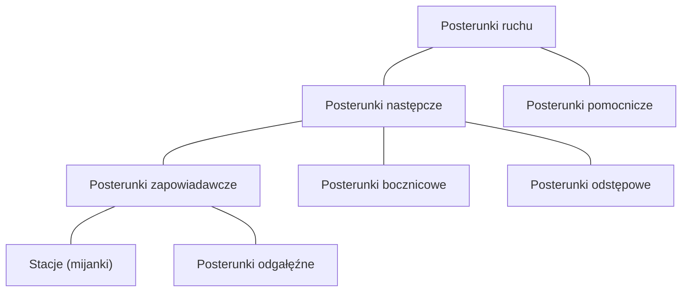

[Ir-1](../index.md)  
[Previous](./r01p02.md) | [Next](./r01p04.md)

# § 3 Posterunki ruchu

## 1.

Posterunek ruchu służy do bezpiecznego i sprawnego prowadzenia ruchu kolejowego. Posterunki ruchu dzielą się na następcze i pomocnicze.

## 2.

Posterunek następczy służy do regulacji następstwa jazdy pociągów w ten sposób, że pozwala na przejazd lub odjazd pociągu tylko wówczas, gdy tor przyległego odstępu lub szlaku do tego posterunku jest wolny. Posterunki następcze dzielą się na posterunki: zapowiadawcze, bocznicowe i odstępowe.

3. Posterunek zapowiadawczy jest to posterunek mający możliwość zmiany kolejności jazdy pociągów wyprawianych na tor szlakowy przyległy do tego posterunku.

4. Do posterunków zapowiadawczych należą stacje i posterunki odgałęźne.

5. Stacja jest to posterunek zapowiadawczy, w obrębie, którego, oprócz toru głównego zasadniczego, znajduje się co najmniej jeden tor główny dodatkowy, a pociągi mogą rozpoczynać i kończyć jazdę, krzyżować się i wyprzedzać, jak również zmieniać skład lub kierunek jazdy. Duże stacje mogą być podzielone na okręgi dysponujące stanowiące osobne posterunki zapowiadawcze.

> Stacja, na której układ torów umożliwia jedynie krzyżowanie i wyprzedzanie pociągów, nazywa się mijanką.

6. Pod względem ruchu pociągów rozróżnia się stacje:
   
   1. krańcowe, tj. początkowe i końcowe dla danej relacji pociągu,
   
   2. pośrednie, które znajdują się między stacjami krańcowymi.

7. Stacje, na których łączą się szlaki z trzech lub więcej kierunków, nazywamy stacjami węzłowymi.

> Zespół stacji i posterunków ruchu sąsiadujących ze sobą nazywa się węzłem kolejowym.

8. Posterunek odgałęźny urządzony jest poza stacją:
   
   1. w miejscu odgałęzienia linii kolejowej,
   
   2. przy przejściu ze szlaku jednotorowego w dwutorowy i odwrotnie,
   
   3. w miejscu połączenia torów na szlaku.

> Posterunek odgałęźny bierze udział w prowadzeniu ruchu wszystkich pociągów kursujących na przyległych szlakach (odstępach).

9. Granicę pomiędzy szlakiem a posterunkiem zapowiadawczym stanowi:
   
   1. na liniach jednotorowych -- semafor wjazdowy tego posterunku,
   
   2. na liniach dwutorowych -- miejsce znajdowania się semafora wjazdowego i linia prostopadła do osi torów, w miejscu ustawienia tego semafora, z wyjątkiem przypadków, w których granica między poszczególnymi torami szlakowymi a posterunkiem zapowiadawczym jest różna to jest gdy:
      
      a.  tory szlakowe oddalone są od siebie tak, że nie można określić linii prostopadłej do osi torów, w miejscu ustawienia semafora wjazdowego, wówczas granicą między

> tym torem szlakowym, przy którym nie ma semafora wjazdowego, a posterunkiem zapowiadawczym jest miejsce znajdujące się przy tym torze od strony szlaku w odległości 100 m przed najbliższym rozjazdem lub skrzyżowaniem,

b.  w torze najbliższy rozjazd lub skrzyżowanie znajduje się bliżej szlaku niż rozjazd lub skrzyżowanie w sąsiednim torze osłaniany semaforem wjazdowym, wówczas granicą między tym torem szlakowym, przy którym nie ma semafora wjazdowego, a posterunkiem zapowiadawczym jest miejsce znajdujące się przy tym torze od strony szlaku w odległości 100 m przed najbliższym rozjazdem lub skrzyżowaniem,

c.  przy torze znajduje się odnoszące się do tego toru urządzenie sygnałowe, za pomocą którego podaje się zezwolenie na wjazd pociągu, wówczas granicą między tym torem szlakowym a torem posterunku zapowiadawczego jest miejsce usytuowania tego urządzenia.

<!-- -->

10. Posterunek bocznicowy jest to posterunek ruchu urządzony na szlaku przy odgałęzieniu bocznicy, który bierze udział w prowadzeniu ruchu wszystkich pociągów kursujących na przyległych odstępach i pociągów obsługujących bocznicę. Przyjmowanie pociągów na bocznicę i wyprawianie ich z bocznicy odbywa się na zasadach ustalonych dla posterunków zapowiadawczych, a przepuszczanie innych pociągów -- na zasadach ustalonych dla posterunków odstępowych.

11. Posterunek odstępowy jest posterunkiem ruchu urządzanym na szlaku w celu podziału szlaku na odstępy. Posterunek odstępowy lub automatyczny posterunek odstępowy (APO) reguluje następstwo pociągów, to jest pozwala na przejazd pociągu przez ten posterunek, gdy następny odstęp jest wolny. Na szlaku jednotorowym semaforami odstępowymi APO dysponuje dyżurny ruchu wyznaczony regulaminem technicznym, a na szlaku dwutorowym ten dyżurny ruchu, który zarządza danym torem.

> Posterunki odstępowe obsługiwane na liniach z jednoodstępową (półsamoczynną) blokadą liniową nazywają się posterunkami blokowymi, a na liniach z telefonicznym zapowiadaniem pociągów posterunkami odstępowymi telefonicznymi. Na liniach z wieloodstępową (samoczynną) blokadą liniową funkcje posterunków odstępowych spełniają samoczynne semafory odstępowe.

12. Posterunek pomocniczy jest to posterunek urządzony na szlaku przy odgałęzieniu bocznicy, tylko w celu umożliwienia wjazdu pociągu na bocznicę i zgłoszenia, że szlak jest wolny, względnie wyjazdu pociągu z bocznicy. Posterunek pomocniczy nie jest wyposażony w semafory i bierze udział w zapowiadaniu tylko pociągów obsługujących bocznicę.

13. Na sieci PKP PLK S.A. oprócz posterunków ruchu występują również przystanki osobowe i bocznice kolejowe.

14. Przystanek osobowy to miejsce na szlaku, urządzone do wsiadania i wysiadania podróżnych, w którym rozkładowo zatrzymują się pociągi pasażerskie.

> Na przystankach osobowych położonych na szlakach jednotorowych nie wyposażonych w urządzenia blokady liniowej, wewnętrzny rozkład jazdy może przewidywać zmianę kierunku jazdy pociągów pasażerskich. Szczegółowe zasady dokonywania zmiany kierunku jazdy pociągów pasażerskich określają regulaminy techniczne posterunków przylegających do szlaku, na którym następuje zmiana kierunku jazdy.

15. Bocznica kolejowa to wyznaczona przez zarządcę infrastruktury droga kolejowa, połączona bezpośrednio lub pośrednio z linią kolejową, służąca do wykonywania czynności ładunkowych, utrzymaniowych lub postoju pojazdów kolejowych albo przemieszczania i włączania pojazdów kolejowych do ruchu po sieci kolejowej.
 